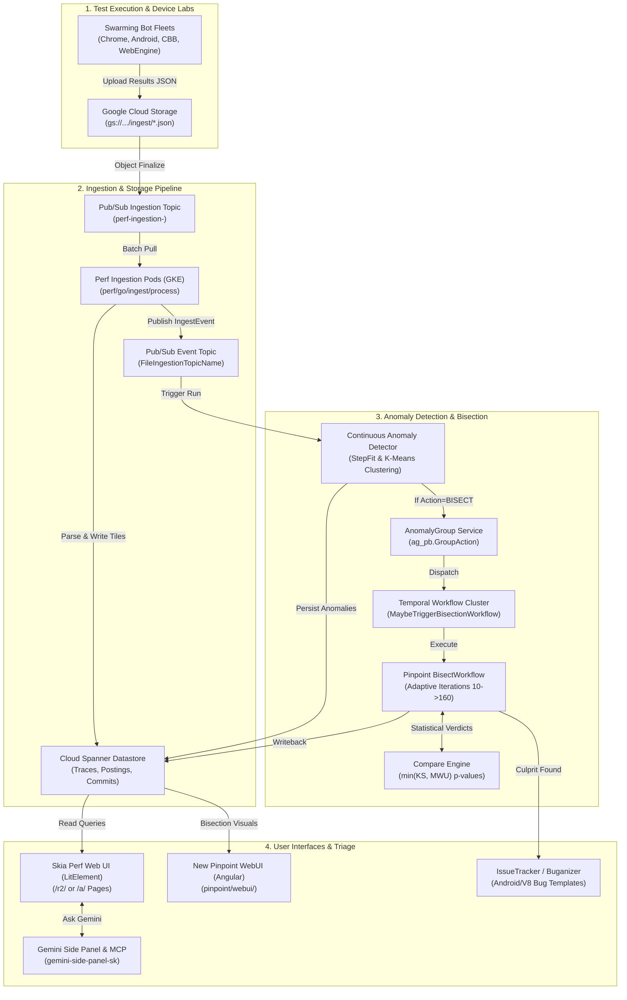

# CDMX Onsite Working Agenda: Modular Topic Briefs (Task 0 Index)

## Executive Overview
This document serves as the master index and technical executive summary for **Task 0: CDMX Onsite Modular Topic Briefs**, prepared for the Perf-Infra CDMX onsite working sessions.

The briefs provide rigorous, code-verified documentation of the entire Skia Perf and Pinpoint ecosystem, covering how performance regressions are detected, clustered, triaged, and automatically bisected; how data flows from hardware device labs to Cloud Spanner; how multi-tenant partner workflows (Chrome, V8, Android, Fuchsia) are supported; the roadmap to decommission legacy App Engine systems; planned automation initiatives; and operational fleet management.

Every claim across these briefs is grounded directly in the codebase with links to concrete source files, schemas, and line numbers.

---

## Modular Topic Briefs

| # | Topic | Document | Key Technical Subsystems Covered |
| :- | :--- | :--- | :--- |
| **1** | **Regression Detection, Triage & Auto-Bisection** | [Topic 1 Brief](./cdmx_agenda_briefs/topic_01_regression_detection_triage_autobisect.md) | • Step detection algorithms (`OriginalStep`, `AbsoluteStep`, `Const`, `PercentStep`, `CohenStep`, `Stepiness`, `MannWhitneyU`, `PercentMedianStep`) in [`stepfit.go`](../../go/stepfit/stepfit.go) • K-Means clustering pipeline in [`clustering.go`](../../go/clustering2/clustering.go) • Auto-bisection bridge in [`maybe_trigger_bisection.go`](../../go/workflows/internal/maybe_trigger_bisection.go) • Pinpoint adaptive sample sizing ($10 \to 160$) & recursive midpoint bisection in [`bisect.go`](../../../pinpoint/go/workflows/internal/bisect.go) • Kolmogorov-Smirnov & Mann-Whitney U statistical comparison in [`compare.go`](../../../pinpoint/go/compare/compare.go) • V8 Sheriff Config vs Android Build ID triage workflows |
| **2** | **Core System Architecture & GCP Hosting** | [Topic 2 Brief](./cdmx_agenda_briefs/topic_02_core_system_architecture_gcp_configs.md) | • End-to-end data pipeline: Swarming bot $\to$ GCS $\to$ Pub/Sub $\to$ Ingestion worker $\to$ Cloud Spanner $\to$ UI • Ingestion worker concurrency and retry logic in [`process.go`](../../go/ingest/process/process.go) • GKE microservices (Frontend, Backend, Ingestion, Temporal workers) • Multi-tenant priority matrix and tenant isolation (Tier 1 Corp, Tier 2 Public, Tier 3 Autopush) • Instance JSON configuration schema rationalization |
| **3** | **Chrome Migration & V8 Custom Workflows** | [Topic 3 Brief](./cdmx_agenda_briefs/topic_03_chrome_migration_v8_custom_workflows.md) | • V8 reliance on `/a/` anomaly page routing and `SheriffConfigService` • Multi-repo commit range resolution (`V8`, `WebRTC`, `V8 Git Hash`) in [`point-links-sk.ts`](../../modules/point-links-sk/point-links-sk.ts) • V8 Pinpoint blocker: Chromium DEPS rolls paired with Profile Guided Optimization (PGO) missing profiles • Technical path to decommission legacy Appspot (`chromeperf.appspot.com`, `skia-bridge`) |
| **4** | **Legacy Pinpoint Demystification & Migration** | [Topic 4 Brief](./cdmx_agenda_briefs/topic_04_legacy_pinpoint_migration_to_skia.md) | • Architectural comparison: Python App Engine Datastore vs Go Temporal on GKE • Staged sequencing: Why backend execution was migrated before the UI • Backwards compatibility bridge via [`CatapultBisectWorkflow`](../../../pinpoint/go/workflows/catapult/catapult_bisect.go) and [`WriteBisectToCatapultActivity`](../../../pinpoint/go/workflows/catapult/write.go) • Remaining parity gaps: Pairwise Wilcoxon signed-rank tryjobs, Telemetry argument parity, Angular WebUI |
| **5** | **Bridging Partner Workflows (Android, Fuchsia, Skia)** | [Topic 5 Brief](./cdmx_agenda_briefs/topic_05_bridging_android_fuchsia_skia_workflows.md) | • AndroidX synthetic Build ID indexing and [`android_ingest`](../android_ingest/) pipeline • Custom bug formatting via `AndroidNotificationProvider.GetBuildIdUrlDiff()` • Fuchsia JSON format conversion via [`fuchsia_to_skia_perf`](../../go/fuchsia_to_skia_perf/) and WebEngine bisection • Partner-specific Appspot shutdown verification gates |
| **6** | **Automation Efforts Planned** | [Topic 6 Brief](./cdmx_agenda_briefs/topic_06_automation_efforts_planned.md) | • Dynamic website deployment pipelines via GKE & GitOps • Spanner automated schema migrations in [`expectedschema/migrations/`](../../go/sql/expectedschema/migrations/) • Testing pyramid: TypeScript component tests vs Puppeteer visual E2E • Pinpoint on CQ: CABE statistical analysis preventing regression merges • AI-assisted triage: Gemini assistant side panel and Model Context Protocol (MCP) tool integration |
| **7** | **Operational Summaries: CBB, Bot Fleet & Skia Gold** | [Topic 7 Brief](./cdmx_agenda_briefs/topic_07_operational_summaries_cbb_fleet_gold.md) | • Comparative Browser Benchmarking (CBB) architecture across Chrome, Safari, and Edge • Safari Technology Preview (STP) automated CIPD distribution • Swarming bot capacity management and randomized load balancing via [`FindAvailableBotsActivity`](../../../pinpoint/go/workflows/internal/pairwise_runner.go) • Temporal task queue backlog auditing and timeout recovery • Architectural synergies and shared design patterns with Skia Gold |

---

## Overarching System Architecture Diagram

---

## Key Strategic Conclusions for CDMX Onsite Discussions

1. **Decouple Backend Execution from Frontend UI**: The strategic decision to run bisections on Temporal while writing back to legacy Catapult has stabilized execution. The final phase is to cut over the frontend to Angular [`pinpoint/webui/`](../../../pinpoint/webui/) and drop App Engine completely.
2. **Standardize Multi-Repo PGO Handling**: Addressing the V8 blocker regarding intermediate DEPS roll commits lacking PGO profiles requires standardized bot fallback configurations in [`pinpoint/go/bot_configs/isolate_targets.yaml`](../../../pinpoint/go/bot_configs/isolate_targets.yaml).
3. **Consolidate Partner Configuration Sprawl**: Transitioning all partner instances (Android, Fuchsia, V8, Chrome) to unified Spanner schemas and a single notification provider model will reduce maintenance overhead.
4. **Expand Pre-Commit Quality with Pinpoint on CQ**: Leveraging CABE for pairwise statistical gating on commit queues shifts regression detection left, intercepting performance bugs prior to landing.
