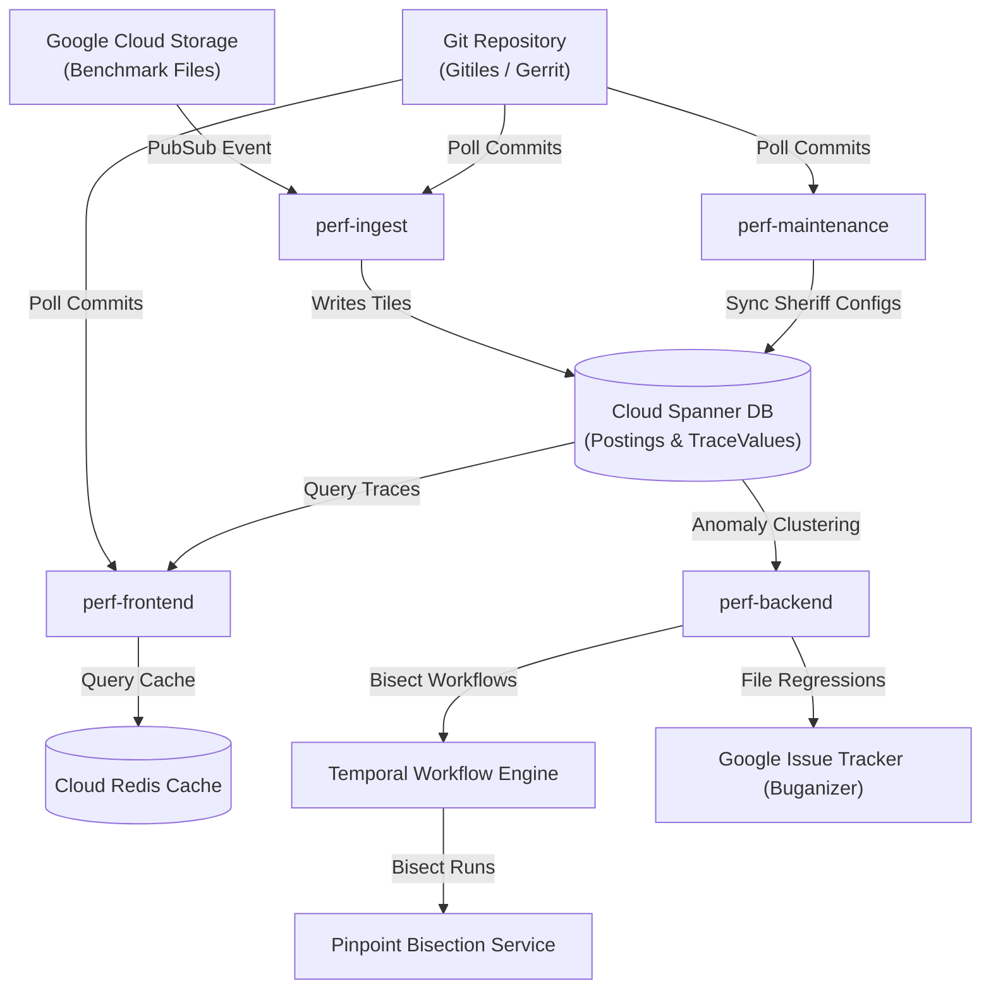

# Comprehensive Reference Guide: Cloud Spanner Perf Instance Configurations

> **Document Purpose**: Authoritative, zero-hallucination architectural and configuration reference for the 31 Cloud Spanner instances in Skia / Chrome Performance Dashboard (`perf/configs/spanner/*.json`). Cross-references all JSON properties with Go struct definitions in [`perf/go/config/config.go`](../../go/config/config.go) and active consumers across the entire `perf/go` codebase.

## Executive Summary & System Architecture

Perf is Google's high-scale performance monitoring and regression detection platform. The 31 production and staging instances defined in `perf/configs/spanner/` monitor telemetry from Chromium, Android, V8, Fuchsia, WebRTC, Skia, Flutter, Angle, Widevine, and DevTools.

### Microservice Architecture & Config Flow

Perf operates as a suite of specialized microservices, all configured via the unified `InstanceConfig` struct:

1. **`perf-frontend`**: Serves the web dashboard, renders explore graphs, evaluates user queries, serializes configuration into `window.perf` via `SkPerfConfig`, and interfaces with Redis/Spanner.

2. **`perf-backend`**: Runs asynchronous background tasks, manages anomaly groups, culprit identification, and Pinpoint bisection scheduling.

3. **`perf-ingest`**: Subscribes to GCS Pub/Sub file finalize notifications, parses benchmark formats, and writes posting lists and trace values into Spanner commit tiles.

4. **`perf-maintenance`**: Performs continuous database maintenance, Spanner schema migrations, Gitiles sheriff config syncing, and outdated shortcut/regression pruning.

### The 31 Cloud Spanner Instances

| Instance Name | Target Ecosystem | Scope / Tier | Primary Ingestion Project | Commit Tile Size | Active Notifier |
| :--- | :--- | :--- | :--- | :--- | :--- |
| `android` | Android | Public | `skia-public` | 512 | `markdown_issuetracker` |
| `android2-autopush` | Android2 | Public | `skia-public` | 512 | `markdown_issuetracker` |
| `angle` | Angle | Public | `skia-public` | 256 | `none` |
| `chrome-internal-autopush` | Chrome | Internal / Corp | `skia-public` | 8192 | `anomalygroup` |
| `chrome-internal-ng` | Chrome | Internal / Corp | `skia-public` | 8192 | `anomalygroup` |
| `chrome-internal-secondary` | Chrome | Internal / Corp | `skia-public` | 8192 | `none` |
| `chrome-internal` | Chrome | Internal / Corp | `skia-public` | 8192 | `anomalygroup` |
| `chrome-public-autopush` | Chrome | Public | `skia-public` | 8192 | `anomalygroup` |
| `chrome-public-exp` | Chrome | Public | `skia-public` | 8192 | `none` |
| `chrome-public` | Chrome | Public | `skia-public` | 8192 | `none` |
| `crystalball` | Crystalball | Public | `skia-public` | 8192 | `none` |
| `devtools-frontend` | Devtools | Public | `skia-public` | 8192 | `none` |
| `emscripten` | Emscripten | Public | `skia-public` | 256 | `none` |
| `eskia-internal` | Eskia | Internal / Corp | `skia-public` | 256 | `none` |
| `flutter-engine` | Flutter | Public | `skia-public` | 4096 | `html_email` |
| `flutter-flutter` | Flutter | Public | `skia-public` | 4096 | `html_email` |
| `fuchsia-exp-internal` | Fuchsia | Internal / Corp | `skia-public` | 256 | `anomalygroup` |
| `fuchsia-exp-public` | Fuchsia | Public | `skia-public` | 256 | `html_email` |
| `fuchsia-internal-autopush` | Fuchsia | Internal / Corp | `skia-public` | 256 | `html_email` |
| `fuchsia-internal` | Fuchsia | Internal / Corp | `skia-public` | 256 | `anomalygroup` |
| `fuchsia-public` | Fuchsia | Public | `skia-public` | 256 | `html_email` |
| `germanium-internal` | Germanium | Internal / Corp | `skia-public` | 8192 | `none` |
| `germanium-public` | Germanium | Public | `skia-public` | 8192 | `none` |
| `skia-public` | Skia | Public | `skia-public` | 256 | `none` |
| `v8-internal-autopush` | V8 | Internal / Corp | `skia-public` | 256 | `none` |
| `v8-internal` | V8 | Internal / Corp | `skia-public` | 256 | `none` |
| `v8-public` | V8 | Public | `skia-public` | 256 | `html_email` |
| `webrtc-public-ng` | Webrtc | Public | `skia-public` | 8192 | `html_email` |
| `webrtc-public` | Webrtc | Public | `skia-public` | 8192 | `html_email` |
| `widevine-cdm` | Widevine | Public | `skia-public` | 8192 | `markdown_issuetracker` |
| `widevine-whitebox` | Widevine | Public | `skia-public` | 8192 | `none` |
---

## Section 1: Core & Datastore Configuration

This subsystem manages the core operational environment of a Perf instance and its backing storage tier. Perf utilizes Google Cloud Spanner as its scalable relational database for all high-volume telemetry, storing commit headers, postings lists, param sets, trace values, alert rules, and anomaly clusters. The configuration specifies Spanner connection strings, connection pooling parameters, commit tile granularities (`tile_size`), trace query parallelization (`query_traces_pool_size`, `query_traces_chunk_size`), secondary index generation for trace parameters, and background maintenance service coordination.

**Total Fields in Subsystem**: 22

| JSON Path | Go Type | Struct Line | Presence (31) | Summary Role |
| :--- | :--- | :--- | :--- | :--- |
| [`URL`](#url) | `string` | [`config.go:1068`](../../go/config/config.go#L1068) | 31/31 | URL is the root URL at which this instance is available, ... |
| [`allowed_hosts`](#allowedhosts) | `[]string` | [`config.go:1084`](../../go/config/config.go#L1084) | 21/31 | Other domain names that are allowed to make cross-site re... |
| [`backend_host_url`](#backendhosturl) | `string` | [`config.go:1081`](../../go/config/config.go#L1081) | 6/31 | Configuration parameter. |
| [`contact`](#contact) | `string` | [`config.go:1087`](../../go/config/config.go#L1087) | 31/31 | Contact is the best way to contact the team for this inst... |
| [`data_store_config`](#datastoreconfig) | `DataStoreConfig` | [`config.go:1143`](../../go/config/config.go#L1143) | 31/31 | Configuration parameter. |
| [`demo`](#demo) | `bool` | [`config.go:1215`](../../go/config/config.go#L1215) | 0/31 | Demo if true signifies an instance running in development... |
| [`instance_name`](#instancename) | `string` | [`config.go:1071`](../../go/config/config.go#L1071) | 19/31 | Name this instance calls itself (eg |
| [`invalid_param_char_regex`](#invalidparamcharregex) | `string` | [`config.go:1092`](../../go/config/config.go#L1092) | 22/31 | Customized invalid char regrex, regex must never accept '... |
| [`maintenance_config`](#maintenanceconfig) | `MaintenanceConfig` | [`config.go:1155`](../../go/config/config.go#L1155) | 10/31 | Configuration parameter. |
| [`trace_sample_proportion`](#tracesampleproportion) | `float32` | [`config.go:1132`](../../go/config/config.go#L1132) | 31/31 | TraceSampleProportion is a float between 0 |
| [`data_store_config.cache`](#datastoreconfigcache) | `*CacheConfig` | [`config.go:161`](../../go/config/config.go#L161) | 0/31 | CacheConfig is the config for LRU caches in the trace store |
| [`data_store_config.connection_string`](#datastoreconfigconnectionstring) | `string` | [`config.go:154`](../../go/config/config.go#L154) | 31/31 | ConnectionString is a connection string of the form "post... |
| [`data_store_config.datastore_type`](#datastoreconfigdatastoretype) | `DataStoreType` | [`config.go:151`](../../go/config/config.go#L151) | 31/31 | DataStoreType determines what type of datastore to build |
| [`data_store_config.min_db_connections`](#datastoreconfigmindbconnections) | `int32` | [`config.go:170`](../../go/config/config.go#L170) | 13/31 | MinimumConnectionsInDBPool defines the minimum number of ... |
| [`data_store_config.query_traces_chunk_size`](#datastoreconfigquerytraceschunksize) | `int32` | [`config.go:176`](../../go/config/config.go#L176) | 4/31 | QueryTracesChunkSize specifies the batch size of traces f... |
| [`data_store_config.query_traces_pool_size`](#datastoreconfigquerytracespoolsize) | `int32` | [`config.go:173`](../../go/config/config.go#L173) | 1/31 | QueryTracesPoolSize specifies the maximum number of concu... |
| [`data_store_config.tile_size`](#datastoreconfigtilesize) | `int32` | [`config.go:158`](../../go/config/config.go#L158) | 31/31 | TileSize is the size of each tile in commits |
| [`data_store_config.traceparams_param_indexes`](#datastoreconfigtraceparamsparamindexes) | `[]string` | [`config.go:179`](../../go/config/config.go#L179) | 0/31 | Extra (generated) columns to index in TraceParams table |
| [`maintenance_config.gitiles_repo_url`](#maintenanceconfiggitilesrepourl) | `string` | [`config.go:880`](../../go/config/config.go#L880) | 10/31 | Configuration parameter. |
| [`maintenance_config.sheriff_config_path`](#maintenanceconfigsheriffconfigpath) | `string` | [`config.go:881`](../../go/config/config.go#L881) | 10/31 | Configuration parameter. |
| [`data_store_config.cache.memcached_servers`](#datastoreconfigcachememcachedservers) | `[]string` | [`config.go:140`](../../go/config/config.go#L140) | 0/31 | The names of the memcached servers to use, for example:  ... |
| [`data_store_config.cache.namespace`](#datastoreconfigcachenamespace) | `string` | [`config.go:144`](../../go/config/config.go#L144) | 0/31 | The name to postfix to keys, to allow more than one insta... |

### Field Specifications

#### `URL`

- **Full JSON Key Path**: `URL`
- **Go Struct Tag**: `URL`
- **Go Field Definition**: [`URL` in perf/go/config/config.go:1068](../../go/config/config.go#L1068)
- **Go Data Type**: `string`
- **Default / Behavior If Omitted**: `""` (empty string)
- **Instance Presence**: **31 / 31 instances** (100.0%)
- **Configured Sample Values**: `https://androidx-perf.skia.org`, `https://androidx2-perf-autopush.luci.app`, `https://angle-perf.luci.app`

**Functional Explanation**:
URL is the root URL at which this instance is available, for example: "https://example.com".

**Code Consumers & Architectural Flow**:
Referenced and evaluated in the following production components:
- [`perf/go/backend/backend.go:168`](../../go/backend/backend.go#L168): `UrlBase:               config.Config.URL,`
- [`perf/go/bug/bug.go:14`](../../go/bug/bug.go#L14): `"commit_url":  c.URL,`
- [`perf/go/config/config.go:325`](../../go/config/config.go#L325): `URL string json:"url"`
- [`perf/go/config/validate/validate.go:115`](../../go/config/validate/validate.go#L115): `URL:          "https://skia.googlesource.com/skia/+/0f9e50daa87997d376bf5fb60b06ab5b15c63ed9",`

**Instance Presence Matrix**:
- Configured across **all 31 Spanner instances**.

---

#### `allowed_hosts`

- **Full JSON Key Path**: `allowed_hosts`
- **Go Struct Tag**: `allowed_hosts,omitempty`
- **Go Field Definition**: [`AllowedHosts` in perf/go/config/config.go:1084](../../go/config/config.go#L1084)
- **Go Data Type**: `[]string`
- **Default / Behavior If Omitted**: `nil` / empty container
- **Instance Presence**: **21 / 31 instances** (67.7%)
- **Configured Sample Values**: `['status.skia.org']`

**Functional Explanation**:
Other domain names that are allowed to make cross-site requests to this instance.

**Code Consumers & Architectural Flow**:
Referenced and evaluated in the following production components:
- [`perf/go/config/config.go:1084`](../../go/config/config.go#L1084): `AllowedHosts []string json:"allowed_hosts,omitempty"`
- [`perf/go/frontend/frontend.go:1498`](../../go/frontend/frontend.go#L1498): `var h http.Handler = f.GetHandler(config.Config.AllowedHosts)`

**Instance Presence Matrix**:
- Configured in 21 instances: `chrome-internal`, `chrome-internal-autopush`, `chrome-internal-ng`, `chrome-internal-secondary`, `chrome-public`, `chrome-public-autopush`, `chrome-public-exp`, `devtools-frontend`, `eskia-internal`, `fuchsia-exp-internal`, `fuchsia-exp-public`, `fuchsia-internal`, `fuchsia-internal-autopush`, `fuchsia-public`, `germanium-internal`, `germanium-public`, `skia-public`, `webrtc-public`, `webrtc-public-ng`, `widevine-cdm`, `widevine-whitebox`
- Omitted in 10 instances: `android`, `android2-autopush`, `angle`, `crystalball`, `emscripten`, `flutter-engine`, `flutter-flutter`, `v8-internal`, `v8-internal-autopush`, `v8-public`

---

#### `backend_host_url`

- **Full JSON Key Path**: `backend_host_url`
- **Go Struct Tag**: `backend_host_url,omitempty`
- **Go Field Definition**: [`BackendServiceHostUrl` in perf/go/config/config.go:1081](../../go/config/config.go#L1081)
- **Go Data Type**: `string`
- **Default / Behavior If Omitted**: `""` (empty string)
- **Instance Presence**: **6 / 31 instances** (19.4%)
- **Configured Sample Values**: `perf-be-chrome-non-public-autopush.perf.svc.cluster.local:8000`, `perf-be-chrome-non-public.perf.svc.cluster.local:8000`, `perf-be-chrome-public.perf.svc.cluster.local:8000`

**Functional Explanation**:
Specifies configuration parameter for `BackendServiceHostUrl` within the `InstanceConfig` component.

**Code Consumers & Architectural Flow**:
Referenced and evaluated in the following production components:
- [`perf/go/anomalygroup/utils/anomalygrouputils.go:141`](../../go/anomalygroup/utils/anomalygrouputils.go#L141): `AnomalyGroupServiceUrl:             config.Config.BackendServiceHostUrl,`
- [`perf/go/backend/client/backendclientutil.go:25`](../../go/backend/client/backendclientutil.go#L25): `return config.Config.BackendServiceHostUrl`
- [`perf/go/config/config.go:1081`](../../go/config/config.go#L1081): `BackendServiceHostUrl string json:"backend_host_url,omitempty"`

**Instance Presence Matrix**:
- Configured in 6 instances: `chrome-internal`, `chrome-internal-autopush`, `chrome-internal-ng`, `chrome-internal-secondary`, `chrome-public`, `chrome-public-autopush`

---

#### `contact`

- **Full JSON Key Path**: `contact`
- **Go Struct Tag**: `contact`
- **Go Field Definition**: [`Contact` in perf/go/config/config.go:1087](../../go/config/config.go#L1087)
- **Go Data Type**: `string`
- **Default / Behavior If Omitted**: `""` (empty string)
- **Instance Presence**: **31 / 31 instances** (100.0%)
- **Configured Sample Values**: `http://go/androidx-discuss`, `https://bugs.chromium.org/p/angle/issues/list?q=component%3ATools&can=2`, `browser-perf-engprod@google.com`

**Functional Explanation**:
Contact is the best way to contact the team for this instance.

**Code Consumers & Architectural Flow**:
Referenced and evaluated in the following production components:
- [`perf/go/config/config.go:1087`](../../go/config/config.go#L1087): `Contact string json:"contact"`

**Instance Presence Matrix**:
- Configured across **all 31 Spanner instances**.

---

#### `data_store_config`

- **Full JSON Key Path**: `data_store_config`
- **Go Struct Tag**: `data_store_config`
- **Go Field Definition**: [`DataStoreConfig` in perf/go/config/config.go:1143](../../go/config/config.go#L1143)
- **Go Data Type**: `DataStoreConfig`
- **Default / Behavior If Omitted**: Go zero-value struct or unmarshaled defaults
- **Instance Presence**: **31 / 31 instances** (100.0%)

**Functional Explanation**:
Specifies configuration parameter for `DataStoreConfig` within the `InstanceConfig` component.

**Code Consumers & Architectural Flow**:
Referenced and evaluated in the following production components:
- [`perf/go/builders/builders.go:101`](../../go/builders/builders.go#L101): `cfg, err := pgxpool.ParseConfig(instanceConfig.DataStoreConfig.ConnectionString)`
- [`perf/go/config/config.go:147`](../../go/config/config.go#L147): `// DataStoreConfig is the configuration for how Perf stores data.`
- [`perf/go/config/validate/validate.go:197`](../../go/config/validate/validate.go#L197): `if i.QueryConfig.CommitChunkSize > 0 && i.QueryConfig.CommitChunkSize <= int(i.DataStoreConfig.TileSize) {`
- [`perf/go/frontend/frontend.go:688`](../../go/frontend/frontend.go#L688): `config.Config.DataStoreConfig.ConnectionString = f.flags.ConnectionString`

**Instance Presence Matrix**:
- Configured across **all 31 Spanner instances**.

---

#### `demo`

- **Full JSON Key Path**: `demo`
- **Go Struct Tag**: `demo,omitempty`
- **Go Field Definition**: [`Demo` in perf/go/config/config.go:1215](../../go/config/config.go#L1215)
- **Go Data Type**: `bool`
- **Default / Behavior If Omitted**: `false` (Go zero-value for boolean)
- **Instance Presence**: **0 / 31 instances** (0.0%)

**Functional Explanation**:
Demo if true signifies an instance running in development demo mode.

**Code Consumers & Architectural Flow**:
Referenced and evaluated in the following production components:
- [`perf/go/backend/client/backendclientutil.go:51`](../../go/backend/client/backendclientutil.go#L51): `demo = config.Config.Demo`
- [`perf/go/config/config.go:1215`](../../go/config/config.go#L1215): `Demo bool json:"demo,omitempty"`
- [`perf/go/frontend/api/pinpointApi.go:39`](../../go/frontend/api/pinpointApi.go#L39): `newClient, err := backendClient.NewPinpointClient("", devMode || config.Config.Demo)`
- [`perf/go/frontend/frontend.go:430`](../../go/frontend/frontend.go#L430): `Demo                           bool               json:"demo"                                         // True if this is a demo page, as opposed to being in production. Used to make puppeteer tests deterministic.`

**Instance Presence Matrix**:
- **Omitted across all 31 Spanner instances** (operates entirely under default zero-value behavior).

---

#### `instance_name`

- **Full JSON Key Path**: `instance_name`
- **Go Struct Tag**: `instance_name,omitempty`
- **Go Field Definition**: [`InstanceName` in perf/go/config/config.go:1071](../../go/config/config.go#L1071)
- **Go Data Type**: `string`
- **Default / Behavior If Omitted**: `""` (empty string)
- **Instance Presence**: **19 / 31 instances** (61.3%)
- **Configured Sample Values**: `AndroidX`, `AndroidX (Autopush)`, `Angle`

**Functional Explanation**:
Name this instance calls itself (eg. in tracing)

**Code Consumers & Architectural Flow**:
Referenced and evaluated in the following production components:
- [`perf/go/config/config.go:1071`](../../go/config/config.go#L1071): `InstanceName string json:"instance_name,omitempty"`
- [`perf/go/frontend/api/anomaliesApi.go:697`](../../go/frontend/api/anomaliesApi.go#L697): `if strings.Contains(config.Config.InstanceName, "fuchsia") && preferLegacy {`
- [`perf/go/frontend/frontend.go:422`](../../go/frontend/frontend.go#L422): `InstanceName                   string             json:"instance_name"                                // The name of the instance.`
- [`perf/go/frontend/mock/frontend_mock_for_demo.go:72`](../../go/frontend/mock/frontend_mock_for_demo.go#L72): `"InstanceName":                 "Chrome Perf Demo",`

**Instance Presence Matrix**:
- Configured in 19 instances: `android`, `android2-autopush`, `angle`, `chrome-internal`, `chrome-internal-autopush`, `chrome-internal-ng`, `chrome-public`, `chrome-public-autopush`, `chrome-public-exp`, `fuchsia-exp-internal`, `fuchsia-internal`, `fuchsia-internal-autopush`, `v8-internal`, `v8-internal-autopush`, `v8-public`, `webrtc-public`, `webrtc-public-ng`, `widevine-cdm`, `widevine-whitebox`

---

#### `invalid_param_char_regex`

- **Full JSON Key Path**: `invalid_param_char_regex`
- **Go Struct Tag**: `invalid_param_char_regex,omitempty`
- **Go Field Definition**: [`InvalidParamCharRegex` in perf/go/config/config.go:1092](../../go/config/config.go#L1092)
- **Go Data Type**: `string`
- **Default / Behavior If Omitted**: `""` (empty string)
- **Instance Presence**: **22 / 31 instances** (71.0%)
- **Configured Sample Values**: `([^a-zA-Z0-9!~@#$%^&*()+ :\._\-])`

**Functional Explanation**:
Customized invalid char regrex, regex must never accept ',' or '='. because '=' and ',' are used to parse the Param key and value, they can never be allowed.

**Code Consumers & Architectural Flow**:
Referenced and evaluated in the following production components:
- [`perf/go/config/config.go:1092`](../../go/config/config.go#L1092): `InvalidParamCharRegex string json:"invalid_param_char_regex,omitempty"`
- [`perf/go/config/validate/validate.go:86`](../../go/config/validate/validate.go#L86): `if i.InvalidParamCharRegex != "" {`
- [`perf/go/frontend/api/anomaliesApi.go:746`](../../go/frontend/api/anomaliesApi.go#L746): `if config.Config.InvalidParamCharRegex != "" {`
- [`perf/go/ingest/parser/parser.go:45`](../../go/ingest/parser/parser.go#L45): `if instanceConfig.InvalidParamCharRegex != "" {`

**Instance Presence Matrix**:
- Configured in 22 instances: `chrome-internal`, `chrome-internal-autopush`, `chrome-internal-ng`, `chrome-internal-secondary`, `chrome-public`, `chrome-public-autopush`, `chrome-public-exp`, `devtools-frontend`, `eskia-internal`, `fuchsia-exp-internal`, `fuchsia-exp-public`, `fuchsia-internal`, `fuchsia-internal-autopush`, `fuchsia-public`, `germanium-internal`, `germanium-public`, `v8-internal`, `v8-internal-autopush`, `webrtc-public`, `webrtc-public-ng`, `widevine-cdm`, `widevine-whitebox`
- Omitted in 9 instances: `android`, `android2-autopush`, `angle`, `crystalball`, `emscripten`, `flutter-engine`, `flutter-flutter`, `skia-public`, `v8-public`

---

#### `maintenance_config`

- **Full JSON Key Path**: `maintenance_config`
- **Go Struct Tag**: `maintenance_config,omitempty`
- **Go Field Definition**: [`MaintenanceConfig` in perf/go/config/config.go:1155](../../go/config/config.go#L1155)
- **Go Data Type**: `MaintenanceConfig`
- **Default / Behavior If Omitted**: Go zero-value struct or unmarshaled defaults
- **Instance Presence**: **10 / 31 instances** (32.3%)

**Functional Explanation**:
Specifies configuration parameter for `MaintenanceConfig` within the `InstanceConfig` component.

**Code Consumers & Architectural Flow**:
Referenced and evaluated in the following production components:
- [`perf/go/config/config.go:878`](../../go/config/config.go#L878): `// MaintenanceConfig contains configuration for the maintenance service.`
- [`perf/go/frontend/frontend.go:540`](../../go/frontend/frontend.go#L540): `if config.Config.MaintenanceConfig.GitilesRepoUrl != "" && config.Config.MaintenanceConfig.SheriffConfigPath != "" {`
- [`perf/go/maintenance/maintenance.go:131`](../../go/maintenance/maintenance.go#L131): `instanceConfig.MaintenanceConfig.GitilesRepoUrl,`

**Instance Presence Matrix**:
- Configured in 10 instances: `chrome-internal`, `chrome-internal-autopush`, `chrome-internal-ng`, `fuchsia-exp-internal`, `fuchsia-exp-public`, `fuchsia-internal`, `v8-internal`, `v8-internal-autopush`, `webrtc-public`, `webrtc-public-ng`

---

#### `trace_sample_proportion`

- **Full JSON Key Path**: `trace_sample_proportion`
- **Go Struct Tag**: `trace_sample_proportion,omitempty`
- **Go Field Definition**: [`TraceSampleProportion` in perf/go/config/config.go:1132](../../go/config/config.go#L1132)
- **Go Data Type**: `float32`
- **Default / Behavior If Omitted**: `0.0` (all traces ingested without downsampling)
- **Instance Presence**: **31 / 31 instances** (100.0%)
- **Configured Sample Values**: `0.2`, `0.01`, `0.1`

**Functional Explanation**:
TraceSampleProportion is a float between 0.0 and 1.0 that determines which percentage of traces get uploaded

**Code Consumers & Architectural Flow**:
Referenced and evaluated in the following production components:
- [`perf/go/config/config.go:1132`](../../go/config/config.go#L1132): `TraceSampleProportion float32 json:"trace_sample_proportion,omitempty"`
- [`perf/go/tracing/tracing.go:17`](../../go/tracing/tracing.go#L17): `f := cfg.TraceSampleProportion`

**Instance Presence Matrix**:
- Configured across **all 31 Spanner instances**.

---

#### `data_store_config.cache`

- **Full JSON Key Path**: `data_store_config.cache`
- **Go Struct Tag**: `cache,omitempty`
- **Go Field Definition**: [`DataStoreConfig.CacheConfig` in perf/go/config/config.go:161](../../go/config/config.go#L161)
- **Go Data Type**: `*CacheConfig`
- **Default / Behavior If Omitted**: `nil` pointer
- **Instance Presence**: **0 / 31 instances** (0.0%)

**Functional Explanation**:
CacheConfig is the config for LRU caches in the trace store.

**Code Consumers & Architectural Flow**:
Referenced and evaluated in the following production components:
- [`perf/go/builders/builders.go:391`](../../go/builders/builders.go#L391): `switch instanceConfig.QueryConfig.CacheConfig.Type {`
- [`perf/go/config/config.go:129`](../../go/config/config.go#L129): `// CacheConfig is the config for LRU caches in the trace store.`
- [`perf/go/frontend/frontend.go:785`](../../go/frontend/frontend.go#L785): `if f.flags.DevMode && config.Config.QueryConfig.CacheConfig.Enabled {`
- [`perf/go/psrefresh/cachedpsrefresh.go:38`](../../go/psrefresh/cachedpsrefresh.go#L38): `cacheConfig := c.psRefresher.qConfig.CacheConfig`

**Instance Presence Matrix**:
- **Omitted across all 31 Spanner instances** (operates entirely under default zero-value behavior).

---

#### `data_store_config.connection_string`

- **Full JSON Key Path**: `data_store_config.connection_string`
- **Go Struct Tag**: `connection_string`
- **Go Field Definition**: [`DataStoreConfig.ConnectionString` in perf/go/config/config.go:154](../../go/config/config.go#L154)
- **Go Data Type**: `string`
- **Default / Behavior If Omitted**: `""` (empty string)
- **Instance Presence**: **31 / 31 instances** (100.0%)
- **Configured Sample Values**: `postgresql://root@localhost:5432/androidx?sslmode=disable`, `postgresql://root@127.0.0.1:5432/androidx_autopush?sslmode=disable`, `postgresql://root@localhost:5432/angle?sslmode=disable`

**Functional Explanation**:
ConnectionString is a connection string of the form "postgresql://...".

**Code Consumers & Architectural Flow**:
Referenced and evaluated in the following production components:
- [`perf/go/builders/builders.go:101`](../../go/builders/builders.go#L101): `cfg, err := pgxpool.ParseConfig(instanceConfig.DataStoreConfig.ConnectionString)`
- [`perf/go/config/config.go:154`](../../go/config/config.go#L154): `ConnectionString string json:"connection_string"`
- [`perf/go/frontend/frontend.go:687`](../../go/frontend/frontend.go#L687): `if f.flags.ConnectionString != "" {`
- [`perf/go/perf-tool/main.go:174`](../../go/perf-tool/main.go#L174): `instanceConfig.DataStoreConfig.ConnectionString = override`

**Instance Presence Matrix**:
- Configured across **all 31 Spanner instances**.

---

#### `data_store_config.datastore_type`

- **Full JSON Key Path**: `data_store_config.datastore_type`
- **Go Struct Tag**: `datastore_type`
- **Go Field Definition**: [`DataStoreConfig.DataStoreType` in perf/go/config/config.go:151](../../go/config/config.go#L151)
- **Go Data Type**: `DataStoreType`
- **Default / Behavior If Omitted**: Go zero-value struct or unmarshaled defaults
- **Instance Presence**: **31 / 31 instances** (100.0%)
- **Configured Sample Values**: `spanner`

**Functional Explanation**:
DataStoreType determines what type of datastore to build. This value will determine how the rest of the DataStoreConfig values are interpreted.

**Code Consumers & Architectural Flow**:
Referenced and evaluated in the following production components:
- [`perf/go/chromeperf/sqlreversekeymapstore/sqlreversekeymapstore.go:65`](../../go/chromeperf/sqlreversekeymapstore/sqlreversekeymapstore.go#L65): `func New(db pool.Pool, dbType config.DataStoreType) *ReverseKeyMapStoreImpl {`
- [`perf/go/config/config.go:122`](../../go/config/config.go#L122): `type DataStoreType string`
- [`perf/go/git/gittest/gittest.go:107`](../../go/git/gittest/gittest.go#L107): `DataStoreType: config.SpannerDataStoreType,`
- [`perf/go/git/impl.go:369`](../../go/git/impl.go#L369): `if g.instanceConfig.DataStoreConfig.DataStoreType == config.SpannerDataStoreType {`

**Instance Presence Matrix**:
- Configured across **all 31 Spanner instances**.

---

#### `data_store_config.min_db_connections`

- **Full JSON Key Path**: `data_store_config.min_db_connections`
- **Go Struct Tag**: `min_db_connections,omitempty`
- **Go Field Definition**: [`DataStoreConfig.MinimumConnectionsInDBPool` in perf/go/config/config.go:170](../../go/config/config.go#L170)
- **Go Data Type**: `int32`
- **Default / Behavior If Omitted**: `0` (Go zero-value for integer)
- **Instance Presence**: **13 / 31 instances** (41.9%)
- **Configured Sample Values**: `5`

**Functional Explanation**:
MinimumConnectionsInDBPool defines the minimum number of database connections to be maintained in the connection pool.

**Code Consumers & Architectural Flow**:
Referenced and evaluated in the following production components:
- [`perf/go/builders/builders.go:109`](../../go/builders/builders.go#L109): `if instanceConfig.DataStoreConfig.MinimumConnectionsInDBPool == 0 {`
- [`perf/go/config/config.go:170`](../../go/config/config.go#L170): `MinimumConnectionsInDBPool int32 json:"min_db_connections,omitempty"`

**Instance Presence Matrix**:
- Configured in 13 instances: `android`, `android2-autopush`, `chrome-internal`, `chrome-internal-autopush`, `chrome-internal-ng`, `chrome-internal-secondary`, `chrome-public`, `chrome-public-autopush`, `crystalball`, `skia-public`, `v8-internal`, `v8-internal-autopush`, `v8-public`

---

#### `data_store_config.query_traces_chunk_size`

- **Full JSON Key Path**: `data_store_config.query_traces_chunk_size`
- **Go Struct Tag**: `query_traces_chunk_size,omitempty`
- **Go Field Definition**: [`DataStoreConfig.QueryTracesChunkSize` in perf/go/config/config.go:176](../../go/config/config.go#L176)
- **Go Data Type**: `int32`
- **Default / Behavior If Omitted**: `5` (Runtime default in `sqltracestore.go:523-526` if <= 0; config.go comment mentions 10)
- **Instance Presence**: **4 / 31 instances** (12.9%)
- **Configured Sample Values**: `500`

**Functional Explanation**:
QueryTracesChunkSize specifies the batch size of traces fetched per Spanner query. Note: Go struct comment in config.go mentions default 10, but in sqltracestore.go:523-526 the runtime code explicitly defaults to 5 if <= 0.

**Code Consumers & Architectural Flow**:
Referenced and evaluated in the following production components:
- [`perf/go/tracestore/sqltracestore/sqltracestore.go:523`](../../go/tracestore/sqltracestore/sqltracestore.go#L523): `chunkSize := int(datastoreConfig.QueryTracesChunkSize) // runtime default 5 if <= 0`
- [`perf/go/tracestore/sqltracestore/sqltracestore.go:535`](../../go/tracestore/sqltracestore/sqltracestore.go#L535): `queryTracesChunkSize: chunkSize,`

**Instance Presence Matrix**:
- Configured in 4 instances: `android`, `skia-public`, `v8-internal`, `v8-internal-autopush`

---

#### `data_store_config.query_traces_pool_size`

- **Full JSON Key Path**: `data_store_config.query_traces_pool_size`
- **Go Struct Tag**: `query_traces_pool_size,omitempty`
- **Go Field Definition**: [`DataStoreConfig.QueryTracesPoolSize` in perf/go/config/config.go:173](../../go/config/config.go#L173)
- **Go Data Type**: `int32`
- **Default / Behavior If Omitted**: `10` (Runtime default in `sqltracestore.go:519-522` if <= 0; config.go comment mentions 5)
- **Instance Presence**: **1 / 31 instances** (3.2%)
- **Configured Sample Values**: `10`

**Functional Explanation**:
QueryTracesPoolSize specifies the maximum number of concurrent goroutine workers in the pool querying Spanner trace values. Note: Go struct comment in config.go mentions default 5, but in sqltracestore.go:519-522 the runtime code explicitly defaults to 10 if <= 0.

**Code Consumers & Architectural Flow**:
Referenced and evaluated in the following production components:
- [`perf/go/tracestore/sqltracestore/sqltracestore.go:519`](../../go/tracestore/sqltracestore/sqltracestore.go#L519): `poolSize := int(datastoreConfig.QueryTracesPoolSize) // runtime default 10 if <= 0`
- [`perf/go/tracestore/sqltracestore/sqltracestore.go:534`](../../go/tracestore/sqltracestore/sqltracestore.go#L534): `queryTracesPoolSize: poolSize,`

**Instance Presence Matrix**:
- Configured in 1 instances: `skia-public`

---

#### `data_store_config.tile_size`

- **Full JSON Key Path**: `data_store_config.tile_size`
- **Go Struct Tag**: `tile_size`
- **Go Field Definition**: [`DataStoreConfig.TileSize` in perf/go/config/config.go:158](../../go/config/config.go#L158)
- **Go Data Type**: `int32`
- **Default / Behavior If Omitted**: `0` (Go zero-value for integer)
- **Instance Presence**: **31 / 31 instances** (100.0%)
- **Configured Sample Values**: `512`, `256`, `8192`

**Functional Explanation**:
TileSize is the size of each tile in commits. This value is used for all datastore types.

**Code Consumers & Architectural Flow**:
Referenced and evaluated in the following production components:
- [`perf/go/config/config.go:158`](../../go/config/config.go#L158): `TileSize int32 json:"tile_size"`
- [`perf/go/config/validate/validate.go:197`](../../go/config/validate/validate.go#L197): `if i.QueryConfig.CommitChunkSize > 0 && i.QueryConfig.CommitChunkSize <= int(i.DataStoreConfig.TileSize) {`
- [`perf/go/dataframe/dataframe.go:78`](../../go/dataframe/dataframe.go#L78): `TileSize int32`
- [`perf/go/dfbuilder/dfbuilder.go:96`](../../go/dfbuilder/dfbuilder.go#L96): `tileSize:                           store.TileSize(),`

**Instance Presence Matrix**:
- Configured across **all 31 Spanner instances**.

---

#### `data_store_config.traceparams_param_indexes`

- **Full JSON Key Path**: `data_store_config.traceparams_param_indexes`
- **Go Struct Tag**: `traceparams_param_indexes,omitempty`
- **Go Field Definition**: [`DataStoreConfig.TraceParamsParamIndexes` in perf/go/config/config.go:179](../../go/config/config.go#L179)
- **Go Data Type**: `[]string`
- **Default / Behavior If Omitted**: `nil` / empty container
- **Instance Presence**: **0 / 31 instances** (0.0%)

**Functional Explanation**:
Extra (generated) columns to index in TraceParams table

**Code Consumers & Architectural Flow**:
Referenced and evaluated in the following production components:
- [`perf/go/config/config.go:179`](../../go/config/config.go#L179): `TraceParamsParamIndexes []string json:"traceparams_param_indexes,omitempty"`
- [`perf/go/maintenance/maintenance.go:91`](../../go/maintenance/maintenance.go#L91): `traceParamsIndexes = instanceConfig.DataStoreConfig.TraceParamsParamIndexes`

**Instance Presence Matrix**:
- **Omitted across all 31 Spanner instances** (operates entirely under default zero-value behavior).

---

#### `maintenance_config.gitiles_repo_url`

- **Full JSON Key Path**: `maintenance_config.gitiles_repo_url`
- **Go Struct Tag**: `gitiles_repo_url,omitempty`
- **Go Field Definition**: [`MaintenanceConfig.GitilesRepoUrl` in perf/go/config/config.go:880](../../go/config/config.go#L880)
- **Go Data Type**: `string`
- **Default / Behavior If Omitted**: `""` (empty string)
- **Instance Presence**: **10 / 31 instances** (32.3%)
- **Configured Sample Values**: `https://chrome-internal.googlesource.com/infra/infra_internal`, `https://chrome-internal.googlesource.com/v8/v8-perf`

**Functional Explanation**:
Specifies configuration parameter for `MaintenanceConfig.GitilesRepoUrl` within the `MaintenanceConfig` component.

**Code Consumers & Architectural Flow**:
Referenced and evaluated in the following production components:
- [`perf/go/config/config.go:880`](../../go/config/config.go#L880): `GitilesRepoUrl    string json:"gitiles_repo_url,omitempty"`
- [`perf/go/frontend/frontend.go:540`](../../go/frontend/frontend.go#L540): `if config.Config.MaintenanceConfig.GitilesRepoUrl != "" && config.Config.MaintenanceConfig.SheriffConfigPath != "" {`
- [`perf/go/maintenance/maintenance.go:131`](../../go/maintenance/maintenance.go#L131): `instanceConfig.MaintenanceConfig.GitilesRepoUrl,`

**Instance Presence Matrix**:
- Configured in 10 instances: `chrome-internal`, `chrome-internal-autopush`, `chrome-internal-ng`, `fuchsia-exp-internal`, `fuchsia-exp-public`, `fuchsia-internal`, `v8-internal`, `v8-internal-autopush`, `webrtc-public`, `webrtc-public-ng`

---

#### `maintenance_config.sheriff_config_path`

- **Full JSON Key Path**: `maintenance_config.sheriff_config_path`
- **Go Struct Tag**: `sheriff_config_path,omitempty`
- **Go Field Definition**: [`MaintenanceConfig.SheriffConfigPath` in perf/go/config/config.go:881](../../go/config/config.go#L881)
- **Go Data Type**: `string`
- **Default / Behavior If Omitted**: `""` (empty string)
- **Instance Presence**: **10 / 31 instances** (32.3%)
- **Configured Sample Values**: `infra/config/subprojects/skiaperf/chrome-internal-autopush.textpb`, `infra/config/subprojects/skiaperf/chrome-internal.textpb`, `infra/config/subprojects/skiaperf/fuchsia-exp-internal.textpb`

**Functional Explanation**:
Specifies configuration parameter for `MaintenanceConfig.SheriffConfigPath` within the `MaintenanceConfig` component.

**Code Consumers & Architectural Flow**:
Referenced and evaluated in the following production components:
- [`perf/go/config/config.go:881`](../../go/config/config.go#L881): `SheriffConfigPath string json:"sheriff_config_path,omitempty"`
- [`perf/go/frontend/frontend.go:540`](../../go/frontend/frontend.go#L540): `if config.Config.MaintenanceConfig.GitilesRepoUrl != "" && config.Config.MaintenanceConfig.SheriffConfigPath != "" {`
- [`perf/go/maintenance/maintenance.go:132`](../../go/maintenance/maintenance.go#L132): `instanceConfig.MaintenanceConfig.SheriffConfigPath,`

**Instance Presence Matrix**:
- Configured in 10 instances: `chrome-internal`, `chrome-internal-autopush`, `chrome-internal-ng`, `fuchsia-exp-internal`, `fuchsia-exp-public`, `fuchsia-internal`, `v8-internal`, `v8-internal-autopush`, `webrtc-public`, `webrtc-public-ng`

---

#### `data_store_config.cache.memcached_servers`

- **Full JSON Key Path**: `data_store_config.cache.memcached_servers`
- **Go Struct Tag**: `memcached_servers`
- **Go Field Definition**: [`DataStoreConfig.CacheConfig.MemcachedServers` in perf/go/config/config.go:140](../../go/config/config.go#L140)
- **Go Data Type**: `[]string`
- **Default / Behavior If Omitted**: `nil` / empty container
- **Instance Presence**: **0 / 31 instances** (0.0%)

**Functional Explanation**:
The names of the memcached servers to use, for example:  "memcached_servers": [ "perf-memcached-0.perf-memcached:11211", "perf-memcached-1.perf-memcached:11211", ]  If the list is empty or nil then memcached will not be used and an in-memory lru cache will be used.

**Code Consumers & Architectural Flow**:
Referenced and evaluated in the following production components:
- [`perf/go/tracestore/sqltracestore/sqltracestore.go:501`](../../go/tracestore/sqltracestore/sqltracestore.go#L501): `if datastoreConfig.CacheConfig != nil && len(datastoreConfig.CacheConfig.MemcachedServers) > 0 {`

**Instance Presence Matrix**:
- **Omitted across all 31 Spanner instances** (operates entirely under default zero-value behavior).

---

#### `data_store_config.cache.namespace`

- **Full JSON Key Path**: `data_store_config.cache.namespace`
- **Go Struct Tag**: `namespace`
- **Go Field Definition**: [`DataStoreConfig.CacheConfig.Namespace` in perf/go/config/config.go:144](../../go/config/config.go#L144)
- **Go Data Type**: `string`
- **Default / Behavior If Omitted**: `""` (empty string)
- **Instance Presence**: **0 / 31 instances** (0.0%)

**Functional Explanation**:
The name to postfix to keys, to allow more than one instance of Perf to use a common memcached cluster.

**Code Consumers & Architectural Flow**:
Referenced and evaluated in the following production components:
- [`perf/go/tracestore/sqltracestore/sqltracestore.go:502`](../../go/tracestore/sqltracestore/sqltracestore.go#L502): `cache, err = memcached.New(datastoreConfig.CacheConfig.MemcachedServers, datastoreConfig.CacheConfig.Namespace)`

**Instance Presence Matrix**:
- **Omitted across all 31 Spanner instances** (operates entirely under default zero-value behavior).

---

## Section 2: Ingestion & Cloud Sources Configuration

This subsystem manages the continuous streaming ingestion of performance benchmark results into the trace store. Data files generated by benchmark runners (e.g. Telemetry, Android benchmark harness, Skia nanobench) are written to Google Cloud Storage (GCS) buckets. When a file is finalized, Cloud Pub/Sub sends notifications to the `perf-ingest` microservice. Ingestion configuration defines the target GCP project, Pub/Sub topics and subscriptions, dead-letter queues for unprocessable payloads, directory vs GCS file sources, and regex filters to accept or reject benchmark artifacts.

**Total Fields in Subsystem**: 12

| JSON Path | Go Type | Struct Line | Presence (31) | Summary Role |
| :--- | :--- | :--- | :--- | :--- |
| [`ingestion_config`](#ingestionconfig) | `IngestionConfig` | [`config.go:1144`](../../go/config/config.go#L1144) | 31/31 | Configuration parameter. |
| [`ingestion_config.branches`](#ingestionconfigbranches) | `[]string` | [`config.go:259`](../../go/config/config.go#L259) | 31/31 | Branches, if populated then restrict to ingesting just th... |
| [`ingestion_config.source_config`](#ingestionconfigsourceconfig) | `SourceConfig` | [`config.go:253`](../../go/config/config.go#L253) | 31/31 | SourceConfig is the config for where files to ingest come... |
| [`ingestion_config.source_config.accept_if_name_matches`](#ingestionconfigsourceconfigacceptifnamematches) | `string` | [`config.go:246`](../../go/config/config.go#L246) | 0/31 | AcceptIfNameMatches is a regex |
| [`ingestion_config.source_config.dl_subscription`](#ingestionconfigsourceconfigdlsubscription) | `string` | [`config.go:231`](../../go/config/config.go#L231) | 9/31 | DeadLetterSubscription is the name of the dead letter sub... |
| [`ingestion_config.source_config.dl_topic`](#ingestionconfigsourceconfigdltopic) | `string` | [`config.go:221`](../../go/config/config.go#L221) | 9/31 | DeadLetterTopic is the PubSub dead letter topic to use wh... |
| [`ingestion_config.source_config.project`](#ingestionconfigsourceconfigproject) | `string` | [`config.go:202`](../../go/config/config.go#L202) | 31/31 | Project is the Google Cloud Project name |
| [`ingestion_config.source_config.reject_if_name_matches`](#ingestionconfigsourceconfigrejectifnamematches) | `string` | [`config.go:242`](../../go/config/config.go#L242) | 2/31 | RejectIfNameMatches is a regex |
| [`ingestion_config.source_config.source_type`](#ingestionconfigsourceconfigsourcetype) | `SourceType` | [`config.go:198`](../../go/config/config.go#L198) | 31/31 | SourceType is the type of file |
| [`ingestion_config.source_config.sources`](#ingestionconfigsourceconfigsources) | `[]string` | [`config.go:238`](../../go/config/config.go#L238) | 31/31 | Sources is the list of sources of data files |
| [`ingestion_config.source_config.subscription`](#ingestionconfigsourceconfigsubscription) | `string` | [`config.go:211`](../../go/config/config.go#L211) | 31/31 | Subscription is the name of the subscription to use when ... |
| [`ingestion_config.source_config.topic`](#ingestionconfigsourceconfigtopic) | `string` | [`config.go:206`](../../go/config/config.go#L206) | 31/31 | Topic is the PubSub topic when new files arrive to be ing... |

### Field Specifications

#### `ingestion_config`

- **Full JSON Key Path**: `ingestion_config`
- **Go Struct Tag**: `ingestion_config`
- **Go Field Definition**: [`IngestionConfig` in perf/go/config/config.go:1144](../../go/config/config.go#L1144)
- **Go Data Type**: `IngestionConfig`
- **Default / Behavior If Omitted**: Go zero-value struct or unmarshaled defaults
- **Instance Presence**: **31 / 31 instances** (100.0%)

**Functional Explanation**:
Specifies configuration parameter for `IngestionConfig` within the `InstanceConfig` component.

**Code Consumers & Architectural Flow**:
Referenced and evaluated in the following production components:
- [`perf/go/builders/builders.go:287`](../../go/builders/builders.go#L287): `switch instanceConfig.IngestionConfig.SourceConfig.SourceType {`
- [`perf/go/config/config.go:249`](../../go/config/config.go#L249): `// IngestionConfig is the configuration for how source files are ingested into`
- [`perf/go/file/gcssource/gcssource.go:85`](../../go/file/gcssource/gcssource.go#L85): `subName := instanceConfig.IngestionConfig.SourceConfig.Subscription`
- [`perf/go/frontend/api/graphApi.go:481`](../../go/frontend/api/graphApi.go#L481): `if len(config.Config.IngestionConfig.Branches) != 0 {`

**Instance Presence Matrix**:
- Configured across **all 31 Spanner instances**.

---

#### `ingestion_config.branches`

- **Full JSON Key Path**: `ingestion_config.branches`
- **Go Struct Tag**: `branches`
- **Go Field Definition**: [`IngestionConfig.Branches` in perf/go/config/config.go:259](../../go/config/config.go#L259)
- **Go Data Type**: `[]string`
- **Default / Behavior If Omitted**: `nil` / empty container
- **Instance Presence**: **31 / 31 instances** (100.0%)

**Functional Explanation**:
Branches, if populated then restrict to ingesting just these branches.  Only use this if the Subject of each commit in the repo ends with the branch name, otherwise this will break the clustering page.

**Code Consumers & Architectural Flow**:
Referenced and evaluated in the following production components:
- [`perf/go/config/config.go:259`](../../go/config/config.go#L259): `Branches []string json:"branches"`
- [`perf/go/frontend/api/graphApi.go:481`](../../go/frontend/api/graphApi.go#L481): `if len(config.Config.IngestionConfig.Branches) != 0 {`
- [`perf/go/ingest/parser/parser.go:42`](../../go/ingest/parser/parser.go#L42): `branches := instanceConfig.IngestionConfig.Branches`
- [`perf/go/perf-tool/application/application.go:840`](../../go/perf-tool/application/application.go#L840): `Branches: []string{},`

**Instance Presence Matrix**:
- Configured across **all 31 Spanner instances**.

---

#### `ingestion_config.source_config`

- **Full JSON Key Path**: `ingestion_config.source_config`
- **Go Struct Tag**: `source_config`
- **Go Field Definition**: [`IngestionConfig.SourceConfig` in perf/go/config/config.go:253](../../go/config/config.go#L253)
- **Go Data Type**: `SourceConfig`
- **Default / Behavior If Omitted**: Go zero-value struct or unmarshaled defaults
- **Instance Presence**: **31 / 31 instances** (100.0%)

**Functional Explanation**:
SourceConfig is the config for where files to ingest come from.

**Code Consumers & Architectural Flow**:
Referenced and evaluated in the following production components:
- [`perf/go/builders/builders.go:287`](../../go/builders/builders.go#L287): `switch instanceConfig.IngestionConfig.SourceConfig.SourceType {`
- [`perf/go/config/config.go:182`](../../go/config/config.go#L182): `// SourceType determines what type of file.Source to build from a SourceConfig.`
- [`perf/go/file/gcssource/gcssource.go:85`](../../go/file/gcssource/gcssource.go#L85): `subName := instanceConfig.IngestionConfig.SourceConfig.Subscription`
- [`perf/go/ingest/process/process.go:334`](../../go/ingest/process/process.go#L334): `pubSubClient, err = pubsub.NewClient(ctx, instanceConfig.IngestionConfig.SourceConfig.Project, option.WithTokenSource(ts))`

**Instance Presence Matrix**:
- Configured across **all 31 Spanner instances**.

---

#### `ingestion_config.source_config.accept_if_name_matches`

- **Full JSON Key Path**: `ingestion_config.source_config.accept_if_name_matches`
- **Go Struct Tag**: `accept_if_name_matches,omitempty`
- **Go Field Definition**: [`IngestionConfig.SourceConfig.AcceptIfNameMatches` in perf/go/config/config.go:246](../../go/config/config.go#L246)
- **Go Data Type**: `string`
- **Default / Behavior If Omitted**: `""` (empty string)
- **Instance Presence**: **0 / 31 instances** (0.0%)

**Functional Explanation**:
AcceptIfNameMatches is a regex. If it matches the file.Name the file will be processed. Leave the empty string to accept all files.

**Code Consumers & Architectural Flow**:
Referenced and evaluated in the following production components:
- [`perf/go/config/config.go:246`](../../go/config/config.go#L246): `AcceptIfNameMatches string json:"accept_if_name_matches,omitempty"`
- [`perf/go/file/gcssource/gcssource.go:102`](../../go/file/gcssource/gcssource.go#L102): `f, err := filter.New(instanceConfig.IngestionConfig.SourceConfig.AcceptIfNameMatches, instanceConfig.IngestionConfig.SourceConfig.RejectIfNameMatches)`

**Instance Presence Matrix**:
- **Omitted across all 31 Spanner instances** (operates entirely under default zero-value behavior).

---

#### `ingestion_config.source_config.dl_subscription`

- **Full JSON Key Path**: `ingestion_config.source_config.dl_subscription`
- **Go Struct Tag**: `dl_subscription,omitempty`
- **Go Field Definition**: [`IngestionConfig.SourceConfig.DeadLetterSubscription` in perf/go/config/config.go:231](../../go/config/config.go#L231)
- **Go Data Type**: `string`
- **Default / Behavior If Omitted**: `""` (empty string)
- **Instance Presence**: **9 / 31 instances** (29.0%)
- **Configured Sample Values**: `perf-ingestion-chrome-non-public-dl-prod`, `perf-ingestion-chrome-public-dl-prod`, `perf-ingestion-devtools-frontend-perf-dl-prod`

**Functional Explanation**:
DeadLetterSubscription is the name of the dead letter subscription to use when a message cannot be handled. To avoid losing messages from the dead-letter topic, attach at least one dead-letter subscription to the dead-letter topic. The dead-letter subscription receives messages from the dead-letter topic Pub/Sub dead-letter topic doc: https://cloud.google.com/pubsub/docs/handling-failures#configure_a_dead_letter_topic Only used for source of type "gcs".

**Code Consumers & Architectural Flow**:
Referenced and evaluated in the following production components:
- [`perf/go/config/config.go:231`](../../go/config/config.go#L231): `DeadLetterSubscription string json:"dl_subscription,omitempty"`
- [`perf/go/perf-tool/application/application.go:101`](../../go/perf-tool/application/application.go#L101): `} else if instanceConfig.IngestionConfig.SourceConfig.DeadLetterSubscription != "" {`

**Instance Presence Matrix**:
- Configured in 9 instances: `chrome-internal`, `chrome-internal-ng`, `chrome-public`, `chrome-public-exp`, `devtools-frontend`, `webrtc-public`, `webrtc-public-ng`, `widevine-cdm`, `widevine-whitebox`

---

#### `ingestion_config.source_config.dl_topic`

- **Full JSON Key Path**: `ingestion_config.source_config.dl_topic`
- **Go Struct Tag**: `dl_topic,omitempty`
- **Go Field Definition**: [`IngestionConfig.SourceConfig.DeadLetterTopic` in perf/go/config/config.go:221](../../go/config/config.go#L221)
- **Go Data Type**: `string`
- **Default / Behavior If Omitted**: `""` (empty string)
- **Instance Presence**: **9 / 31 instances** (29.0%)
- **Configured Sample Values**: `perf-ingestion-chrome-non-public-dl`, `perf-ingestion-chrome-public-dl`, `perf-ingestion-devtools-frontend-perf-dl`

**Functional Explanation**:
DeadLetterTopic is the PubSub dead letter topic to use when a message cannot be handled. When this attribute is configed: If the Pub/Sub service attempts to deliver a message but the subscriber can't acknowledge it within the maximum number of delivery attempts, Pub/Sub will forward the undeliverable message to a dead-letter topic Pub/Sub dead letter topic doc: https://cloud.google.com/pubsub/docs/handling-failures#dead_letter_topic Only used for source of type "gcs".

**Code Consumers & Architectural Flow**:
Referenced and evaluated in the following production components:
- [`perf/go/config/config.go:221`](../../go/config/config.go#L221): `DeadLetterTopic string json:"dl_topic,omitempty"`
- [`perf/go/perf-tool/application/application.go:98`](../../go/perf-tool/application/application.go#L98): `if instanceConfig.IngestionConfig.SourceConfig.DeadLetterTopic != "" {`

**Instance Presence Matrix**:
- Configured in 9 instances: `chrome-internal`, `chrome-internal-ng`, `chrome-public`, `chrome-public-exp`, `devtools-frontend`, `webrtc-public`, `webrtc-public-ng`, `widevine-cdm`, `widevine-whitebox`

---

#### `ingestion_config.source_config.project`

- **Full JSON Key Path**: `ingestion_config.source_config.project`
- **Go Struct Tag**: `project`
- **Go Field Definition**: [`IngestionConfig.SourceConfig.Project` in perf/go/config/config.go:202](../../go/config/config.go#L202)
- **Go Data Type**: `string`
- **Default / Behavior If Omitted**: `""` (empty string)
- **Instance Presence**: **31 / 31 instances** (100.0%)
- **Configured Sample Values**: `skia-public`

**Functional Explanation**:
Project is the Google Cloud Project name. Only used for source of type "gcs".

**Code Consumers & Architectural Flow**:
Referenced and evaluated in the following production components:
- [`go/cache/redis/redis.go:30`](../go/cache/redis/redis.go#L30): `Project string json:"project,omitempty" optional:"true"`
- [`perf/go/config/config.go:202`](../../go/config/config.go#L202): `Project string json:"project"`
- [`perf/go/culprit/proto/v1/culprit_service.pb.go:612`](../../go/culprit/proto/v1/culprit_service.pb.go#L612): `Project string protobuf:"bytes,2,opt,name=project,proto3" json:"project,omitempty"`
- [`perf/go/culprit/sqlculpritstore/schema/schema.go:14`](../../go/culprit/sqlculpritstore/schema/schema.go#L14): `Project string sql:"project STRING"`

**Instance Presence Matrix**:
- Configured across **all 31 Spanner instances**.

---

#### `ingestion_config.source_config.reject_if_name_matches`

- **Full JSON Key Path**: `ingestion_config.source_config.reject_if_name_matches`
- **Go Struct Tag**: `reject_if_name_matches,omitempty`
- **Go Field Definition**: [`IngestionConfig.SourceConfig.RejectIfNameMatches` in perf/go/config/config.go:242](../../go/config/config.go#L242)
- **Go Data Type**: `string`
- **Default / Behavior If Omitted**: `""` (empty string)
- **Instance Presence**: **2 / 31 instances** (6.5%)
- **Configured Sample Values**: `.lock$`

**Functional Explanation**:
RejectIfNameMatches is a regex. If it matches the file.Name then the file will be ignored. Leave the empty string to disable rejection.

**Code Consumers & Architectural Flow**:
Referenced and evaluated in the following production components:
- [`perf/go/config/config.go:242`](../../go/config/config.go#L242): `RejectIfNameMatches string json:"reject_if_name_matches,omitempty"`
- [`perf/go/file/gcssource/gcssource.go:102`](../../go/file/gcssource/gcssource.go#L102): `f, err := filter.New(instanceConfig.IngestionConfig.SourceConfig.AcceptIfNameMatches, instanceConfig.IngestionConfig.SourceConfig.RejectIfNameMatches)`
- [`perf/go/file/gcssource/gcssource_manual_test.go:161`](../../go/file/gcssource/gcssource_manual_test.go#L161): `instanceConfig.IngestionConfig.SourceConfig.RejectIfNameMatches = "/tx_log/"`

**Instance Presence Matrix**:
- Configured in 2 instances: `flutter-engine`, `flutter-flutter`

---

#### `ingestion_config.source_config.source_type`

- **Full JSON Key Path**: `ingestion_config.source_config.source_type`
- **Go Struct Tag**: `source_type`
- **Go Field Definition**: [`IngestionConfig.SourceConfig.SourceType` in perf/go/config/config.go:198](../../go/config/config.go#L198)
- **Go Data Type**: `SourceType`
- **Default / Behavior If Omitted**: Go zero-value struct or unmarshaled defaults
- **Instance Presence**: **31 / 31 instances** (100.0%)
- **Configured Sample Values**: `gcs`

**Functional Explanation**:
SourceType is the type of file.Source to use. This value will determine how the rest of the SourceConfig values are interpreted.

**Code Consumers & Architectural Flow**:
Referenced and evaluated in the following production components:
- [`perf/go/builders/builders.go:287`](../../go/builders/builders.go#L287): `switch instanceConfig.IngestionConfig.SourceConfig.SourceType {`
- [`perf/go/config/config.go:182`](../../go/config/config.go#L182): `// SourceType determines what type of file.Source to build from a SourceConfig.`
- [`perf/go/builders/builders_test.go:34`](../../go/builders/builders_test.go#L34): `SourceType: config.DirSourceType,`
- [`perf/go/ingest/process/process_manual_test.go:80`](../../go/ingest/process/process_manual_test.go#L80): `SourceType: config.DirSourceType,`

**Instance Presence Matrix**:
- Configured across **all 31 Spanner instances**.

---

#### `ingestion_config.source_config.sources`

- **Full JSON Key Path**: `ingestion_config.source_config.sources`
- **Go Struct Tag**: `sources`
- **Go Field Definition**: [`IngestionConfig.SourceConfig.Sources` in perf/go/config/config.go:238](../../go/config/config.go#L238)
- **Go Data Type**: `[]string`
- **Default / Behavior If Omitted**: `nil` / empty container
- **Instance Presence**: **31 / 31 instances** (100.0%)
- **Configured Sample Values**: `['gs://android-perf-2/android2']`, `['gs://angle-perf-skia/angle_perftests']`, `['gs://chrome-perf-non-public/ingest']`

**Functional Explanation**:
Sources is the list of sources of data files. For a source of "gcs" this is a list of Google Cloud Storage URLs, e.g. "gs://skia-perf/nano-json-v1". For a source of type "dir" is must only have a single entry and be populated with a local filesystem directory name.

**Code Consumers & Architectural Flow**:
Referenced and evaluated in the following production components:
- [`perf/go/builders/builders.go:291`](../../go/builders/builders.go#L291): `n := len(instanceConfig.IngestionConfig.SourceConfig.Sources)`
- [`perf/go/config/config.go:238`](../../go/config/config.go#L238): `Sources []string json:"sources"`
- [`perf/go/file/gcssource/gcssource.go:162`](../../go/file/gcssource/gcssource.go#L162): `// Restrict files processed to those that appear in SourceConfig.Sources.`
- [`perf/go/perf-tool/application/application.go:712`](../../go/perf-tool/application/application.go#L712): `for _, prefix := range instanceConfig.IngestionConfig.SourceConfig.Sources {`

**Instance Presence Matrix**:
- Configured across **all 31 Spanner instances**.

---

#### `ingestion_config.source_config.subscription`

- **Full JSON Key Path**: `ingestion_config.source_config.subscription`
- **Go Struct Tag**: `subscription`
- **Go Field Definition**: [`IngestionConfig.SourceConfig.Subscription` in perf/go/config/config.go:211](../../go/config/config.go#L211)
- **Go Data Type**: `string`
- **Default / Behavior If Omitted**: `""` (empty string)
- **Instance Presence**: **31 / 31 instances** (100.0%)
- **Configured Sample Values**: `perf-ingestion-android2-spanner-production-prod`, `perf-ingestion-android2-autopush-prod`, `perf-ingestion-angle-spanner-prod`

**Functional Explanation**:
Subscription is the name of the subscription to use when requestion events from the PubSub Topic. If not supplied then a name that incorporates the Topic name will be used.

**Code Consumers & Architectural Flow**:
Referenced and evaluated in the following production components:
- [`perf/go/config/config.go:211`](../../go/config/config.go#L211): `Subscription string json:"subscription"`
- [`perf/go/culprit/formatter/formatter.go:19`](../../go/culprit/formatter/formatter.go#L19): `defaultNewCulpritSubject = {{ .Subscription.Name }} - Regression Detected & Culprit Found`
- [`perf/go/culprit/formatter/mocks/Formatter.go:23`](../../go/culprit/formatter/mocks/Formatter.go#L23): `func (_m *Formatter) GetCulpritSubjectAndBody(ctx context.Context, culprit *v1.Culprit, subscription *protov1.Subscription) (string, string, error) {`
- [`perf/go/culprit/formatter/noop.go:22`](../../go/culprit/formatter/noop.go#L22): `subscription *sub_pb.Subscription) (string, string, error) {`

**Instance Presence Matrix**:
- Configured across **all 31 Spanner instances**.

---

#### `ingestion_config.source_config.topic`

- **Full JSON Key Path**: `ingestion_config.source_config.topic`
- **Go Struct Tag**: `topic`
- **Go Field Definition**: [`IngestionConfig.SourceConfig.Topic` in perf/go/config/config.go:206](../../go/config/config.go#L206)
- **Go Data Type**: `string`
- **Default / Behavior If Omitted**: `""` (empty string)
- **Instance Presence**: **31 / 31 instances** (100.0%)
- **Configured Sample Values**: `perf-ingestion-android2-spanner-production`, `perf-ingestion-android2-autopush`, `perf-ingestion-angle-spanner`

**Functional Explanation**:
Topic is the PubSub topic when new files arrive to be ingested. Only used for source of type "gcs".

**Code Consumers & Architectural Flow**:
Referenced and evaluated in the following production components:
- [`perf/go/config/config.go:206`](../../go/config/config.go#L206): `Topic string json:"topic"`
- [`perf/go/file/gcssource/gcssource.go:87`](../../go/file/gcssource/gcssource.go#L87): `subName, err = sub.NewRoundRobinNameProvider(false, instanceConfig.IngestionConfig.SourceConfig.Topic).SubName()`
- [`perf/go/ingest/process/process.go:57`](../../go/ingest/process/process.go#L57): `_, err = pubSubClient.Topic(topicName).Publish(ctx, msg).Get(ctx)`
- [`perf/go/perf-tool/application/application.go:72`](../../go/perf-tool/application/application.go#L72): `func createPubSubTopic(ctx context.Context, client *pubsub.Client, topicName string) (*pubsub.Topic, error) {`

**Instance Presence Matrix**:
- Configured across **all 31 Spanner instances**.

---

## Section 3: Git Repository & Commit Tracking Configuration

Perf organizes all time-series telemetry along the commit history of a source code repository (e.g. Chromium, Skia, V8, Android, Fuchsia, WebRTC). The Git configuration specifies the remote repository URL, interrogation method (CLI clone vs high-performance Gitiles API), authentication credentials (Gerrit OAuth vs public), start commit offset for large repos, branch tracking filters, commit URL formatting templates for external links, and regexes for extracting sequential commit position numbers from commit messages.

**Total Fields in Subsystem**: 10

| JSON Path | Go Type | Struct Line | Presence (31) | Summary Role |
| :--- | :--- | :--- | :--- | :--- |
| [`git_repo_config`](#gitrepoconfig) | `GitRepoConfig` | [`config.go:1145`](../../go/config/config.go#L1145) | 31/31 | Configuration parameter. |
| [`git_repo_config.branch`](#gitrepoconfigbranch) | `string` | [`config.go:353`](../../go/config/config.go#L353) | 3/31 | Branch is a specific branch that the commits should be tr... |
| [`git_repo_config.commit_number_regex`](#gitrepoconfigcommitnumberregex) | `string` | [`config.go:349`](../../go/config/config.go#L349) | 11/31 | CommitNumberRegex is the regex we use to get commit numbe... |
| [`git_repo_config.commit_url`](#gitrepoconfigcommiturl) | `string` | [`config.go:342`](../../go/config/config.go#L342) | 2/31 | CommitURL is a Go format string that joins the GitRepoCon... |
| [`git_repo_config.debounce_commit_url`](#gitrepoconfigdebouncecommiturl) | `bool` | [`config.go:335`](../../go/config/config.go#L335) | 31/31 | DebouceCommitURL signals if a link to a Git commit needs ... |
| [`git_repo_config.dir`](#gitrepoconfigdir) | `string` | [`config.go:328`](../../go/config/config.go#L328) | 31/31 | Dir is the directory into which the repo should be checke... |
| [`git_repo_config.git_auth_type`](#gitrepoconfiggitauthtype) | `GitAuthType` | [`config.go:312`](../../go/config/config.go#L312) | 0/31 | GitAuthType is the type of authentication the repo requires |
| [`git_repo_config.provider`](#gitrepoconfigprovider) | `GitProvider` | [`config.go:315`](../../go/config/config.go#L315) | 31/31 | Provider is the method used to interrogate git repos |
| [`git_repo_config.start_commit`](#gitrepoconfigstartcommit) | `string` | [`config.go:322`](../../go/config/config.go#L322) | 25/31 | StartCommit is the commit in the repo where we start trac... |
| [`git_repo_config.url`](#gitrepoconfigurl) | `string` | [`config.go:325`](../../go/config/config.go#L325) | 31/31 | URL that the Git repo is fetched from |

### Field Specifications

#### `git_repo_config`

- **Full JSON Key Path**: `git_repo_config`
- **Go Struct Tag**: `git_repo_config`
- **Go Field Definition**: [`GitRepoConfig` in perf/go/config/config.go:1145](../../go/config/config.go#L1145)
- **Go Data Type**: `GitRepoConfig`
- **Default / Behavior If Omitted**: Go zero-value struct or unmarshaled defaults
- **Instance Presence**: **31 / 31 instances** (100.0%)

**Functional Explanation**:
Specifies configuration parameter for `GitRepoConfig` within the `InstanceConfig` component.

**Code Consumers & Architectural Flow**:
Referenced and evaluated in the following production components:
- [`perf/go/config/config.go:308`](../../go/config/config.go#L308): `// GitRepoConfig is the config for the git repo.`
- [`perf/go/frontend/api/anomaliesApi.go:149`](../../go/frontend/api/anomaliesApi.go#L149): `// True if config.Config.GitRepoConfig.CommitNumberRegex is empty.`
- [`perf/go/frontend/api/graphApi.go:185`](../../go/frontend/api/graphApi.go#L185): `err := frame.ProcessFrameRequest(timeoutCtx, fr, api.perfGit, dfBuilder, api.traceStore, api.metadataStore, api.shortcutStore, storeToUse, config.Config.GitRepoConfig.CommitNumberRegex == "")`
- [`perf/go/frontend/api/pinpointApi.go:332`](../../go/frontend/api/pinpointApi.go#L332): `if config.Config.GitRepoConfig.URL != "" && (repo == "" || repo == config.Config.GitRepoConfig.Dir) {`

**Instance Presence Matrix**:
- Configured across **all 31 Spanner instances**.

---

#### `git_repo_config.branch`

- **Full JSON Key Path**: `git_repo_config.branch`
- **Go Struct Tag**: `branch,omitempty`
- **Go Field Definition**: [`GitRepoConfig.Branch` in perf/go/config/config.go:353](../../go/config/config.go#L353)
- **Go Data Type**: `string`
- **Default / Behavior If Omitted**: `""` (empty string)
- **Instance Presence**: **3 / 31 instances** (9.7%)
- **Configured Sample Values**: `androidx-main`

**Functional Explanation**:
Branch is a specific branch that the commits should be tracked from. If this is empty, the main branch will be used.

**Code Consumers & Architectural Flow**:
Referenced and evaluated in the following production components:
- [`perf/go/config/config.go:353`](../../go/config/config.go#L353): `Branch string json:"branch,omitempty"`
- [`perf/go/git/providers/gitiles/gitiles.go:44`](../../go/git/providers/gitiles/gitiles.go#L44): `branch:      instanceConfig.GitRepoConfig.Branch,`

**Instance Presence Matrix**:
- Configured in 3 instances: `android`, `android2-autopush`, `crystalball`

---

#### `git_repo_config.commit_number_regex`

- **Full JSON Key Path**: `git_repo_config.commit_number_regex`
- **Go Struct Tag**: `commit_number_regex,omitempty`
- **Go Field Definition**: [`GitRepoConfig.CommitNumberRegex` in perf/go/config/config.go:349](../../go/config/config.go#L349)
- **Go Data Type**: `string`
- **Default / Behavior If Omitted**: `""` (empty string)
- **Instance Presence**: **11 / 31 instances** (35.5%)
- **Configured Sample Values**: `Cr-Commit-Position: refs/heads/(main|master)@\{#(.*)\}`

**Functional Explanation**:
CommitNumberRegex is the regex we use to get commit number from the message section of git log. This field also indicates whether the commit number should be used Git log example: "... Cr-Commit-Position: refs/heads/master@{#727901}" Leave empty to have Perf generate commit numbers.

**Code Consumers & Architectural Flow**:
Referenced and evaluated in the following production components:
- [`perf/go/config/config.go:349`](../../go/config/config.go#L349): `CommitNumberRegex string json:"commit_number_regex,omitempty"`
- [`perf/go/frontend/api/anomaliesApi.go:149`](../../go/frontend/api/anomaliesApi.go#L149): `// True if config.Config.GitRepoConfig.CommitNumberRegex is empty.`
- [`perf/go/frontend/api/graphApi.go:185`](../../go/frontend/api/graphApi.go#L185): `err := frame.ProcessFrameRequest(timeoutCtx, fr, api.perfGit, dfBuilder, api.traceStore, api.metadataStore, api.shortcutStore, storeToUse, config.Config.GitRepoConfig.CommitNumberRegex == "")`
- [`perf/go/git/impl.go:253`](../../go/git/impl.go#L253): `commitNumberRegex := instanceConfig.GitRepoConfig.CommitNumberRegex`

**Instance Presence Matrix**:
- Configured in 11 instances: `chrome-internal`, `chrome-internal-autopush`, `chrome-internal-ng`, `chrome-internal-secondary`, `chrome-public`, `chrome-public-autopush`, `chrome-public-exp`, `v8-internal`, `v8-internal-autopush`, `webrtc-public`, `webrtc-public-ng`

---

#### `git_repo_config.commit_url`

- **Full JSON Key Path**: `git_repo_config.commit_url`
- **Go Struct Tag**: `commit_url,omitempty`
- **Go Field Definition**: [`GitRepoConfig.CommitURL` in perf/go/config/config.go:342](../../go/config/config.go#L342)
- **Go Data Type**: `string`
- **Default / Behavior If Omitted**: `""` (empty string)
- **Instance Presence**: **2 / 31 instances** (6.5%)
- **Configured Sample Values**: `%s/commit/%s`

**Functional Explanation**:
CommitURL is a Go format string that joins the GitRepoConfig URL with a commit hash to produce the URL of a web page that shows that exact commit. For example "%s/commit/%s" would be a good value for GitHub repos, while "%s/+show/%s" is a good value for Gerrit repos. Defaults to "%s/+show/%s" if no value is supplied.

**Code Consumers & Architectural Flow**:
Referenced and evaluated in the following production components:
- [`perf/go/config/config.go:337`](../../go/config/config.go#L337): `// CommitURL is a Go format string that joins the GitRepoConfig URL with a`
- [`perf/go/git/impl.go:460`](../../go/git/impl.go#L460): `format := instanceConfig.GitRepoConfig.CommitURL`
- [`perf/go/notify/android_notification_provider.go:41`](../../go/notify/android_notification_provider.go#L41): `CommitURL string`
- [`perf/go/notify/html.go:29`](../../go/notify/html.go#L29): `<a href="{{ .CommitURL }}">{{ .CommitURL }}</a>`

**Instance Presence Matrix**:
- Configured in 2 instances: `flutter-engine`, `flutter-flutter`

---

#### `git_repo_config.debounce_commit_url`

- **Full JSON Key Path**: `git_repo_config.debounce_commit_url`
- **Go Struct Tag**: `debounce_commit_url,omitempty`
- **Go Field Definition**: [`GitRepoConfig.DebouceCommitURL` in perf/go/config/config.go:335](../../go/config/config.go#L335)
- **Go Data Type**: `bool`
- **Default / Behavior If Omitted**: `false` (Go zero-value for boolean)
- **Instance Presence**: **31 / 31 instances** (100.0%)
- **Configured Sample Values**: `False`

**Functional Explanation**:
DebouceCommitURL signals if a link to a Git commit needs to be specially dereferenced. That is, some repos are synthetic and just contain a single file that changes, with a commit message that is a URL that points to the true source of information. If this value is true then links to commits need to be debounced and use the commit message instead.

**Code Consumers & Architectural Flow**:
Referenced and evaluated in the following production components:
- [`perf/go/config/config.go:335`](../../go/config/config.go#L335): `DebouceCommitURL bool json:"debounce_commit_url,omitempty"`
- [`perf/go/git/impl.go:456`](../../go/git/impl.go#L456): `if instanceConfig.GitRepoConfig.DebouceCommitURL {`
- [`perf/go/git/impl_test.go:411`](../../go/git/impl_test.go#L411): `DebouceCommitURL: true,`

**Instance Presence Matrix**:
- Configured across **all 31 Spanner instances**.

---

#### `git_repo_config.dir`

- **Full JSON Key Path**: `git_repo_config.dir`
- **Go Struct Tag**: `dir`
- **Go Field Definition**: [`GitRepoConfig.Dir` in perf/go/config/config.go:328](../../go/config/config.go#L328)
- **Go Data Type**: `string`
- **Default / Behavior If Omitted**: `""` (empty string)
- **Instance Presence**: **31 / 31 instances** (100.0%)
- **Configured Sample Values**: `/tmp/androidx`, `/tmp/angle`, `/tmp/checkout`

**Functional Explanation**:
Dir is the directory into which the repo should be checked out.

**Code Consumers & Architectural Flow**:
Referenced and evaluated in the following production components:
- [`perf/go/config/config.go:328`](../../go/config/config.go#L328): `Dir string json:"dir"`
- [`perf/go/e2e/test_runner.go:203`](../../go/e2e/test_runner.go#L203): `bzl, err := bazel.New(ctx, gitDir.Dir(), *rbeKey, opts)`
- [`perf/go/frontend/api/pinpointApi.go:332`](../../go/frontend/api/pinpointApi.go#L332): `if config.Config.GitRepoConfig.URL != "" && (repo == "" || repo == config.Config.GitRepoConfig.Dir) {`
- [`perf/go/frontend/frontend.go:716`](../../go/frontend/frontend.go#L716): `f.flags.ResourcesDir = filepath.Join(filepath.Dir(filename), "../../dist")`

**Instance Presence Matrix**:
- Configured across **all 31 Spanner instances**.

---

#### `git_repo_config.git_auth_type`

- **Full JSON Key Path**: `git_repo_config.git_auth_type`
- **Go Struct Tag**: `git_auth_type,omitempty`
- **Go Field Definition**: [`GitRepoConfig.GitAuthType` in perf/go/config/config.go:312](../../go/config/config.go#L312)
- **Go Data Type**: `GitAuthType`
- **Default / Behavior If Omitted**: Go zero-value struct or unmarshaled defaults
- **Instance Presence**: **0 / 31 instances** (0.0%)

**Functional Explanation**:
GitAuthType is the type of authentication the repo requires. Defaults to GitAuthNone.

**Code Consumers & Architectural Flow**:
Referenced and evaluated in the following production components:
- [`perf/go/config/config.go:276`](../../go/config/config.go#L276): `type GitAuthType string`
- [`perf/go/git/providers/git_checkout/git_checkout.go:45`](../../go/git/providers/git_checkout/git_checkout.go#L45): `if instanceConfig.GitRepoConfig.GitAuthType == config.GitAuthGerrit {`

**Instance Presence Matrix**:
- **Omitted across all 31 Spanner instances** (operates entirely under default zero-value behavior).

---

#### `git_repo_config.provider`

- **Full JSON Key Path**: `git_repo_config.provider`
- **Go Struct Tag**: `provider`
- **Go Field Definition**: [`GitRepoConfig.Provider` in perf/go/config/config.go:315](../../go/config/config.go#L315)
- **Go Data Type**: `GitProvider`
- **Default / Behavior If Omitted**: Go zero-value struct or unmarshaled defaults
- **Instance Presence**: **31 / 31 instances** (100.0%)
- **Configured Sample Values**: `gitiles`, `git`

**Functional Explanation**:
Provider is the method used to interrogate git repos.

**Code Consumers & Architectural Flow**:
Referenced and evaluated in the following production components:
- [`perf/go/config/config.go:315`](../../go/config/config.go#L315): `Provider GitProvider json:"provider"`
- [`perf/go/git/formatter/formatter.go:34`](../../go/git/formatter/formatter.go#L34): `switch config.Config.GitRepoConfig.Provider {`
- [`perf/go/git/gittest/gittest.go:35`](../../go/git/gittest/gittest.go#L35): `func NewForTest(t *testing.T) (context.Context, pool.Pool, *testutils.GitBuilder, []string, provider.Provider, *config.InstanceConfig) {`
- [`perf/go/git/impl.go:211`](../../go/git/impl.go#L211): `gp provider.Provider`

**Instance Presence Matrix**:
- Configured across **all 31 Spanner instances**.

---

#### `git_repo_config.start_commit`

- **Full JSON Key Path**: `git_repo_config.start_commit`
- **Go Struct Tag**: `start_commit,omitempty`
- **Go Field Definition**: [`GitRepoConfig.StartCommit` in perf/go/config/config.go:322](../../go/config/config.go#L322)
- **Go Data Type**: `string`
- **Default / Behavior If Omitted**: `""` (empty string)
- **Instance Presence**: **25 / 31 instances** (80.6%)
- **Configured Sample Values**: `5f8b9aa0feafff7548336998a17723cb792cdb53`, `b7fa4587f55a066e97f79b4c97ed785dc217064b`, `1f0b8f89aa85265e67f4c8c9a64f404e5f964391`

**Functional Explanation**:
StartCommit is the commit in the repo where we start tracking commits, i.e. StartCommit will have a Commit Number of 0. If not supplied then default to the first commit in the repo. This is used to avoid having to ingest all the commits in a huge repo where we don't care about the majority of the history, e.g. Chrome.

**Code Consumers & Architectural Flow**:
Referenced and evaluated in the following production components:
- [`perf/go/anomalygroup/proto/v1/anomalygroup_service.pb.go:92`](../../go/anomalygroup/proto/v1/anomalygroup_service.pb.go#L92): `StartCommit int64 protobuf:"varint,5,opt,name=start_commit,json=startCommit,proto3" json:"start_commit,omitempty"`
- [`perf/go/anomalygroup/service/service.go:77`](../../go/anomalygroup/service/service.go#L77): `req.StartCommit,`
- [`perf/go/anomalygroup/utils/anomalygrouputils.go:82`](../../go/anomalygroup/utils/anomalygrouputils.go#L82): `StartCommit:          startCommit,`
- [`perf/go/config/config.go:322`](../../go/config/config.go#L322): `StartCommit string json:"start_commit,omitempty"`

**Instance Presence Matrix**:
- Configured in 25 instances: `android`, `android2-autopush`, `chrome-internal`, `chrome-internal-autopush`, `chrome-internal-ng`, `chrome-internal-secondary`, `chrome-public`, `chrome-public-autopush`, `chrome-public-exp`, `crystalball`, `devtools-frontend`, `eskia-internal`, `fuchsia-exp-internal`, `fuchsia-exp-public`, `fuchsia-internal`, `fuchsia-internal-autopush`, `fuchsia-public`, `germanium-internal`, `germanium-public`, `v8-internal`, `v8-internal-autopush`, `webrtc-public`, `webrtc-public-ng`, `widevine-cdm`, `widevine-whitebox`
- Omitted in 6 instances: `angle`, `emscripten`, `flutter-engine`, `flutter-flutter`, `skia-public`, `v8-public`

---

#### `git_repo_config.url`

- **Full JSON Key Path**: `git_repo_config.url`
- **Go Struct Tag**: `url`
- **Go Field Definition**: [`GitRepoConfig.URL` in perf/go/config/config.go:325](../../go/config/config.go#L325)
- **Go Data Type**: `string`
- **Default / Behavior If Omitted**: `""` (empty string)
- **Instance Presence**: **31 / 31 instances** (100.0%)
- **Configured Sample Values**: `https://android.googlesource.com/platform/superproject`, `https://chromium.googlesource.com/angle/angle`, `https://chromium.googlesource.com/chromium/src`

**Functional Explanation**:
URL that the Git repo is fetched from.

**Code Consumers & Architectural Flow**:
Referenced and evaluated in the following production components:
- [`perf/go/backend/backend.go:168`](../../go/backend/backend.go#L168): `UrlBase:               config.Config.URL,`
- [`perf/go/bug/bug.go:14`](../../go/bug/bug.go#L14): `"commit_url":  c.URL,`
- [`perf/go/config/config.go:325`](../../go/config/config.go#L325): `URL string json:"url"`
- [`perf/go/config/validate/validate.go:115`](../../go/config/validate/validate.go#L115): `URL:          "https://skia.googlesource.com/skia/+/0f9e50daa87997d376bf5fb60b06ab5b15c63ed9",`

**Instance Presence Matrix**:
- Configured across **all 31 Spanner instances**.

---

## Section 4: Anomaly Detection & Regression Algorithms Configuration

This subsystem governs the anomaly detection engine, regression refiners, alert action workflows, and schema versions. Perf continuously clusters telemetry traces using algorithms like StepFit and K-Means to identify sudden performance drops (regressions) or improvements. Configuration determines settling times (to prevent false positives from out-of-order data arrival), the active regression refiner (`default`, `anomaly_bounds`, `improved`), worker goroutine concurrency, dual-source anomaly fetching (Chrome Perf API vs Spanner SQL tables), subscription allowlists (`sheriff_configs_to_notify`), and whether alerts route to legacy `/a/` or modern `/r2/` dashboards.

**Total Fields in Subsystem**: 17

| JSON Path | Go Type | Struct Line | Presence (31) | Summary Role |
| :--- | :--- | :--- | :--- | :--- |
| [`allow_multiple_regressions_per_alert_id`](#allowmultipleregressionsperalertid) | `bool` | [`config.go:1199`](../../go/config/config.go#L1199) | 7/31 | AllowMultipleRegressionsPerAlertId indicates if the given... |
| [`anomaly_config`](#anomalyconfig) | `AnomalyConfig` | [`config.go:1148`](../../go/config/config.go#L1148) | 9/31 | Configuration parameter. |
| [`enable_sheriff_config`](#enablesheriffconfig) | `bool` | [`config.go:1153`](../../go/config/config.go#L1153) | 11/31 | Configuration parameter. |
| [`fetch_anomalies_from_sql`](#fetchanomaliesfromsql) | `bool` | [`config.go:1103`](../../go/config/config.go#L1103) | 9/31 | FetchAnomaliesFromSql if true means fetch anomalies from ... |
| [`fetch_chrome_perf_anomalies`](#fetchchromeperfanomalies) | `bool` | [`config.go:1099`](../../go/config/config.go#L1099) | 17/31 | FetchChromePerfAnomalies if true enables a bunch of funct... |
| [`need_alert_action`](#needalertaction) | `bool` | [`config.go:1138`](../../go/config/config.go#L1138) | 7/31 | Configuration parameter. |
| [`sheriff_configs_to_notify`](#sheriffconfigstonotify) | `[]string` | [`config.go:1154`](../../go/config/config.go#L1154) | 0/31 | Allowlist of subscription names for which notifications a... |
| [`switch_between_anomaly_sources`](#switchbetweenanomalysources) | `bool` | [`config.go:1106`](../../go/config/config.go#L1106) | 5/31 | Enables the runtime switch |
| [`use_regression2_schema`](#useregression2schema) | `bool` | [`config.go:1140`](../../go/config/config.go#L1140) | 15/31 | Configuration parameter. |
| [`anomaly_config.backfill_concurrency`](#anomalyconfigbackfillconcurrency) | `int` | [`config.go:436`](../../go/config/config.go#L436) | 0/31 | BackfillConcurrency is the number of concurrent backfill ... |
| [`anomaly_config.backfill_topic_name`](#anomalyconfigbackfilltopicname) | `string` | [`config.go:433`](../../go/config/config.go#L433) | 2/31 | BackfillTopicName is the PubSub topic name we should use ... |
| [`anomaly_config.default_refiner`](#anomalyconfigdefaultrefiner) | `string` | [`config.go:423`](../../go/config/config.go#L423) | 7/31 | DefaultRefiner specifies the name of the default regressi... |
| [`anomaly_config.process_alert_configs_worker_count`](#anomalyconfigprocessalertconfigsworkercount) | `int` | [`config.go:430`](../../go/config/config.go#L430) | 2/31 | ProcessAlertConfigsWorkerCount is the number of parallel ... |
| [`anomaly_config.settling_time`](#anomalyconfigsettlingtime) | `DurationAsString` | [`config.go:419`](../../go/config/config.go#L419) | 2/31 | SettlingTime is the amount of time to wait before includi... |
| [`anomaly_config.stepfit_unaligned`](#anomalyconfigstepfitunaligned) | `bool` | [`config.go:427`](../../go/config/config.go#L427) | 0/31 | StepFitUnaligned enables unaligned step fitting |
| [`anomaly_config.use_recursive_loader`](#anomalyconfiguserecursiveloader) | `bool` | [`config.go:439`](../../go/config/config.go#L439) | 1/31 | UseRecursiveLoader enables bulk loading of matching trace... |
| [`experiments.regressions_trace_id_field`](#experimentsregressionstraceidfield) | `bool` | [`config.go:1031`](../../go/config/config.go#L1031) | 15/31 | Flag specifying whether regressions2 |

### Field Specifications

#### `allow_multiple_regressions_per_alert_id`

- **Full JSON Key Path**: `allow_multiple_regressions_per_alert_id`
- **Go Struct Tag**: `allow_multiple_regressions_per_alert_id,omitempty`
- **Go Field Definition**: [`AllowMultipleRegressionsPerAlertId` in perf/go/config/config.go:1199](../../go/config/config.go#L1199)
- **Go Data Type**: `bool`
- **Default / Behavior If Omitted**: `false` (Go zero-value for boolean)
- **Instance Presence**: **7 / 31 instances** (22.6%)
- **Configured Sample Values**: `True`

**Functional Explanation**:
AllowMultipleRegressionsPerAlertId indicates if the given alert can have multiple regressions. This is to support the case where the same alert config can be used to detect regressions across different traces.

**Code Consumers & Architectural Flow**:
Referenced and evaluated in the following production components:
- [`perf/go/config/config.go:1199`](../../go/config/config.go#L1199): `AllowMultipleRegressionsPerAlertId bool json:"allow_multiple_regressions_per_alert_id,omitempty"`
- [`perf/go/regression/sqlregression2store/sqlregression2store.go:1089`](../../go/regression/sqlregression2store/sqlregression2store.go#L1089): `if s.instanceConfig.AllowMultipleRegressionsPerAlertId && traceName != "" {`
- [`perf/go/backend/backend_test.go:34`](../../go/backend/backend_test.go#L34): `AllowMultipleRegressionsPerAlertId: true,`
- [`perf/go/regression/migration/migrator_test.go:26`](../../go/regression/migration/migrator_test.go#L26): `AllowMultipleRegressionsPerAlertId: true,`

**Instance Presence Matrix**:
- Configured in 7 instances: `chrome-internal`, `chrome-internal-autopush`, `chrome-public-autopush`, `fuchsia-exp-internal`, `fuchsia-internal`, `v8-internal`, `v8-internal-autopush`

---

#### `anomaly_config`

- **Full JSON Key Path**: `anomaly_config`
- **Go Struct Tag**: `anomaly_config,omitempty`
- **Go Field Definition**: [`AnomalyConfig` in perf/go/config/config.go:1148](../../go/config/config.go#L1148)
- **Go Data Type**: `AnomalyConfig`
- **Default / Behavior If Omitted**: Go zero-value struct or unmarshaled defaults
- **Instance Presence**: **9 / 31 instances** (29.0%)

**Functional Explanation**:
Specifies configuration parameter for `AnomalyConfig` within the `InstanceConfig` component.

**Code Consumers & Architectural Flow**:
Referenced and evaluated in the following production components:
- [`perf/go/config/config.go:411`](../../go/config/config.go#L411): `// AnomalyConfig contains the settings for Anomaly detection.`
- [`perf/go/dfiter/dfiter.go:64`](../../go/dfiter/dfiter.go#L64): `anomalyConfig config.AnomalyConfig,`
- [`perf/go/dryrun/dryrun.go:132`](../../go/dryrun/dryrun.go#L132): `err := regression.ProcessRegressions(ctx, req, detectorResponseProcessor, d.perfGit, d.shortcutStore, d.dfBuilder, d.paramsProvider(), regression.ExpandBaseAlertByGroupBy, regression.ContinueOnError, config.Config.AnomalyConfig, nil, d.regressionRefiner)`
- [`perf/go/dryrun/sheriff_config.go:179`](../../go/dryrun/sheriff_config.go#L179): `err := regression.ProcessRegressions(ctx, alertReq, detectorResponseProcessor, d.perfGit, d.shortcutStore, d.dfBuilder, d.paramsProvider(), regression.ExpandBaseAlertByGroupBy, regression.ContinueOnError, config.Config.AnomalyConfig, nil, d.regressionRefiner)`

**Instance Presence Matrix**:
- Configured in 9 instances: `android`, `android2-autopush`, `chrome-internal`, `chrome-internal-autopush`, `chrome-public-autopush`, `fuchsia-exp-internal`, `fuchsia-internal`, `v8-internal`, `v8-internal-autopush`

---

#### `enable_sheriff_config`

- **Full JSON Key Path**: `enable_sheriff_config`
- **Go Struct Tag**: `enable_sheriff_config,omitempty`
- **Go Field Definition**: [`EnableSheriffConfig` in perf/go/config/config.go:1153](../../go/config/config.go#L1153)
- **Go Data Type**: `bool`
- **Default / Behavior If Omitted**: `false` (Go zero-value for boolean)
- **Instance Presence**: **11 / 31 instances** (35.5%)
- **Configured Sample Values**: `True`

**Functional Explanation**:
Specifies configuration parameter for `EnableSheriffConfig` within the `InstanceConfig` component.

**Code Consumers & Architectural Flow**:
Referenced and evaluated in the following production components:
- [`perf/go/chromeperf/anomalyApi.go:412`](../../go/chromeperf/anomalyApi.go#L412): `testPath, err := TraceNameToTestPath(traceName, cp.config.EnableSheriffConfig)`
- [`perf/go/config/config.go:1153`](../../go/config/config.go#L1153): `EnableSheriffConfig    bool               json:"enable_sheriff_config,omitempty"`
- [`perf/go/maintenance/maintenance.go:117`](../../go/maintenance/maintenance.go#L117): `if instanceConfig.EnableSheriffConfig && instanceConfig.InstanceName != "" {`

**Instance Presence Matrix**:
- Configured in 11 instances: `chrome-internal`, `chrome-internal-autopush`, `chrome-internal-ng`, `chrome-public-autopush`, `fuchsia-exp-internal`, `fuchsia-exp-public`, `fuchsia-internal`, `v8-internal`, `v8-internal-autopush`, `webrtc-public`, `webrtc-public-ng`

---

#### `fetch_anomalies_from_sql`

- **Full JSON Key Path**: `fetch_anomalies_from_sql`
- **Go Struct Tag**: `fetch_anomalies_from_sql,omitempty`
- **Go Field Definition**: [`FetchAnomaliesFromSql` in perf/go/config/config.go:1103](../../go/config/config.go#L1103)
- **Go Data Type**: `bool`
- **Default / Behavior If Omitted**: `false` (Go zero-value for boolean)
- **Instance Presence**: **9 / 31 instances** (29.0%)
- **Configured Sample Values**: `True`

**Functional Explanation**:
FetchAnomaliesFromSql if true means fetch anomalies from SQL table instead of Chrome Perf API.

**Code Consumers & Architectural Flow**:
Referenced and evaluated in the following production components:
- [`perf/go/backend/backend.go:164`](../../go/backend/backend.go#L164): `FetchAnomaliesFromSql: config.Config.FetchAnomaliesFromSql,`
- [`perf/go/config/config.go:1103`](../../go/config/config.go#L1103): `FetchAnomaliesFromSql bool json:"fetch_anomalies_from_sql,omitempty"`
- [`perf/go/frontend/api/common.go:29`](../../go/frontend/api/common.go#L29): `config.Config.FetchAnomaliesFromSql &&`
- [`perf/go/frontend/frontend.go:435`](../../go/frontend/frontend.go#L435): `FetchAnomaliesFromSql          bool               json:"fetch_anomalies_from_sql"                     // If true new anomalies API will be used.`

**Instance Presence Matrix**:
- Configured in 9 instances: `chrome-internal-autopush`, `chrome-internal-ng`, `chrome-public-autopush`, `fuchsia-exp-internal`, `fuchsia-exp-public`, `fuchsia-internal-autopush`, `v8-internal`, `v8-internal-autopush`, `webrtc-public-ng`

---

#### `fetch_chrome_perf_anomalies`

- **Full JSON Key Path**: `fetch_chrome_perf_anomalies`
- **Go Struct Tag**: `fetch_chrome_perf_anomalies,omitempty`
- **Go Field Definition**: [`FetchChromePerfAnomalies` in perf/go/config/config.go:1099](../../go/config/config.go#L1099)
- **Go Data Type**: `bool`
- **Default / Behavior If Omitted**: `false` (Go zero-value for boolean)
- **Instance Presence**: **17 / 31 instances** (54.8%)
- **Configured Sample Values**: `True`

**Functional Explanation**:
FetchChromePerfAnomalies if true enables a bunch of functionality: - fetch anomalies from Chrome Perf API (unless FetchAnomaliesFromSql is true) - connect to Pinpoint - alerts grouping - connect to issues tracker (if configured, depending on IssueTrackerConfig)

**Code Consumers & Architectural Flow**:
Referenced and evaluated in the following production components:
- [`perf/go/config/config.go:524`](../../go/config/config.go#L524): `FetchChromePerfAnomalies   bool`
- [`perf/go/frontend/api/common.go:30`](../../go/frontend/api/common.go#L30): `config.Config.FetchChromePerfAnomalies {`
- [`perf/go/frontend/frontend.go:434`](../../go/frontend/frontend.go#L434): `FetchChromePerfAnomalies       bool               json:"fetch_chrome_perf_anomalies"                  // If true explore-sk will show the bisect button`
- [`perf/go/frontend/api/traceValuesApi_test.go:223`](../../go/frontend/api/traceValuesApi_test.go#L223): `FetchChromePerfAnomalies: true,`

**Instance Presence Matrix**:
- Configured in 17 instances: `chrome-internal`, `chrome-internal-autopush`, `chrome-internal-ng`, `chrome-internal-secondary`, `chrome-public`, `chrome-public-autopush`, `chrome-public-exp`, `devtools-frontend`, `fuchsia-exp-internal`, `fuchsia-exp-public`, `fuchsia-internal`, `fuchsia-internal-autopush`, `fuchsia-public`, `webrtc-public`, `webrtc-public-ng`, `widevine-cdm`, `widevine-whitebox`

---

#### `need_alert_action`

- **Full JSON Key Path**: `need_alert_action`
- **Go Struct Tag**: `need_alert_action,omitempty`
- **Go Field Definition**: [`NeedAlertAction` in perf/go/config/config.go:1138](../../go/config/config.go#L1138)
- **Go Data Type**: `bool`
- **Default / Behavior If Omitted**: `false` (Go zero-value for boolean)
- **Instance Presence**: **7 / 31 instances** (22.6%)
- **Configured Sample Values**: `True`

**Functional Explanation**:
Specifies configuration parameter for `NeedAlertAction` within the `InstanceConfig` component.

**Code Consumers & Architectural Flow**:
Referenced and evaluated in the following production components:
- [`perf/go/config/config.go:1138`](../../go/config/config.go#L1138): `NeedAlertAction bool json:"need_alert_action,omitempty"`
- [`perf/go/frontend/frontend.go:441`](../../go/frontend/frontend.go#L441): `NeedAlertAction                bool               json:"need_alert_action"                            // Action to take for the alert.`

**Instance Presence Matrix**:
- Configured in 7 instances: `chrome-internal`, `chrome-internal-autopush`, `chrome-internal-ng`, `chrome-internal-secondary`, `chrome-public`, `chrome-public-autopush`, `chrome-public-exp`

---

#### `sheriff_configs_to_notify`

- **Full JSON Key Path**: `sheriff_configs_to_notify`
- **Go Struct Tag**: `sheriff_configs_to_notify,omitempty`
- **Go Field Definition**: [`SheriffConfigsToNotify` in perf/go/config/config.go:1154](../../go/config/config.go#L1154)
- **Go Data Type**: `[]string`
- **Default / Behavior If Omitted**: `nil` / empty container
- **Instance Presence**: **0 / 31 instances** (0.0%)

**Functional Explanation**:
Allowlist of subscription names for which notifications and bug filings are permitted. Evaluated in perf/go/culprit/service/service.go:168: if a loaded subscription's name is NOT in SheriffConfigsToNotify, PrepareSubscription() overwrites the subscription's bug filing parameters (bug component 1325852, mock labels, empty CCs) to prevent unwanted alerts or production bug filing during testing and staging.

**Code Consumers & Architectural Flow**:
Referenced and evaluated in the following production components:
- [`perf/go/culprit/service/service.go:168`](../../go/culprit/service/service.go#L168): `else if config != nil && !slices.Contains(config.SheriffConfigsToNotify, sub.Name) { // subscription allowlist guard`
- [`perf/go/culprit/service/service_test.go:145`](../../go/culprit/service/service_test.go#L145): `SheriffConfigsToNotify: []string{"s_name"},`

**Instance Presence Matrix**:
- **Omitted across all 31 Spanner instances** (operates entirely under default zero-value behavior).

---

#### `switch_between_anomaly_sources`

- **Full JSON Key Path**: `switch_between_anomaly_sources`
- **Go Struct Tag**: `switch_between_anomaly_sources,omitempty`
- **Go Field Definition**: [`SwitchBetweenAnomalySources` in perf/go/config/config.go:1106](../../go/config/config.go#L1106)
- **Go Data Type**: `bool`
- **Default / Behavior If Omitted**: `false` (Go zero-value for boolean)
- **Instance Presence**: **5 / 31 instances** (16.1%)
- **Configured Sample Values**: `True`

**Functional Explanation**:
Enables the runtime switch.

**Code Consumers & Architectural Flow**:
Referenced and evaluated in the following production components:
- [`perf/go/config/config.go:1106`](../../go/config/config.go#L1106): `SwitchBetweenAnomalySources bool json:"switch_between_anomaly_sources,omitempty"`
- [`perf/go/frontend/api/common.go:28`](../../go/frontend/api/common.go#L28): `if config.Config.SwitchBetweenAnomalySources &&`
- [`perf/go/frontend/frontend.go:502`](../../go/frontend/frontend.go#L502): `BothAnomalySources:             config.Config.SwitchBetweenAnomalySources,`

**Instance Presence Matrix**:
- Configured in 5 instances: `chrome-internal-autopush`, `chrome-public-autopush`, `fuchsia-exp-internal`, `fuchsia-exp-public`, `fuchsia-internal-autopush`

---

#### `use_regression2_schema`

- **Full JSON Key Path**: `use_regression2_schema`
- **Go Struct Tag**: `use_regression2_schema,omitempty`
- **Go Field Definition**: [`UseRegression2` in perf/go/config/config.go:1140](../../go/config/config.go#L1140)
- **Go Data Type**: `bool`
- **Default / Behavior If Omitted**: `false` (Go zero-value for boolean)
- **Instance Presence**: **15 / 31 instances** (48.4%)
- **Configured Sample Values**: `True`

**Functional Explanation**:
Specifies configuration parameter for `UseRegression2` within the `InstanceConfig` component.

**Code Consumers & Architectural Flow**:
Referenced and evaluated in the following production components:
- [`perf/go/builders/builders.go:219`](../../go/builders/builders.go#L219): `if instanceConfig.UseRegression2 {`
- [`perf/go/config/config.go:1140`](../../go/config/config.go#L1140): `UseRegression2 bool json:"use_regression2_schema,omitempty"`
- [`perf/go/regression/sqlregression2store/sqlregression2store.go:788`](../../go/regression/sqlregression2store/sqlregression2store.go#L788): `if s.instanceConfig.UseRegression2 {`

**Instance Presence Matrix**:
- Configured in 15 instances: `chrome-internal`, `chrome-internal-autopush`, `chrome-internal-ng`, `chrome-internal-secondary`, `chrome-public`, `chrome-public-autopush`, `chrome-public-exp`, `fuchsia-exp-internal`, `fuchsia-exp-public`, `fuchsia-internal`, `fuchsia-internal-autopush`, `fuchsia-public`, `v8-internal`, `v8-internal-autopush`, `widevine-cdm`

---

#### `anomaly_config.backfill_concurrency`

- **Full JSON Key Path**: `anomaly_config.backfill_concurrency`
- **Go Struct Tag**: `backfill_concurrency,omitempty`
- **Go Field Definition**: [`AnomalyConfig.BackfillConcurrency` in perf/go/config/config.go:436](../../go/config/config.go#L436)
- **Go Data Type**: `int`
- **Default / Behavior If Omitted**: `0` (Go zero-value for integer)
- **Instance Presence**: **0 / 31 instances** (0.0%)

**Functional Explanation**:
BackfillConcurrency is the number of concurrent backfill requests to process.

**Code Consumers & Architectural Flow**:
Referenced and evaluated in the following production components:
- [`perf/go/config/config.go:436`](../../go/config/config.go#L436): `BackfillConcurrency int json:"backfill_concurrency,omitempty"`
- [`perf/go/regression/continuous/backfill/anomaly_backfill.go:59`](../../go/regression/continuous/backfill/anomaly_backfill.go#L59): `concurrency := l.instanceConfig.AnomalyConfig.BackfillConcurrency`

**Instance Presence Matrix**:
- **Omitted across all 31 Spanner instances** (operates entirely under default zero-value behavior).

---

#### `anomaly_config.backfill_topic_name`

- **Full JSON Key Path**: `anomaly_config.backfill_topic_name`
- **Go Struct Tag**: `backfill_topic_name,omitempty`
- **Go Field Definition**: [`AnomalyConfig.BackfillTopicName` in perf/go/config/config.go:433](../../go/config/config.go#L433)
- **Go Data Type**: `string`
- **Default / Behavior If Omitted**: `""` (empty string)
- **Instance Presence**: **2 / 31 instances** (6.5%)
- **Configured Sample Values**: `perf-anomaly-backfill-android2`, `perf-anomaly-backfill-v8-perf-autopush`

**Functional Explanation**:
BackfillTopicName is the PubSub topic name we should use for backfill requests.

**Code Consumers & Architectural Flow**:
Referenced and evaluated in the following production components:
- [`perf/go/config/config.go:433`](../../go/config/config.go#L433): `BackfillTopicName string json:"backfill_topic_name,omitempty"`
- [`perf/go/regression/continuous/backfill/anomaly_backfill.go:54`](../../go/regression/continuous/backfill/anomaly_backfill.go#L54): `if l.instanceConfig.AnomalyConfig.BackfillTopicName == "" {`
- [`perf/go/regression/continuous/continuous.go:514`](../../go/regression/continuous/continuous.go#L514): `if c.instanceConfig.AnomalyConfig.BackfillTopicName != "" {`

**Instance Presence Matrix**:
- Configured in 2 instances: `android`, `v8-internal-autopush`

---

#### `anomaly_config.default_refiner`

- **Full JSON Key Path**: `anomaly_config.default_refiner`
- **Go Struct Tag**: `default_refiner,omitempty`
- **Go Field Definition**: [`AnomalyConfig.DefaultRefiner` in perf/go/config/config.go:423](../../go/config/config.go#L423)
- **Go Data Type**: `string`
- **Default / Behavior If Omitted**: `""` (empty string)
- **Instance Presence**: **7 / 31 instances** (22.6%)
- **Configured Sample Values**: `anomaly_bounds`, `improved`

**Functional Explanation**:
DefaultRefiner specifies the name of the default regression refiner to use. Supported values: "default", "anomaly_bounds", "improved". "changepoint" is a future supported value.

**Code Consumers & Architectural Flow**:
Referenced and evaluated in the following production components:
- [`perf/go/config/config.go:423`](../../go/config/config.go#L423): `DefaultRefiner string json:"default_refiner,omitempty"`
- [`perf/go/dfiter/dfiter.go:147`](../../go/dfiter/dfiter.go#L147): `refinerName = anomalyConfig.DefaultRefiner`
- [`perf/go/frontend/frontend.go:1607`](../../go/frontend/frontend.go#L1607): `refinerName = config.Config.AnomalyConfig.DefaultRefiner`
- [`perf/go/dfiter/dfiter_test.go:304`](../../go/dfiter/dfiter_test.go#L304): `DefaultRefiner: "anomaly_bounds",`

**Instance Presence Matrix**:
- Configured in 7 instances: `chrome-internal`, `chrome-internal-autopush`, `chrome-public-autopush`, `fuchsia-exp-internal`, `fuchsia-internal`, `v8-internal`, `v8-internal-autopush`

---

#### `anomaly_config.process_alert_configs_worker_count`

- **Full JSON Key Path**: `anomaly_config.process_alert_configs_worker_count`
- **Go Struct Tag**: `process_alert_configs_worker_count,omitempty`
- **Go Field Definition**: [`AnomalyConfig.ProcessAlertConfigsWorkerCount` in perf/go/config/config.go:430](../../go/config/config.go#L430)
- **Go Data Type**: `int`
- **Default / Behavior If Omitted**: `0` (Go zero-value for integer)
- **Instance Presence**: **2 / 31 instances** (6.5%)
- **Configured Sample Values**: `10`

**Functional Explanation**:
ProcessAlertConfigsWorkerCount is the number of parallel goroutines that will process alert configs for the incoming event.

**Code Consumers & Architectural Flow**:
Referenced and evaluated in the following production components:
- [`perf/go/config/config.go:429`](../../go/config/config.go#L429): `// ProcessAlertConfigsWorkerCount is the number of parallel goroutines that will process alert configs for the incoming event.`
- [`perf/go/regression/continuous/continuous.go:550`](../../go/regression/continuous/continuous.go#L550): `configsWorkerCount := c.instanceConfig.AnomalyConfig.ProcessAlertConfigsWorkerCount`

**Instance Presence Matrix**:
- Configured in 2 instances: `v8-internal`, `v8-internal-autopush`

---

#### `anomaly_config.settling_time`

- **Full JSON Key Path**: `anomaly_config.settling_time`
- **Go Struct Tag**: `settling_time,omitempty`
- **Go Field Definition**: [`AnomalyConfig.SettlingTime` in perf/go/config/config.go:419](../../go/config/config.go#L419)
- **Go Data Type**: `DurationAsString`
- **Default / Behavior If Omitted**: Go zero-value struct or unmarshaled defaults
- **Instance Presence**: **2 / 31 instances** (6.5%)
- **Configured Sample Values**: `5h`

**Functional Explanation**:
SettlingTime is the amount of time to wait before including data from a commit in Anomaly detection.  For example, because of machine contention or retries for some tests, the results may arrive out of order causing Anomalies to be mis-attributed, or attributed to a series of different CLs as new data arrives.

**Code Consumers & Architectural Flow**:
Referenced and evaluated in the following production components:
- [`perf/go/config/config.go:419`](../../go/config/config.go#L419): `SettlingTime DurationAsString json:"settling_time,omitempty"`
- [`perf/go/dfiter/dfiter.go:85`](../../go/dfiter/dfiter.go#L85): `if anomalyConfig.SettlingTime != 0 {`
- [`perf/go/dfiter/dfiter_test.go:472`](../../go/dfiter/dfiter_test.go#L472): `SettlingTime: config.DurationAsString(30 * time.Second),`

**Instance Presence Matrix**:
- Configured in 2 instances: `android`, `android2-autopush`

---

#### `anomaly_config.stepfit_unaligned`

- **Full JSON Key Path**: `anomaly_config.stepfit_unaligned`
- **Go Struct Tag**: `stepfit_unaligned,omitempty`
- **Go Field Definition**: [`AnomalyConfig.StepFitUnaligned` in perf/go/config/config.go:427](../../go/config/config.go#L427)
- **Go Data Type**: `bool`
- **Default / Behavior If Omitted**: `false` (Go zero-value for boolean)
- **Instance Presence**: **0 / 31 instances** (0.0%)

**Functional Explanation**:
StepFitUnaligned enables unaligned step fitting. This is an experimental flag.

**Code Consumers & Architectural Flow**:
Referenced and evaluated in the following production components:
- [`perf/go/config/config.go:427`](../../go/config/config.go#L427): `StepFitUnaligned bool json:"stepfit_unaligned,omitempty"`

**Instance Presence Matrix**:
- **Omitted across all 31 Spanner instances** (operates entirely under default zero-value behavior).

---

#### `anomaly_config.use_recursive_loader`

- **Full JSON Key Path**: `anomaly_config.use_recursive_loader`
- **Go Struct Tag**: `use_recursive_loader,omitempty`
- **Go Field Definition**: [`AnomalyConfig.UseRecursiveLoader` in perf/go/config/config.go:439](../../go/config/config.go#L439)
- **Go Data Type**: `bool`
- **Default / Behavior If Omitted**: `false` (Go zero-value for boolean)
- **Instance Presence**: **1 / 31 instances** (3.2%)
- **Configured Sample Values**: `True`

**Functional Explanation**:
UseRecursiveLoader enables bulk loading of matching trace IDs using NewNFromKeysRecursive.

**Code Consumers & Architectural Flow**:
Referenced and evaluated in the following production components:
- [`perf/go/config/config.go:439`](../../go/config/config.go#L439): `UseRecursiveLoader bool json:"use_recursive_loader,omitempty"`
- [`perf/go/regression/continuous/continuous.go:614`](../../go/regression/continuous/continuous.go#L614): `if c.instanceConfig.AnomalyConfig.UseRecursiveLoader {`
- [`perf/go/regression/detector.go:165`](../../go/regression/detector.go#L165): `if len(traceIds) == 0 && anomalyConfig.UseRecursiveLoader && req.Alert != nil && req.Alert.Algo == types.StepFitGrouping {`
- [`perf/go/regression/continuous/continuous_test.go:612`](../../go/regression/continuous/continuous_test.go#L612): `c.instanceConfig.AnomalyConfig.UseRecursiveLoader = true`

**Instance Presence Matrix**:
- Configured in 1 instances: `v8-internal-autopush`

---

#### `experiments.regressions_trace_id_field`

- **Full JSON Key Path**: `experiments.regressions_trace_id_field`
- **Go Struct Tag**: `regressions_trace_id_field,omitempty`
- **Go Field Definition**: [`Experiments.RegressionsTraceIdField` in perf/go/config/config.go:1031](../../go/config/config.go#L1031)
- **Go Data Type**: `bool`
- **Default / Behavior If Omitted**: `false` (Go zero-value for boolean)
- **Instance Presence**: **15 / 31 instances** (48.4%)
- **Configured Sample Values**: `True`

**Functional Explanation**:
Flag specifying whether regressions2.trace_id field should be used for queries We populate the field in all instances, but if K-means are used, only one trace will be present per regression, so this flag should NOT be enabled in such a case.

**Code Consumers & Architectural Flow**:
Referenced and evaluated in the following production components:
- [`perf/go/config/config.go:1031`](../../go/config/config.go#L1031): `RegressionsTraceIdField bool json:"regressions_trace_id_field,omitempty"`
- [`perf/go/regression/sqlregression2store/sqlregression2store.go:480`](../../go/regression/sqlregression2store/sqlregression2store.go#L480): `if s.instanceConfig.Experiments.RegressionsTraceIdField {`
- [`perf/go/regression/refiner/improved_anomaly_bounds_refiner_integration_test.go:250`](../../go/regression/refiner/improved_anomaly_bounds_refiner_integration_test.go#L250): `Experiments:                        config.Experiments{RegressionsTraceIdField: true},`
- [`perf/go/regression/sqlregression2store/sqlregression2store_test.go:37`](../../go/regression/sqlregression2store/sqlregression2store_test.go#L37): `Experiments:                        config.Experiments{RegressionsTraceIdField: false},`

**Instance Presence Matrix**:
- Configured in 15 instances: `chrome-internal`, `chrome-internal-autopush`, `chrome-internal-ng`, `chrome-internal-secondary`, `chrome-public`, `chrome-public-autopush`, `chrome-public-exp`, `fuchsia-exp-internal`, `fuchsia-exp-public`, `fuchsia-internal`, `fuchsia-internal-autopush`, `fuchsia-public`, `v8-internal`, `v8-internal-autopush`, `widevine-cdm`

---

## Section 5: Notifications & Issue Tracker Integration Configuration

When regressions or performance culprits are identified, Perf dispatches notifications to engineering teams and files bugs in Google Issue Tracker (Buganizer). This subsystem configures the notification transport (`markdown_issuetracker`, `email`, `anomalygroup`, or `none`), GCP Secret Manager coordinates for API authentication keys, Markdown template formatting for bug subjects and bodies, culprit bisection updates, and component override experiments.

**Total Fields in Subsystem**: 16

| JSON Path | Go Type | Struct Line | Presence (31) | Summary Role |
| :--- | :--- | :--- | :--- | :--- |
| [`issue_tracker_config`](#issuetrackerconfig) | `IssueTrackerConfig` | [`config.go:1147`](../../go/config/config.go#L1147) | 24/31 | Configuration parameter. |
| [`notify_config`](#notifyconfig) | `NotifyConfig` | [`config.go:1146`](../../go/config/config.go#L1146) | 31/31 | Configuration parameter. |
| [`experiments.override_bug_component`](#experimentsoverridebugcomponent) | `bool` | [`config.go:1015`](../../go/config/config.go#L1015) | 7/31 | Flag to override component when filing bugs and always ta... |
| [`issue_tracker_config.anomaly_report_body`](#issuetrackerconfiganomalyreportbody) | `[]string` | [`config.go:117`](../../go/config/config.go#L117) | 0/31 | AnomalyReportBody is a template for the body of the notfi... |
| [`issue_tracker_config.anomaly_report_subject`](#issuetrackerconfiganomalyreportsubject) | `string` | [`config.go:113`](../../go/config/config.go#L113) | 0/31 | AnomalyReportSubject is a template for the subject of the... |
| [`issue_tracker_config.culprit_body`](#issuetrackerconfigculpritbody) | `[]string` | [`config.go:109`](../../go/config/config.go#L109) | 0/31 | CulpritBody is a template for the body of the notfication... |
| [`issue_tracker_config.culprit_subject`](#issuetrackerconfigculpritsubject) | `string` | [`config.go:105`](../../go/config/config.go#L105) | 0/31 | The following fields, CulpritSubject and CulpritBody, are... |
| [`issue_tracker_config.issue_tracker_api_key_secret_name`](#issuetrackerconfigissuetrackerapikeysecretname) | `string` | [`config.go:97`](../../go/config/config.go#L97) | 24/31 | IssueTrackerAPIKeySecretName is the name of the secret in... |
| [`issue_tracker_config.issue_tracker_api_key_secret_project`](#issuetrackerconfigissuetrackerapikeysecretproject) | `string` | [`config.go:92`](../../go/config/config.go#L92) | 24/31 | IssueTrackerAPIKeySecretProject is the name of the GCP pr... |
| [`issue_tracker_config.notification_type`](#issuetrackerconfignotificationtype) | `types.AnomalyDetectionNotifyType` | [`config.go:87`](../../go/config/config.go#L87) | 24/31 | NotificationType chooses how notifications are sent when ... |
| [`notify_config.body`](#notifyconfigbody) | `[]string` | [`config.go:68`](../../go/config/config.go#L68) | 2/31 | Body is a golang template for the body of the notificatio... |
| [`notify_config.data_provider`](#notifyconfigdataprovider) | `notifytypes.NotificationDataProviderType` | [`config.go:81`](../../go/config/config.go#L81) | 2/31 | NotificationDataProvider defines the data provider to gen... |
| [`notify_config.missing_body`](#notifyconfigmissingbody) | `[]string` | [`config.go:77`](../../go/config/config.go#L77) | 0/31 | MissingBody is a golang template for the body of the notf... |
| [`notify_config.missing_subject`](#notifyconfigmissingsubject) | `string` | [`config.go:72`](../../go/config/config.go#L72) | 0/31 | MissingSubject is a template for the subject of the notfi... |
| [`notify_config.notifications`](#notifyconfignotifications) | `notifytypes.Type` | [`config.go:58`](../../go/config/config.go#L58) | 31/31 | Notifications chooses how notifications are sent when a r... |
| [`notify_config.subject`](#notifyconfigsubject) | `string` | [`config.go:65`](../../go/config/config.go#L65) | 2/31 | The following fields, Subject, Body, MissingSubject and M... |

### Field Specifications

#### `issue_tracker_config`

- **Full JSON Key Path**: `issue_tracker_config`
- **Go Struct Tag**: `issue_tracker_config,omitempty`
- **Go Field Definition**: [`IssueTrackerConfig` in perf/go/config/config.go:1147](../../go/config/config.go#L1147)
- **Go Data Type**: `IssueTrackerConfig`
- **Default / Behavior If Omitted**: Go zero-value struct or unmarshaled defaults
- **Instance Presence**: **24 / 31 instances** (77.4%)

**Functional Explanation**:
Specifies configuration parameter for `IssueTrackerConfig` within the `InstanceConfig` component.

**Code Consumers & Architectural Flow**:
Referenced and evaluated in the following production components:
- [`perf/go/backend/backend.go:161`](../../go/backend/backend.go#L161): `if config.Config.IssueTrackerConfig.IssueTrackerAPIKeySecretProject != "" && config.Config.IssueTrackerConfig.IssueTrackerAPIKeySecretName != "" {`
- [`perf/go/config/config.go:85`](../../go/config/config.go#L85): `type IssueTrackerConfig struct {`
- [`perf/go/config/validate/validate.go:69`](../../go/config/validate/validate.go#L69): `if i.IssueTrackerConfig.IssueTrackerAPIKeySecretProject == "" {`
- [`perf/go/culprit/formatter/formatter.go:94`](../../go/culprit/formatter/formatter.go#L94): `culpritSubject := instanceConfig.IssueTrackerConfig.CulpritSubject`

**Instance Presence Matrix**:
- Configured in 24 instances: `android`, `android2-autopush`, `chrome-internal`, `chrome-internal-autopush`, `chrome-internal-ng`, `chrome-internal-secondary`, `chrome-public`, `chrome-public-autopush`, `chrome-public-exp`, `devtools-frontend`, `eskia-internal`, `fuchsia-exp-internal`, `fuchsia-exp-public`, `fuchsia-internal`, `fuchsia-internal-autopush`, `fuchsia-public`, `germanium-internal`, `germanium-public`, `v8-internal`, `v8-internal-autopush`, `webrtc-public`, `webrtc-public-ng`, `widevine-cdm`, `widevine-whitebox`
- Omitted in 7 instances: `angle`, `crystalball`, `emscripten`, `flutter-engine`, `flutter-flutter`, `skia-public`, `v8-public`

---

#### `notify_config`

- **Full JSON Key Path**: `notify_config`
- **Go Struct Tag**: `notify_config`
- **Go Field Definition**: [`NotifyConfig` in perf/go/config/config.go:1146](../../go/config/config.go#L1146)
- **Go Data Type**: `NotifyConfig`
- **Default / Behavior If Omitted**: Go zero-value struct or unmarshaled defaults
- **Instance Presence**: **31 / 31 instances** (100.0%)

**Functional Explanation**:
Specifies configuration parameter for `NotifyConfig` within the `InstanceConfig` component.

**Code Consumers & Architectural Flow**:
Referenced and evaluated in the following production components:
- [`perf/go/backend/backend.go:144`](../../go/backend/backend.go#L144): `if config.Config.NotifyConfig.Notifications == notifytypes.AnomalyGrouper {`
- [`perf/go/config/config.go:55`](../../go/config/config.go#L55): `// NotifyConfig controls how notifications are sent, and their format.`
- [`perf/go/config/validate/validate.go:68`](../../go/config/validate/validate.go#L68): `if i.NotifyConfig.Notifications == notifytypes.MarkdownIssueTracker {`
- [`perf/go/frontend/api/regressionsApi.go:591`](../../go/frontend/api/regressionsApi.go#L591): `if tr.Triage.Status == regression.Negative && config.Config.NotifyConfig.Notifications != notifytypes.MarkdownIssueTracker {`

**Instance Presence Matrix**:
- Configured across **all 31 Spanner instances**.

---

#### `experiments.override_bug_component`

- **Full JSON Key Path**: `experiments.override_bug_component`
- **Go Struct Tag**: `override_bug_component,omitempty`
- **Go Field Definition**: [`Experiments.OverrideBugComponent` in perf/go/config/config.go:1015](../../go/config/config.go#L1015)
- **Go Data Type**: `bool`
- **Default / Behavior If Omitted**: `false` (Go zero-value for boolean)
- **Instance Presence**: **7 / 31 instances** (22.6%)
- **Configured Sample Values**: `True`

**Functional Explanation**:
Flag to override component when filing bugs and always target 1325852 (chrome perf testing).

**Code Consumers & Architectural Flow**:
Referenced and evaluated in the following production components:
- [`perf/go/backend/backend.go:165`](../../go/backend/backend.go#L165): `OverrideBugComponent:  config.Config.Experiments.OverrideBugComponent,`
- [`perf/go/config/config.go:1015`](../../go/config/config.go#L1015): `OverrideBugComponent bool json:"override_bug_component,omitempty"`
- [`perf/go/frontend/frontend.go:873`](../../go/frontend/frontend.go#L873): `OverrideBugComponent:     config.Config.Experiments.OverrideBugComponent,`
- [`perf/go/issuetracker/issuetracker.go:153`](../../go/issuetracker/issuetracker.go#L153): `OverrideBugComponent     bool`

**Instance Presence Matrix**:
- Configured in 7 instances: `chrome-internal-autopush`, `chrome-public-autopush`, `chrome-public-exp`, `fuchsia-exp-internal`, `fuchsia-exp-public`, `fuchsia-internal`, `fuchsia-internal-autopush`

---

#### `issue_tracker_config.anomaly_report_body`

- **Full JSON Key Path**: `issue_tracker_config.anomaly_report_body`
- **Go Struct Tag**: `anomaly_report_body,omitempty`
- **Go Field Definition**: [`IssueTrackerConfig.AnomalyReportBody` in perf/go/config/config.go:117](../../go/config/config.go#L117)
- **Go Data Type**: `[]string`
- **Default / Behavior If Omitted**: `nil` / empty container
- **Instance Presence**: **0 / 31 instances** (0.0%)

**Functional Explanation**:
AnomalyReportBody is a template for the body of the notfication sent when an anomaly group is reported.

**Code Consumers & Architectural Flow**:
Referenced and evaluated in the following production components:
- [`perf/go/config/config.go:117`](../../go/config/config.go#L117): `AnomalyReportBody []string json:"anomaly_report_body,omitempty"`
- [`perf/go/culprit/formatter/formatter.go:118`](../../go/culprit/formatter/formatter.go#L118): `reportBody := strings.Join(instanceConfig.IssueTrackerConfig.AnomalyReportBody, "\n")`
- [`perf/go/culprit/formatter/formatter_test.go:102`](../../go/culprit/formatter/formatter_test.go#L102): `AnomalyReportBody: []string{`

**Instance Presence Matrix**:
- **Omitted across all 31 Spanner instances** (operates entirely under default zero-value behavior).

---

#### `issue_tracker_config.anomaly_report_subject`

- **Full JSON Key Path**: `issue_tracker_config.anomaly_report_subject`
- **Go Struct Tag**: `anomaly_report_subject,omitempty`
- **Go Field Definition**: [`IssueTrackerConfig.AnomalyReportSubject` in perf/go/config/config.go:113](../../go/config/config.go#L113)
- **Go Data Type**: `string`
- **Default / Behavior If Omitted**: `""` (empty string)
- **Instance Presence**: **0 / 31 instances** (0.0%)

**Functional Explanation**:
AnomalyReportSubject is a template for the subject of the notfication sent when an anomaly group is reported.

**Code Consumers & Architectural Flow**:
Referenced and evaluated in the following production components:
- [`perf/go/config/config.go:113`](../../go/config/config.go#L113): `AnomalyReportSubject string json:"anomaly_report_subject,omitempty"`
- [`perf/go/culprit/formatter/formatter.go:114`](../../go/culprit/formatter/formatter.go#L114): `reportSubject := instanceConfig.IssueTrackerConfig.AnomalyReportSubject`
- [`perf/go/culprit/formatter/formatter_test.go:101`](../../go/culprit/formatter/formatter_test.go#L101): `AnomalyReportSubject: "Simple title: [{{ .Subscription.Name }}]",`

**Instance Presence Matrix**:
- **Omitted across all 31 Spanner instances** (operates entirely under default zero-value behavior).

---

#### `issue_tracker_config.culprit_body`

- **Full JSON Key Path**: `issue_tracker_config.culprit_body`
- **Go Struct Tag**: `culprit_body,omitempty`
- **Go Field Definition**: [`IssueTrackerConfig.CulpritBody` in perf/go/config/config.go:109](../../go/config/config.go#L109)
- **Go Data Type**: `[]string`
- **Default / Behavior If Omitted**: `nil` / empty container
- **Instance Presence**: **0 / 31 instances** (0.0%)

**Functional Explanation**:
CulpritBody is a template for the body of the notfication sent when a culprit is detected.

**Code Consumers & Architectural Flow**:
Referenced and evaluated in the following production components:
- [`perf/go/config/config.go:109`](../../go/config/config.go#L109): `CulpritBody []string json:"culprit_body,omitempty"`
- [`perf/go/culprit/formatter/formatter.go:98`](../../go/culprit/formatter/formatter.go#L98): `culpritBody := strings.Join(instanceConfig.IssueTrackerConfig.CulpritBody, "\n")`

**Instance Presence Matrix**:
- **Omitted across all 31 Spanner instances** (operates entirely under default zero-value behavior).

---

#### `issue_tracker_config.culprit_subject`

- **Full JSON Key Path**: `issue_tracker_config.culprit_subject`
- **Go Struct Tag**: `culprit_subject,omitempty`
- **Go Field Definition**: [`IssueTrackerConfig.CulpritSubject` in perf/go/config/config.go:105](../../go/config/config.go#L105)
- **Go Data Type**: `string`
- **Default / Behavior If Omitted**: `""` (empty string)
- **Instance Presence**: **0 / 31 instances** (0.0%)

**Functional Explanation**:
The following fields, CulpritSubject and CulpritBody, are all golang text templates. See culprit.formatter.TemplateContext for the values that are available to the templates. CulpritSubject is a template for the subject of the notfication sent when a culprit is detected.

**Code Consumers & Architectural Flow**:
Referenced and evaluated in the following production components:
- [`perf/go/config/config.go:105`](../../go/config/config.go#L105): `CulpritSubject string json:"culprit_subject,omitempty"`
- [`perf/go/culprit/formatter/formatter.go:94`](../../go/culprit/formatter/formatter.go#L94): `culpritSubject := instanceConfig.IssueTrackerConfig.CulpritSubject`

**Instance Presence Matrix**:
- **Omitted across all 31 Spanner instances** (operates entirely under default zero-value behavior).

---

#### `issue_tracker_config.issue_tracker_api_key_secret_name`

- **Full JSON Key Path**: `issue_tracker_config.issue_tracker_api_key_secret_name`
- **Go Struct Tag**: `issue_tracker_api_key_secret_name,omitempty`
- **Go Field Definition**: [`IssueTrackerConfig.IssueTrackerAPIKeySecretName` in perf/go/config/config.go:97](../../go/config/config.go#L97)
- **Go Data Type**: `string`
- **Default / Behavior If Omitted**: `""` (empty string)
- **Instance Presence**: **24 / 31 instances** (77.4%)
- **Configured Sample Values**: `perf-issue-tracker-apikey`

**Functional Explanation**:
IssueTrackerAPIKeySecretName is the name of the secret in the secret manager that contains the issue tracker API key. Only required if Notifications is set to use an issue tracker.

**Code Consumers & Architectural Flow**:
Referenced and evaluated in the following production components:
- [`perf/go/backend/backend.go:161`](../../go/backend/backend.go#L161): `if config.Config.IssueTrackerConfig.IssueTrackerAPIKeySecretProject != "" && config.Config.IssueTrackerConfig.IssueTrackerAPIKeySecretName != "" {`
- [`perf/go/config/config.go:97`](../../go/config/config.go#L97): `IssueTrackerAPIKeySecretName string json:"issue_tracker_api_key_secret_name,omitempty"`
- [`perf/go/config/validate/validate.go:72`](../../go/config/validate/validate.go#L72): `if i.IssueTrackerConfig.IssueTrackerAPIKeySecretName == "" {`
- [`perf/go/frontend/frontend.go:869`](../../go/frontend/frontend.go#L869): `if (cfg.IssueTrackerConfig.IssueTrackerAPIKeySecretProject != "" && cfg.IssueTrackerConfig.IssueTrackerAPIKeySecretName != "") || f.flags.DevMode {`

**Instance Presence Matrix**:
- Configured in 24 instances: `android`, `android2-autopush`, `chrome-internal`, `chrome-internal-autopush`, `chrome-internal-ng`, `chrome-internal-secondary`, `chrome-public`, `chrome-public-autopush`, `chrome-public-exp`, `devtools-frontend`, `eskia-internal`, `fuchsia-exp-internal`, `fuchsia-exp-public`, `fuchsia-internal`, `fuchsia-internal-autopush`, `fuchsia-public`, `germanium-internal`, `germanium-public`, `v8-internal`, `v8-internal-autopush`, `webrtc-public`, `webrtc-public-ng`, `widevine-cdm`, `widevine-whitebox`
- Omitted in 7 instances: `angle`, `crystalball`, `emscripten`, `flutter-engine`, `flutter-flutter`, `skia-public`, `v8-public`

---

#### `issue_tracker_config.issue_tracker_api_key_secret_project`

- **Full JSON Key Path**: `issue_tracker_config.issue_tracker_api_key_secret_project`
- **Go Struct Tag**: `issue_tracker_api_key_secret_project,omitempty`
- **Go Field Definition**: [`IssueTrackerConfig.IssueTrackerAPIKeySecretProject` in perf/go/config/config.go:92](../../go/config/config.go#L92)
- **Go Data Type**: `string`
- **Default / Behavior If Omitted**: `""` (empty string)
- **Instance Presence**: **24 / 31 instances** (77.4%)
- **Configured Sample Values**: `skia-infra-public`

**Functional Explanation**:
IssueTrackerAPIKeySecretProject is the name of the GCP project where the issue tracker API key is stored in the secret manager. Only required if Notifications is set to use an issue tracker.

**Code Consumers & Architectural Flow**:
Referenced and evaluated in the following production components:
- [`perf/go/backend/backend.go:161`](../../go/backend/backend.go#L161): `if config.Config.IssueTrackerConfig.IssueTrackerAPIKeySecretProject != "" && config.Config.IssueTrackerConfig.IssueTrackerAPIKeySecretName != "" {`
- [`perf/go/config/config.go:92`](../../go/config/config.go#L92): `IssueTrackerAPIKeySecretProject string json:"issue_tracker_api_key_secret_project,omitempty"`
- [`perf/go/config/validate/validate.go:69`](../../go/config/validate/validate.go#L69): `if i.IssueTrackerConfig.IssueTrackerAPIKeySecretProject == "" {`
- [`perf/go/frontend/frontend.go:869`](../../go/frontend/frontend.go#L869): `if (cfg.IssueTrackerConfig.IssueTrackerAPIKeySecretProject != "" && cfg.IssueTrackerConfig.IssueTrackerAPIKeySecretName != "") || f.flags.DevMode {`

**Instance Presence Matrix**:
- Configured in 24 instances: `android`, `android2-autopush`, `chrome-internal`, `chrome-internal-autopush`, `chrome-internal-ng`, `chrome-internal-secondary`, `chrome-public`, `chrome-public-autopush`, `chrome-public-exp`, `devtools-frontend`, `eskia-internal`, `fuchsia-exp-internal`, `fuchsia-exp-public`, `fuchsia-internal`, `fuchsia-internal-autopush`, `fuchsia-public`, `germanium-internal`, `germanium-public`, `v8-internal`, `v8-internal-autopush`, `webrtc-public`, `webrtc-public-ng`, `widevine-cdm`, `widevine-whitebox`
- Omitted in 7 instances: `angle`, `crystalball`, `emscripten`, `flutter-engine`, `flutter-flutter`, `skia-public`, `v8-public`

---

#### `issue_tracker_config.notification_type`

- **Full JSON Key Path**: `issue_tracker_config.notification_type`
- **Go Struct Tag**: `notification_type`
- **Go Field Definition**: [`IssueTrackerConfig.NotificationType` in perf/go/config/config.go:87](../../go/config/config.go#L87)
- **Go Data Type**: `types.AnomalyDetectionNotifyType`
- **Default / Behavior If Omitted**: Go zero-value struct or unmarshaled defaults
- **Instance Presence**: **24 / 31 instances** (77.4%)
- **Configured Sample Values**: `issuetracker`

**Functional Explanation**:
NotificationType chooses how notifications are sent when a regression is found.

**Code Consumers & Architectural Flow**:
Referenced and evaluated in the following production components:
- [`perf/go/config/config.go:87`](../../go/config/config.go#L87): `NotificationType types.AnomalyDetectionNotifyType json:"notification_type"`
- [`perf/go/config/validate/validate.go:77`](../../go/config/validate/validate.go#L77): `if i.IssueTrackerConfig.NotificationType == types.IssueNotify {`
- [`perf/go/culprit/notify/notify.go:35`](../../go/culprit/notify/notify.go#L35): `switch cfg.IssueTrackerConfig.NotificationType {`
- [`perf/go/config/validate/validate_test.go:89`](../../go/config/validate/validate_test.go#L89): `NotificationType: types.IssueNotify,`

**Instance Presence Matrix**:
- Configured in 24 instances: `android`, `android2-autopush`, `chrome-internal`, `chrome-internal-autopush`, `chrome-internal-ng`, `chrome-internal-secondary`, `chrome-public`, `chrome-public-autopush`, `chrome-public-exp`, `devtools-frontend`, `eskia-internal`, `fuchsia-exp-internal`, `fuchsia-exp-public`, `fuchsia-internal`, `fuchsia-internal-autopush`, `fuchsia-public`, `germanium-internal`, `germanium-public`, `v8-internal`, `v8-internal-autopush`, `webrtc-public`, `webrtc-public-ng`, `widevine-cdm`, `widevine-whitebox`
- Omitted in 7 instances: `angle`, `crystalball`, `emscripten`, `flutter-engine`, `flutter-flutter`, `skia-public`, `v8-public`

---

#### `notify_config.body`

- **Full JSON Key Path**: `notify_config.body`
- **Go Struct Tag**: `body,omitempty`
- **Go Field Definition**: [`NotifyConfig.Body` in perf/go/config/config.go:68](../../go/config/config.go#L68)
- **Go Data Type**: `[]string`
- **Default / Behavior If Omitted**: `nil` / empty container
- **Instance Presence**: **2 / 31 instances** (6.5%)
- **Configured Sample Values**: `['Perf Regression ({{ .Cluster.StepFit.Status }}) found, matching {{ .Cluster.Num }} tracked metrics`

**Functional Explanation**:
Body is a golang template for the body of the notification which is formatted as Markdown.

**Code Consumers & Architectural Flow**:
Referenced and evaluated in the following production components:
- [`perf/go/chromeperf/chromeperfClient.go:91`](../../go/chromeperf/chromeperfClient.go#L91): `defer httpResponse.Body.Close()`
- [`perf/go/config/config.go:68`](../../go/config/config.go#L68): `Body []string json:"body,omitempty"`
- [`perf/go/config/validate/validate.go:100`](../../go/config/validate/validate.go#L100): `if i.NotifyConfig.Notifications == notifytypes.MarkdownIssueTracker && (len(i.NotifyConfig.Body) > 0 || i.NotifyConfig.Subject != "" || len(i.NotifyConfig.MissingBody) > 0 || i.NotifyConfig.MissingSubject != "") {`
- [`perf/go/dryrun/dryrun.go:60`](../../go/dryrun/dryrun.go#L60): `if err := json.NewDecoder(r.Body).Decode(req); err != nil {`

**Instance Presence Matrix**:
- Configured in 2 instances: `android`, `android2-autopush`

---

#### `notify_config.data_provider`

- **Full JSON Key Path**: `notify_config.data_provider`
- **Go Struct Tag**: `data_provider,omitempty`
- **Go Field Definition**: [`NotifyConfig.NotificationDataProvider` in perf/go/config/config.go:81](../../go/config/config.go#L81)
- **Go Data Type**: `notifytypes.NotificationDataProviderType`
- **Default / Behavior If Omitted**: Go zero-value struct or unmarshaled defaults
- **Instance Presence**: **2 / 31 instances** (6.5%)
- **Configured Sample Values**: `android`

**Functional Explanation**:
NotificationDataProvider defines the data provider to generate the subject and body for the notification whenever a regression is detected.

**Code Consumers & Architectural Flow**:
Referenced and evaluated in the following production components:
- [`perf/go/config/config.go:81`](../../go/config/config.go#L81): `NotificationDataProvider notifytypes.NotificationDataProviderType json:"data_provider,omitempty"`
- [`perf/go/config/validate/validate.go:171`](../../go/config/validate/validate.go#L171): `if i.NotifyConfig.NotificationDataProvider != notifytypes.AndroidNotificationProvider {`
- [`perf/go/notify/mocks/NotificationDataProvider.go:14`](../../go/notify/mocks/NotificationDataProvider.go#L14): `type NotificationDataProvider struct {`
- [`perf/go/notify/notification_provider.go:10`](../../go/notify/notification_provider.go#L10): `type NotificationDataProvider interface {`

**Instance Presence Matrix**:
- Configured in 2 instances: `android`, `android2-autopush`

---

#### `notify_config.missing_body`

- **Full JSON Key Path**: `notify_config.missing_body`
- **Go Struct Tag**: `missing_body,omitempty`
- **Go Field Definition**: [`NotifyConfig.MissingBody` in perf/go/config/config.go:77](../../go/config/config.go#L77)
- **Go Data Type**: `[]string`
- **Default / Behavior If Omitted**: `nil` / empty container
- **Instance Presence**: **0 / 31 instances** (0.0%)

**Functional Explanation**:
MissingBody is a golang template for the body of the notfication which is formatted as Markdow. Sent when a detected regression is no longer detectable.

**Code Consumers & Architectural Flow**:
Referenced and evaluated in the following production components:
- [`perf/go/config/config.go:77`](../../go/config/config.go#L77): `MissingBody []string json:"missing_body,omitempty"`
- [`perf/go/config/validate/validate.go:100`](../../go/config/validate/validate.go#L100): `if i.NotifyConfig.Notifications == notifytypes.MarkdownIssueTracker && (len(i.NotifyConfig.Body) > 0 || i.NotifyConfig.Subject != "" || len(i.NotifyConfig.MissingBody) > 0 || i.NotifyConfig.MissingSubject != "") {`
- [`perf/go/notify/android_notification_provider.go:98`](../../go/notify/android_notification_provider.go#L98): `missingBody := strings.Join(notifyConfig.MissingBody, "\n")`
- [`perf/go/notify/markdown.go:81`](../../go/notify/markdown.go#L81): `missingBody := strings.Join(notifyConfig.MissingBody, "\n")`

**Instance Presence Matrix**:
- **Omitted across all 31 Spanner instances** (operates entirely under default zero-value behavior).

---

#### `notify_config.missing_subject`

- **Full JSON Key Path**: `notify_config.missing_subject`
- **Go Struct Tag**: `missing_subject,omitempty`
- **Go Field Definition**: [`NotifyConfig.MissingSubject` in perf/go/config/config.go:72](../../go/config/config.go#L72)
- **Go Data Type**: `string`
- **Default / Behavior If Omitted**: `""` (empty string)
- **Instance Presence**: **0 / 31 instances** (0.0%)

**Functional Explanation**:
MissingSubject is a template for the subject of the notfication sent when a detected regression is no longer detectable.

**Code Consumers & Architectural Flow**:
Referenced and evaluated in the following production components:
- [`perf/go/config/config.go:72`](../../go/config/config.go#L72): `MissingSubject string json:"missing_subject,omitempty"`
- [`perf/go/config/validate/validate.go:100`](../../go/config/validate/validate.go#L100): `if i.NotifyConfig.Notifications == notifytypes.MarkdownIssueTracker && (len(i.NotifyConfig.Body) > 0 || i.NotifyConfig.Subject != "" || len(i.NotifyConfig.MissingBody) > 0 || i.NotifyConfig.MissingSubject != "") {`
- [`perf/go/notify/android_notification_provider.go:103`](../../go/notify/android_notification_provider.go#L103): `missingSubject := notifyConfig.MissingSubject`
- [`perf/go/notify/markdown.go:86`](../../go/notify/markdown.go#L86): `missingSubject := notifyConfig.MissingSubject`

**Instance Presence Matrix**:
- **Omitted across all 31 Spanner instances** (operates entirely under default zero-value behavior).

---

#### `notify_config.notifications`

- **Full JSON Key Path**: `notify_config.notifications`
- **Go Struct Tag**: `notifications`
- **Go Field Definition**: [`NotifyConfig.Notifications` in perf/go/config/config.go:58](../../go/config/config.go#L58)
- **Go Data Type**: `notifytypes.Type`
- **Default / Behavior If Omitted**: Go zero-value struct or unmarshaled defaults
- **Instance Presence**: **31 / 31 instances** (100.0%)
- **Configured Sample Values**: `markdown_issuetracker`, `none`, `anomalygroup`

**Functional Explanation**:
Notifications chooses how notifications are sent when a regression is found.

**Code Consumers & Architectural Flow**:
Referenced and evaluated in the following production components:
- [`perf/go/backend/backend.go:144`](../../go/backend/backend.go#L144): `if config.Config.NotifyConfig.Notifications == notifytypes.AnomalyGrouper {`
- [`perf/go/config/config.go:58`](../../go/config/config.go#L58): `Notifications notifytypes.Type json:"notifications"`
- [`perf/go/config/validate/validate.go:68`](../../go/config/validate/validate.go#L68): `if i.NotifyConfig.Notifications == notifytypes.MarkdownIssueTracker {`
- [`perf/go/frontend/api/regressionsApi.go:591`](../../go/frontend/api/regressionsApi.go#L591): `if tr.Triage.Status == regression.Negative && config.Config.NotifyConfig.Notifications != notifytypes.MarkdownIssueTracker {`

**Instance Presence Matrix**:
- Configured across **all 31 Spanner instances**.

---

#### `notify_config.subject`

- **Full JSON Key Path**: `notify_config.subject`
- **Go Struct Tag**: `subject,omitempty`
- **Go Field Definition**: [`NotifyConfig.Subject` in perf/go/config/config.go:65](../../go/config/config.go#L65)
- **Go Data Type**: `string`
- **Default / Behavior If Omitted**: `""` (empty string)
- **Instance Presence**: **2 / 31 instances** (6.5%)
- **Configured Sample Values**: `{{ .Alert.DisplayName }} - Regression between {{ .PreviousCommit.Subject }} and {{ .RegressionCommit`

**Functional Explanation**:
The following fields, Subject, Body, MissingSubject and MissingBody, are all golang text templates. See notify.TemplateContext for the values that are available to the templates. Subject is a golang template for the subject of the notfication.

**Code Consumers & Architectural Flow**:
Referenced and evaluated in the following production components:
- [`perf/go/config/config.go:65`](../../go/config/config.go#L65): `Subject string json:"subject,omitempty"`
- [`perf/go/config/validate/validate.go:100`](../../go/config/validate/validate.go#L100): `if i.NotifyConfig.Notifications == notifytypes.MarkdownIssueTracker && (len(i.NotifyConfig.Body) > 0 || i.NotifyConfig.Subject != "" || len(i.NotifyConfig.MissingBody) > 0 || i.NotifyConfig.MissingSubject != "") {`
- [`perf/go/dataframe/dataframe.go:403`](../../go/dataframe/dataframe.go#L403): `Message:   commit.Subject,`
- [`perf/go/dfbuilder/dfbuilder.go:137`](../../go/dfbuilder/dfbuilder.go#L137): `Message:   commit.Subject,`

**Instance Presence Matrix**:
- Configured in 2 instances: `android`, `android2-autopush`

---

## Section 6: UI, Graphing, Navigation & Query Configuration

This subsystem encompasses the web frontend and visualization interfaces (`perf-frontend`). It controls UI navigation bars, explore multi-graph layouts, query picker dialogs, default URL state parameters, high-speed query result caching via Google Cloud Memorystore (Redis) or in-memory LRU, data point tooltip formatting, custom favorites links, and feature experiment flags.

**Total Fields in Subsystem**: 78

| JSON Path | Go Type | Struct Line | Presence (31) | Summary Role |
| :--- | :--- | :--- | :--- | :--- |
| [`bug_host_url`](#bughosturl) | `string` | [`config.go:1119`](../../go/config/config.go#L1119) | 17/31 | URL for the bug host for the instance |
| [`chat_url`](#chaturl) | `string` | [`config.go:1112`](../../go/config/config.go#L1112) | 16/31 | Chat space URL to use for the "Ask the team" link |
| [`data_point_config`](#datapointconfig) | `DataPointConfig` | [`config.go:1151`](../../go/config/config.go#L1151) | 18/31 | Configuration parameter. |
| [`default_to_explore_v2`](#defaulttoexplorev2) | `bool` | [`config.go:1205`](../../go/config/config.go#L1205) | 2/31 | DefaultToExploreV2 if true will default to V2 for explore... |
| [`default_to_manual_plot_mode`](#defaulttomanualplotmode) | `bool` | [`config.go:1212`](../../go/config/config.go#L1212) | 5/31 | DefaultToManualPlotMode if true will include manual_plot_... |
| [`enable_only_regressions_option`](#enableonlyregressionsoption) | `bool` | [`config.go:1208`](../../go/config/config.go#L1208) | 10/31 | Feature flags for Explore Multi V2 options |
| [`enable_split_all_option`](#enablesplitalloption) | `bool` | [`config.go:1209`](../../go/config/config.go#L1209) | 10/31 | Configuration parameter. |
| [`enable_v2_ui`](#enablev2ui) | `bool` | [`config.go:1202`](../../go/config/config.go#L1202) | 2/31 | EnableV2UI if true allows users to toggle the V2 UI |
| [`experiments`](#experiments) | `Experiments` | [`config.go:1170`](../../go/config/config.go#L1170) | 30/31 | Experiment flags |
| [`extra_links`](#extralinks) | `*ExtraLinks` | [`config.go:1125`](../../go/config/config.go#L1125) | 2/31 | ExtraLinks to be displayed for the instance; currently us... |
| [`favorites`](#favorites) | `Favorites` | [`config.go:1122`](../../go/config/config.go#L1122) | 2/31 | Favorites configuration for the instance |
| [`feedback_url`](#feedbackurl) | `string` | [`config.go:1109`](../../go/config/config.go#L1109) | 30/31 | Feedback URL to use for the "Provide Feedback" link |
| [`filter_parent_traces`](#filterparenttraces) | `bool` | [`config.go:1128`](../../go/config/config.go#L1128) | 11/31 | If true, filter out parent traces if child traces satisfy... |
| [`ga_measurement_id`](#gameasurementid) | `string` | [`config.go:1158`](../../go/config/config.go#L1158) | 28/31 | Measurement ID to use when tracking user metrics with Goo... |
| [`header_image_url`](#headerimageurl) | `string` | [`config.go:1075`](../../go/config/config.go#L1075) | 30/31 | HeaderImageURL is the URL of the image to display in the ... |
| [`help_url_override`](#helpurloverride) | `string` | [`config.go:1116`](../../go/config/config.go#L1116) | 4/31 | Help URL to override the existing help link address |
| [`landing_page_rel_path`](#landingpagerelpath) | `string` | [`config.go:1079`](../../go/config/config.go#L1079) | 24/31 | LandingPageRelPath is the relative path to the landing page |
| [`new_alerts_page`](#newalertspage) | `bool` | [`config.go:1165`](../../go/config/config.go#L1165) | 12/31 | Bool for instance to determine routing logic for Alerts |
| [`query_config`](#queryconfig) | `QueryConfig` | [`config.go:1149`](../../go/config/config.go#L1149) | 31/31 | Configuration parameter. |
| [`show_clustering_link`](#showclusteringlink) | `*bool` | [`config.go:1180`](../../go/config/config.go#L1180) | 1/31 | Whether to show the 'Clustering' link on side panel/nav bar |
| [`show_explore_link`](#showexplorelink) | `*bool` | [`config.go:1177`](../../go/config/config.go#L1177) | 1/31 | Whether to show the 'Explore' link on side panel/nav bar |
| [`show_hash_ranges_in_tooltip`](#showhashrangesintooltip) | `bool` | [`config.go:1195`](../../go/config/config.go#L1195) | 3/31 | Whether to show commit range as hashes instead of positions |
| [`show_playground_link`](#showplaygroundlink) | `*bool` | [`config.go:1183`](../../go/config/config.go#L1183) | 1/31 | Whether to show the 'Playground' link on side panel/nav bar |
| [`show_triage_link`](#showtriagelink) | `bool` | [`config.go:1174`](../../go/config/config.go#L1174) | 31/31 | TODO(b/414626204 )Whether to show the 'Triage' link on si... |
| [`trace_format`](#traceformat) | `TraceFormat` | [`config.go:1136`](../../go/config/config.go#L1136) | 12/31 | TraceFormat is string that specifies the format to use to... |
| [`data_point_config.always_show_commit_info`](#datapointconfigalwaysshowcommitinfo) | `bool` | [`config.go:931`](../../go/config/config.go#L931) | 4/31 | If set to true, display commit author and hash in the too... |
| [`data_point_config.enable_point_links`](#datapointconfigenablepointlinks) | `bool` | [`config.go:925`](../../go/config/config.go#L925) | 4/31 | If set to true, get links for specific data points than j... |
| [`data_point_config.keys_for_commit_range`](#datapointconfigkeysforcommitrange) | `[]string` | [`config.go:913`](../../go/config/config.go#L913) | 9/31 | The link keys to use for commit range urls |
| [`data_point_config.keys_for_useful_links`](#datapointconfigkeysforusefullinks) | `[]string` | [`config.go:916`](../../go/config/config.go#L916) | 15/31 | The link keys to use for useful links i |
| [`data_point_config.show_json_file_display`](#datapointconfigshowjsonfiledisplay) | `bool` | [`config.go:928`](../../go/config/config.go#L928) | 17/31 | If set to true, display commit detail in the pop-up for t... |
| [`data_point_config.skip_commit_detail_display`](#datapointconfigskipcommitdetaildisplay) | `bool` | [`config.go:919`](../../go/config/config.go#L919) | 11/31 | If set to true, do not display commit detail in the pop-u... |
| [`experiments.df_iter_trace_slicer`](#experimentsdfitertraceslicer) | `bool` | [`config.go:1033`](../../go/config/config.go#L1033) | 3/31 | Flag specifying whether to use the trace slicer for dfiter |
| [`experiments.enable_skia_bridge_aggregation`](#experimentsenableskiabridgeaggregation) | `bool` | [`config.go:1019`](../../go/config/config.go#L1019) | 5/31 | Flag to enable aggregation in skia-bridge |
| [`experiments.preflight_subqueries_for_existing_keys`](#experimentspreflightsubqueriesforexistingkeys) | `bool` | [`config.go:1025`](../../go/config/config.go#L1025) | 0/31 | Flag specifying whether subqueries for keys already prese... |
| [`experiments.progress_use_redis_cache`](#experimentsprogressuserediscache) | `bool` | [`config.go:1027`](../../go/config/config.go#L1027) | 0/31 | Flag specifying whether to use redis or local cache for P... |
| [`experiments.trace_transform`](#experimentstracetransform) | `bool` | [`config.go:1035`](../../go/config/config.go#L1035) | 4/31 | Flag specifying whether to enable custom trace transforma... |
| [`extra_links.links`](#extralinkslinks) | `[]FavoritesSectionLinkConfig` | [`config.go:875`](../../go/config/config.go#L875) | 2/31 | The links to display on the page |
| [`extra_links.name`](#extralinksname) | `string` | [`config.go:871`](../../go/config/config.go#L871) | 2/31 | Name of the page, i |
| [`extra_links.title`](#extralinkstitle) | `string` | [`config.go:873`](../../go/config/config.go#L873) | 2/31 | Title of the page, displayed at the top of the extra link... |
| [`favorites.sections`](#favoritessections) | `[]FavoritesSectionConfig` | [`config.go:866`](../../go/config/config.go#L866) | 2/31 | Sections to display on the Favorites page |
| [`query_config.cache_config`](#queryconfigcacheconfig) | `QueryCacheConfig` | [`config.go:964`](../../go/config/config.go#L964) | 8/31 | CacheConfig defines the caching config information for th... |
| [`query_config.conditional_defaults`](#queryconfigconditionaldefaults) | `[]ConditionalDefaultRule` | [`config.go:986`](../../go/config/config.go#L986) | 2/31 | ConditionalDefaults defines rules for setting default val... |
| [`query_config.default_param_selections`](#queryconfigdefaultparamselections) | `map[string][]string` | [`config.go:957`](../../go/config/config.go#L957) | 16/31 | DefaultParamSelections specifies default values for param... |
| [`query_config.default_range`](#queryconfigdefaultrange) | `int64` | [`config.go:980`](../../go/config/config.go#L980) | 8/31 | DefaultRange determines the time range of datapoints to o... |
| [`query_config.default_trigger_priority`](#queryconfigdefaulttriggerpriority) | `map[string][]string` | [`config.go:990`](../../go/config/config.go#L990) | 2/31 | DefaultTriggerPriority defines a list of values to priori... |
| [`query_config.default_url_values`](#queryconfigdefaulturlvalues) | `map[string]string` | [`config.go:961`](../../go/config/config.go#L961) | 31/31 | DefaultUrlValues specifies default values for url params |
| [`query_config.default_xaxis_domain`](#queryconfigdefaultxaxisdomain) | `string` | [`config.go:983`](../../go/config/config.go#L983) | 2/31 | DefaultXAxisDomain defines the default domain of the x-ax... |
| [`query_config.include_params`](#queryconfigincludeparams) | `[]string` | [`config.go:953`](../../go/config/config.go#L953) | 21/31 | IncludedParams defines the params that should be displaye... |
| [`query_config.max_empty_tiles`](#queryconfigmaxemptytiles) | `int` | [`config.go:976`](../../go/config/config.go#L976) | 1/31 | MaxEmptyTilesForQuery defines the max number of tiles wit... |
| [`query_config.query_commit_chunk_size`](#queryconfigquerycommitchunksize) | `int` | [`config.go:972`](../../go/config/config.go#L972) | 7/31 | CommitChunkSize defines the commit size to use for the se... |
| [`query_config.redis_config`](#queryconfigredisconfig) | `redis.RedisConfig` | [`config.go:967`](../../go/config/config.go#L967) | 8/31 | RedisConfig defines the Redis properties used to find the... |
| [`extra_links.links[].description`](#extralinkslinksdescription) | `string` | [`config.go:853`](../../go/config/config.go#L853) | 2/31 | Description for the link |
| [`extra_links.links[].href`](#extralinkslinkshref) | `string` | [`config.go:850`](../../go/config/config.go#L850) | 2/31 | Href for the link |
| [`extra_links.links[].id`](#extralinkslinksid) | `string` | [`config.go:844`](../../go/config/config.go#L844) | 0/31 | Id of a user's personalized favorite |
| [`extra_links.links[].text`](#extralinkslinkstext) | `string` | [`config.go:847`](../../go/config/config.go#L847) | 2/31 | Text to display on the link |
| [`favorites.sections[].links`](#favoritessectionslinks) | `[]FavoritesSectionLinkConfig` | [`config.go:861`](../../go/config/config.go#L861) | 2/31 | Links in the section |
| [`favorites.sections[].name`](#favoritessectionsname) | `string` | [`config.go:858`](../../go/config/config.go#L858) | 2/31 | Name of the section |
| [`query_config.cache_config.enabled`](#queryconfigcacheconfigenabled) | `bool` | [`config.go:1062`](../../go/config/config.go#L1062) | 8/31 | The switch to turn cache on and off |
| [`query_config.cache_config.level1_cache_key`](#queryconfigcacheconfiglevel1cachekey) | `string` | [`config.go:1050`](../../go/config/config.go#L1050) | 8/31 | The parameter key of first level of cache |
| [`query_config.cache_config.level1_cache_values`](#queryconfigcacheconfiglevel1cachevalues) | `[]string` | [`config.go:1053`](../../go/config/config.go#L1053) | 0/31 | The parameter values of first level of cache |
| [`query_config.cache_config.level2_cache_key`](#queryconfigcacheconfiglevel2cachekey) | `string` | [`config.go:1056`](../../go/config/config.go#L1056) | 8/31 | The parameter key of second level of cache |
| [`query_config.cache_config.level2_cache_values`](#queryconfigcacheconfiglevel2cachevalues) | `[]string` | [`config.go:1059`](../../go/config/config.go#L1059) | 0/31 | The parameter values of second level of cache |
| [`query_config.cache_config.type`](#queryconfigcacheconfigtype) | `CacheType` | [`config.go:1047`](../../go/config/config.go#L1047) | 8/31 | Configuration parameter. |
| [`query_config.conditional_defaults[].apply`](#queryconfigconditionaldefaultsapply) | `[]ApplyDefault` | [`config.go:1002`](../../go/config/config.go#L1002) | 2/31 | Configuration parameter. |
| [`query_config.conditional_defaults[].trigger`](#queryconfigconditionaldefaultstrigger) | `TriggerCondition` | [`config.go:1001`](../../go/config/config.go#L1001) | 2/31 | Configuration parameter. |
| [`query_config.redis_config.cache_expiration_minutes`](#queryconfigredisconfigcacheexpirationminutes) | `int` | [`config.go:39`](../go/cache/redis/redis.go#L39) | 8/31 | Cache expiration for the given keys |
| [`query_config.redis_config.instance`](#queryconfigredisconfiginstance) | `string` | [`config.go:36`](../go/cache/redis/redis.go#L36) | 8/31 | The name of the Redis instance |
| [`query_config.redis_config.project`](#queryconfigredisconfigproject) | `string` | [`config.go:30`](../go/cache/redis/redis.go#L30) | 8/31 | The GCP Project of the Redis instance |
| [`query_config.redis_config.zone`](#queryconfigredisconfigzone) | `string` | [`config.go:33`](../go/cache/redis/redis.go#L33) | 8/31 | The Zone (Region) of the Redis instance |
| [`favorites.sections[].links[].description`](#favoritessectionslinksdescription) | `string` | [`config.go:853`](../../go/config/config.go#L853) | 2/31 | Description for the link |
| [`favorites.sections[].links[].href`](#favoritessectionslinkshref) | `string` | [`config.go:850`](../../go/config/config.go#L850) | 2/31 | Href for the link |
| [`favorites.sections[].links[].id`](#favoritessectionslinksid) | `string` | [`config.go:844`](../../go/config/config.go#L844) | 0/31 | Unique identifier for a user's favorite shortcut |
| [`favorites.sections[].links[].text`](#favoritessectionslinkstext) | `string` | [`config.go:847`](../../go/config/config.go#L847) | 2/31 | Text to display on the link |
| [`query_config.conditional_defaults[].apply[].param`](#queryconfigconditionaldefaultsapplyparam) | `string` | [`config.go:1007`](../../go/config/config.go#L1007) | 2/31 | Configuration parameter. |
| [`query_config.conditional_defaults[].apply[].select_only_first`](#queryconfigconditionaldefaultsapplyselectonlyfirst) | `bool` | [`config.go:1009`](../../go/config/config.go#L1009) | 2/31 | Configuration parameter. |
| [`query_config.conditional_defaults[].apply[].values`](#queryconfigconditionaldefaultsapplyvalues) | `[]string` | [`config.go:1008`](../../go/config/config.go#L1008) | 2/31 | Configuration parameter. |
| [`query_config.conditional_defaults[].trigger.param`](#queryconfigconditionaldefaultstriggerparam) | `string` | [`config.go:995`](../../go/config/config.go#L995) | 2/31 | Configuration parameter. |
| [`query_config.conditional_defaults[].trigger.values`](#queryconfigconditionaldefaultstriggervalues) | `[]string` | [`config.go:996`](../../go/config/config.go#L996) | 2/31 | Configuration parameter. |

### Field Specifications

#### `bug_host_url`

- **Full JSON Key Path**: `bug_host_url`
- **Go Struct Tag**: `bug_host_url,omitempty`
- **Go Field Definition**: [`BugHostUrl` in perf/go/config/config.go:1119](../../go/config/config.go#L1119)
- **Go Data Type**: `string`
- **Default / Behavior If Omitted**: `""` (empty string)
- **Instance Presence**: **17 / 31 instances** (54.8%)
- **Configured Sample Values**: `https://issues.chromium.org`, ``, `https://bugs.webrtc.org`

**Functional Explanation**:
URL for the bug host for the instance. Eg: https://bugs.chromium.org/

**Code Consumers & Architectural Flow**:
Referenced and evaluated in the following production components:
- [`perf/go/config/config.go:1119`](../../go/config/config.go#L1119): `BugHostUrl string json:"bug_host_url,omitempty"`
- [`perf/go/frontend/frontend.go:508`](../../go/frontend/frontend.go#L508): `BugHostURL:                     config.Config.BugHostUrl,`

**Instance Presence Matrix**:
- Configured in 17 instances: `chrome-internal`, `chrome-internal-autopush`, `chrome-internal-ng`, `chrome-internal-secondary`, `chrome-public`, `chrome-public-autopush`, `chrome-public-exp`, `emscripten`, `fuchsia-exp-internal`, `fuchsia-exp-public`, `fuchsia-internal`, `fuchsia-internal-autopush`, `fuchsia-public`, `v8-internal`, `v8-internal-autopush`, `webrtc-public`, `webrtc-public-ng`

---

#### `chat_url`

- **Full JSON Key Path**: `chat_url`
- **Go Struct Tag**: `chat_url,omitempty`
- **Go Field Definition**: [`ChatURL` in perf/go/config/config.go:1112](../../go/config/config.go#L1112)
- **Go Data Type**: `string`
- **Default / Behavior If Omitted**: `""` (empty string)
- **Instance Presence**: **16 / 31 instances** (51.6%)
- **Configured Sample Values**: `http://go/berf-skia-chat`

**Functional Explanation**:
Chat space URL to use for the "Ask the team" link

**Code Consumers & Architectural Flow**:
Referenced and evaluated in the following production components:
- [`perf/go/config/config.go:1112`](../../go/config/config.go#L1112): `ChatURL string json:"chat_url,omitempty"`
- [`perf/go/frontend/frontend.go:438`](../../go/frontend/frontend.go#L438): `ChatURL                        string             json:"chat_url"                                     // The URL for the Ask the Team link`

**Instance Presence Matrix**:
- Configured in 16 instances: `chrome-internal`, `chrome-internal-autopush`, `chrome-internal-ng`, `chrome-internal-secondary`, `chrome-public-autopush`, `devtools-frontend`, `eskia-internal`, `fuchsia-exp-internal`, `fuchsia-internal`, `fuchsia-internal-autopush`, `germanium-internal`, `germanium-public`, `v8-internal`, `v8-internal-autopush`, `widevine-cdm`, `widevine-whitebox`

---

#### `data_point_config`

- **Full JSON Key Path**: `data_point_config`
- **Go Struct Tag**: `data_point_config,omitempty`
- **Go Field Definition**: [`DataPointConfig` in perf/go/config/config.go:1151](../../go/config/config.go#L1151)
- **Go Data Type**: `DataPointConfig`
- **Default / Behavior If Omitted**: Go zero-value struct or unmarshaled defaults
- **Instance Presence**: **18 / 31 instances** (58.1%)

**Functional Explanation**:
Specifies configuration parameter for `DataPointConfig` within the `InstanceConfig` component.

**Code Consumers & Architectural Flow**:
Referenced and evaluated in the following production components:
- [`perf/go/config/config.go:910`](../../go/config/config.go#L910): `// DataPointConfig contains config properties to customize how data for individual points is displayed.`
- [`perf/go/dataframe/metadata.go:131`](../../go/dataframe/metadata.go#L131): `if len(config.Config.DataPointConfig.KeysForCommitRange) > 0 {`
- [`perf/go/frontend/api/graphApi.go:253`](../../go/frontend/api/graphApi.go#L253): `if config.Config.DataPointConfig.EnablePointSpecificLinks {`
- [`perf/go/frontend/frontend.go:510`](../../go/frontend/frontend.go#L510): `KeysForCommitRange:             config.Config.DataPointConfig.KeysForCommitRange,`

**Instance Presence Matrix**:
- Configured in 18 instances: `android`, `android2-autopush`, `chrome-internal`, `chrome-internal-autopush`, `chrome-internal-ng`, `chrome-internal-secondary`, `chrome-public`, `chrome-public-autopush`, `chrome-public-exp`, `crystalball`, `fuchsia-exp-internal`, `fuchsia-exp-public`, `fuchsia-internal`, `fuchsia-internal-autopush`, `fuchsia-public`, `skia-public`, `v8-internal`, `v8-internal-autopush`

---

#### `default_to_explore_v2`

- **Full JSON Key Path**: `default_to_explore_v2`
- **Go Struct Tag**: `default_to_explore_v2,omitempty`
- **Go Field Definition**: [`DefaultToExploreV2` in perf/go/config/config.go:1205](../../go/config/config.go#L1205)
- **Go Data Type**: `bool`
- **Default / Behavior If Omitted**: `false` (Go zero-value for boolean)
- **Instance Presence**: **2 / 31 instances** (6.5%)
- **Configured Sample Values**: `True`

**Functional Explanation**:
DefaultToExploreV2 if true will default to V2 for explore-multi and report-page.

**Code Consumers & Architectural Flow**:
Referenced and evaluated in the following production components:
- [`perf/go/config/config.go:1205`](../../go/config/config.go#L1205): `DefaultToExploreV2 bool json:"default_to_explore_v2,omitempty"`
- [`perf/go/frontend/frontend.go:464`](../../go/frontend/frontend.go#L464): `DefaultToExploreV2             bool               json:"default_to_explore_v2,omitempty"              // True if V2 is default for explore-multi and report-page.`
- [`perf/go/config/instance_config_test.go:72`](../../go/config/instance_config_test.go#L72): `require.True(t, cfg.DefaultToExploreV2)`

**Instance Presence Matrix**:
- Configured in 2 instances: `android`, `android2-autopush`

---

#### `default_to_manual_plot_mode`

- **Full JSON Key Path**: `default_to_manual_plot_mode`
- **Go Struct Tag**: `default_to_manual_plot_mode,omitempty`
- **Go Field Definition**: [`DefaultToManualPlotMode` in perf/go/config/config.go:1212](../../go/config/config.go#L1212)
- **Go Data Type**: `bool`
- **Default / Behavior If Omitted**: `false` (Go zero-value for boolean)
- **Instance Presence**: **5 / 31 instances** (16.1%)
- **Configured Sample Values**: `True`

**Functional Explanation**:
DefaultToManualPlotMode if true will include manual_plot_mode=true in Multigraph link references.

**Code Consumers & Architectural Flow**:
Referenced and evaluated in the following production components:
- [`perf/go/config/config.go:1212`](../../go/config/config.go#L1212): `DefaultToManualPlotMode bool json:"default_to_manual_plot_mode,omitempty"`
- [`perf/go/frontend/frontend.go:470`](../../go/frontend/frontend.go#L470): `DefaultToManualPlotMode        bool               json:"default_to_manual_plot_mode,omitempty"`
- [`perf/go/frontend/frontend_test.go:116`](../../go/frontend/frontend_test.go#L116): `config.Config.DefaultToManualPlotMode = true`

**Instance Presence Matrix**:
- Configured in 5 instances: `fuchsia-exp-internal`, `fuchsia-exp-public`, `fuchsia-internal`, `fuchsia-internal-autopush`, `fuchsia-public`

---

#### `enable_only_regressions_option`

- **Full JSON Key Path**: `enable_only_regressions_option`
- **Go Struct Tag**: `enable_only_regressions_option,omitempty`
- **Go Field Definition**: [`EnableOnlyRegressionsOption` in perf/go/config/config.go:1208](../../go/config/config.go#L1208)
- **Go Data Type**: `bool`
- **Default / Behavior If Omitted**: `false` (Go zero-value for boolean)
- **Instance Presence**: **10 / 31 instances** (32.3%)
- **Configured Sample Values**: `True`

**Functional Explanation**:
Feature flags for Explore Multi V2 options

**Code Consumers & Architectural Flow**:
Referenced and evaluated in the following production components:
- [`perf/go/config/config.go:1208`](../../go/config/config.go#L1208): `EnableOnlyRegressionsOption bool json:"enable_only_regressions_option,omitempty"`
- [`perf/go/frontend/frontend.go:465`](../../go/frontend/frontend.go#L465): `EnableOnlyRegressionsOption    bool               json:"enable_only_regressions_option,omitempty"`

**Instance Presence Matrix**:
- Configured in 10 instances: `chrome-internal`, `chrome-internal-autopush`, `chrome-internal-ng`, `chrome-internal-secondary`, `chrome-public`, `chrome-public-autopush`, `chrome-public-exp`, `v8-internal`, `v8-internal-autopush`, `v8-public`

---

#### `enable_split_all_option`

- **Full JSON Key Path**: `enable_split_all_option`
- **Go Struct Tag**: `enable_split_all_option,omitempty`
- **Go Field Definition**: [`EnableSplitAllOption` in perf/go/config/config.go:1209](../../go/config/config.go#L1209)
- **Go Data Type**: `bool`
- **Default / Behavior If Omitted**: `false` (Go zero-value for boolean)
- **Instance Presence**: **10 / 31 instances** (32.3%)
- **Configured Sample Values**: `True`

**Functional Explanation**:
Specifies configuration parameter for `EnableSplitAllOption` within the `InstanceConfig` component.

**Code Consumers & Architectural Flow**:
Referenced and evaluated in the following production components:
- [`perf/go/config/config.go:1209`](../../go/config/config.go#L1209): `EnableSplitAllOption        bool json:"enable_split_all_option,omitempty"`
- [`perf/go/frontend/frontend.go:466`](../../go/frontend/frontend.go#L466): `EnableSplitAllOption           bool               json:"enable_split_all_option,omitempty"`

**Instance Presence Matrix**:
- Configured in 10 instances: `chrome-internal`, `chrome-internal-autopush`, `chrome-internal-ng`, `chrome-internal-secondary`, `chrome-public`, `chrome-public-autopush`, `chrome-public-exp`, `v8-internal`, `v8-internal-autopush`, `v8-public`

---

#### `enable_v2_ui`

- **Full JSON Key Path**: `enable_v2_ui`
- **Go Struct Tag**: `enable_v2_ui,omitempty`
- **Go Field Definition**: [`EnableV2UI` in perf/go/config/config.go:1202](../../go/config/config.go#L1202)
- **Go Data Type**: `bool`
- **Default / Behavior If Omitted**: `false` (Go zero-value for boolean)
- **Instance Presence**: **2 / 31 instances** (6.5%)
- **Configured Sample Values**: `True`

**Functional Explanation**:
EnableV2UI if true allows users to toggle the V2 UI.

**Code Consumers & Architectural Flow**:
Referenced and evaluated in the following production components:
- [`perf/go/config/config.go:1202`](../../go/config/config.go#L1202): `EnableV2UI bool json:"enable_v2_ui,omitempty"`
- [`perf/go/frontend/frontend.go:463`](../../go/frontend/frontend.go#L463): `EnableV2UI                     bool               json:"enable_v2_ui"                                 // True if V2 UI can be toggled.`

**Instance Presence Matrix**:
- Configured in 2 instances: `android`, `android2-autopush`

---

#### `experiments`

- **Full JSON Key Path**: `experiments`
- **Go Struct Tag**: `experiments,omitempty`
- **Go Field Definition**: [`Experiments` in perf/go/config/config.go:1170](../../go/config/config.go#L1170)
- **Go Data Type**: `Experiments`
- **Default / Behavior If Omitted**: Go zero-value struct or unmarshaled defaults
- **Instance Presence**: **30 / 31 instances** (96.8%)

**Functional Explanation**:
Experiment flags

**Code Consumers & Architectural Flow**:
Referenced and evaluated in the following production components:
- [`perf/go/backend/backend.go:165`](../../go/backend/backend.go#L165): `OverrideBugComponent:  config.Config.Experiments.OverrideBugComponent,`
- [`perf/go/chromeperf/anomalyApi.go:370`](../../go/chromeperf/anomalyApi.go#L370): `testPath, err := TraceNameToTestPath(traceName, cp.config.Experiments.EnableSkiaBridgeAggregation)`
- [`perf/go/config/config.go:1013`](../../go/config/config.go#L1013): `type Experiments struct {`
- [`perf/go/frontend/api/graphApi.go:160`](../../go/frontend/api/graphApi.go#L160): `config.Config.Experiments.PreflightSubqueriesForExistingKeys,`

**Instance Presence Matrix**:
- Configured in 30 instances: `android`, `android2-autopush`, `angle`, `chrome-internal`, `chrome-internal-autopush`, `chrome-internal-ng`, `chrome-internal-secondary`, `chrome-public`, `chrome-public-autopush`, `chrome-public-exp`, `devtools-frontend`, `emscripten`, `eskia-internal`, `flutter-engine`, `flutter-flutter`, `fuchsia-exp-internal`, `fuchsia-exp-public`, `fuchsia-internal`, `fuchsia-internal-autopush`, `fuchsia-public`, `germanium-internal`, `germanium-public`, `skia-public`, `v8-internal`, `v8-internal-autopush`, `v8-public`, `webrtc-public`, `webrtc-public-ng`, `widevine-cdm`, `widevine-whitebox`
- Omitted in 1 instances: `crystalball`

---

#### `extra_links`

- **Full JSON Key Path**: `extra_links`
- **Go Struct Tag**: `extra_links,omitempty`
- **Go Field Definition**: [`ExtraLinks` in perf/go/config/config.go:1125](../../go/config/config.go#L1125)
- **Go Data Type**: `*ExtraLinks`
- **Default / Behavior If Omitted**: `nil` pointer
- **Instance Presence**: **2 / 31 instances** (6.5%)

**Functional Explanation**:
ExtraLinks to be displayed for the instance; currently used by CBB

**Code Consumers & Architectural Flow**:
Referenced and evaluated in the following production components:
- [`perf/go/config/config.go:869`](../../go/config/config.go#L869): `type ExtraLinks struct {`
- [`perf/go/frontend/frontend.go:468`](../../go/frontend/frontend.go#L468): `ExtraLinks                     *config.ExtraLinks json:"extra_links" // Extra links to be display on a dedicated page.`

**Instance Presence Matrix**:
- Configured in 2 instances: `chrome-internal`, `chrome-internal-autopush`

---

#### `favorites`

- **Full JSON Key Path**: `favorites`
- **Go Struct Tag**: `favorites,omitempty`
- **Go Field Definition**: [`Favorites` in perf/go/config/config.go:1122](../../go/config/config.go#L1122)
- **Go Data Type**: `Favorites`
- **Default / Behavior If Omitted**: Go zero-value struct or unmarshaled defaults
- **Instance Presence**: **2 / 31 instances** (6.5%)

**Functional Explanation**:
Favorites configuration for the instance

**Code Consumers & Architectural Flow**:
Referenced and evaluated in the following production components:
- [`perf/go/config/config.go:864`](../../go/config/config.go#L864): `type Favorites struct {`
- [`perf/go/favorites/sqlfavoritestore/sqlfavoritestore.go:34`](../../go/favorites/sqlfavoritestore/sqlfavoritestore.go#L34): `Favorites`
- [`perf/go/frontend/api/favoritesApi.go:56`](../../go/frontend/api/favoritesApi.go#L56): `fav := config.Favorites{`
- [`perf/go/frontend/mock/frontend_mock_api_impl.go:275`](../../go/frontend/mock/frontend_mock_api_impl.go#L275): `sendJSON(w, map[string]interface{}{"sections": []map[string]interface{}{{"name": "My Favorites", "links": []map[string]string{{"id": "fav1", "text": "Android Arm", "href": "/e/?queries=arch=arm&os=Android"}}}}})`

**Instance Presence Matrix**:
- Configured in 2 instances: `chrome-public`, `chrome-public-exp`

---

#### `feedback_url`

- **Full JSON Key Path**: `feedback_url`
- **Go Struct Tag**: `feedback_url,omitempty`
- **Go Field Definition**: [`FeedbackURL` in perf/go/config/config.go:1109](../../go/config/config.go#L1109)
- **Go Data Type**: `string`
- **Default / Behavior If Omitted**: `""` (empty string)
- **Instance Presence**: **30 / 31 instances** (96.8%)
- **Configured Sample Values**: `https://issuetracker.google.com/issues/new?component=1547614&template=1970127`, `http://go/berf-skia-feedback`

**Functional Explanation**:
Feedback URL to use for the "Provide Feedback" link

**Code Consumers & Architectural Flow**:
Referenced and evaluated in the following production components:
- [`perf/go/config/config.go:525`](../../go/config/config.go#L525): `FeedbackURL                string`
- [`perf/go/frontend/frontend.go:437`](../../go/frontend/frontend.go#L437): `FeedbackURL                    string             json:"feedback_url"                                 // The URL for the Provide Feedback link`

**Instance Presence Matrix**:
- Configured in 30 instances: `android`, `android2-autopush`, `angle`, `chrome-internal`, `chrome-internal-autopush`, `chrome-internal-ng`, `chrome-internal-secondary`, `chrome-public`, `chrome-public-autopush`, `chrome-public-exp`, `crystalball`, `devtools-frontend`, `emscripten`, `eskia-internal`, `flutter-engine`, `flutter-flutter`, `fuchsia-exp-internal`, `fuchsia-exp-public`, `fuchsia-internal`, `fuchsia-internal-autopush`, `fuchsia-public`, `germanium-internal`, `germanium-public`, `v8-internal`, `v8-internal-autopush`, `v8-public`, `webrtc-public`, `webrtc-public-ng`, `widevine-cdm`, `widevine-whitebox`
- Omitted in 1 instances: `skia-public`

---

#### `filter_parent_traces`

- **Full JSON Key Path**: `filter_parent_traces`
- **Go Struct Tag**: `filter_parent_traces,omitempty`
- **Go Field Definition**: [`FilterParentTraces` in perf/go/config/config.go:1128](../../go/config/config.go#L1128)
- **Go Data Type**: `bool`
- **Default / Behavior If Omitted**: `false` (Go zero-value for boolean)
- **Instance Presence**: **11 / 31 instances** (35.5%)
- **Configured Sample Values**: `True`

**Functional Explanation**:
If true, filter out parent traces if child traces satisfy query

**Code Consumers & Architectural Flow**:
Referenced and evaluated in the following production components:
- [`perf/go/config/config.go:1128`](../../go/config/config.go#L1128): `FilterParentTraces bool json:"filter_parent_traces,omitempty"`
- [`perf/go/frontend/frontend.go:800`](../../go/frontend/frontend.go#L800): `sklog.Info("Filter parent traces: %s", config.Config.FilterParentTraces)`
- [`perf/go/maintenance/maintenance.go:160`](../../go/maintenance/maintenance.go#L160): `dfbuilder.Filtering(instanceConfig.FilterParentTraces),`

**Instance Presence Matrix**:
- Configured in 11 instances: `chrome-internal`, `chrome-internal-autopush`, `chrome-internal-ng`, `chrome-internal-secondary`, `chrome-public`, `chrome-public-autopush`, `chrome-public-exp`, `devtools-frontend`, `emscripten`, `widevine-cdm`, `widevine-whitebox`

---

#### `ga_measurement_id`

- **Full JSON Key Path**: `ga_measurement_id`
- **Go Struct Tag**: `ga_measurement_id,omitempty`
- **Go Field Definition**: [`GoogleAnalyticsMeasurementID` in perf/go/config/config.go:1158](../../go/config/config.go#L1158)
- **Go Data Type**: `string`
- **Default / Behavior If Omitted**: `""` (empty string)
- **Instance Presence**: **28 / 31 instances** (90.3%)
- **Configured Sample Values**: `G-YDQJ6YQGFM`, `G-94G59ZPQ5W`, `G-PFC9BX9411`

**Functional Explanation**:
Measurement ID to use when tracking user metrics with Google Analytics.

**Code Consumers & Architectural Flow**:
Referenced and evaluated in the following production components:
- [`perf/go/config/config.go:1158`](../../go/config/config.go#L1158): `GoogleAnalyticsMeasurementID string json:"ga_measurement_id,omitempty"`
- [`perf/go/frontend/frontend.go:116`](../../go/frontend/frontend.go#L116): `// that specfy a value for [config.Config.GoogleAnalyticsMeasurementID], aka`
- [`perf/go/frontend/mock/frontend_mock_for_demo.go:73`](../../go/frontend/mock/frontend_mock_for_demo.go#L73): `"GoogleAnalyticsMeasurementID": "G-MOCK-ID",`

**Instance Presence Matrix**:
- Configured in 28 instances: `android`, `android2-autopush`, `angle`, `chrome-internal`, `chrome-internal-autopush`, `chrome-internal-ng`, `chrome-internal-secondary`, `chrome-public`, `chrome-public-autopush`, `chrome-public-exp`, `devtools-frontend`, `emscripten`, `eskia-internal`, `flutter-engine`, `flutter-flutter`, `fuchsia-exp-internal`, `fuchsia-exp-public`, `fuchsia-internal`, `fuchsia-internal-autopush`, `fuchsia-public`, `skia-public`, `v8-internal`, `v8-internal-autopush`, `v8-public`, `webrtc-public`, `webrtc-public-ng`, `widevine-cdm`, `widevine-whitebox`
- Omitted in 3 instances: `crystalball`, `germanium-internal`, `germanium-public`

---

#### `header_image_url`

- **Full JSON Key Path**: `header_image_url`
- **Go Struct Tag**: `header_image_url,omitempty`
- **Go Field Definition**: [`HeaderImageURL` in perf/go/config/config.go:1075](../../go/config/config.go#L1075)
- **Go Data Type**: `string`
- **Default / Behavior If Omitted**: `""` (empty string)
- **Instance Presence**: **30 / 31 instances** (96.8%)
- **Configured Sample Values**: `/dist/images/androidx.svg`, `/dist/images/alpine_transparent.png`, `/dist/images/chrome-logo.svg`

**Functional Explanation**:
HeaderImageURL is the URL of the image to display in the header. If not supplied, the default Chrome logo will be used.

**Code Consumers & Architectural Flow**:
Referenced and evaluated in the following production components:
- [`perf/go/config/config.go:1075`](../../go/config/config.go#L1075): `HeaderImageURL string json:"header_image_url,omitempty"`
- [`perf/go/frontend/frontend.go:423`](../../go/frontend/frontend.go#L423): `HeaderImageURL                 string             json:"header_image_url"                             // The URL of the image to display in the header.`

**Instance Presence Matrix**:
- Configured in 30 instances: `android`, `android2-autopush`, `angle`, `chrome-internal`, `chrome-internal-autopush`, `chrome-internal-secondary`, `chrome-public`, `chrome-public-autopush`, `chrome-public-exp`, `crystalball`, `devtools-frontend`, `emscripten`, `eskia-internal`, `flutter-engine`, `flutter-flutter`, `fuchsia-exp-internal`, `fuchsia-exp-public`, `fuchsia-internal`, `fuchsia-internal-autopush`, `fuchsia-public`, `germanium-internal`, `germanium-public`, `skia-public`, `v8-internal`, `v8-internal-autopush`, `v8-public`, `webrtc-public`, `webrtc-public-ng`, `widevine-cdm`, `widevine-whitebox`
- Omitted in 1 instances: `chrome-internal-ng`

---

#### `help_url_override`

- **Full JSON Key Path**: `help_url_override`
- **Go Struct Tag**: `help_url_override,omitempty`
- **Go Field Definition**: [`HelpURLOverride` in perf/go/config/config.go:1116](../../go/config/config.go#L1116)
- **Go Data Type**: `string`
- **Default / Behavior If Omitted**: `""` (empty string)
- **Instance Presence**: **4 / 31 instances** (12.9%)
- **Configured Sample Values**: `http://go/chrome-perf-user-doc`

**Functional Explanation**:
Help URL to override the existing help link address. To be used for instance specific help documentation.

**Code Consumers & Architectural Flow**:
Referenced and evaluated in the following production components:
- [`perf/go/config/config.go:1116`](../../go/config/config.go#L1116): `HelpURLOverride string json:"help_url_override,omitempty"`
- [`perf/go/frontend/frontend.go:439`](../../go/frontend/frontend.go#L439): `HelpURLOverride                string             json:"help_url_override"                            // If specified, this URL will override the help link`

**Instance Presence Matrix**:
- Configured in 4 instances: `chrome-internal`, `chrome-internal-autopush`, `chrome-internal-ng`, `chrome-public-autopush`

---

#### `landing_page_rel_path`

- **Full JSON Key Path**: `landing_page_rel_path`
- **Go Struct Tag**: `landing_page_rel_path,omitempty`
- **Go Field Definition**: [`LandingPageRelPath` in perf/go/config/config.go:1079](../../go/config/config.go#L1079)
- **Go Data Type**: `string`
- **Default / Behavior If Omitted**: `""` (empty string)
- **Instance Presence**: **24 / 31 instances** (77.4%)
- **Configured Sample Values**: `/e2`, `/m/`, `/e/`

**Functional Explanation**:
LandingPageRelPath is the relative path to the landing page. This path is used to redirect the user when they access the root URL.

**Code Consumers & Architectural Flow**:
Referenced and evaluated in the following production components:
- [`perf/go/config/config.go:1079`](../../go/config/config.go#L1079): `LandingPageRelPath string json:"landing_page_rel_path,omitempty"`
- [`perf/go/frontend/frontend.go:1303`](../../go/frontend/frontend.go#L1303): `landingPath := instanceConf.LandingPageRelPath`
- [`perf/go/frontend/frontend_test.go:101`](../../go/frontend/frontend_test.go#L101): `config.Config.LandingPageRelPath = "/m"`

**Instance Presence Matrix**:
- Configured in 24 instances: `android`, `android2-autopush`, `chrome-internal`, `chrome-internal-autopush`, `chrome-internal-ng`, `chrome-internal-secondary`, `chrome-public`, `chrome-public-autopush`, `chrome-public-exp`, `devtools-frontend`, `eskia-internal`, `fuchsia-exp-internal`, `fuchsia-exp-public`, `fuchsia-internal`, `fuchsia-internal-autopush`, `fuchsia-public`, `germanium-internal`, `germanium-public`, `v8-internal`, `v8-internal-autopush`, `webrtc-public`, `webrtc-public-ng`, `widevine-cdm`, `widevine-whitebox`
- Omitted in 7 instances: `angle`, `crystalball`, `emscripten`, `flutter-engine`, `flutter-flutter`, `skia-public`, `v8-public`

---

#### `new_alerts_page`

- **Full JSON Key Path**: `new_alerts_page`
- **Go Struct Tag**: `new_alerts_page,omitempty`
- **Go Field Definition**: [`NewAlertsPage` in perf/go/config/config.go:1165](../../go/config/config.go#L1165)
- **Go Data Type**: `bool`
- **Default / Behavior If Omitted**: `false` (Go zero-value for boolean)
- **Instance Presence**: **12 / 31 instances** (38.7%)
- **Configured Sample Values**: `True`

**Functional Explanation**:
Bool for instance to determine routing logic for Alerts. Some instances ie/ V8 have alerts that are Sheriff Config based, while others such as Android utilize alerts that are Skia-native. The routing between the two differ, and we use instance config to control which one it routes to. Default is /a/, alternative is /r2/

**Code Consumers & Architectural Flow**:
Referenced and evaluated in the following production components:
- [`perf/go/config/config.go:1165`](../../go/config/config.go#L1165): `NewAlertsPage bool json:"new_alerts_page,omitempty"`
- [`perf/go/frontend/frontend.go:1402`](../../go/frontend/frontend.go#L1402): `if config.Config.NewAlertsPage {`

**Instance Presence Matrix**:
- Configured in 12 instances: `chrome-internal`, `chrome-internal-autopush`, `chrome-internal-ng`, `chrome-public-autopush`, `fuchsia-exp-internal`, `fuchsia-exp-public`, `fuchsia-internal`, `fuchsia-internal-autopush`, `fuchsia-public`, `v8-internal`, `v8-internal-autopush`, `v8-public`

---

#### `query_config`

- **Full JSON Key Path**: `query_config`
- **Go Struct Tag**: `query_config,omitempty`
- **Go Field Definition**: [`QueryConfig` in perf/go/config/config.go:1149](../../go/config/config.go#L1149)
- **Go Data Type**: `QueryConfig`
- **Default / Behavior If Omitted**: Go zero-value struct or unmarshaled defaults
- **Instance Presence**: **31 / 31 instances** (100.0%)

**Functional Explanation**:
Specifies configuration parameter for `QueryConfig` within the `InstanceConfig` component.

**Code Consumers & Architectural Flow**:
Referenced and evaluated in the following production components:
- [`perf/go/builders/builders.go:391`](../../go/builders/builders.go#L391): `switch instanceConfig.QueryConfig.CacheConfig.Type {`
- [`perf/go/config/config.go:949`](../../go/config/config.go#L949): `// QueryConfig contains query customization info for the instance.`
- [`perf/go/config/validate/validate.go:197`](../../go/config/validate/validate.go#L197): `if i.QueryConfig.CommitChunkSize > 0 && i.QueryConfig.CommitChunkSize <= int(i.DataStoreConfig.TileSize) {`
- [`perf/go/frontend/api/queryApi.go:215`](../../go/frontend/api/queryApi.go#L215): `if config.Config.QueryConfig.IncludedParams == nil {`

**Instance Presence Matrix**:
- Configured across **all 31 Spanner instances**.

---

#### `show_clustering_link`

- **Full JSON Key Path**: `show_clustering_link`
- **Go Struct Tag**: `show_clustering_link,omitempty`
- **Go Field Definition**: [`ShowClusteringLink` in perf/go/config/config.go:1180](../../go/config/config.go#L1180)
- **Go Data Type**: `*bool`
- **Default / Behavior If Omitted**: `nil` pointer
- **Instance Presence**: **1 / 31 instances** (3.2%)
- **Configured Sample Values**: `False`

**Functional Explanation**:
Whether to show the 'Clustering' link on side panel/nav bar.

**Code Consumers & Architectural Flow**:
Referenced and evaluated in the following production components:
- [`perf/go/config/config.go:1180`](../../go/config/config.go#L1180): `ShowClusteringLink *bool json:"show_clustering_link,omitempty"`
- [`perf/go/frontend/frontend.go:453`](../../go/frontend/frontend.go#L453): `ShowClusteringLink             *bool              json:"show_clustering_link,omitempty"               // Boolean to display clustering link or not`

**Instance Presence Matrix**:
- Configured in 1 instances: `android`

---

#### `show_explore_link`

- **Full JSON Key Path**: `show_explore_link`
- **Go Struct Tag**: `show_explore_link,omitempty`
- **Go Field Definition**: [`ShowExploreLink` in perf/go/config/config.go:1177](../../go/config/config.go#L1177)
- **Go Data Type**: `*bool`
- **Default / Behavior If Omitted**: `nil` pointer
- **Instance Presence**: **1 / 31 instances** (3.2%)
- **Configured Sample Values**: `False`

**Functional Explanation**:
Whether to show the 'Explore' link on side panel/nav bar.

**Code Consumers & Architectural Flow**:
Referenced and evaluated in the following production components:
- [`perf/go/config/config.go:1177`](../../go/config/config.go#L1177): `ShowExploreLink *bool json:"show_explore_link,omitempty"`
- [`perf/go/frontend/frontend.go:452`](../../go/frontend/frontend.go#L452): `ShowExploreLink                *bool              json:"show_explore_link,omitempty"                  // Boolean to display explore link or not`

**Instance Presence Matrix**:
- Configured in 1 instances: `android`

---

#### `show_hash_ranges_in_tooltip`

- **Full JSON Key Path**: `show_hash_ranges_in_tooltip`
- **Go Struct Tag**: `show_hash_ranges_in_tooltip,omitempty`
- **Go Field Definition**: [`ShowHashRangesInTooltip` in perf/go/config/config.go:1195](../../go/config/config.go#L1195)
- **Go Data Type**: `bool`
- **Default / Behavior If Omitted**: `false` (Go zero-value for boolean)
- **Instance Presence**: **3 / 31 instances** (9.7%)
- **Configured Sample Values**: `False`, `True`

**Functional Explanation**:
Whether to show commit range as hashes instead of positions.

**Code Consumers & Architectural Flow**:
Referenced and evaluated in the following production components:
- [`perf/go/config/config.go:1195`](../../go/config/config.go#L1195): `ShowHashRangesInTooltip bool json:"show_hash_ranges_in_tooltip,omitempty"`
- [`perf/go/frontend/frontend.go:458`](../../go/frontend/frontend.go#L458): `ShowHashRangesInTooltip        bool               json:"show_hash_ranges_in_tooltip,omitempty"        // Boolean to display hash ranges instead of commit positions in tooltip.`

**Instance Presence Matrix**:
- Configured in 3 instances: `chrome-internal-autopush`, `chrome-public-autopush`, `flutter-flutter`

---

#### `show_playground_link`

- **Full JSON Key Path**: `show_playground_link`
- **Go Struct Tag**: `show_playground_link,omitempty`
- **Go Field Definition**: [`ShowPlaygroundLink` in perf/go/config/config.go:1183](../../go/config/config.go#L1183)
- **Go Data Type**: `*bool`
- **Default / Behavior If Omitted**: `nil` pointer
- **Instance Presence**: **1 / 31 instances** (3.2%)
- **Configured Sample Values**: `False`

**Functional Explanation**:
Whether to show the 'Playground' link on side panel/nav bar.

**Code Consumers & Architectural Flow**:
Referenced and evaluated in the following production components:
- [`perf/go/config/config.go:1183`](../../go/config/config.go#L1183): `ShowPlaygroundLink *bool json:"show_playground_link,omitempty"`
- [`perf/go/frontend/frontend.go:454`](../../go/frontend/frontend.go#L454): `ShowPlaygroundLink             *bool              json:"show_playground_link,omitempty"               // Boolean to display playground link or not`

**Instance Presence Matrix**:
- Configured in 1 instances: `android`

---

#### `show_triage_link`

- **Full JSON Key Path**: `show_triage_link`
- **Go Struct Tag**: `show_triage_link,omitempty`
- **Go Field Definition**: [`ShowTriageLink` in perf/go/config/config.go:1174](../../go/config/config.go#L1174)
- **Go Data Type**: `bool`
- **Default / Behavior If Omitted**: `false` (Go zero-value for boolean)
- **Instance Presence**: **31 / 31 instances** (100.0%)
- **Configured Sample Values**: `True`, `False`

**Functional Explanation**:
TODO(b/414626204 )Whether to show the 'Triage' link on side panel. Currently hide triage link for V8 and Chrome perf

**Code Consumers & Architectural Flow**:
Referenced and evaluated in the following production components:
- [`perf/go/config/config.go:1174`](../../go/config/config.go#L1174): `ShowTriageLink bool json:"show_triage_link,omitempty"`
- [`perf/go/frontend/frontend.go:451`](../../go/frontend/frontend.go#L451): `ShowTriageLink                 bool               json:"show_triage_link"                             // Boolean to display traige link on side panel or not`

**Instance Presence Matrix**:
- Configured across **all 31 Spanner instances**.

---

#### `trace_format`

- **Full JSON Key Path**: `trace_format`
- **Go Struct Tag**: `trace_format,omitempty`
- **Go Field Definition**: [`TraceFormat` in perf/go/config/config.go:1136](../../go/config/config.go#L1136)
- **Go Data Type**: `TraceFormat`
- **Default / Behavior If Omitted**: Go zero-value struct or unmarshaled defaults
- **Instance Presence**: **12 / 31 instances** (38.7%)
- **Configured Sample Values**: `chrome`

**Functional Explanation**:
TraceFormat is string that specifies the format to use to display trace information for the instance.

**Code Consumers & Architectural Flow**:
Referenced and evaluated in the following production components:
- [`perf/go/config/config.go:357`](../../go/config/config.go#L357): `type TraceFormat string`
- [`perf/go/frontend/frontend.go:440`](../../go/frontend/frontend.go#L440): `TraceFormat                    config.TraceFormat json:"trace_format"                                 // Trace formatter to use`
- [`perf/go/ts/main.go:128`](../../go/ts/main.go#L128): `{config.AllTraceFormats, "TraceFormat"},`

**Instance Presence Matrix**:
- Configured in 12 instances: `chrome-internal`, `chrome-internal-autopush`, `chrome-internal-ng`, `chrome-internal-secondary`, `chrome-public`, `chrome-public-autopush`, `chrome-public-exp`, `fuchsia-exp-internal`, `fuchsia-exp-public`, `fuchsia-internal`, `fuchsia-internal-autopush`, `fuchsia-public`

---

#### `data_point_config.always_show_commit_info`

- **Full JSON Key Path**: `data_point_config.always_show_commit_info`
- **Go Struct Tag**: `always_show_commit_info,omitempty`
- **Go Field Definition**: [`DataPointConfig.AlwaysShowCommitInfo` in perf/go/config/config.go:931](../../go/config/config.go#L931)
- **Go Data Type**: `bool`
- **Default / Behavior If Omitted**: `false` (Go zero-value for boolean)
- **Instance Presence**: **4 / 31 instances** (12.9%)
- **Configured Sample Values**: `True`

**Functional Explanation**:
If set to true, display commit author and hash in the tooltip.

**Code Consumers & Architectural Flow**:
Referenced and evaluated in the following production components:
- [`perf/go/config/config.go:931`](../../go/config/config.go#L931): `AlwaysShowCommitInfo bool json:"always_show_commit_info,omitempty"`
- [`perf/go/frontend/frontend.go:459`](../../go/frontend/frontend.go#L459): `AlwaysShowCommitInfo           bool               json:"always_show_commit_info"                      // Boolean to display commit author and hash.`

**Instance Presence Matrix**:
- Configured in 4 instances: `android`, `android2-autopush`, `crystalball`, `skia-public`

---

#### `data_point_config.enable_point_links`

- **Full JSON Key Path**: `data_point_config.enable_point_links`
- **Go Struct Tag**: `enable_point_links,omitempty`
- **Go Field Definition**: [`DataPointConfig.EnablePointSpecificLinks` in perf/go/config/config.go:925](../../go/config/config.go#L925)
- **Go Data Type**: `bool`
- **Default / Behavior If Omitted**: `false` (Go zero-value for boolean)
- **Instance Presence**: **4 / 31 instances** (12.9%)
- **Configured Sample Values**: `True`

**Functional Explanation**:
If set to true, get links for specific data points than just the links for the relevant commit. This is relevant only if the ingested files have links specified for individual data points and not just the common links section in the json file.

**Code Consumers & Architectural Flow**:
Referenced and evaluated in the following production components:
- [`perf/go/config/config.go:925`](../../go/config/config.go#L925): `EnablePointSpecificLinks bool json:"enable_point_links,omitempty"`
- [`perf/go/frontend/api/graphApi.go:253`](../../go/frontend/api/graphApi.go#L253): `if config.Config.DataPointConfig.EnablePointSpecificLinks {`

**Instance Presence Matrix**:
- Configured in 4 instances: `android`, `android2-autopush`, `crystalball`, `skia-public`

---

#### `data_point_config.keys_for_commit_range`

- **Full JSON Key Path**: `data_point_config.keys_for_commit_range`
- **Go Struct Tag**: `keys_for_commit_range,omitempty`
- **Go Field Definition**: [`DataPointConfig.KeysForCommitRange` in perf/go/config/config.go:913](../../go/config/config.go#L913)
- **Go Data Type**: `[]string`
- **Default / Behavior If Omitted**: `nil` / empty container
- **Instance Presence**: **9 / 31 instances** (29.0%)
- **Configured Sample Values**: `['V8', 'WebRTC', 'V8 Git Hash', 'WebRTC Git Hash']`, `['V8 Git Hash', 'WebRTC Git Hash']`

**Functional Explanation**:
The link keys to use for commit range urls.

**Code Consumers & Architectural Flow**:
Referenced and evaluated in the following production components:
- [`perf/go/config/config.go:913`](../../go/config/config.go#L913): `KeysForCommitRange []string json:"keys_for_commit_range,omitempty"`
- [`perf/go/dataframe/metadata.go:131`](../../go/dataframe/metadata.go#L131): `if len(config.Config.DataPointConfig.KeysForCommitRange) > 0 {`
- [`perf/go/frontend/frontend.go:444`](../../go/frontend/frontend.go#L444): `KeysForCommitRange             []string           json:"keys_for_commit_range"                        // The link keys for commit range url display of individual points.`

**Instance Presence Matrix**:
- Configured in 9 instances: `chrome-internal`, `chrome-internal-autopush`, `chrome-internal-ng`, `chrome-internal-secondary`, `chrome-public`, `chrome-public-autopush`, `chrome-public-exp`, `v8-internal`, `v8-internal-autopush`

---

#### `data_point_config.keys_for_useful_links`

- **Full JSON Key Path**: `data_point_config.keys_for_useful_links`
- **Go Struct Tag**: `keys_for_useful_links,omitempty`
- **Go Field Definition**: [`DataPointConfig.KeysForUsefulLinks` in perf/go/config/config.go:916](../../go/config/config.go#L916)
- **Go Data Type**: `[]string`
- **Default / Behavior If Omitted**: `nil` / empty container
- **Instance Presence**: **15 / 31 instances** (48.4%)
- **Configured Sample Values**: `['ART mainline version', 'ATI Page', 'Build ID', 'Device fingerprint']`, `['Build Page', 'Tracing uri', 'Browser Version', 'Workflow']`, `['Build Page', 'Tracing uri', 'Browser Version']`

**Functional Explanation**:
The link keys to use for useful links i.e. Build Page, tracing

**Code Consumers & Architectural Flow**:
Referenced and evaluated in the following production components:
- [`perf/go/config/config.go:916`](../../go/config/config.go#L916): `KeysForUsefulLinks []string json:"keys_for_useful_links,omitempty"`
- [`perf/go/dataframe/metadata.go:170`](../../go/dataframe/metadata.go#L170): `if len(config.Config.DataPointConfig.KeysForUsefulLinks) > 0 {`
- [`perf/go/frontend/frontend.go:445`](../../go/frontend/frontend.go#L445): `KeysForUsefulLinks             []string           json:"keys_for_useful_links"                        // The link keys for useful information of individual points i.e. build page, tracing.`
- [`perf/go/dataframe/metadata_test.go:33`](../../go/dataframe/metadata_test.go#L33): `KeysForUsefulLinks: []string{"link1", "link2", "link3", "link4", "link5", "link6"},`

**Instance Presence Matrix**:
- Configured in 15 instances: `android`, `android2-autopush`, `chrome-internal`, `chrome-internal-autopush`, `chrome-internal-ng`, `chrome-public`, `chrome-public-autopush`, `chrome-public-exp`, `fuchsia-exp-internal`, `fuchsia-exp-public`, `fuchsia-internal`, `fuchsia-internal-autopush`, `fuchsia-public`, `v8-internal`, `v8-internal-autopush`

---

#### `data_point_config.show_json_file_display`

- **Full JSON Key Path**: `data_point_config.show_json_file_display`
- **Go Struct Tag**: `show_json_file_display,omitempty`
- **Go Field Definition**: [`DataPointConfig.ShowJsonResourceDisplay` in perf/go/config/config.go:928](../../go/config/config.go#L928)
- **Go Data Type**: `bool`
- **Default / Behavior If Omitted**: `false` (Go zero-value for boolean)
- **Instance Presence**: **17 / 31 instances** (54.8%)
- **Configured Sample Values**: `True`, `False`

**Functional Explanation**:
If set to true, display commit detail in the pop-up for the data point.

**Code Consumers & Architectural Flow**:
Referenced and evaluated in the following production components:
- [`perf/go/config/config.go:928`](../../go/config/config.go#L928): `ShowJsonResourceDisplay bool json:"show_json_file_display,omitempty"`
- [`perf/go/frontend/frontend.go:450`](../../go/frontend/frontend.go#L450): `ShowJsonResourceDisplay        bool               json:"show_json_file_display"                       // Boolean to display json commit detail or not`

**Instance Presence Matrix**:
- Configured in 17 instances: `android`, `android2-autopush`, `chrome-internal`, `chrome-internal-autopush`, `chrome-internal-ng`, `chrome-public`, `chrome-public-autopush`, `chrome-public-exp`, `crystalball`, `fuchsia-exp-internal`, `fuchsia-exp-public`, `fuchsia-internal`, `fuchsia-internal-autopush`, `fuchsia-public`, `skia-public`, `v8-internal`, `v8-internal-autopush`

---

#### `data_point_config.skip_commit_detail_display`

- **Full JSON Key Path**: `data_point_config.skip_commit_detail_display`
- **Go Struct Tag**: `skip_commit_detail_display,omitempty`
- **Go Field Definition**: [`DataPointConfig.SkipCommitDetailDisplay` in perf/go/config/config.go:919](../../go/config/config.go#L919)
- **Go Data Type**: `bool`
- **Default / Behavior If Omitted**: `false` (Go zero-value for boolean)
- **Instance Presence**: **11 / 31 instances** (35.5%)
- **Configured Sample Values**: `True`

**Functional Explanation**:
If set to true, do not display commit detail in the pop-up for the data point.

**Code Consumers & Architectural Flow**:
Referenced and evaluated in the following production components:
- [`perf/go/config/config.go:919`](../../go/config/config.go#L919): `SkipCommitDetailDisplay bool json:"skip_commit_detail_display,omitempty"`
- [`perf/go/frontend/frontend.go:446`](../../go/frontend/frontend.go#L446): `SkipCommitDetailDisplay        bool               json:"skip_commit_detail_display"                   // Do not display commit detail`

**Instance Presence Matrix**:
- Configured in 11 instances: `chrome-internal`, `chrome-internal-autopush`, `chrome-internal-ng`, `chrome-public`, `chrome-public-autopush`, `chrome-public-exp`, `fuchsia-exp-internal`, `fuchsia-exp-public`, `fuchsia-internal`, `fuchsia-internal-autopush`, `fuchsia-public`

---

#### `experiments.df_iter_trace_slicer`

- **Full JSON Key Path**: `experiments.df_iter_trace_slicer`
- **Go Struct Tag**: `df_iter_trace_slicer,omitempty`
- **Go Field Definition**: [`Experiments.DfIterTraceSlicer` in perf/go/config/config.go:1033](../../go/config/config.go#L1033)
- **Go Data Type**: `bool`
- **Default / Behavior If Omitted**: `false` (Go zero-value for boolean)
- **Instance Presence**: **3 / 31 instances** (9.7%)
- **Configured Sample Values**: `True`

**Functional Explanation**:
Flag specifying whether to use the trace slicer for dfiter.

**Code Consumers & Architectural Flow**:
Referenced and evaluated in the following production components:
- [`perf/go/config/config.go:1033`](../../go/config/config.go#L1033): `DfIterTraceSlicer bool json:"df_iter_trace_slicer,omitempty"`
- [`perf/go/regression/continuous/continuous.go:625`](../../go/regression/continuous/continuous.go#L625): `if config.Config.Experiments.DfIterTraceSlicer {`
- [`perf/go/regression/detector_refiner_integration_test.go:72`](../../go/regression/detector_refiner_integration_test.go#L72): `DfIterTraceSlicer: true,`

**Instance Presence Matrix**:
- Configured in 3 instances: `chrome-internal`, `chrome-internal-autopush`, `chrome-public-autopush`

---

#### `experiments.enable_skia_bridge_aggregation`

- **Full JSON Key Path**: `experiments.enable_skia_bridge_aggregation`
- **Go Struct Tag**: `enable_skia_bridge_aggregation,omitempty`
- **Go Field Definition**: [`Experiments.EnableSkiaBridgeAggregation` in perf/go/config/config.go:1019](../../go/config/config.go#L1019)
- **Go Data Type**: `bool`
- **Default / Behavior If Omitted**: `false` (Go zero-value for boolean)
- **Instance Presence**: **5 / 31 instances** (16.1%)
- **Configured Sample Values**: `True`

**Functional Explanation**:
Flag to enable aggregation in skia-bridge.

**Code Consumers & Architectural Flow**:
Referenced and evaluated in the following production components:
- [`perf/go/chromeperf/anomalyApi.go:370`](../../go/chromeperf/anomalyApi.go#L370): `testPath, err := TraceNameToTestPath(traceName, cp.config.Experiments.EnableSkiaBridgeAggregation)`
- [`perf/go/config/config.go:1019`](../../go/config/config.go#L1019): `EnableSkiaBridgeAggregation bool json:"enable_skia_bridge_aggregation,omitempty"`
- [`perf/go/frontend/frontend.go:449`](../../go/frontend/frontend.go#L449): `EnableSkiaBridgeAggregation    bool               json:"enable_skia_bridge_aggregation"               // experimental flag to enable aggregation at skia_bridge.`
- [`perf/go/chromeperf/anomalyApi_test.go:19`](../../go/chromeperf/anomalyApi_test.go#L19): `EnableSkiaBridgeAggregation: false,`

**Instance Presence Matrix**:
- Configured in 5 instances: `chrome-internal`, `chrome-internal-autopush`, `chrome-internal-ng`, `chrome-public`, `chrome-public-autopush`

---

#### `experiments.preflight_subqueries_for_existing_keys`

- **Full JSON Key Path**: `experiments.preflight_subqueries_for_existing_keys`
- **Go Struct Tag**: `preflight_subqueries_for_existing_keys,omitempty`
- **Go Field Definition**: [`Experiments.PreflightSubqueriesForExistingKeys` in perf/go/config/config.go:1025](../../go/config/config.go#L1025)
- **Go Data Type**: `bool`
- **Default / Behavior If Omitted**: `false` (Go zero-value for boolean)
- **Instance Presence**: **0 / 31 instances** (0.0%)

**Functional Explanation**:
Flag specifying whether subqueries for keys already present in a dfbuilder's PreflightQuery should be executed. If false, those keys will be populated using all possible values. If true, those keys will be filtered using the remaining keys from the query, which is more intuitive for the user, but requires a lot of extra queries, because for every key, we need to execute the preflight on less restrictive (so more expensive) query.

**Code Consumers & Architectural Flow**:
Referenced and evaluated in the following production components:
- [`perf/go/config/config.go:1025`](../../go/config/config.go#L1025): `PreflightSubqueriesForExistingKeys bool json:"preflight_subqueries_for_existing_keys,omitempty"`
- [`perf/go/frontend/api/graphApi.go:160`](../../go/frontend/api/graphApi.go#L160): `config.Config.Experiments.PreflightSubqueriesForExistingKeys,`
- [`perf/go/frontend/frontend.go:809`](../../go/frontend/frontend.go#L809): `config.Config.Experiments.PreflightSubqueriesForExistingKeys,`
- [`perf/go/maintenance/maintenance.go:163`](../../go/maintenance/maintenance.go#L163): `instanceConfig.Experiments.PreflightSubqueriesForExistingKeys,`

**Instance Presence Matrix**:
- **Omitted across all 31 Spanner instances** (operates entirely under default zero-value behavior).

---

#### `experiments.progress_use_redis_cache`

- **Full JSON Key Path**: `experiments.progress_use_redis_cache`
- **Go Struct Tag**: `progress_use_redis_cache,omitempty`
- **Go Field Definition**: [`Experiments.ProgressUseRedisCache` in perf/go/config/config.go:1027](../../go/config/config.go#L1027)
- **Go Data Type**: `bool`
- **Default / Behavior If Omitted**: `false` (Go zero-value for boolean)
- **Instance Presence**: **0 / 31 instances** (0.0%)

**Functional Explanation**:
Flag specifying whether to use redis or local cache for Progress package.

**Code Consumers & Architectural Flow**:
Referenced and evaluated in the following production components:
- [`perf/go/config/config.go:1027`](../../go/config/config.go#L1027): `ProgressUseRedisCache bool json:"progress_use_redis_cache,omitempty"`
- [`perf/go/progress/progress.go:133`](../../go/progress/progress.go#L133): `useRedis := config.Config.Experiments.ProgressUseRedisCache`
- [`perf/go/dfbuilder/dfbuilder_test.go:98`](../../go/dfbuilder/dfbuilder_test.go#L98): `config.Config.Experiments = config.Experiments{ProgressUseRedisCache: false}`
- [`perf/go/dfiter/dfIterProvider_test.go:28`](../../go/dfiter/dfIterProvider_test.go#L28): `config.Config.Experiments = config.Experiments{ProgressUseRedisCache: false}`

**Instance Presence Matrix**:
- **Omitted across all 31 Spanner instances** (operates entirely under default zero-value behavior).

---

#### `experiments.trace_transform`

- **Full JSON Key Path**: `experiments.trace_transform`
- **Go Struct Tag**: `trace_transform,omitempty`
- **Go Field Definition**: [`Experiments.TraceTransform` in perf/go/config/config.go:1035](../../go/config/config.go#L1035)
- **Go Data Type**: `bool`
- **Default / Behavior If Omitted**: `false` (Go zero-value for boolean)
- **Instance Presence**: **4 / 31 instances** (12.9%)
- **Configured Sample Values**: `True`

**Functional Explanation**:
Flag specifying whether to enable custom trace transformations.

**Code Consumers & Architectural Flow**:
Referenced and evaluated in the following production components:
- [`perf/go/config/config.go:1035`](../../go/config/config.go#L1035): `TraceTransform bool json:"trace_transform,omitempty"`
- [`perf/go/frontend/frontend.go:472`](../../go/frontend/frontend.go#L472): `TraceTransform                 bool               json:"trace_transform,omitempty" // True if custom trace transformations are enabled.`

**Instance Presence Matrix**:
- Configured in 4 instances: `android2-autopush`, `chrome-internal-autopush`, `fuchsia-internal-autopush`, `v8-internal-autopush`

---

#### `extra_links.links`

- **Full JSON Key Path**: `extra_links.links`
- **Go Struct Tag**: `links`
- **Go Field Definition**: [`ExtraLinks.Links` in perf/go/config/config.go:875](../../go/config/config.go#L875)
- **Go Data Type**: `[]FavoritesSectionLinkConfig`
- **Default / Behavior If Omitted**: `nil` / empty container
- **Instance Presence**: **2 / 31 instances** (6.5%)

**Functional Explanation**:
The links to display on the page

**Code Consumers & Architectural Flow**:
Referenced and evaluated in the following production components:
- [`perf/go/config/config.go:861`](../../go/config/config.go#L861): `Links []FavoritesSectionLinkConfig json:"links"`
- [`perf/go/frontend/api/favoritesApi.go:86`](../../go/frontend/api/favoritesApi.go#L86): `Links: favoriteList,`
- [`perf/go/frontend/api/graphApi.go:295`](../../go/frontend/api/graphApi.go#L295): `Links: links,`
- [`perf/go/fuchsia_to_skia_perf/convert/lib.go:166`](../../go/fuchsia_to_skia_perf/convert/lib.go#L166): `Links: map[string]string{`

**Instance Presence Matrix**:
- Configured in 2 instances: `chrome-internal`, `chrome-internal-autopush`

---

#### `extra_links.name`

- **Full JSON Key Path**: `extra_links.name`
- **Go Struct Tag**: `name`
- **Go Field Definition**: [`ExtraLinks.Name` in perf/go/config/config.go:871](../../go/config/config.go#L871)
- **Go Data Type**: `string`
- **Default / Behavior If Omitted**: `""` (empty string)
- **Instance Presence**: **2 / 31 instances** (6.5%)
- **Configured Sample Values**: `CBB`

**Functional Explanation**:
Name of the page, i.e., the link text displayed in the margin of perf dashboard

**Code Consumers & Architectural Flow**:
Referenced and evaluated in the following production components:
- [`go/cache/redis/redis.go:63`](../go/cache/redis/redis.go#L63): `Name: instanceName,`
- [`perf/go/backend/backendserver/main.go:20`](../../go/backend/backendserver/main.go#L20): `Name:  "backend",`
- [`perf/go/config/config.go:456`](../../go/config/config.go#L456): `Name:        "config_filename",`
- [`perf/go/culprit/formatter/formatter.go:19`](../../go/culprit/formatter/formatter.go#L19): `defaultNewCulpritSubject = {{ .Subscription.Name }} - Regression Detected & Culprit Found`

**Instance Presence Matrix**:
- Configured in 2 instances: `chrome-internal`, `chrome-internal-autopush`

---

#### `extra_links.title`

- **Full JSON Key Path**: `extra_links.title`
- **Go Struct Tag**: `title`
- **Go Field Definition**: [`ExtraLinks.Title` in perf/go/config/config.go:873](../../go/config/config.go#L873)
- **Go Data Type**: `string`
- **Default / Behavior If Omitted**: `""` (empty string)
- **Instance Presence**: **2 / 31 instances** (6.5%)
- **Configured Sample Values**: `Comparative Browser Benchmarking (CBB)`

**Functional Explanation**:
Title of the page, displayed at the top of the extra link page

**Code Consumers & Architectural Flow**:
Referenced and evaluated in the following production components:
- [`perf/go/config/config.go:406`](../../go/config/config.go#L406): `Title:       "Duration",`
- [`perf/go/culprit/transport/transport.go:58`](../../go/culprit/transport/transport.go#L58): `Title:       subject,`
- [`perf/go/frontend/api/chromeperfTriageBackend.go:39`](../../go/frontend/api/chromeperfTriageBackend.go#L39): `Title       string   json:"title"`
- [`perf/go/frontend/api/triageApi.go:306`](../../go/frontend/api/triageApi.go#L306): `sklog.Debugf("[SkiaTriage] Fetched and returned ListIssue IssueId: %s and IssueState.Title %s", resp[0].IssueId, resp[0].IssueState.Title)`

**Instance Presence Matrix**:
- Configured in 2 instances: `chrome-internal`, `chrome-internal-autopush`

---

#### `favorites.sections`

- **Full JSON Key Path**: `favorites.sections`
- **Go Struct Tag**: `sections`
- **Go Field Definition**: [`Favorites.Sections` in perf/go/config/config.go:866](../../go/config/config.go#L866)
- **Go Data Type**: `[]FavoritesSectionConfig`
- **Default / Behavior If Omitted**: `nil` / empty container
- **Instance Presence**: **2 / 31 instances** (6.5%)

**Functional Explanation**:
Sections to display on the Favorites page

**Code Consumers & Architectural Flow**:
Referenced and evaluated in the following production components:
- [`perf/go/config/config.go:866`](../../go/config/config.go#L866): `Sections []FavoritesSectionConfig json:"sections"`
- [`perf/go/frontend/api/favoritesApi.go:57`](../../go/frontend/api/favoritesApi.go#L57): `Sections: []config.FavoritesSectionConfig{},`
- [`perf/go/frontend/api/favoritesApi_test.go:47`](../../go/frontend/api/favoritesApi_test.go#L47): `require.Equal(t, favResp.Sections[0].Name, "Section 1")`
- [`perf/go/perf-tool/main_test.go:25`](../../go/perf-tool/main_test.go#L25): `Sections: []config.FavoritesSectionConfig{},`

**Instance Presence Matrix**:
- Configured in 2 instances: `chrome-public`, `chrome-public-exp`

---

#### `query_config.cache_config`

- **Full JSON Key Path**: `query_config.cache_config`
- **Go Struct Tag**: `cache_config,omitempty`
- **Go Field Definition**: [`QueryConfig.CacheConfig` in perf/go/config/config.go:964](../../go/config/config.go#L964)
- **Go Data Type**: `QueryCacheConfig`
- **Default / Behavior If Omitted**: Go zero-value struct or unmarshaled defaults
- **Instance Presence**: **8 / 31 instances** (25.8%)

**Functional Explanation**:
CacheConfig defines the caching config information for the query to reduce latency.

**Code Consumers & Architectural Flow**:
Referenced and evaluated in the following production components:
- [`perf/go/builders/builders.go:391`](../../go/builders/builders.go#L391): `switch instanceConfig.QueryConfig.CacheConfig.Type {`
- [`perf/go/config/config.go:129`](../../go/config/config.go#L129): `// CacheConfig is the config for LRU caches in the trace store.`
- [`perf/go/frontend/frontend.go:785`](../../go/frontend/frontend.go#L785): `if f.flags.DevMode && config.Config.QueryConfig.CacheConfig.Enabled {`
- [`perf/go/psrefresh/cachedpsrefresh.go:38`](../../go/psrefresh/cachedpsrefresh.go#L38): `cacheConfig := c.psRefresher.qConfig.CacheConfig`

**Instance Presence Matrix**:
- Configured in 8 instances: `chrome-internal`, `chrome-internal-autopush`, `chrome-internal-ng`, `chrome-public`, `chrome-public-autopush`, `chrome-public-exp`, `v8-internal`, `v8-internal-autopush`

---

#### `query_config.conditional_defaults`

- **Full JSON Key Path**: `query_config.conditional_defaults`
- **Go Struct Tag**: `conditional_defaults,omitempty`
- **Go Field Definition**: [`QueryConfig.ConditionalDefaults` in perf/go/config/config.go:986](../../go/config/config.go#L986)
- **Go Data Type**: `[]ConditionalDefaultRule`
- **Default / Behavior If Omitted**: `nil` / empty container
- **Instance Presence**: **2 / 31 instances** (6.5%)

**Functional Explanation**:
ConditionalDefaults defines rules for setting default values based on other selections.

**Code Consumers & Architectural Flow**:
Referenced and evaluated in the following production components:
- [`perf/go/config/config.go:986`](../../go/config/config.go#L986): `ConditionalDefaults []ConditionalDefaultRule json:"conditional_defaults,omitempty"`
- [`perf/go/config/instance_config_test.go:49`](../../go/config/instance_config_test.go#L49): `require.Len(t, cfg.QueryConfig.ConditionalDefaults, 1)`

**Instance Presence Matrix**:
- Configured in 2 instances: `android`, `android2-autopush`

---

#### `query_config.default_param_selections`

- **Full JSON Key Path**: `query_config.default_param_selections`
- **Go Struct Tag**: `default_param_selections,omitempty`
- **Go Field Definition**: [`QueryConfig.DefaultParamSelections` in perf/go/config/config.go:957](../../go/config/config.go#L957)
- **Go Data Type**: `map[string][]string`
- **Default / Behavior If Omitted**: `nil` / empty container
- **Instance Presence**: **16 / 31 instances** (51.6%)

**Functional Explanation**:
DefaultParamSelections specifies default values for params in a query. If the user makes a selection for any of these params, the user selected value is used.

**Code Consumers & Architectural Flow**:
Referenced and evaluated in the following production components:
- [`perf/go/config/config.go:957`](../../go/config/config.go#L957): `DefaultParamSelections map[string][]string json:"default_param_selections,omitempty"`
- [`perf/go/psrefresh/cachedpsrefresh.go:199`](../../go/psrefresh/cachedpsrefresh.go#L199): `if len(c.psRefresher.qConfig.DefaultParamSelections) > 0 {`
- [`perf/go/psrefresh/psrefresh.go:134`](../../go/psrefresh/psrefresh.go#L134): `if len(pf.qConfig.DefaultParamSelections) > 0 {`
- [`perf/go/regression/continuous/continuous.go:437`](../../go/regression/continuous/continuous.go#L437): `if config.Config == nil || config.Config.QueryConfig.DefaultParamSelections == nil {`

**Instance Presence Matrix**:
- Configured in 16 instances: `chrome-internal`, `chrome-internal-autopush`, `chrome-internal-ng`, `chrome-public`, `chrome-public-autopush`, `chrome-public-exp`, `fuchsia-exp-internal`, `fuchsia-exp-public`, `fuchsia-internal`, `fuchsia-internal-autopush`, `fuchsia-public`, `v8-internal`, `v8-internal-autopush`, `webrtc-public`, `webrtc-public-ng`, `widevine-cdm`

---

#### `query_config.default_range`

- **Full JSON Key Path**: `query_config.default_range`
- **Go Struct Tag**: `default_range,omitempty`
- **Go Field Definition**: [`QueryConfig.DefaultRange` in perf/go/config/config.go:980](../../go/config/config.go#L980)
- **Go Data Type**: `int64`
- **Default / Behavior If Omitted**: `0` (Go zero-value for integer)
- **Instance Presence**: **8 / 31 instances** (25.8%)
- **Configured Sample Values**: `604800`, `15552000`

**Functional Explanation**:
DefaultRange determines the time range of datapoints to obtain when displaying a graph without ranges specified. Specified in seconds.

**Code Consumers & Architectural Flow**:
Referenced and evaluated in the following production components:
- [`perf/go/config/config.go:980`](../../go/config/config.go#L980): `DefaultRange int64 json:"default_range,omitempty"`

**Instance Presence Matrix**:
- Configured in 8 instances: `chrome-internal`, `chrome-internal-autopush`, `chrome-internal-ng`, `chrome-public`, `chrome-public-autopush`, `v8-internal`, `v8-internal-autopush`, `widevine-cdm`

---

#### `query_config.default_trigger_priority`

- **Full JSON Key Path**: `query_config.default_trigger_priority`
- **Go Struct Tag**: `default_trigger_priority,omitempty`
- **Go Field Definition**: [`QueryConfig.DefaultTriggerPriority` in perf/go/config/config.go:990](../../go/config/config.go#L990)
- **Go Data Type**: `map[string][]string`
- **Default / Behavior If Omitted**: `nil` / empty container
- **Instance Presence**: **2 / 31 instances** (6.5%)

**Functional Explanation**:
DefaultTriggerPriority defines a list of values to prioritize for auto-selection for a specific parameter (e.g. "metric").

**Code Consumers & Architectural Flow**:
Referenced and evaluated in the following production components:
- [`perf/go/config/config.go:990`](../../go/config/config.go#L990): `DefaultTriggerPriority map[string][]string json:"default_trigger_priority,omitempty"`
- [`perf/go/config/instance_config_test.go:60`](../../go/config/instance_config_test.go#L60): `require.Equal(t, []string{"subtest", "bench_type"}, cfg.QueryConfig.DefaultTriggerPriority["metric"])`

**Instance Presence Matrix**:
- Configured in 2 instances: `android`, `android2-autopush`

---

#### `query_config.default_url_values`

- **Full JSON Key Path**: `query_config.default_url_values`
- **Go Struct Tag**: `default_url_values,omitempty`
- **Go Field Definition**: [`QueryConfig.DefaultUrlValues` in perf/go/config/config.go:961](../../go/config/config.go#L961)
- **Go Data Type**: `map[string]string`
- **Default / Behavior If Omitted**: `nil` / empty container
- **Instance Presence**: **31 / 31 instances** (100.0%)

**Functional Explanation**:
DefaultUrlValues specifies default values for url params. If the user makes a selection for any of these params, the user selected value is used.

**Code Consumers & Architectural Flow**:
Referenced and evaluated in the following production components:
- [`perf/go/config/config.go:961`](../../go/config/config.go#L961): `DefaultUrlValues map[string]string json:"default_url_values,omitempty"`
- [`perf/go/config/instance_config_test.go:46`](../../go/config/instance_config_test.go#L46): `require.Equal(t, "value", cfg.QueryConfig.DefaultUrlValues["stat"])`

**Instance Presence Matrix**:
- Configured across **all 31 Spanner instances**.

---

#### `query_config.default_xaxis_domain`

- **Full JSON Key Path**: `query_config.default_xaxis_domain`
- **Go Struct Tag**: `default_xaxis_domain,omitempty`
- **Go Field Definition**: [`QueryConfig.DefaultXAxisDomain` in perf/go/config/config.go:983](../../go/config/config.go#L983)
- **Go Data Type**: `string`
- **Default / Behavior If Omitted**: `""` (empty string)
- **Instance Presence**: **2 / 31 instances** (6.5%)
- **Configured Sample Values**: `commit`, `date`

**Functional Explanation**:
DefaultXAxisDomain defines the default domain of the x-axis, either commit or date.

**Code Consumers & Architectural Flow**:
Referenced and evaluated in the following production components:
- [`perf/go/config/config.go:983`](../../go/config/config.go#L983): `DefaultXAxisDomain string json:"default_xaxis_domain,omitempty"`

**Instance Presence Matrix**:
- Configured in 2 instances: `android`, `android2-autopush`

---

#### `query_config.include_params`

- **Full JSON Key Path**: `query_config.include_params`
- **Go Struct Tag**: `include_params,omitempty`
- **Go Field Definition**: [`QueryConfig.IncludedParams` in perf/go/config/config.go:953](../../go/config/config.go#L953)
- **Go Data Type**: `[]string`
- **Default / Behavior If Omitted**: `nil` / empty container
- **Instance Presence**: **21 / 31 instances** (67.7%)
- **Configured Sample Values**: `['test_class', 'test_method', 'metric', 'stat']`, `['benchmark', 'bot', 'test', 'subtest_1']`, `['name', 'source_type', 'sub_result', 'test']`

**Functional Explanation**:
IncludedParams defines the params that should be displayed in the query dialog. If empty, it will default to all params

**Code Consumers & Architectural Flow**:
Referenced and evaluated in the following production components:
- [`perf/go/config/config.go:953`](../../go/config/config.go#L953): `IncludedParams []string json:"include_params,omitempty"`
- [`perf/go/frontend/api/queryApi.go:215`](../../go/frontend/api/queryApi.go#L215): `if config.Config.QueryConfig.IncludedParams == nil {`
- [`perf/go/frontend/frontend.go:810`](../../go/frontend/frontend.go#L810): `config.Config.QueryConfig.IncludedParams)`
- [`perf/go/frontend/api/queryApi_test.go:38`](../../go/frontend/api/queryApi_test.go#L38): `IncludedParams: []string{"benchmark", "bot", "measurement"},`

**Instance Presence Matrix**:
- Configured in 21 instances: `android`, `android2-autopush`, `chrome-internal`, `chrome-internal-autopush`, `chrome-internal-ng`, `chrome-public`, `chrome-public-autopush`, `chrome-public-exp`, `fuchsia-exp-internal`, `fuchsia-exp-public`, `fuchsia-internal`, `fuchsia-internal-autopush`, `fuchsia-public`, `skia-public`, `v8-internal`, `v8-internal-autopush`, `v8-public`, `webrtc-public`, `webrtc-public-ng`, `widevine-cdm`, `widevine-whitebox`
- Omitted in 10 instances: `angle`, `chrome-internal-secondary`, `crystalball`, `devtools-frontend`, `emscripten`, `eskia-internal`, `flutter-engine`, `flutter-flutter`, `germanium-internal`, `germanium-public`

---

#### `query_config.max_empty_tiles`

- **Full JSON Key Path**: `query_config.max_empty_tiles`
- **Go Struct Tag**: `max_empty_tiles,omitempty`
- **Go Field Definition**: [`QueryConfig.MaxEmptyTilesForQuery` in perf/go/config/config.go:976](../../go/config/config.go#L976)
- **Go Data Type**: `int`
- **Default / Behavior If Omitted**: `0` (Go zero-value for integer)
- **Instance Presence**: **1 / 31 instances** (3.2%)
- **Configured Sample Values**: `5`

**Functional Explanation**:
MaxEmptyTilesForQuery defines the max number of tiles with empty results to look at before we stop querying further back.

**Code Consumers & Architectural Flow**:
Referenced and evaluated in the following production components:
- [`perf/go/config/config.go:976`](../../go/config/config.go#L976): `MaxEmptyTilesForQuery int json:"max_empty_tiles,omitempty"`
- [`perf/go/frontend/frontend.go:808`](../../go/frontend/frontend.go#L808): `config.Config.QueryConfig.MaxEmptyTilesForQuery,`
- [`perf/go/maintenance/maintenance.go:162`](../../go/maintenance/maintenance.go#L162): `instanceConfig.QueryConfig.MaxEmptyTilesForQuery,`
- [`perf/go/dfbuilder/dfbuilder_test.go:104`](../../go/dfbuilder/dfbuilder_test.go#L104): `builder := NewDataFrameBuilderFromTraceStore(g, store, nil, 2, doNotFilterParentTraces, instanceConfig.QueryConfig.CommitChunkSize, instanceConfig.QueryConfig.MaxEmptyTilesForQuery, preflightSubqueriesForExistingKeysFeatureFlag, nil)`

**Instance Presence Matrix**:
- Configured in 1 instances: `chrome-public`

---

#### `query_config.query_commit_chunk_size`

- **Full JSON Key Path**: `query_config.query_commit_chunk_size`
- **Go Struct Tag**: `query_commit_chunk_size,omitempty`
- **Go Field Definition**: [`QueryConfig.CommitChunkSize` in perf/go/config/config.go:972](../../go/config/config.go#L972)
- **Go Data Type**: `int`
- **Default / Behavior If Omitted**: `0` (Go zero-value for integer)
- **Instance Presence**: **7 / 31 instances** (22.6%)
- **Configured Sample Values**: `7000`, `10000`

**Functional Explanation**:
CommitChunkSize defines the commit size to use for the search window. Ideally this is greater than the tile size and we search for traces for each tile within this window in parallel.

**Code Consumers & Architectural Flow**:
Referenced and evaluated in the following production components:
- [`perf/go/config/config.go:972`](../../go/config/config.go#L972): `CommitChunkSize int json:"query_commit_chunk_size,omitempty"`
- [`perf/go/config/validate/validate.go:197`](../../go/config/validate/validate.go#L197): `if i.QueryConfig.CommitChunkSize > 0 && i.QueryConfig.CommitChunkSize <= int(i.DataStoreConfig.TileSize) {`
- [`perf/go/frontend/frontend.go:807`](../../go/frontend/frontend.go#L807): `config.Config.QueryConfig.CommitChunkSize,`
- [`perf/go/maintenance/maintenance.go:161`](../../go/maintenance/maintenance.go#L161): `instanceConfig.QueryConfig.CommitChunkSize,`

**Instance Presence Matrix**:
- Configured in 7 instances: `android`, `android2-autopush`, `v8-internal`, `v8-internal-autopush`, `v8-public`, `webrtc-public`, `webrtc-public-ng`

---

#### `query_config.redis_config`

- **Full JSON Key Path**: `query_config.redis_config`
- **Go Struct Tag**: `redis_config,omitempty`
- **Go Field Definition**: [`QueryConfig.RedisConfig` in perf/go/config/config.go:967](../../go/config/config.go#L967)
- **Go Data Type**: `redis.RedisConfig`
- **Default / Behavior If Omitted**: Go zero-value struct or unmarshaled defaults
- **Instance Presence**: **8 / 31 instances** (25.8%)

**Functional Explanation**:
RedisConfig defines the Redis properties used to find the Redis instance.

**Code Consumers & Architectural Flow**:
Referenced and evaluated in the following production components:
- [`go/cache/redis/redis.go:27`](../go/cache/redis/redis.go#L27): `// RedisConfig contains properties of a redis instance.`
- [`perf/go/builders/builders.go:393`](../../go/builders/builders.go#L393): `redisConfig := instanceConfig.QueryConfig.RedisConfig`
- [`perf/go/config/config.go:966`](../../go/config/config.go#L966): `// RedisConfig defines the Redis properties used to find the Redis instance.`
- [`perf/go/redis/redis.go:53`](../../go/redis/redis.go#L53): `func (r *RedisClient) StartRefreshRoutine(ctx context.Context, refreshPeriod time.Duration, config *redis_client.RedisConfig) {`

**Instance Presence Matrix**:
- Configured in 8 instances: `chrome-internal`, `chrome-internal-autopush`, `chrome-internal-ng`, `chrome-public`, `chrome-public-autopush`, `chrome-public-exp`, `v8-internal`, `v8-internal-autopush`

---

#### `extra_links.links[].description`

- **Full JSON Key Path**: `extra_links.links[].description`
- **Go Struct Tag**: `description`
- **Go Field Definition**: [`ExtraLinks.Links.Description` in perf/go/config/config.go:853](../../go/config/config.go#L853)
- **Go Data Type**: `string`
- **Default / Behavior If Omitted**: `""` (empty string)
- **Instance Presence**: **2 / 31 instances** (6.5%)
- **Configured Sample Values**: `CBB results on Mac`, `CBB results on Windows (Intel CPU)`, `CBB results on Windows (ARM64 CPU)`

**Functional Explanation**:
Description for the link

**Code Consumers & Architectural Flow**:
Referenced and evaluated in the following production components:
- [`perf/go/frontend/frontend.go:1400`](../../go/frontend/frontend.go#L1400): `router.HandleFunc("/e/", ... (renders extra links navigation page)`

**Instance Presence Matrix**:
- Configured in 2 instances: `chrome-internal`, `chrome-internal-autopush`

---

#### `extra_links.links[].href`

- **Full JSON Key Path**: `extra_links.links[].href`
- **Go Struct Tag**: `href`
- **Go Field Definition**: [`ExtraLinks.Links.Href` in perf/go/config/config.go:850](../../go/config/config.go#L850)
- **Go Data Type**: `string`
- **Default / Behavior If Omitted**: `""` (empty string)
- **Instance Presence**: **2 / 31 instances** (6.5%)
- **Configured Sample Values**: `https://chrome-perf.corp.goog/m?begin=1752000000&end=1780000000&numCommits=50&shortcut=dd0dd339ebb06`, `https://chrome-perf.corp.goog/m?begin=1752000000&end=1780000000&numCommits=50&shortcut=8e3d2605de2b3`, `https://chrome-perf.corp.goog/m?begin=1752000000&end=1780000000&numCommits=50&shortcut=1adc4014bca70`

**Functional Explanation**:
Href for the link

**Code Consumers & Architectural Flow**:
Referenced and evaluated in the following production components:
- [`perf/go/frontend/frontend.go:1400`](../../go/frontend/frontend.go#L1400): `router.HandleFunc("/e/", ... (renders extra links navigation page)`

**Instance Presence Matrix**:
- Configured in 2 instances: `chrome-internal`, `chrome-internal-autopush`

---

#### `extra_links.links[].id`

- **Full JSON Key Path**: `extra_links.links[].id`
- **Go Struct Tag**: `id,omitempty`
- **Go Field Definition**: [`ExtraLinks.Links.Id` in perf/go/config/config.go:844](../../go/config/config.go#L844)
- **Go Data Type**: `string`
- **Default / Behavior If Omitted**: `""` (empty string)
- **Instance Presence**: **0 / 31 instances** (0.0%)

**Functional Explanation**:
Id of a user's personalized favorite

**Code Consumers & Architectural Flow**:
Referenced and evaluated in the following production components:
- [`perf/go/config/config.go:844`](../../go/config/config.go#L844): `Id string json:"id,omitempty" (optional identifier for extra links)`

**Instance Presence Matrix**:
- **Omitted across all 31 Spanner instances** (operates entirely under default zero-value behavior).

---

#### `extra_links.links[].text`

- **Full JSON Key Path**: `extra_links.links[].text`
- **Go Struct Tag**: `text`
- **Go Field Definition**: [`ExtraLinks.Links.Text` in perf/go/config/config.go:847](../../go/config/config.go#L847)
- **Go Data Type**: `string`
- **Default / Behavior If Omitted**: `""` (empty string)
- **Instance Presence**: **2 / 31 instances** (6.5%)
- **Configured Sample Values**: `Mac (go/cbb-mac)`, `Windows x64 (go/cbb-win)`, `Windows ARM64 (go/cbb-win-arm)`

**Functional Explanation**:
Text to display on the link

**Code Consumers & Architectural Flow**:
Referenced and evaluated in the following production components:
- [`perf/go/frontend/frontend.go:1400`](../../go/frontend/frontend.go#L1400): `router.HandleFunc("/e/", ... (renders extra links navigation page)`

**Instance Presence Matrix**:
- Configured in 2 instances: `chrome-internal`, `chrome-internal-autopush`

---

#### `favorites.sections[].links`

- **Full JSON Key Path**: `favorites.sections[].links`
- **Go Struct Tag**: `links`
- **Go Field Definition**: [`Favorites.Sections.Links` in perf/go/config/config.go:861](../../go/config/config.go#L861)
- **Go Data Type**: `[]FavoritesSectionLinkConfig`
- **Default / Behavior If Omitted**: `nil` / empty container
- **Instance Presence**: **2 / 31 instances** (6.5%)

**Functional Explanation**:
Links in the section

**Code Consumers & Architectural Flow**:
Referenced and evaluated in the following production components:
- [`perf/go/config/config.go:861`](../../go/config/config.go#L861): `Links []FavoritesSectionLinkConfig json:"links"`
- [`perf/go/frontend/api/favoritesApi.go:86`](../../go/frontend/api/favoritesApi.go#L86): `Links: favoriteList,`
- [`perf/go/frontend/api/graphApi.go:295`](../../go/frontend/api/graphApi.go#L295): `Links: links,`
- [`perf/go/fuchsia_to_skia_perf/convert/lib.go:166`](../../go/fuchsia_to_skia_perf/convert/lib.go#L166): `Links: map[string]string{`

**Instance Presence Matrix**:
- Configured in 2 instances: `chrome-public`, `chrome-public-exp`

---

#### `favorites.sections[].name`

- **Full JSON Key Path**: `favorites.sections[].name`
- **Go Struct Tag**: `name`
- **Go Field Definition**: [`Favorites.Sections.Name` in perf/go/config/config.go:858](../../go/config/config.go#L858)
- **Go Data Type**: `string`
- **Default / Behavior If Omitted**: `""` (empty string)
- **Instance Presence**: **2 / 31 instances** (6.5%)
- **Configured Sample Values**: `Press Benchmarks`

**Functional Explanation**:
Name of the section

**Code Consumers & Architectural Flow**:
Referenced and evaluated in the following production components:
- [`go/cache/redis/redis.go:63`](../go/cache/redis/redis.go#L63): `Name: instanceName,`
- [`perf/go/backend/backendserver/main.go:20`](../../go/backend/backendserver/main.go#L20): `Name:  "backend",`
- [`perf/go/config/config.go:456`](../../go/config/config.go#L456): `Name:        "config_filename",`
- [`perf/go/culprit/formatter/formatter.go:19`](../../go/culprit/formatter/formatter.go#L19): `defaultNewCulpritSubject = {{ .Subscription.Name }} - Regression Detected & Culprit Found`

**Instance Presence Matrix**:
- Configured in 2 instances: `chrome-public`, `chrome-public-exp`

---

#### `query_config.cache_config.enabled`

- **Full JSON Key Path**: `query_config.cache_config.enabled`
- **Go Struct Tag**: `enabled,omitempty`
- **Go Field Definition**: [`QueryConfig.CacheConfig.Enabled` in perf/go/config/config.go:1062](../../go/config/config.go#L1062)
- **Go Data Type**: `bool`
- **Default / Behavior If Omitted**: `false` (Go zero-value for boolean)
- **Instance Presence**: **8 / 31 instances** (25.8%)
- **Configured Sample Values**: `True`

**Functional Explanation**:
The switch to turn cache on and off

**Code Consumers & Architectural Flow**:
Referenced and evaluated in the following production components:
- [`perf/go/config/config.go:1062`](../../go/config/config.go#L1062): `Enabled bool json:"enabled,omitempty"`
- [`perf/go/frontend/frontend.go:785`](../../go/frontend/frontend.go#L785): `if f.flags.DevMode && config.Config.QueryConfig.CacheConfig.Enabled {`
- [`perf/go/psrefresh/cachedpsrefresh_test.go:82`](../../go/psrefresh/cachedpsrefresh_test.go#L82): `Enabled:   true,`

**Instance Presence Matrix**:
- Configured in 8 instances: `chrome-internal`, `chrome-internal-autopush`, `chrome-internal-ng`, `chrome-public`, `chrome-public-autopush`, `chrome-public-exp`, `v8-internal`, `v8-internal-autopush`

---

#### `query_config.cache_config.level1_cache_key`

- **Full JSON Key Path**: `query_config.cache_config.level1_cache_key`
- **Go Struct Tag**: `level1_cache_key,omitempty`
- **Go Field Definition**: [`QueryConfig.CacheConfig.Level1Key` in perf/go/config/config.go:1050](../../go/config/config.go#L1050)
- **Go Data Type**: `string`
- **Default / Behavior If Omitted**: `""` (empty string)
- **Instance Presence**: **8 / 31 instances** (25.8%)
- **Configured Sample Values**: `benchmark`

**Functional Explanation**:
The parameter key of first level of cache.

**Code Consumers & Architectural Flow**:
Referenced and evaluated in the following production components:
- [`perf/go/config/config.go:1050`](../../go/config/config.go#L1050): `Level1Key string json:"level1_cache_key,omitempty"`
- [`perf/go/psrefresh/cachedpsrefresh.go:44`](../../go/psrefresh/cachedpsrefresh.go#L44): `lv1Key := cacheConfig.Level1Key`
- [`perf/go/psrefresh/cachedpsrefresh_test.go:80`](../../go/psrefresh/cachedpsrefresh_test.go#L80): `Level1Key: "config",`

**Instance Presence Matrix**:
- Configured in 8 instances: `chrome-internal`, `chrome-internal-autopush`, `chrome-internal-ng`, `chrome-public`, `chrome-public-autopush`, `chrome-public-exp`, `v8-internal`, `v8-internal-autopush`

---

#### `query_config.cache_config.level1_cache_values`

- **Full JSON Key Path**: `query_config.cache_config.level1_cache_values`
- **Go Struct Tag**: `level1_cache_values,omitempty`
- **Go Field Definition**: [`QueryConfig.CacheConfig.Level1Values` in perf/go/config/config.go:1053](../../go/config/config.go#L1053)
- **Go Data Type**: `[]string`
- **Default / Behavior If Omitted**: `nil` / empty container
- **Instance Presence**: **0 / 31 instances** (0.0%)

**Functional Explanation**:
The parameter values of first level of cache.

**Code Consumers & Architectural Flow**:
Referenced and evaluated in the following production components:
- [`perf/go/config/config.go:1053`](../../go/config/config.go#L1053): `Level1Values []string json:"level1_cache_values,omitempty"`
- [`perf/go/psrefresh/cachedpsrefresh.go:52`](../../go/psrefresh/cachedpsrefresh.go#L52): `c.populateLevels(ctx, lv1Key, cacheConfig.Level1Values, fullps)`
- [`perf/go/psrefresh/cachedpsrefresh_test.go:38`](../../go/psrefresh/cachedpsrefresh_test.go#L38): `pf.qConfig.CacheConfig.Level1Values = []string{"NonExistingValue"}`

**Instance Presence Matrix**:
- **Omitted across all 31 Spanner instances** (operates entirely under default zero-value behavior).

---

#### `query_config.cache_config.level2_cache_key`

- **Full JSON Key Path**: `query_config.cache_config.level2_cache_key`
- **Go Struct Tag**: `level2_cache_key,omitempty`
- **Go Field Definition**: [`QueryConfig.CacheConfig.Level2Key` in perf/go/config/config.go:1056](../../go/config/config.go#L1056)
- **Go Data Type**: `string`
- **Default / Behavior If Omitted**: `""` (empty string)
- **Instance Presence**: **8 / 31 instances** (25.8%)
- **Configured Sample Values**: `bot`

**Functional Explanation**:
The parameter key of second level of cache.

**Code Consumers & Architectural Flow**:
Referenced and evaluated in the following production components:
- [`perf/go/config/config.go:1056`](../../go/config/config.go#L1056): `Level2Key string json:"level2_cache_key,omitempty"`
- [`perf/go/psrefresh/cachedpsrefresh.go:152`](../../go/psrefresh/cachedpsrefresh.go#L152): `if c.psRefresher.qConfig.CacheConfig.Level2Key != "" {`
- [`perf/go/psrefresh/cachedpsrefresh_test.go:81`](../../go/psrefresh/cachedpsrefresh_test.go#L81): `Level2Key: "test",`

**Instance Presence Matrix**:
- Configured in 8 instances: `chrome-internal`, `chrome-internal-autopush`, `chrome-internal-ng`, `chrome-public`, `chrome-public-autopush`, `chrome-public-exp`, `v8-internal`, `v8-internal-autopush`

---

#### `query_config.cache_config.level2_cache_values`

- **Full JSON Key Path**: `query_config.cache_config.level2_cache_values`
- **Go Struct Tag**: `level2_cache_values,omitempty`
- **Go Field Definition**: [`QueryConfig.CacheConfig.Level2Values` in perf/go/config/config.go:1059](../../go/config/config.go#L1059)
- **Go Data Type**: `[]string`
- **Default / Behavior If Omitted**: `nil` / empty container
- **Instance Presence**: **0 / 31 instances** (0.0%)

**Functional Explanation**:
The parameter values of second level of cache.

**Code Consumers & Architectural Flow**:
Referenced and evaluated in the following production components:
- [`perf/go/config/config.go:1059`](../../go/config/config.go#L1059): `Level2Values []string json:"level2_cache_values,omitempty"`
- [`perf/go/psrefresh/cachedpsrefresh.go:153`](../../go/psrefresh/cachedpsrefresh.go#L153): `err := c.populateChildLevel(ctx, levelKey, value, paramSet, c.psRefresher.qConfig.CacheConfig.Level2Key, c.psRefresher.qConfig.CacheConfig.Level2Values)`

**Instance Presence Matrix**:
- **Omitted across all 31 Spanner instances** (operates entirely under default zero-value behavior).

---

#### `query_config.cache_config.type`

- **Full JSON Key Path**: `query_config.cache_config.type`
- **Go Struct Tag**: `type`
- **Go Field Definition**: [`QueryConfig.CacheConfig.Type` in perf/go/config/config.go:1047](../../go/config/config.go#L1047)
- **Go Data Type**: `CacheType`
- **Default / Behavior If Omitted**: Go zero-value struct or unmarshaled defaults
- **Instance Presence**: **8 / 31 instances** (25.8%)
- **Configured Sample Values**: `redis`

**Functional Explanation**:
Specifies configuration parameter for `QueryConfig.CacheConfig.Type` within the `QueryCacheConfig` component.

**Code Consumers & Architectural Flow**:
Referenced and evaluated in the following production components:
- [`perf/go/anomalygroup/proto/v1/anomalygroup_service.pb.go:67`](../../go/anomalygroup/proto/v1/anomalygroup_service.pb.go#L67): `func (GroupActionType) Type() protoreflect.EnumType {`
- [`perf/go/autobisection/proto/v1/autobisection_service.pb.go:64`](../../go/autobisection/proto/v1/autobisection_service.pb.go#L64): `func (RegressionStatus) Type() protoreflect.EnumType {`
- [`perf/go/builders/builders.go:391`](../../go/builders/builders.go#L391): `switch instanceConfig.QueryConfig.CacheConfig.Type {`
- [`perf/go/chromeperf/compat/compat.go:63`](../../go/chromeperf/compat/compat.go#L63): `sklog.Warningf("bug %d out of %d has id %s and is of type %s", i, len(reg.Bugs), reg.Bugs[i].BugId, reg.Bugs[i].Type)`

**Instance Presence Matrix**:
- Configured in 8 instances: `chrome-internal`, `chrome-internal-autopush`, `chrome-internal-ng`, `chrome-public`, `chrome-public-autopush`, `chrome-public-exp`, `v8-internal`, `v8-internal-autopush`

---

#### `query_config.conditional_defaults[].apply`

- **Full JSON Key Path**: `query_config.conditional_defaults[].apply`
- **Go Struct Tag**: `apply`
- **Go Field Definition**: [`QueryConfig.ConditionalDefaults.Apply` in perf/go/config/config.go:1002](../../go/config/config.go#L1002)
- **Go Data Type**: `[]ApplyDefault`
- **Default / Behavior If Omitted**: `nil` / empty container
- **Instance Presence**: **2 / 31 instances** (6.5%)

**Functional Explanation**:
Specifies configuration parameter for `QueryConfig.ConditionalDefaults.Apply` within the `ConditionalDefaultRule` component.

**Code Consumers & Architectural Flow**:
Referenced and evaluated in the following production components:
- [`perf/go/config/config.go:1002`](../../go/config/config.go#L1002): `Apply   []ApplyDefault   json:"apply"`
- [`perf/go/config/instance_config_test.go:53`](../../go/config/instance_config_test.go#L53): `require.Len(t, rule.Apply, 1)`

**Instance Presence Matrix**:
- Configured in 2 instances: `android`, `android2-autopush`

---

#### `query_config.conditional_defaults[].trigger`

- **Full JSON Key Path**: `query_config.conditional_defaults[].trigger`
- **Go Struct Tag**: `trigger`
- **Go Field Definition**: [`QueryConfig.ConditionalDefaults.Trigger` in perf/go/config/config.go:1001](../../go/config/config.go#L1001)
- **Go Data Type**: `TriggerCondition`
- **Default / Behavior If Omitted**: Go zero-value struct or unmarshaled defaults
- **Instance Presence**: **2 / 31 instances** (6.5%)

**Functional Explanation**:
Specifies configuration parameter for `QueryConfig.ConditionalDefaults.Trigger` within the `ConditionalDefaultRule` component.

**Code Consumers & Architectural Flow**:
Referenced and evaluated in the following production components:
- [`perf/go/config/config.go:1001`](../../go/config/config.go#L1001): `Trigger TriggerCondition json:"trigger"`
- [`perf/go/config/instance_config_test.go:51`](../../go/config/instance_config_test.go#L51): `require.Equal(t, "metric", rule.Trigger.Param)`

**Instance Presence Matrix**:
- Configured in 2 instances: `android`, `android2-autopush`

---

#### `query_config.redis_config.cache_expiration_minutes`

- **Full JSON Key Path**: `query_config.redis_config.cache_expiration_minutes`
- **Go Struct Tag**: `cache_expiration_minutes,omitempty`
- **Go Field Definition**: [`QueryConfig.RedisConfig.CacheExpirationInMinutes` in go/cache/redis/redis.go:39](../go/cache/redis/redis.go#L39)
- **Go Data Type**: `int`
- **Default / Behavior If Omitted**: `0` (Go zero-value for integer)
- **Instance Presence**: **8 / 31 instances** (25.8%)
- **Configured Sample Values**: `300`

**Functional Explanation**:
Cache expiration for the given keys.

**Code Consumers & Architectural Flow**:
Referenced and evaluated in the following production components:
- [`go/cache/redis/redis.go:39`](../go/cache/redis/redis.go#L39): `CacheExpirationInMinutes int json:"cache_expiration_minutes,omitempty"`

**Instance Presence Matrix**:
- Configured in 8 instances: `chrome-internal`, `chrome-internal-autopush`, `chrome-internal-ng`, `chrome-public`, `chrome-public-autopush`, `chrome-public-exp`, `v8-internal`, `v8-internal-autopush`

---

#### `query_config.redis_config.instance`

- **Full JSON Key Path**: `query_config.redis_config.instance`
- **Go Struct Tag**: `instance,omitempty`
- **Go Field Definition**: [`QueryConfig.RedisConfig.Instance` in go/cache/redis/redis.go:36](../go/cache/redis/redis.go#L36)
- **Go Data Type**: `string`
- **Default / Behavior If Omitted**: `""` (empty string)
- **Instance Presence**: **8 / 31 instances** (25.8%)
- **Configured Sample Values**: `chrome-internal`, `chrome-public-autopush`, `chrome-public`

**Functional Explanation**:
The name of the Redis instance.

**Code Consumers & Architectural Flow**:
Referenced and evaluated in the following production components:
- [`perf/go/builders/builders.go:398`](../../go/builders/builders.go#L398): `cache, err = redisCache.NewRedisCache(ctx, gcpClient, &redisConfig)`

**Instance Presence Matrix**:
- Configured in 8 instances: `chrome-internal`, `chrome-internal-autopush`, `chrome-internal-ng`, `chrome-public`, `chrome-public-autopush`, `chrome-public-exp`, `v8-internal`, `v8-internal-autopush`

---

#### `query_config.redis_config.project`

- **Full JSON Key Path**: `query_config.redis_config.project`
- **Go Struct Tag**: `project,omitempty`
- **Go Field Definition**: [`QueryConfig.RedisConfig.Project` in go/cache/redis/redis.go:30](../go/cache/redis/redis.go#L30)
- **Go Data Type**: `string`
- **Default / Behavior If Omitted**: `""` (empty string)
- **Instance Presence**: **8 / 31 instances** (25.8%)
- **Configured Sample Values**: `skia-infra-corp`, `skia-infra-public`

**Functional Explanation**:
The GCP Project of the Redis instance

**Code Consumers & Architectural Flow**:
Referenced and evaluated in the following production components:
- [`perf/go/builders/builders.go:398`](../../go/builders/builders.go#L398): `cache, err = redisCache.NewRedisCache(ctx, gcpClient, &redisConfig)`
- [`perf/go/redis/redis.go:53`](../../go/redis/redis.go#L53): `func (r *RedisClient) StartRefreshRoutine(ctx context.Context, refreshPeriod time.Duration, config *redis_client.RedisConfig)`

**Instance Presence Matrix**:
- Configured in 8 instances: `chrome-internal`, `chrome-internal-autopush`, `chrome-internal-ng`, `chrome-public`, `chrome-public-autopush`, `chrome-public-exp`, `v8-internal`, `v8-internal-autopush`

---

#### `query_config.redis_config.zone`

- **Full JSON Key Path**: `query_config.redis_config.zone`
- **Go Struct Tag**: `zone,omitempty`
- **Go Field Definition**: [`QueryConfig.RedisConfig.Zone` in go/cache/redis/redis.go:33](../go/cache/redis/redis.go#L33)
- **Go Data Type**: `string`
- **Default / Behavior If Omitted**: `""` (empty string)
- **Instance Presence**: **8 / 31 instances** (25.8%)
- **Configured Sample Values**: `us-central1`

**Functional Explanation**:
The Zone (Region) of the Redis instance.

**Code Consumers & Architectural Flow**:
Referenced and evaluated in the following production components:
- [`perf/go/redis/redis.go:55`](../../go/redis/redis.go#L55): `zone := config.Zone`
- [`perf/go/builders/builders.go:398`](../../go/builders/builders.go#L398): `cache, err = redisCache.NewRedisCache(ctx, gcpClient, &redisConfig)`

**Instance Presence Matrix**:
- Configured in 8 instances: `chrome-internal`, `chrome-internal-autopush`, `chrome-internal-ng`, `chrome-public`, `chrome-public-autopush`, `chrome-public-exp`, `v8-internal`, `v8-internal-autopush`

---

#### `favorites.sections[].links[].description`

- **Full JSON Key Path**: `favorites.sections[].links[].description`
- **Go Struct Tag**: `description`
- **Go Field Definition**: [`Favorites.Sections.Links.Description` in perf/go/config/config.go:853](../../go/config/config.go#L853)
- **Go Data Type**: `string`
- **Default / Behavior If Omitted**: `""` (empty string)
- **Instance Presence**: **2 / 31 instances** (6.5%)
- **Configured Sample Values**: `Performance data for the Speedometer2 benchmark`, `Performance data for the JetStream2 benchmark`, `Performance data for the MotionMark benchmark`

**Functional Explanation**:
Description for the link

**Code Consumers & Architectural Flow**:
Referenced and evaluated in the following production components:
- [`perf/go/frontend/api/favoritesApi.go:78`](../../go/frontend/api/favoritesApi.go#L78): `Description: favorite.Description, (detail text for favorite link)`

**Instance Presence Matrix**:
- Configured in 2 instances: `chrome-public`, `chrome-public-exp`

---

#### `favorites.sections[].links[].href`

- **Full JSON Key Path**: `favorites.sections[].links[].href`
- **Go Struct Tag**: `href`
- **Go Field Definition**: [`Favorites.Sections.Links.Href` in perf/go/config/config.go:850](../../go/config/config.go#L850)
- **Go Data Type**: `string`
- **Default / Behavior If Omitted**: `""` (empty string)
- **Instance Presence**: **2 / 31 instances** (6.5%)
- **Configured Sample Values**: `https://perf.luci.app/e/?queries=benchmark%3Dspeedometer2%26stat%3Dvalue%26subtest_1%3DSpeedometer2%`, `https://perf.luci.app/e/?queries=benchmark%3Djetstream2%26stat%3Dvalue%26subtest_1%3DJetStream2%26te`, `https://perf.luci.app/e/?queries=benchmark%3Drendering.desktop%26master%3DChromiumPerf%26stat%3Dvalu`

**Functional Explanation**:
Href for the link

**Code Consumers & Architectural Flow**:
Referenced and evaluated in the following production components:
- [`perf/go/frontend/api/favoritesApi.go:77`](../../go/frontend/api/favoritesApi.go#L77): `Href:        favorite.Url, (target URL of favorite link)`

**Instance Presence Matrix**:
- Configured in 2 instances: `chrome-public`, `chrome-public-exp`

---

#### `favorites.sections[].links[].id`

- **Full JSON Key Path**: `favorites.sections[].links[].id`
- **Go Struct Tag**: `id,omitempty`
- **Go Field Definition**: [`Favorites.Sections.Links.Id` in perf/go/config/config.go:844](../../go/config/config.go#L844)
- **Go Data Type**: `string`
- **Default / Behavior If Omitted**: `""` (empty string)
- **Instance Presence**: **0 / 31 instances** (0.0%)

**Functional Explanation**:
Unique identifier for a user's favorite shortcut. In static instance JSON configurations this field is omitted (0/31 instances). At runtime, it is dynamically populated by perf/go/frontend/api/favoritesApi.go:75 with the UUID from the database when listing a user's saved favorites under 'My Favorites'.

**Code Consumers & Architectural Flow**:
Referenced and evaluated in the following production components:
- [`perf/go/frontend/api/favoritesApi.go:75`](../../go/frontend/api/favoritesApi.go#L75): `Id:          favorite.Id, (populated from database user favorites)`

**Instance Presence Matrix**:
- **Omitted across all 31 Spanner instances** (operates entirely under default zero-value behavior).

---

#### `favorites.sections[].links[].text`

- **Full JSON Key Path**: `favorites.sections[].links[].text`
- **Go Struct Tag**: `text`
- **Go Field Definition**: [`Favorites.Sections.Links.Text` in perf/go/config/config.go:847](../../go/config/config.go#L847)
- **Go Data Type**: `string`
- **Default / Behavior If Omitted**: `""` (empty string)
- **Instance Presence**: **2 / 31 instances** (6.5%)
- **Configured Sample Values**: `Speedometer2`, `JetStream2`, `MotionMark`

**Functional Explanation**:
Text to display on the link

**Code Consumers & Architectural Flow**:
Referenced and evaluated in the following production components:
- [`perf/go/frontend/api/favoritesApi.go:76`](../../go/frontend/api/favoritesApi.go#L76): `Text:        favorite.Name, (serialized link title in favorites API)`

**Instance Presence Matrix**:
- Configured in 2 instances: `chrome-public`, `chrome-public-exp`

---

#### `query_config.conditional_defaults[].apply[].param`

- **Full JSON Key Path**: `query_config.conditional_defaults[].apply[].param`
- **Go Struct Tag**: `param`
- **Go Field Definition**: [`QueryConfig.ConditionalDefaults.Apply.Param` in perf/go/config/config.go:1007](../../go/config/config.go#L1007)
- **Go Data Type**: `string`
- **Default / Behavior If Omitted**: `""` (empty string)
- **Instance Presence**: **2 / 31 instances** (6.5%)
- **Configured Sample Values**: `stat`, `device_name`, `os_version`

**Functional Explanation**:
Specifies configuration parameter for `QueryConfig.ConditionalDefaults.Apply.Param` within the `ApplyDefault` component.

**Code Consumers & Architectural Flow**:
Referenced and evaluated in the following production components:
- [`perf/go/config/config.go:995`](../../go/config/config.go#L995): `Param  string   json:"param"`
- [`perf/go/frontend/api/wasmApi.go:25`](../../go/frontend/api/wasmApi.go#L25): `type Param struct {`
- [`perf/go/config/instance_config_test.go:51`](../../go/config/instance_config_test.go#L51): `require.Equal(t, "metric", rule.Trigger.Param)`

**Instance Presence Matrix**:
- Configured in 2 instances: `android`, `android2-autopush`

---

#### `query_config.conditional_defaults[].apply[].select_only_first`

- **Full JSON Key Path**: `query_config.conditional_defaults[].apply[].select_only_first`
- **Go Struct Tag**: `select_only_first`
- **Go Field Definition**: [`QueryConfig.ConditionalDefaults.Apply.SelectFirstAvailable` in perf/go/config/config.go:1009](../../go/config/config.go#L1009)
- **Go Data Type**: `bool`
- **Default / Behavior If Omitted**: `false` (Go zero-value for boolean)
- **Instance Presence**: **2 / 31 instances** (6.5%)
- **Configured Sample Values**: `True`, `False`

**Functional Explanation**:
Specifies configuration parameter for `QueryConfig.ConditionalDefaults.Apply.SelectFirstAvailable` within the `ApplyDefault` component.

**Code Consumers & Architectural Flow**:
Referenced and evaluated in the following production components:
- [`perf/go/config/config.go:1009`](../../go/config/config.go#L1009): `SelectFirstAvailable bool     json:"select_only_first"`
- [`perf/go/config/instance_config_test.go:57`](../../go/config/instance_config_test.go#L57): `require.False(t, apply.SelectFirstAvailable)`

**Instance Presence Matrix**:
- Configured in 2 instances: `android`, `android2-autopush`

---

#### `query_config.conditional_defaults[].apply[].values`

- **Full JSON Key Path**: `query_config.conditional_defaults[].apply[].values`
- **Go Struct Tag**: `values`
- **Go Field Definition**: [`QueryConfig.ConditionalDefaults.Apply.Values` in perf/go/config/config.go:1008](../../go/config/config.go#L1008)
- **Go Data Type**: `[]string`
- **Default / Behavior If Omitted**: `nil` / empty container
- **Instance Presence**: **2 / 31 instances** (6.5%)
- **Configured Sample Values**: `['median']`, `['oriole', 'mokey']`, `['API_37_REL', 'API_34_U']`

**Functional Explanation**:
Specifies configuration parameter for `QueryConfig.ConditionalDefaults.Apply.Values` within the `ApplyDefault` component.

**Code Consumers & Architectural Flow**:
Referenced and evaluated in the following production components:
- [`perf/go/chromeperf/alertGroupApi.go:61`](../../go/chromeperf/alertGroupApi.go#L61): `err := client.chromeperfClient.SendGetRequest(ctx, AlertGroupAPIName, DetailsFuncName, url.Values{"key": {groupKey}}, &alertgroupResponse)`
- [`perf/go/chromeperf/anomalyApi.go:328`](../../go/chromeperf/anomalyApi.go#L328): `err := cp.chromeperfClient.SendGetRequest(ctx, AnomalyAPIName, GetFuncName, url.Values{"key": {key}}, getAnomaliesResp)`
- [`perf/go/chromeperf/chromeperfClient.go:35`](../../go/chromeperf/chromeperfClient.go#L35): `SendGetRequest(ctx context.Context, apiName string, functionName string, queryParams url.Values, response interface{}) error`
- [`perf/go/chromeperf/mock/ChromePerfClient.go:18`](../../go/chromeperf/mock/ChromePerfClient.go#L18): `func (_m *ChromePerfClient) SendGetRequest(ctx context.Context, apiName string, functionName string, queryParams url.Values, response interface{}) error {`

**Instance Presence Matrix**:
- Configured in 2 instances: `android`, `android2-autopush`

---

#### `query_config.conditional_defaults[].trigger.param`

- **Full JSON Key Path**: `query_config.conditional_defaults[].trigger.param`
- **Go Struct Tag**: `param`
- **Go Field Definition**: [`QueryConfig.ConditionalDefaults.Trigger.Param` in perf/go/config/config.go:995](../../go/config/config.go#L995)
- **Go Data Type**: `string`
- **Default / Behavior If Omitted**: `""` (empty string)
- **Instance Presence**: **2 / 31 instances** (6.5%)
- **Configured Sample Values**: `metric`

**Functional Explanation**:
Specifies configuration parameter for `QueryConfig.ConditionalDefaults.Trigger.Param` within the `TriggerCondition` component.

**Code Consumers & Architectural Flow**:
Referenced and evaluated in the following production components:
- [`perf/go/config/config.go:995`](../../go/config/config.go#L995): `Param  string   json:"param"`
- [`perf/go/frontend/api/wasmApi.go:25`](../../go/frontend/api/wasmApi.go#L25): `type Param struct {`
- [`perf/go/config/instance_config_test.go:51`](../../go/config/instance_config_test.go#L51): `require.Equal(t, "metric", rule.Trigger.Param)`

**Instance Presence Matrix**:
- Configured in 2 instances: `android`, `android2-autopush`

---

#### `query_config.conditional_defaults[].trigger.values`

- **Full JSON Key Path**: `query_config.conditional_defaults[].trigger.values`
- **Go Struct Tag**: `values`
- **Go Field Definition**: [`QueryConfig.ConditionalDefaults.Trigger.Values` in perf/go/config/config.go:996](../../go/config/config.go#L996)
- **Go Data Type**: `[]string`
- **Default / Behavior If Omitted**: `nil` / empty container
- **Instance Presence**: **2 / 31 instances** (6.5%)
- **Configured Sample Values**: `['timeNs']`, `['timeToFullDisplayMs']`, `['frameDurationCpuMs']`

**Functional Explanation**:
Specifies configuration parameter for `QueryConfig.ConditionalDefaults.Trigger.Values` within the `TriggerCondition` component.

**Code Consumers & Architectural Flow**:
Referenced and evaluated in the following production components:
- [`perf/go/chromeperf/alertGroupApi.go:61`](../../go/chromeperf/alertGroupApi.go#L61): `err := client.chromeperfClient.SendGetRequest(ctx, AlertGroupAPIName, DetailsFuncName, url.Values{"key": {groupKey}}, &alertgroupResponse)`
- [`perf/go/chromeperf/anomalyApi.go:328`](../../go/chromeperf/anomalyApi.go#L328): `err := cp.chromeperfClient.SendGetRequest(ctx, AnomalyAPIName, GetFuncName, url.Values{"key": {key}}, getAnomaliesResp)`
- [`perf/go/chromeperf/chromeperfClient.go:35`](../../go/chromeperf/chromeperfClient.go#L35): `SendGetRequest(ctx context.Context, apiName string, functionName string, queryParams url.Values, response interface{}) error`
- [`perf/go/chromeperf/mock/ChromePerfClient.go:18`](../../go/chromeperf/mock/ChromePerfClient.go#L18): `func (_m *ChromePerfClient) SendGetRequest(ctx context.Context, apiName string, functionName string, queryParams url.Values, response interface{}) error {`

**Instance Presence Matrix**:
- Configured in 2 instances: `android`, `android2-autopush`

---

## Section 7: Authentication, Authorization & Visibility Configuration

This subsystem secures Perf endpoints and restricts trace visibility. Because Perf instances can run behind Google Cloud Identity-Aware Proxy (IAP) or reverse authentication proxies, the auth config specifies the incoming user identity header and email extraction regex. In addition, the visibility config defines dynamic rule providers that inspect external repositories (such as Chromium `public_builders.json`) to classify traces as public or internal.

**Total Fields in Subsystem**: 11

| JSON Path | Go Type | Struct Line | Presence (31) | Summary Role |
| :--- | :--- | :--- | :--- | :--- |
| [`auth_config`](#authconfig) | `AuthConfig` | [`config.go:1142`](../../go/config/config.go#L1142) | 31/31 | Configuration parameter. |
| [`visibility_config`](#visibilityconfig) | `*VisibilityConfig` | [`config.go:1152`](../../go/config/config.go#L1152) | 4/31 | Configuration parameter. |
| [`auth_config.email_regex`](#authconfigemailregex) | `string` | [`config.go:52`](../../go/config/config.go#L52) | 0/31 | A regex to extract the users email address from the heade... |
| [`auth_config.header_name`](#authconfigheadername) | `string` | [`config.go:42`](../../go/config/config.go#L42) | 31/31 | HeaderName is the name of the header that contains the lo... |
| [`visibility_config.override_gcs`](#visibilityconfigoverridegcs) | `string` | [`config.go:939`](../../go/config/config.go#L939) | 2/31 | Configuration parameter. |
| [`visibility_config.provider_name`](#visibilityconfigprovidername) | `string` | [`config.go:936`](../../go/config/config.go#L936) | 4/31 | Configuration parameter. |
| [`visibility_config.show_only_public_traces`](#visibilityconfigshowonlypublictraces) | `bool` | [`config.go:938`](../../go/config/config.go#L938) | 2/31 | Configuration parameter. |
| [`visibility_config.sources`](#visibilityconfigsources) | `map[string]VisibilitySourceConfig` | [`config.go:937`](../../go/config/config.go#L937) | 4/31 | Configuration parameter. |
| [`visibility_config.sources.<key>.git_repo`](#visibilityconfigsourcesgitrepo) | `string` | [`config.go:944`](../../go/config/config.go#L944) | 4/31 | Configuration parameter. |
| [`visibility_config.sources.<key>.path`](#visibilityconfigsourcespath) | `string` | [`config.go:945`](../../go/config/config.go#L945) | 4/31 | Configuration parameter. |
| [`visibility_config.sources.<key>.rule_prefix`](#visibilityconfigsourcesruleprefix) | `string` | [`config.go:946`](../../go/config/config.go#L946) | 4/31 | Configuration parameter. |

### Field Specifications

#### `auth_config`

- **Full JSON Key Path**: `auth_config`
- **Go Struct Tag**: `auth_config,omitempty`
- **Go Field Definition**: [`AuthConfig` in perf/go/config/config.go:1142](../../go/config/config.go#L1142)
- **Go Data Type**: `AuthConfig`
- **Default / Behavior If Omitted**: Go zero-value struct or unmarshaled defaults
- **Instance Presence**: **31 / 31 instances** (100.0%)

**Functional Explanation**:
Specifies configuration parameter for `AuthConfig` within the `InstanceConfig` component.

**Code Consumers & Architectural Flow**:
Referenced and evaluated in the following production components:
- [`perf/go/config/config.go:36`](../../go/config/config.go#L36): `// AuthConfig provides details how authentication is done, which is by Auth`
- [`perf/go/frontend/frontend.go:707`](../../go/frontend/frontend.go#L707): `cfg.AuthConfig.HeaderName,`

**Instance Presence Matrix**:
- Configured across **all 31 Spanner instances**.

---

#### `visibility_config`

- **Full JSON Key Path**: `visibility_config`
- **Go Struct Tag**: `visibility_config,omitempty`
- **Go Field Definition**: [`VisibilityConfig` in perf/go/config/config.go:1152](../../go/config/config.go#L1152)
- **Go Data Type**: `*VisibilityConfig`
- **Default / Behavior If Omitted**: `nil` pointer
- **Instance Presence**: **4 / 31 instances** (12.9%)

**Functional Explanation**:
Specifies configuration parameter for `VisibilityConfig` within the `InstanceConfig` component.

**Code Consumers & Architectural Flow**:
Referenced and evaluated in the following production components:
- [`perf/go/builders/builders.go:170`](../../go/builders/builders.go#L170): `if instanceConfig.VisibilityConfig != nil {`
- [`perf/go/config/config.go:934`](../../go/config/config.go#L934): `// VisibilityConfig contains settings for fetching external visibility rules.`
- [`perf/go/frontend/api/common.go:40`](../../go/frontend/api/common.go#L40): `return config.Config.VisibilityConfig != nil && config.Config.VisibilityConfig.ShowOnlyPublicTraces`
- [`perf/go/maintenance/maintenance.go:192`](../../go/maintenance/maintenance.go#L192): `if instanceConfig.VisibilityConfig == nil {`

**Instance Presence Matrix**:
- Configured in 4 instances: `chrome-internal`, `chrome-internal-autopush`, `chrome-public`, `chrome-public-autopush`

---

#### `auth_config.email_regex`

- **Full JSON Key Path**: `auth_config.email_regex`
- **Go Struct Tag**: `email_regex,omitempty`
- **Go Field Definition**: [`AuthConfig.EmailRegex` in perf/go/config/config.go:52](../../go/config/config.go#L52)
- **Go Data Type**: `string`
- **Default / Behavior If Omitted**: `""` (empty string)
- **Instance Presence**: **0 / 31 instances** (0.0%)

**Functional Explanation**:
A regex to extract the users email address from the header, in case EmailRegex is a regex to extract the email address from the header value. This value can be empty. This is useful for reverse proxies that include other information in the header in addition to the email address, such as https://cloud.google.com/iap/docs/identity-howto#getting_the_users_identity_with_signed_headers  If supplied, the Regex must have a single subexpression that matches the email address.

**Code Consumers & Architectural Flow**:
Referenced and evaluated in the following production components:
- [`perf/go/config/config.go:52`](../../go/config/config.go#L52): `EmailRegex string json:"email_regex,omitempty"`
- [`perf/go/frontend/frontend.go:708`](../../go/frontend/frontend.go#L708): `cfg.AuthConfig.EmailRegex)`

**Instance Presence Matrix**:
- **Omitted across all 31 Spanner instances** (operates entirely under default zero-value behavior).

---

#### `auth_config.header_name`

- **Full JSON Key Path**: `auth_config.header_name`
- **Go Struct Tag**: `header_name`
- **Go Field Definition**: [`AuthConfig.HeaderName` in perf/go/config/config.go:42](../../go/config/config.go#L42)
- **Go Data Type**: `string`
- **Default / Behavior If Omitted**: `""` (empty string)
- **Instance Presence**: **31 / 31 instances** (100.0%)
- **Configured Sample Values**: `X-WEBAUTH-USER`

**Functional Explanation**:
HeaderName is the name of the header that contains the logged in users email. E.g. X-WEBAUTH-USER.

**Code Consumers & Architectural Flow**:
Referenced and evaluated in the following production components:
- [`perf/go/config/config.go:42`](../../go/config/config.go#L42): `HeaderName string json:"header_name"`
- [`perf/go/frontend/frontend.go:707`](../../go/frontend/frontend.go#L707): `cfg.AuthConfig.HeaderName,`

**Instance Presence Matrix**:
- Configured across **all 31 Spanner instances**.

---

#### `visibility_config.override_gcs`

- **Full JSON Key Path**: `visibility_config.override_gcs`
- **Go Struct Tag**: `override_gcs,omitempty`
- **Go Field Definition**: [`VisibilityConfig.OverrideGCS` in perf/go/config/config.go:939](../../go/config/config.go#L939)
- **Go Data Type**: `string`
- **Default / Behavior If Omitted**: `""` (empty string)
- **Instance Presence**: **2 / 31 instances** (6.5%)
- **Configured Sample Values**: `chrome-perf-public`

**Functional Explanation**:
Specifies configuration parameter for `VisibilityConfig.OverrideGCS` within the `VisibilityConfig` component.

**Code Consumers & Architectural Flow**:
Referenced and evaluated in the following production components:
- [`perf/go/builders/builders.go:318`](../../go/builders/builders.go#L318): `if cfg.VisibilityConfig != nil && cfg.VisibilityConfig.OverrideGCS != "" {`
- [`perf/go/config/config.go:939`](../../go/config/config.go#L939): `OverrideGCS          string                            json:"override_gcs,omitempty"`

**Instance Presence Matrix**:
- Configured in 2 instances: `chrome-public`, `chrome-public-autopush`

---

#### `visibility_config.provider_name`

- **Full JSON Key Path**: `visibility_config.provider_name`
- **Go Struct Tag**: `provider_name`
- **Go Field Definition**: [`VisibilityConfig.ProviderName` in perf/go/config/config.go:936](../../go/config/config.go#L936)
- **Go Data Type**: `string`
- **Default / Behavior If Omitted**: `""` (empty string)
- **Instance Presence**: **4 / 31 instances** (12.9%)
- **Configured Sample Values**: `chrome`

**Functional Explanation**:
Specifies configuration parameter for `VisibilityConfig.ProviderName` within the `VisibilityConfig` component.

**Code Consumers & Architectural Flow**:
Referenced and evaluated in the following production components:
- [`perf/go/config/config.go:936`](../../go/config/config.go#L936): `ProviderName         string                            json:"provider_name"`
- [`perf/go/maintenance/maintenance.go:207`](../../go/maintenance/maintenance.go#L207): `switch instanceConfig.VisibilityConfig.ProviderName {`

**Instance Presence Matrix**:
- Configured in 4 instances: `chrome-internal`, `chrome-internal-autopush`, `chrome-public`, `chrome-public-autopush`

---

#### `visibility_config.show_only_public_traces`

- **Full JSON Key Path**: `visibility_config.show_only_public_traces`
- **Go Struct Tag**: `show_only_public_traces,omitempty`
- **Go Field Definition**: [`VisibilityConfig.ShowOnlyPublicTraces` in perf/go/config/config.go:938](../../go/config/config.go#L938)
- **Go Data Type**: `bool`
- **Default / Behavior If Omitted**: `false` (Go zero-value for boolean)
- **Instance Presence**: **2 / 31 instances** (6.5%)
- **Configured Sample Values**: `True`

**Functional Explanation**:
Specifies configuration parameter for `VisibilityConfig.ShowOnlyPublicTraces` within the `VisibilityConfig` component.

**Code Consumers & Architectural Flow**:
Referenced and evaluated in the following production components:
- [`perf/go/builders/builders.go:171`](../../go/builders/builders.go#L171): `showOnlyPublicTraces = instanceConfig.VisibilityConfig.ShowOnlyPublicTraces`
- [`perf/go/config/config.go:938`](../../go/config/config.go#L938): `ShowOnlyPublicTraces bool                              json:"show_only_public_traces,omitempty"`
- [`perf/go/frontend/api/common.go:40`](../../go/frontend/api/common.go#L40): `return config.Config.VisibilityConfig != nil && config.Config.VisibilityConfig.ShowOnlyPublicTraces`
- [`perf/go/tracestore/sqltracestore/inmemorytraceparams.go:498`](../../go/tracestore/sqltracestore/inmemorytraceparams.go#L498): `func (tp *InMemoryTraceParams) ShowOnlyPublicTraces() bool {`

**Instance Presence Matrix**:
- Configured in 2 instances: `chrome-public`, `chrome-public-autopush`

---

#### `visibility_config.sources`

- **Full JSON Key Path**: `visibility_config.sources`
- **Go Struct Tag**: `sources`
- **Go Field Definition**: [`VisibilityConfig.Sources` in perf/go/config/config.go:937](../../go/config/config.go#L937)
- **Go Data Type**: `map[string]VisibilitySourceConfig`
- **Default / Behavior If Omitted**: `nil` / empty container
- **Instance Presence**: **4 / 31 instances** (12.9%)

**Functional Explanation**:
Specifies configuration parameter for `VisibilityConfig.Sources` within the `VisibilityConfig` component.

**Code Consumers & Architectural Flow**:
Referenced and evaluated in the following production components:
- [`perf/go/builders/builders.go:291`](../../go/builders/builders.go#L291): `n := len(instanceConfig.IngestionConfig.SourceConfig.Sources)`
- [`perf/go/config/config.go:238`](../../go/config/config.go#L238): `Sources []string json:"sources"`
- [`perf/go/file/gcssource/gcssource.go:162`](../../go/file/gcssource/gcssource.go#L162): `// Restrict files processed to those that appear in SourceConfig.Sources.`
- [`perf/go/perf-tool/application/application.go:712`](../../go/perf-tool/application/application.go#L712): `for _, prefix := range instanceConfig.IngestionConfig.SourceConfig.Sources {`

**Instance Presence Matrix**:
- Configured in 4 instances: `chrome-internal`, `chrome-internal-autopush`, `chrome-public`, `chrome-public-autopush`

---

#### `visibility_config.sources.<key>.git_repo`

- **Full JSON Key Path**: `visibility_config.sources.<key>.git_repo`
- **Go Struct Tag**: `git_repo`
- **Go Field Definition**: [`VisibilityConfig.Sources.GitRepo` in perf/go/config/config.go:944](../../go/config/config.go#L944)
- **Go Data Type**: `string`
- **Default / Behavior If Omitted**: `""` (empty string)
- **Instance Presence**: **4 / 31 instances** (12.9%)
- **Configured Sample Values**: `https://chromium.googlesource.com/chromium/src`

**Functional Explanation**:
Specifies configuration parameter for `VisibilityConfig.Sources.GitRepo` within the `VisibilitySourceConfig` component.

**Code Consumers & Architectural Flow**:
Referenced and evaluated in the following production components:
- [`perf/go/config/config.go:944`](../../go/config/config.go#L944): `GitRepo    string json:"git_repo"`
- [`perf/go/trace_visibility/provider/chrome/chrome.go:31`](../../go/trace_visibility/provider/chrome/chrome.go#L31): `if s.GitRepo == "" || s.Path == "" || s.RulePrefix == "" {`
- [`perf/go/trace_visibility/provider/chrome/chrome_test.go:35`](../../go/trace_visibility/provider/chrome/chrome_test.go#L35): `GitRepo:    repoUrl,`

**Instance Presence Matrix**:
- Configured in 4 instances: `chrome-internal`, `chrome-internal-autopush`, `chrome-public`, `chrome-public-autopush`

---

#### `visibility_config.sources.<key>.path`

- **Full JSON Key Path**: `visibility_config.sources.<key>.path`
- **Go Struct Tag**: `path`
- **Go Field Definition**: [`VisibilityConfig.Sources.Path` in perf/go/config/config.go:945](../../go/config/config.go#L945)
- **Go Data Type**: `string`
- **Default / Behavior If Omitted**: `""` (empty string)
- **Instance Presence**: **4 / 31 instances** (12.9%)
- **Configured Sample Values**: `tools/public_builders.json`

**Functional Explanation**:
Specifies configuration parameter for `VisibilityConfig.Sources.Path` within the `VisibilitySourceConfig` component.

**Code Consumers & Architectural Flow**:
Referenced and evaluated in the following production components:
- [`perf/go/anomalygroup/utils/anomalygrouputils.go:74`](../../go/anomalygroup/utils/anomalygrouputils.go#L74): `"Looking for groups for regression. SubName: %s, SubRev: %s, Action: %s, Start: %s, End: %s, Path: %s",`
- [`perf/go/config/config.go:713`](../../go/config/config.go#L713): `Usage:       "Path to the file containing the application build version (git hash).",`
- [`perf/go/e2e/test_runner.go:34`](../../go/e2e/test_runner.go#L34): `bazelCacheDir     = flag.String("bazel_cache_dir", "", "Path to the Bazel cache directory.")`
- [`perf/go/filestore/gcs/gcs.go:52`](../../go/filestore/gcs/gcs.go#L52): `if u.Host == "" || u.Path == "" {`

**Instance Presence Matrix**:
- Configured in 4 instances: `chrome-internal`, `chrome-internal-autopush`, `chrome-public`, `chrome-public-autopush`

---

#### `visibility_config.sources.<key>.rule_prefix`

- **Full JSON Key Path**: `visibility_config.sources.<key>.rule_prefix`
- **Go Struct Tag**: `rule_prefix`
- **Go Field Definition**: [`VisibilityConfig.Sources.RulePrefix` in perf/go/config/config.go:946](../../go/config/config.go#L946)
- **Go Data Type**: `string`
- **Default / Behavior If Omitted**: `""` (empty string)
- **Instance Presence**: **4 / 31 instances** (12.9%)
- **Configured Sample Values**: `bot=`

**Functional Explanation**:
Specifies configuration parameter for `VisibilityConfig.Sources.RulePrefix` within the `VisibilitySourceConfig` component.

**Code Consumers & Architectural Flow**:
Referenced and evaluated in the following production components:
- [`perf/go/config/config.go:946`](../../go/config/config.go#L946): `RulePrefix string json:"rule_prefix"`
- [`perf/go/trace_visibility/provider/chrome/chrome.go:31`](../../go/trace_visibility/provider/chrome/chrome.go#L31): `if s.GitRepo == "" || s.Path == "" || s.RulePrefix == "" {`
- [`perf/go/trace_visibility/provider/chrome/chrome_test.go:37`](../../go/trace_visibility/provider/chrome/chrome_test.go#L37): `RulePrefix: "bot=",`

**Instance Presence Matrix**:
- Configured in 4 instances: `chrome-internal`, `chrome-internal-autopush`, `chrome-public`, `chrome-public-autopush`

---

## Section 8: Bisection, Pinpoint & Temporal Workflows Configuration

Perf tightly integrates with Chrome's Pinpoint bisection engine and Temporal workflow orchestration service. When an engineer investigates a detected regression, Perf can trigger automated bisection workflows to locate the exact culprit CL. This subsystem configures the Temporal gRPC host, namespace, workflow task queues for grouping and bisection, polling intervals, and UI bisect buttons.

**Total Fields in Subsystem**: 11

| JSON Path | Go Type | Struct Line | Presence (31) | Summary Role |
| :--- | :--- | :--- | :--- | :--- |
| [`show_bisect_btn`](#showbisectbtn) | `bool` | [`config.go:1189`](../../go/config/config.go#L1189) | 31/31 | wheter or not to show Bisect button in the chart-tooltip |
| [`show_new_pinpoint_backend_checkbox`](#shownewpinpointbackendcheckbox) | `bool` | [`config.go:1192`](../../go/config/config.go#L1192) | 5/31 | Whether to show the new pinpoint backend checkbox |
| [`show_pinpoint_link`](#showpinpointlink) | `*bool` | [`config.go:1186`](../../go/config/config.go#L1186) | 1/31 | Whether to show the 'Pinpoint' link on side panel/nav bar |
| [`temporal_config`](#temporalconfig) | `TemporalConfig` | [`config.go:1150`](../../go/config/config.go#L1150) | 4/31 | Configuration parameter. |
| [`temporal_config.grouping_task_queue`](#temporalconfiggroupingtaskqueue) | `string` | [`config.go:898`](../../go/config/config.go#L898) | 4/31 | The task queue name where the grouping workflows go to |
| [`temporal_config.host_port`](#temporalconfighostport) | `string` | [`config.go:889`](../../go/config/config.go#L889) | 4/31 | The host and port of the temporal instance |
| [`temporal_config.namespace`](#temporalconfignamespace) | `string` | [`config.go:895`](../../go/config/config.go#L895) | 4/31 | The namespace used in the temporal config |
| [`temporal_config.pinpoint_poll_interval`](#temporalconfigpinpointpollinterval) | `DurationAsString` | [`config.go:907`](../../go/config/config.go#L907) | 0/31 | The pinpoint poll interval |
| [`temporal_config.pinpoint_task_queue`](#temporalconfigpinpointtaskqueue) | `string` | [`config.go:901`](../../go/config/config.go#L901) | 4/31 | The task queue name where the bisect workflows go to |
| [`temporal_config.ui_host_url`](#temporalconfiguihosturl) | `string` | [`config.go:892`](../../go/config/config.go#L892) | 1/31 | The web UI URL of the temporal instance |
| [`temporal_config.wait_time_for_anomaly_clustering_window`](#temporalconfigwaittimeforanomalyclusteringwindow) | `DurationAsString` | [`config.go:904`](../../go/config/config.go#L904) | 0/31 | The wait time for anomaly clustering window |

### Field Specifications

#### `show_bisect_btn`

- **Full JSON Key Path**: `show_bisect_btn`
- **Go Struct Tag**: `show_bisect_btn,omitempty`
- **Go Field Definition**: [`ShowBisectBtn` in perf/go/config/config.go:1189](../../go/config/config.go#L1189)
- **Go Data Type**: `bool`
- **Default / Behavior If Omitted**: `false` (Go zero-value for boolean)
- **Instance Presence**: **31 / 31 instances** (100.0%)
- **Configured Sample Values**: `False`, `True`

**Functional Explanation**:
wheter or not to show Bisect button in the chart-tooltip

**Code Consumers & Architectural Flow**:
Referenced and evaluated in the following production components:
- [`perf/go/config/config.go:1189`](../../go/config/config.go#L1189): `ShowBisectBtn bool json:"show_bisect_btn,omitempty"`
- [`perf/go/frontend/frontend.go:456`](../../go/frontend/frontend.go#L456): `ShowBisectBtn                  bool               json:"show_bisect_btn"                              // Boolean to display bisect button or not`

**Instance Presence Matrix**:
- Configured across **all 31 Spanner instances**.

---

#### `show_new_pinpoint_backend_checkbox`

- **Full JSON Key Path**: `show_new_pinpoint_backend_checkbox`
- **Go Struct Tag**: `show_new_pinpoint_backend_checkbox,omitempty`
- **Go Field Definition**: [`ShowNewPinpointBackendCheckbox` in perf/go/config/config.go:1192](../../go/config/config.go#L1192)
- **Go Data Type**: `bool`
- **Default / Behavior If Omitted**: `false` (Go zero-value for boolean)
- **Instance Presence**: **5 / 31 instances** (16.1%)
- **Configured Sample Values**: `True`

**Functional Explanation**:
Whether to show the new pinpoint backend checkbox

**Code Consumers & Architectural Flow**:
Referenced and evaluated in the following production components:
- [`perf/go/config/config.go:1192`](../../go/config/config.go#L1192): `ShowNewPinpointBackendCheckbox bool json:"show_new_pinpoint_backend_checkbox,omitempty"`
- [`perf/go/frontend/frontend.go:457`](../../go/frontend/frontend.go#L457): `ShowNewPinpointBackendCheckbox bool               json:"show_new_pinpoint_backend_checkbox,omitempty" // Boolean to show new pinpoint backend checkbox`

**Instance Presence Matrix**:
- Configured in 5 instances: `android2-autopush`, `chrome-internal-autopush`, `chrome-public-autopush`, `fuchsia-internal-autopush`, `v8-internal-autopush`

---

#### `show_pinpoint_link`

- **Full JSON Key Path**: `show_pinpoint_link`
- **Go Struct Tag**: `show_pinpoint_link,omitempty`
- **Go Field Definition**: [`ShowPinpointLink` in perf/go/config/config.go:1186](../../go/config/config.go#L1186)
- **Go Data Type**: `*bool`
- **Default / Behavior If Omitted**: `nil` pointer
- **Instance Presence**: **1 / 31 instances** (3.2%)
- **Configured Sample Values**: `False`

**Functional Explanation**:
Whether to show the 'Pinpoint' link on side panel/nav bar.

**Code Consumers & Architectural Flow**:
Referenced and evaluated in the following production components:
- [`perf/go/config/config.go:1186`](../../go/config/config.go#L1186): `ShowPinpointLink *bool json:"show_pinpoint_link,omitempty"`
- [`perf/go/frontend/frontend.go:455`](../../go/frontend/frontend.go#L455): `ShowPinpointLink               *bool              json:"show_pinpoint_link,omitempty"                 // Boolean to display pinpoint link or not`

**Instance Presence Matrix**:
- Configured in 1 instances: `android`

---

#### `temporal_config`

- **Full JSON Key Path**: `temporal_config`
- **Go Struct Tag**: `temporal_config,omitempty`
- **Go Field Definition**: [`TemporalConfig` in perf/go/config/config.go:1150](../../go/config/config.go#L1150)
- **Go Data Type**: `TemporalConfig`
- **Default / Behavior If Omitted**: Go zero-value struct or unmarshaled defaults
- **Instance Presence**: **4 / 31 instances** (12.9%)

**Functional Explanation**:
Specifies configuration parameter for `TemporalConfig` within the `InstanceConfig` component.

**Code Consumers & Architectural Flow**:
Referenced and evaluated in the following production components:
- [`perf/go/anomalygroup/utils/anomalygrouputils.go:121`](../../go/anomalygroup/utils/anomalygrouputils.go#L121): `config.Config.TemporalConfig.HostPort, config.Config.TemporalConfig.Namespace)`
- [`perf/go/backend/backend.go:147`](../../go/backend/backend.go#L147): `if config.Config.TemporalConfig.HostPort == "" || config.Config.TemporalConfig.Namespace == "" {`
- [`perf/go/config/config.go:886`](../../go/config/config.go#L886): `// TemporalConfig contains properties of the temporal instance used by the client in the backend.`
- [`perf/go/frontend/api/pinpointApi.go:350`](../../go/frontend/api/pinpointApi.go#L350): `uiHost := config.Config.TemporalConfig.UiHostUrl`

**Instance Presence Matrix**:
- Configured in 4 instances: `chrome-internal`, `chrome-internal-autopush`, `chrome-internal-ng`, `chrome-public-autopush`

---

#### `temporal_config.grouping_task_queue`

- **Full JSON Key Path**: `temporal_config.grouping_task_queue`
- **Go Struct Tag**: `grouping_task_queue,omitempty`
- **Go Field Definition**: [`TemporalConfig.GroupingTaskQueue` in perf/go/config/config.go:898](../../go/config/config.go#L898)
- **Go Data Type**: `string`
- **Default / Behavior If Omitted**: `""` (empty string)
- **Instance Presence**: **4 / 31 instances** (12.9%)
- **Configured Sample Values**: `perf.perf-chrome-internal.grouping`

**Functional Explanation**:
The task queue name where the grouping workflows go to.

**Code Consumers & Architectural Flow**:
Referenced and evaluated in the following production components:
- [`perf/go/anomalygroup/utils/anomalygrouputils.go:128`](../../go/anomalygroup/utils/anomalygrouputils.go#L128): `TaskQueue: config.Config.TemporalConfig.GroupingTaskQueue,`
- [`perf/go/config/config.go:898`](../../go/config/config.go#L898): `GroupingTaskQueue string json:"grouping_task_queue,omitempty"`
- [`perf/go/workflows/workflows.go:36`](../../go/workflows/workflows.go#L36): `GroupingTaskQueue                  string`

**Instance Presence Matrix**:
- Configured in 4 instances: `chrome-internal`, `chrome-internal-autopush`, `chrome-internal-ng`, `chrome-public-autopush`

---

#### `temporal_config.host_port`

- **Full JSON Key Path**: `temporal_config.host_port`
- **Go Struct Tag**: `host_port,omitempty`
- **Go Field Definition**: [`TemporalConfig.HostPort` in perf/go/config/config.go:889](../../go/config/config.go#L889)
- **Go Data Type**: `string`
- **Default / Behavior If Omitted**: `""` (empty string)
- **Instance Presence**: **4 / 31 instances** (12.9%)
- **Configured Sample Values**: `temporal.temporal:7233`

**Functional Explanation**:
The host and port of the temporal instance.

**Code Consumers & Architectural Flow**:
Referenced and evaluated in the following production components:
- [`perf/go/anomalygroup/utils/anomalygrouputils.go:121`](../../go/anomalygroup/utils/anomalygrouputils.go#L121): `config.Config.TemporalConfig.HostPort, config.Config.TemporalConfig.Namespace)`
- [`perf/go/backend/backend.go:147`](../../go/backend/backend.go#L147): `if config.Config.TemporalConfig.HostPort == "" || config.Config.TemporalConfig.Namespace == "" {`
- [`perf/go/config/config.go:889`](../../go/config/config.go#L889): `HostPort string json:"host_port,omitempty"`
- [`perf/go/frontend/frontend.go:1414`](../../go/frontend/frontend.go#L1414): `if ph, err := pp_service.NewJSONHandler(context.Background(), pp_service.New(nil, nil, config.Config.TemporalConfig.HostPort, config.Config.TemporalConfig.Namespace, config.Config.TemporalConfig.PinpointTaskQueue, f.flags.DevMode)); err != nil {`

**Instance Presence Matrix**:
- Configured in 4 instances: `chrome-internal`, `chrome-internal-autopush`, `chrome-internal-ng`, `chrome-public-autopush`

---

#### `temporal_config.namespace`

- **Full JSON Key Path**: `temporal_config.namespace`
- **Go Struct Tag**: `namespace,omitempty`
- **Go Field Definition**: [`TemporalConfig.Namespace` in perf/go/config/config.go:895](../../go/config/config.go#L895)
- **Go Data Type**: `string`
- **Default / Behavior If Omitted**: `""` (empty string)
- **Instance Presence**: **4 / 31 instances** (12.9%)
- **Configured Sample Values**: `perf-internal`

**Functional Explanation**:
The namespace used in the temporal config.

**Code Consumers & Architectural Flow**:
Referenced and evaluated in the following production components:
- [`perf/go/anomalygroup/utils/anomalygrouputils.go:121`](../../go/anomalygroup/utils/anomalygrouputils.go#L121): `config.Config.TemporalConfig.HostPort, config.Config.TemporalConfig.Namespace)`
- [`perf/go/backend/backend.go:147`](../../go/backend/backend.go#L147): `if config.Config.TemporalConfig.HostPort == "" || config.Config.TemporalConfig.Namespace == "" {`
- [`perf/go/config/config.go:144`](../../go/config/config.go#L144): `Namespace string json:"namespace"`
- [`perf/go/frontend/api/pinpointApi.go:354`](../../go/frontend/api/pinpointApi.go#L354): `namespace := config.Config.TemporalConfig.Namespace`

**Instance Presence Matrix**:
- Configured in 4 instances: `chrome-internal`, `chrome-internal-autopush`, `chrome-internal-ng`, `chrome-public-autopush`

---

#### `temporal_config.pinpoint_poll_interval`

- **Full JSON Key Path**: `temporal_config.pinpoint_poll_interval`
- **Go Struct Tag**: `pinpoint_poll_interval,omitempty`
- **Go Field Definition**: [`TemporalConfig.PinpointPollInterval` in perf/go/config/config.go:907](../../go/config/config.go#L907)
- **Go Data Type**: `DurationAsString`
- **Default / Behavior If Omitted**: Go zero-value struct or unmarshaled defaults
- **Instance Presence**: **0 / 31 instances** (0.0%)

**Functional Explanation**:
The pinpoint poll interval.

**Code Consumers & Architectural Flow**:
Referenced and evaluated in the following production components:
- [`perf/go/anomalygroup/utils/anomalygrouputils.go:148`](../../go/anomalygroup/utils/anomalygrouputils.go#L148): `PinpointPollInterval:               time.Duration(config.Config.TemporalConfig.PinpointPollInterval),`
- [`perf/go/config/config.go:907`](../../go/config/config.go#L907): `PinpointPollInterval DurationAsString json:"pinpoint_poll_interval,omitempty"`
- [`perf/go/workflows/internal/maybe_trigger_bisection.go:163`](../../go/workflows/internal/maybe_trigger_bisection.go#L163): `pollInterval := input.PinpointPollInterval`
- [`perf/go/workflows/workflows.go:39`](../../go/workflows/workflows.go#L39): `PinpointPollInterval               time.Duration`

**Instance Presence Matrix**:
- **Omitted across all 31 Spanner instances** (operates entirely under default zero-value behavior).

---

#### `temporal_config.pinpoint_task_queue`

- **Full JSON Key Path**: `temporal_config.pinpoint_task_queue`
- **Go Struct Tag**: `pinpoint_task_queue,omitempty`
- **Go Field Definition**: [`TemporalConfig.PinpointTaskQueue` in perf/go/config/config.go:901](../../go/config/config.go#L901)
- **Go Data Type**: `string`
- **Default / Behavior If Omitted**: `""` (empty string)
- **Instance Presence**: **4 / 31 instances** (12.9%)
- **Configured Sample Values**: `perf.perf-chrome-public.bisect`

**Functional Explanation**:
The task queue name where the bisect workflows go to.

**Code Consumers & Architectural Flow**:
Referenced and evaluated in the following production components:
- [`perf/go/anomalygroup/utils/anomalygrouputils.go:146`](../../go/anomalygroup/utils/anomalygrouputils.go#L146): `PinpointTaskQueue:                  config.Config.TemporalConfig.PinpointTaskQueue,`
- [`perf/go/backend/backend.go:190`](../../go/backend/backend.go#L190): `NewPinpointService(nil, limiter, config.Config.TemporalConfig.HostPort, config.Config.TemporalConfig.Namespace, config.Config.TemporalConfig.PinpointTaskQueue, b.flags.DevMode),`
- [`perf/go/config/config.go:901`](../../go/config/config.go#L901): `PinpointTaskQueue string json:"pinpoint_task_queue,omitempty"`
- [`perf/go/frontend/frontend.go:1414`](../../go/frontend/frontend.go#L1414): `if ph, err := pp_service.NewJSONHandler(context.Background(), pp_service.New(nil, nil, config.Config.TemporalConfig.HostPort, config.Config.TemporalConfig.Namespace, config.Config.TemporalConfig.PinpointTaskQueue, f.flags.DevMode)); err != nil {`

**Instance Presence Matrix**:
- Configured in 4 instances: `chrome-internal`, `chrome-internal-autopush`, `chrome-internal-ng`, `chrome-public-autopush`

---

#### `temporal_config.ui_host_url`

- **Full JSON Key Path**: `temporal_config.ui_host_url`
- **Go Struct Tag**: `ui_host_url,omitempty`
- **Go Field Definition**: [`TemporalConfig.UiHostUrl` in perf/go/config/config.go:892](../../go/config/config.go#L892)
- **Go Data Type**: `string`
- **Default / Behavior If Omitted**: `""` (empty string)
- **Instance Presence**: **1 / 31 instances** (3.2%)
- **Configured Sample Values**: `https://skia-temporal-ui.corp.goog`

**Functional Explanation**:
The web UI URL of the temporal instance.

**Code Consumers & Architectural Flow**:
Referenced and evaluated in the following production components:
- [`perf/go/config/config.go:892`](../../go/config/config.go#L892): `UiHostUrl string json:"ui_host_url,omitempty"`
- [`perf/go/frontend/api/pinpointApi.go:350`](../../go/frontend/api/pinpointApi.go#L350): `uiHost := config.Config.TemporalConfig.UiHostUrl`

**Instance Presence Matrix**:
- Configured in 1 instances: `chrome-internal-autopush`

---

#### `temporal_config.wait_time_for_anomaly_clustering_window`

- **Full JSON Key Path**: `temporal_config.wait_time_for_anomaly_clustering_window`
- **Go Struct Tag**: `wait_time_for_anomaly_clustering_window,omitempty`
- **Go Field Definition**: [`TemporalConfig.WaitTimeForAnomalyClusteringWindow` in perf/go/config/config.go:904](../../go/config/config.go#L904)
- **Go Data Type**: `DurationAsString`
- **Default / Behavior If Omitted**: Go zero-value struct or unmarshaled defaults
- **Instance Presence**: **0 / 31 instances** (0.0%)

**Functional Explanation**:
The wait time for anomaly clustering window.

**Code Consumers & Architectural Flow**:
Referenced and evaluated in the following production components:
- [`perf/go/anomalygroup/utils/anomalygrouputils.go:147`](../../go/anomalygroup/utils/anomalygrouputils.go#L147): `WaitTimeForAnomalyClusteringWindow: time.Duration(config.Config.TemporalConfig.WaitTimeForAnomalyClusteringWindow),`
- [`perf/go/config/config.go:904`](../../go/config/config.go#L904): `WaitTimeForAnomalyClusteringWindow DurationAsString json:"wait_time_for_anomaly_clustering_window,omitempty"`
- [`perf/go/workflows/internal/maybe_trigger_bisection.go:59`](../../go/workflows/internal/maybe_trigger_bisection.go#L59): `waitTime := input.WaitTimeForAnomalyClusteringWindow`
- [`perf/go/workflows/workflows.go:38`](../../go/workflows/workflows.go#L38): `WaitTimeForAnomalyClusteringWindow time.Duration`

**Instance Presence Matrix**:
- **Omitted across all 31 Spanner instances** (operates entirely under default zero-value behavior).

---

## Section 9: Deprecated, Legacy, Experimental & Dead Flags

Over time, Perf has transitioned from CockroachDB to Cloud Spanner, migrated regression schemas, and refactored Pub/Sub event ingestion. Several configuration flags remain in the Go struct definitions or in instance JSON configs that are obsolete, no-ops in Spanner mode, or marked for deprecation. This section provides an audit of all dead, deprecated, and transitional flags to guide cleanup efforts.

**Total Fields in Subsystem**: 5

| JSON Path | Go Type | Struct Line | Presence (31) | Summary Role |
| :--- | :--- | :--- | :--- | :--- |
| [`optimize_sqltracestore`](#optimizesqltracestore) | `bool` | [`config.go:1168`](../../go/config/config.go#L1168) | 31/31 | Historical feature flag for experimental concurrency opti... |
| [`data_store_config.enable_follower_reads`](#datastoreconfigenablefollowerreads) | `bool` | [`config.go:166`](../../go/config/config.go#L166) | 12/31 | Intended to enable Spanner exact staleness / follower rea... |
| [`experiments.remove_default_stat_value`](#experimentsremovedefaultstatvalue) | `bool` | [`config.go:1017`](../../go/config/config.go#L1017) | 0/31 | Experimental flag to omit the default 'stat=value' filter... |
| [`ingestion_config.file_ingestion_pubsub_topic_name`](#ingestionconfigfileingestionpubsubtopicname) | `string` | [`config.go:272`](../../go/config/config.go#L272) | 31/31 | Pub/Sub topic name for event-driven regression detection ... |
| [`maintenance_config.fallback_to_lucicfg`](#maintenanceconfigfallbacktolucicfg) | `bool` | [`config.go:883`](../../go/config/config.go#L883) | 10/31 | Temporary rollout flag for transitioning alert sheriff co... |

### Field Specifications

#### `optimize_sqltracestore`

- **Full JSON Key Path**: `optimize_sqltracestore`
- **Go Struct Tag**: `optimize_sqltracestore,omitempty`
- **Go Field Definition**: [`OptimizeSQLTraceStore` in perf/go/config/config.go:1168](../../go/config/config.go#L1168)
- **Go Data Type**: `bool`
- **Default / Behavior If Omitted**: `false` (Go zero-value for boolean)
- **Instance Presence**: **31 / 31 instances** (100.0%)
- **Configured Sample Values**: `True`

**Functional Explanation**:
Historical feature flag for experimental concurrency optimizations in sqltracestore. Present in all 31 configs as true, but has 0 consumers in the Go codebase as the optimizations were either stabilized into trunk or deprecated.

**Code Consumers & Architectural Flow**:
Referenced and evaluated in the following production components:
- [`perf/go/config/config.go:1168`](../../go/config/config.go#L1168): `OptimizeSQLTraceStore bool json:"optimize_sqltracestore,omitempty" (0 code consumers in perf/go)`

**Instance Presence Matrix**:
- Configured across **all 31 Spanner instances**.

---

#### `data_store_config.enable_follower_reads`

- **Full JSON Key Path**: `data_store_config.enable_follower_reads`
- **Go Struct Tag**: `enable_follower_reads,omitempty`
- **Go Field Definition**: [`DataStoreConfig.EnableFollowerReads` in perf/go/config/config.go:166](../../go/config/config.go#L166)
- **Go Data Type**: `bool`
- **Default / Behavior If Omitted**: `false` (Go zero-value for boolean)
- **Instance Presence**: **12 / 31 instances** (38.7%)
- **Configured Sample Values**: `True`

**Functional Explanation**:
Intended to enable Spanner exact staleness / follower reads for faster queries on historical data. However, it currently has 0 consumers across the entire codebase and is effectively a dead flag.

**Code Consumers & Architectural Flow**:
Referenced and evaluated in the following production components:
- [`perf/go/config/config.go:166`](../../go/config/config.go#L166): `EnableFollowerReads bool json:"enable_follower_reads,omitempty" (0 code consumers in perf/go)`

**Instance Presence Matrix**:
- Configured in 12 instances: `chrome-internal`, `chrome-internal-autopush`, `chrome-internal-ng`, `chrome-internal-secondary`, `chrome-public-autopush`, `devtools-frontend`, `eskia-internal`, `germanium-internal`, `germanium-public`, `skia-public`, `widevine-cdm`, `widevine-whitebox`

---

#### `experiments.remove_default_stat_value`

- **Full JSON Key Path**: `experiments.remove_default_stat_value`
- **Go Struct Tag**: `remove_default_stat_value,omitempty`
- **Go Field Definition**: [`Experiments.RemoveDefaultStatValue` in perf/go/config/config.go:1017](../../go/config/config.go#L1017)
- **Go Data Type**: `bool`
- **Default / Behavior If Omitted**: `false` (Go zero-value for boolean)
- **Instance Presence**: **0 / 31 instances** (0.0%)

**Functional Explanation**:
Experimental flag to omit the default 'stat=value' filter from queries and caching in psrefresh.

**Code Consumers & Architectural Flow**:
Referenced and evaluated in the following production components:
- [`perf/go/config/config.go:1017`](../../go/config/config.go#L1017): `RemoveDefaultStatValue bool json:"remove_default_stat_value,omitempty"`
- [`perf/go/frontend/frontend.go:448`](../../go/frontend/frontend.go#L448): `RemoveDefaultStatValue         bool               json:"remove_default_stat_value"                    // experimental flag to remove the default stat=value on queries.`
- [`perf/go/psrefresh/cachedpsrefresh.go:70`](../../go/psrefresh/cachedpsrefresh.go#L70): `if c.psRefresher.experiments == (config.Experiments{}) || !c.psRefresher.experiments.RemoveDefaultStatValue {`
- [`perf/go/psrefresh/cachedpsrefresh_test.go:193`](../../go/psrefresh/cachedpsrefresh_test.go#L193): `refresher.psRefresher.experiments.RemoveDefaultStatValue = true`

**Instance Presence Matrix**:
- **Omitted across all 31 Spanner instances** (operates entirely under default zero-value behavior).

---

#### `ingestion_config.file_ingestion_pubsub_topic_name`

- **Full JSON Key Path**: `ingestion_config.file_ingestion_pubsub_topic_name`
- **Go Struct Tag**: `file_ingestion_pubsub_topic_name`
- **Go Field Definition**: [`IngestionConfig.FileIngestionTopicName` in perf/go/config/config.go:272](../../go/config/config.go#L272)
- **Go Data Type**: `string`
- **Default / Behavior If Omitted**: `""` (empty string)
- **Instance Presence**: **31 / 31 instances** (100.0%)
- **Configured Sample Values**: ``, `perf-cluster-angle-public`, `perf-cluster-chrome-non-public-autopush`

**Functional Explanation**:
Pub/Sub topic name for event-driven regression detection when new benchmark files are ingested. Marked for deprecation in config.go:269, though still wired into ingest and continuous clustering.

**Code Consumers & Architectural Flow**:
Referenced and evaluated in the following production components:
- [`perf/go/config/config.go:272`](../../go/config/config.go#L272): `FileIngestionTopicName string json:"file_ingestion_pubsub_topic_name"`
- [`perf/go/ingest/process/process.go:267`](../../go/ingest/process/process.go#L267): `if err := sendPubSubEvent(ctx, w.pubSubClient, w.instanceConfig.IngestionConfig.FileIngestionTopicName, params, ps.Freeze(), f.Name); err != nil {`
- [`perf/go/perf-tool/application/application.go:131`](../../go/perf-tool/application/application.go#L131): `if instanceConfig.IngestionConfig.FileIngestionTopicName != "" {`
- [`perf/go/regression/continuous/continuous.go:197`](../../go/regression/continuous/continuous.go#L197): `if c.instanceConfig.IngestionConfig.FileIngestionTopicName == "" {`

**Instance Presence Matrix**:
- Configured across **all 31 Spanner instances**.

---

#### `maintenance_config.fallback_to_lucicfg`

- **Full JSON Key Path**: `maintenance_config.fallback_to_lucicfg`
- **Go Struct Tag**: `fallback_to_lucicfg`
- **Go Field Definition**: [`MaintenanceConfig.FallbackToLucicfg` in perf/go/config/config.go:883](../../go/config/config.go#L883)
- **Go Data Type**: `bool`
- **Default / Behavior If Omitted**: `false` (Go zero-value for boolean)
- **Instance Presence**: **10 / 31 instances** (32.3%)
- **Configured Sample Values**: `False`

**Functional Explanation**:
Temporary rollout flag for transitioning alert sheriff configurations from LUCI config to Gitiles polling. Evaluated in perf/go/maintenance/maintenance.go:133.

**Code Consumers & Architectural Flow**:
Referenced and evaluated in the following production components:
- [`perf/go/config/config.go:883`](../../go/config/config.go#L883): `FallbackToLucicfg bool json:"fallback_to_lucicfg"`
- [`perf/go/maintenance/maintenance.go:133`](../../go/maintenance/maintenance.go#L133): `instanceConfig.MaintenanceConfig.FallbackToLucicfg,`

**Instance Presence Matrix**:
- Configured in 10 instances: `chrome-internal`, `chrome-internal-autopush`, `chrome-internal-ng`, `fuchsia-exp-internal`, `fuchsia-exp-public`, `fuchsia-internal`, `v8-internal`, `v8-internal-autopush`, `webrtc-public`, `webrtc-public-ng`

---

## Section 10: Master Field Cross-Reference Table

Alphabetical cross-reference of all 182 fields across the 9 subsystems:

| Index | JSON Key Path | Subsystem | Go Type | Definition Line | Presence (31) | Status |
| :--- | :--- | :--- | :--- | :--- | :--- | :--- |
| 1 | `URL` | Core & Datastore Configuration | `string` | [`perf/go/config/config.go:1068`](../../go/config/config.go#L1068) | 31/31 | Active |
| 2 | `allow_multiple_regressions_per_alert_id` | Anomaly Detection & Regression Algorithms Configuration | `bool` | [`perf/go/config/config.go:1199`](../../go/config/config.go#L1199) | 7/31 | Active |
| 3 | `allowed_hosts` | Core & Datastore Configuration | `[]string` | [`perf/go/config/config.go:1084`](../../go/config/config.go#L1084) | 21/31 | Active |
| 4 | `anomaly_config` | Anomaly Detection & Regression Algorithms Configuration | `AnomalyConfig` | [`perf/go/config/config.go:1148`](../../go/config/config.go#L1148) | 9/31 | Active |
| 5 | `anomaly_config.backfill_concurrency` | Anomaly Detection & Regression Algorithms Configuration | `int` | [`perf/go/config/config.go:436`](../../go/config/config.go#L436) | 0/31 | Active |
| 6 | `anomaly_config.backfill_topic_name` | Anomaly Detection & Regression Algorithms Configuration | `string` | [`perf/go/config/config.go:433`](../../go/config/config.go#L433) | 2/31 | Active |
| 7 | `anomaly_config.default_refiner` | Anomaly Detection & Regression Algorithms Configuration | `string` | [`perf/go/config/config.go:423`](../../go/config/config.go#L423) | 7/31 | Active |
| 8 | `anomaly_config.process_alert_configs_worker_count` | Anomaly Detection & Regression Algorithms Configuration | `int` | [`perf/go/config/config.go:430`](../../go/config/config.go#L430) | 2/31 | Active |
| 9 | `anomaly_config.settling_time` | Anomaly Detection & Regression Algorithms Configuration | `DurationAsString` | [`perf/go/config/config.go:419`](../../go/config/config.go#L419) | 2/31 | Active |
| 10 | `anomaly_config.stepfit_unaligned` | Anomaly Detection & Regression Algorithms Configuration | `bool` | [`perf/go/config/config.go:427`](../../go/config/config.go#L427) | 0/31 | Active |
| 11 | `anomaly_config.use_recursive_loader` | Anomaly Detection & Regression Algorithms Configuration | `bool` | [`perf/go/config/config.go:439`](../../go/config/config.go#L439) | 1/31 | Active |
| 12 | `auth_config` | Authentication, Authorization & Visibility Configuration | `AuthConfig` | [`perf/go/config/config.go:1142`](../../go/config/config.go#L1142) | 31/31 | Active |
| 13 | `auth_config.email_regex` | Authentication, Authorization & Visibility Configuration | `string` | [`perf/go/config/config.go:52`](../../go/config/config.go#L52) | 0/31 | Active |
| 14 | `auth_config.header_name` | Authentication, Authorization & Visibility Configuration | `string` | [`perf/go/config/config.go:42`](../../go/config/config.go#L42) | 31/31 | Active |
| 15 | `backend_host_url` | Core & Datastore Configuration | `string` | [`perf/go/config/config.go:1081`](../../go/config/config.go#L1081) | 6/31 | Active |
| 16 | `bug_host_url` | UI, Graphing, Navigation & Query Configuration | `string` | [`perf/go/config/config.go:1119`](../../go/config/config.go#L1119) | 17/31 | Active |
| 17 | `chat_url` | UI, Graphing, Navigation & Query Configuration | `string` | [`perf/go/config/config.go:1112`](../../go/config/config.go#L1112) | 16/31 | Active |
| 18 | `contact` | Core & Datastore Configuration | `string` | [`perf/go/config/config.go:1087`](../../go/config/config.go#L1087) | 31/31 | Active |
| 19 | `data_point_config` | UI, Graphing, Navigation & Query Configuration | `DataPointConfig` | [`perf/go/config/config.go:1151`](../../go/config/config.go#L1151) | 18/31 | Active |
| 20 | `data_point_config.always_show_commit_info` | UI, Graphing, Navigation & Query Configuration | `bool` | [`perf/go/config/config.go:931`](../../go/config/config.go#L931) | 4/31 | Active |
| 21 | `data_point_config.enable_point_links` | UI, Graphing, Navigation & Query Configuration | `bool` | [`perf/go/config/config.go:925`](../../go/config/config.go#L925) | 4/31 | Active |
| 22 | `data_point_config.keys_for_commit_range` | UI, Graphing, Navigation & Query Configuration | `[]string` | [`perf/go/config/config.go:913`](../../go/config/config.go#L913) | 9/31 | Active |
| 23 | `data_point_config.keys_for_useful_links` | UI, Graphing, Navigation & Query Configuration | `[]string` | [`perf/go/config/config.go:916`](../../go/config/config.go#L916) | 15/31 | Active |
| 24 | `data_point_config.show_json_file_display` | UI, Graphing, Navigation & Query Configuration | `bool` | [`perf/go/config/config.go:928`](../../go/config/config.go#L928) | 17/31 | Active |
| 25 | `data_point_config.skip_commit_detail_display` | UI, Graphing, Navigation & Query Configuration | `bool` | [`perf/go/config/config.go:919`](../../go/config/config.go#L919) | 11/31 | Active |
| 26 | `data_store_config` | Core & Datastore Configuration | `DataStoreConfig` | [`perf/go/config/config.go:1143`](../../go/config/config.go#L1143) | 31/31 | Active |
| 27 | `data_store_config.cache` | Core & Datastore Configuration | `*CacheConfig` | [`perf/go/config/config.go:161`](../../go/config/config.go#L161) | 0/31 | Active |
| 28 | `data_store_config.cache.memcached_servers` | Core & Datastore Configuration | `[]string` | [`perf/go/config/config.go:140`](../../go/config/config.go#L140) | 0/31 | Active |
| 29 | `data_store_config.cache.namespace` | Core & Datastore Configuration | `string` | [`perf/go/config/config.go:144`](../../go/config/config.go#L144) | 0/31 | Active |
| 30 | `data_store_config.connection_string` | Core & Datastore Configuration | `string` | [`perf/go/config/config.go:154`](../../go/config/config.go#L154) | 31/31 | Active |
| 31 | `data_store_config.datastore_type` | Core & Datastore Configuration | `DataStoreType` | [`perf/go/config/config.go:151`](../../go/config/config.go#L151) | 31/31 | Active |
| 32 | `data_store_config.enable_follower_reads` | Deprecated, Legacy, Experimental & Dead Flags | `bool` | [`perf/go/config/config.go:166`](../../go/config/config.go#L166) | 12/31 | Dead / Deprecated |
| 33 | `data_store_config.min_db_connections` | Core & Datastore Configuration | `int32` | [`perf/go/config/config.go:170`](../../go/config/config.go#L170) | 13/31 | Active |
| 34 | `data_store_config.query_traces_chunk_size` | Core & Datastore Configuration | `int32` | [`perf/go/config/config.go:176`](../../go/config/config.go#L176) | 4/31 | Active |
| 35 | `data_store_config.query_traces_pool_size` | Core & Datastore Configuration | `int32` | [`perf/go/config/config.go:173`](../../go/config/config.go#L173) | 1/31 | Active |
| 36 | `data_store_config.tile_size` | Core & Datastore Configuration | `int32` | [`perf/go/config/config.go:158`](../../go/config/config.go#L158) | 31/31 | Active |
| 37 | `data_store_config.traceparams_param_indexes` | Core & Datastore Configuration | `[]string` | [`perf/go/config/config.go:179`](../../go/config/config.go#L179) | 0/31 | Active |
| 38 | `default_to_explore_v2` | UI, Graphing, Navigation & Query Configuration | `bool` | [`perf/go/config/config.go:1205`](../../go/config/config.go#L1205) | 2/31 | Active |
| 39 | `default_to_manual_plot_mode` | UI, Graphing, Navigation & Query Configuration | `bool` | [`perf/go/config/config.go:1212`](../../go/config/config.go#L1212) | 5/31 | Active |
| 40 | `demo` | Core & Datastore Configuration | `bool` | [`perf/go/config/config.go:1215`](../../go/config/config.go#L1215) | 0/31 | Active |
| 41 | `enable_only_regressions_option` | UI, Graphing, Navigation & Query Configuration | `bool` | [`perf/go/config/config.go:1208`](../../go/config/config.go#L1208) | 10/31 | Active |
| 42 | `enable_sheriff_config` | Anomaly Detection & Regression Algorithms Configuration | `bool` | [`perf/go/config/config.go:1153`](../../go/config/config.go#L1153) | 11/31 | Active |
| 43 | `enable_split_all_option` | UI, Graphing, Navigation & Query Configuration | `bool` | [`perf/go/config/config.go:1209`](../../go/config/config.go#L1209) | 10/31 | Active |
| 44 | `enable_v2_ui` | UI, Graphing, Navigation & Query Configuration | `bool` | [`perf/go/config/config.go:1202`](../../go/config/config.go#L1202) | 2/31 | Active |
| 45 | `experiments` | UI, Graphing, Navigation & Query Configuration | `Experiments` | [`perf/go/config/config.go:1170`](../../go/config/config.go#L1170) | 30/31 | Active |
| 46 | `experiments.df_iter_trace_slicer` | UI, Graphing, Navigation & Query Configuration | `bool` | [`perf/go/config/config.go:1033`](../../go/config/config.go#L1033) | 3/31 | Active |
| 47 | `experiments.enable_skia_bridge_aggregation` | UI, Graphing, Navigation & Query Configuration | `bool` | [`perf/go/config/config.go:1019`](../../go/config/config.go#L1019) | 5/31 | Active |
| 48 | `experiments.override_bug_component` | Notifications & Issue Tracker Integration Configuration | `bool` | [`perf/go/config/config.go:1015`](../../go/config/config.go#L1015) | 7/31 | Active |
| 49 | `experiments.preflight_subqueries_for_existing_keys` | UI, Graphing, Navigation & Query Configuration | `bool` | [`perf/go/config/config.go:1025`](../../go/config/config.go#L1025) | 0/31 | Active |
| 50 | `experiments.progress_use_redis_cache` | UI, Graphing, Navigation & Query Configuration | `bool` | [`perf/go/config/config.go:1027`](../../go/config/config.go#L1027) | 0/31 | Active |
| 51 | `experiments.regressions_trace_id_field` | Anomaly Detection & Regression Algorithms Configuration | `bool` | [`perf/go/config/config.go:1031`](../../go/config/config.go#L1031) | 15/31 | Active |
| 52 | `experiments.remove_default_stat_value` | Deprecated, Legacy, Experimental & Dead Flags | `bool` | [`perf/go/config/config.go:1017`](../../go/config/config.go#L1017) | 0/31 | Dead / Deprecated |
| 53 | `experiments.trace_transform` | UI, Graphing, Navigation & Query Configuration | `bool` | [`perf/go/config/config.go:1035`](../../go/config/config.go#L1035) | 4/31 | Active |
| 54 | `extra_links` | UI, Graphing, Navigation & Query Configuration | `*ExtraLinks` | [`perf/go/config/config.go:1125`](../../go/config/config.go#L1125) | 2/31 | Active |
| 55 | `extra_links.links` | UI, Graphing, Navigation & Query Configuration | `[]FavoritesSectionLinkConfig` | [`perf/go/config/config.go:875`](../../go/config/config.go#L875) | 2/31 | Active |
| 56 | `extra_links.links[].description` | UI, Graphing, Navigation & Query Configuration | `string` | [`perf/go/config/config.go:853`](../../go/config/config.go#L853) | 2/31 | Active |
| 57 | `extra_links.links[].href` | UI, Graphing, Navigation & Query Configuration | `string` | [`perf/go/config/config.go:850`](../../go/config/config.go#L850) | 2/31 | Active |
| 58 | `extra_links.links[].id` | UI, Graphing, Navigation & Query Configuration | `string` | [`perf/go/config/config.go:844`](../../go/config/config.go#L844) | 0/31 | Active |
| 59 | `extra_links.links[].text` | UI, Graphing, Navigation & Query Configuration | `string` | [`perf/go/config/config.go:847`](../../go/config/config.go#L847) | 2/31 | Active |
| 60 | `extra_links.name` | UI, Graphing, Navigation & Query Configuration | `string` | [`perf/go/config/config.go:871`](../../go/config/config.go#L871) | 2/31 | Active |
| 61 | `extra_links.title` | UI, Graphing, Navigation & Query Configuration | `string` | [`perf/go/config/config.go:873`](../../go/config/config.go#L873) | 2/31 | Active |
| 62 | `favorites` | UI, Graphing, Navigation & Query Configuration | `Favorites` | [`perf/go/config/config.go:1122`](../../go/config/config.go#L1122) | 2/31 | Active |
| 63 | `favorites.sections` | UI, Graphing, Navigation & Query Configuration | `[]FavoritesSectionConfig` | [`perf/go/config/config.go:866`](../../go/config/config.go#L866) | 2/31 | Active |
| 64 | `favorites.sections[].links` | UI, Graphing, Navigation & Query Configuration | `[]FavoritesSectionLinkConfig` | [`perf/go/config/config.go:861`](../../go/config/config.go#L861) | 2/31 | Active |
| 65 | `favorites.sections[].links[].description` | UI, Graphing, Navigation & Query Configuration | `string` | [`perf/go/config/config.go:853`](../../go/config/config.go#L853) | 2/31 | Active |
| 66 | `favorites.sections[].links[].href` | UI, Graphing, Navigation & Query Configuration | `string` | [`perf/go/config/config.go:850`](../../go/config/config.go#L850) | 2/31 | Active |
| 67 | `favorites.sections[].links[].id` | UI, Graphing, Navigation & Query Configuration | `string` | [`perf/go/config/config.go:844`](../../go/config/config.go#L844) | 0/31 | Active |
| 68 | `favorites.sections[].links[].text` | UI, Graphing, Navigation & Query Configuration | `string` | [`perf/go/config/config.go:847`](../../go/config/config.go#L847) | 2/31 | Active |
| 69 | `favorites.sections[].name` | UI, Graphing, Navigation & Query Configuration | `string` | [`perf/go/config/config.go:858`](../../go/config/config.go#L858) | 2/31 | Active |
| 70 | `feedback_url` | UI, Graphing, Navigation & Query Configuration | `string` | [`perf/go/config/config.go:1109`](../../go/config/config.go#L1109) | 30/31 | Active |
| 71 | `fetch_anomalies_from_sql` | Anomaly Detection & Regression Algorithms Configuration | `bool` | [`perf/go/config/config.go:1103`](../../go/config/config.go#L1103) | 9/31 | Active |
| 72 | `fetch_chrome_perf_anomalies` | Anomaly Detection & Regression Algorithms Configuration | `bool` | [`perf/go/config/config.go:1099`](../../go/config/config.go#L1099) | 17/31 | Active |
| 73 | `filter_parent_traces` | UI, Graphing, Navigation & Query Configuration | `bool` | [`perf/go/config/config.go:1128`](../../go/config/config.go#L1128) | 11/31 | Active |
| 74 | `ga_measurement_id` | UI, Graphing, Navigation & Query Configuration | `string` | [`perf/go/config/config.go:1158`](../../go/config/config.go#L1158) | 28/31 | Active |
| 75 | `git_repo_config` | Git Repository & Commit Tracking Configuration | `GitRepoConfig` | [`perf/go/config/config.go:1145`](../../go/config/config.go#L1145) | 31/31 | Active |
| 76 | `git_repo_config.branch` | Git Repository & Commit Tracking Configuration | `string` | [`perf/go/config/config.go:353`](../../go/config/config.go#L353) | 3/31 | Active |
| 77 | `git_repo_config.commit_number_regex` | Git Repository & Commit Tracking Configuration | `string` | [`perf/go/config/config.go:349`](../../go/config/config.go#L349) | 11/31 | Active |
| 78 | `git_repo_config.commit_url` | Git Repository & Commit Tracking Configuration | `string` | [`perf/go/config/config.go:342`](../../go/config/config.go#L342) | 2/31 | Active |
| 79 | `git_repo_config.debounce_commit_url` | Git Repository & Commit Tracking Configuration | `bool` | [`perf/go/config/config.go:335`](../../go/config/config.go#L335) | 31/31 | Active |
| 80 | `git_repo_config.dir` | Git Repository & Commit Tracking Configuration | `string` | [`perf/go/config/config.go:328`](../../go/config/config.go#L328) | 31/31 | Active |
| 81 | `git_repo_config.git_auth_type` | Git Repository & Commit Tracking Configuration | `GitAuthType` | [`perf/go/config/config.go:312`](../../go/config/config.go#L312) | 0/31 | Active |
| 82 | `git_repo_config.provider` | Git Repository & Commit Tracking Configuration | `GitProvider` | [`perf/go/config/config.go:315`](../../go/config/config.go#L315) | 31/31 | Active |
| 83 | `git_repo_config.start_commit` | Git Repository & Commit Tracking Configuration | `string` | [`perf/go/config/config.go:322`](../../go/config/config.go#L322) | 25/31 | Active |
| 84 | `git_repo_config.url` | Git Repository & Commit Tracking Configuration | `string` | [`perf/go/config/config.go:325`](../../go/config/config.go#L325) | 31/31 | Active |
| 85 | `header_image_url` | UI, Graphing, Navigation & Query Configuration | `string` | [`perf/go/config/config.go:1075`](../../go/config/config.go#L1075) | 30/31 | Active |
| 86 | `help_url_override` | UI, Graphing, Navigation & Query Configuration | `string` | [`perf/go/config/config.go:1116`](../../go/config/config.go#L1116) | 4/31 | Active |
| 87 | `ingestion_config` | Ingestion & Cloud Sources Configuration | `IngestionConfig` | [`perf/go/config/config.go:1144`](../../go/config/config.go#L1144) | 31/31 | Active |
| 88 | `ingestion_config.branches` | Ingestion & Cloud Sources Configuration | `[]string` | [`perf/go/config/config.go:259`](../../go/config/config.go#L259) | 31/31 | Active |
| 89 | `ingestion_config.file_ingestion_pubsub_topic_name` | Deprecated, Legacy, Experimental & Dead Flags | `string` | [`perf/go/config/config.go:272`](../../go/config/config.go#L272) | 31/31 | Dead / Deprecated |
| 90 | `ingestion_config.source_config` | Ingestion & Cloud Sources Configuration | `SourceConfig` | [`perf/go/config/config.go:253`](../../go/config/config.go#L253) | 31/31 | Active |
| 91 | `ingestion_config.source_config.accept_if_name_matches` | Ingestion & Cloud Sources Configuration | `string` | [`perf/go/config/config.go:246`](../../go/config/config.go#L246) | 0/31 | Active |
| 92 | `ingestion_config.source_config.dl_subscription` | Ingestion & Cloud Sources Configuration | `string` | [`perf/go/config/config.go:231`](../../go/config/config.go#L231) | 9/31 | Active |
| 93 | `ingestion_config.source_config.dl_topic` | Ingestion & Cloud Sources Configuration | `string` | [`perf/go/config/config.go:221`](../../go/config/config.go#L221) | 9/31 | Active |
| 94 | `ingestion_config.source_config.project` | Ingestion & Cloud Sources Configuration | `string` | [`perf/go/config/config.go:202`](../../go/config/config.go#L202) | 31/31 | Active |
| 95 | `ingestion_config.source_config.reject_if_name_matches` | Ingestion & Cloud Sources Configuration | `string` | [`perf/go/config/config.go:242`](../../go/config/config.go#L242) | 2/31 | Active |
| 96 | `ingestion_config.source_config.source_type` | Ingestion & Cloud Sources Configuration | `SourceType` | [`perf/go/config/config.go:198`](../../go/config/config.go#L198) | 31/31 | Active |
| 97 | `ingestion_config.source_config.sources` | Ingestion & Cloud Sources Configuration | `[]string` | [`perf/go/config/config.go:238`](../../go/config/config.go#L238) | 31/31 | Active |
| 98 | `ingestion_config.source_config.subscription` | Ingestion & Cloud Sources Configuration | `string` | [`perf/go/config/config.go:211`](../../go/config/config.go#L211) | 31/31 | Active |
| 99 | `ingestion_config.source_config.topic` | Ingestion & Cloud Sources Configuration | `string` | [`perf/go/config/config.go:206`](../../go/config/config.go#L206) | 31/31 | Active |
| 100 | `instance_name` | Core & Datastore Configuration | `string` | [`perf/go/config/config.go:1071`](../../go/config/config.go#L1071) | 19/31 | Active |
| 101 | `invalid_param_char_regex` | Core & Datastore Configuration | `string` | [`perf/go/config/config.go:1092`](../../go/config/config.go#L1092) | 22/31 | Active |
| 102 | `issue_tracker_config` | Notifications & Issue Tracker Integration Configuration | `IssueTrackerConfig` | [`perf/go/config/config.go:1147`](../../go/config/config.go#L1147) | 24/31 | Active |
| 103 | `issue_tracker_config.anomaly_report_body` | Notifications & Issue Tracker Integration Configuration | `[]string` | [`perf/go/config/config.go:117`](../../go/config/config.go#L117) | 0/31 | Active |
| 104 | `issue_tracker_config.anomaly_report_subject` | Notifications & Issue Tracker Integration Configuration | `string` | [`perf/go/config/config.go:113`](../../go/config/config.go#L113) | 0/31 | Active |
| 105 | `issue_tracker_config.culprit_body` | Notifications & Issue Tracker Integration Configuration | `[]string` | [`perf/go/config/config.go:109`](../../go/config/config.go#L109) | 0/31 | Active |
| 106 | `issue_tracker_config.culprit_subject` | Notifications & Issue Tracker Integration Configuration | `string` | [`perf/go/config/config.go:105`](../../go/config/config.go#L105) | 0/31 | Active |
| 107 | `issue_tracker_config.issue_tracker_api_key_secret_name` | Notifications & Issue Tracker Integration Configuration | `string` | [`perf/go/config/config.go:97`](../../go/config/config.go#L97) | 24/31 | Active |
| 108 | `issue_tracker_config.issue_tracker_api_key_secret_project` | Notifications & Issue Tracker Integration Configuration | `string` | [`perf/go/config/config.go:92`](../../go/config/config.go#L92) | 24/31 | Active |
| 109 | `issue_tracker_config.notification_type` | Notifications & Issue Tracker Integration Configuration | `types.AnomalyDetectionNotifyType` | [`perf/go/config/config.go:87`](../../go/config/config.go#L87) | 24/31 | Active |
| 110 | `landing_page_rel_path` | UI, Graphing, Navigation & Query Configuration | `string` | [`perf/go/config/config.go:1079`](../../go/config/config.go#L1079) | 24/31 | Active |
| 111 | `maintenance_config` | Core & Datastore Configuration | `MaintenanceConfig` | [`perf/go/config/config.go:1155`](../../go/config/config.go#L1155) | 10/31 | Active |
| 112 | `maintenance_config.fallback_to_lucicfg` | Deprecated, Legacy, Experimental & Dead Flags | `bool` | [`perf/go/config/config.go:883`](../../go/config/config.go#L883) | 10/31 | Dead / Deprecated |
| 113 | `maintenance_config.gitiles_repo_url` | Core & Datastore Configuration | `string` | [`perf/go/config/config.go:880`](../../go/config/config.go#L880) | 10/31 | Active |
| 114 | `maintenance_config.sheriff_config_path` | Core & Datastore Configuration | `string` | [`perf/go/config/config.go:881`](../../go/config/config.go#L881) | 10/31 | Active |
| 115 | `need_alert_action` | Anomaly Detection & Regression Algorithms Configuration | `bool` | [`perf/go/config/config.go:1138`](../../go/config/config.go#L1138) | 7/31 | Active |
| 116 | `new_alerts_page` | UI, Graphing, Navigation & Query Configuration | `bool` | [`perf/go/config/config.go:1165`](../../go/config/config.go#L1165) | 12/31 | Active |
| 117 | `notify_config` | Notifications & Issue Tracker Integration Configuration | `NotifyConfig` | [`perf/go/config/config.go:1146`](../../go/config/config.go#L1146) | 31/31 | Active |
| 118 | `notify_config.body` | Notifications & Issue Tracker Integration Configuration | `[]string` | [`perf/go/config/config.go:68`](../../go/config/config.go#L68) | 2/31 | Active |
| 119 | `notify_config.data_provider` | Notifications & Issue Tracker Integration Configuration | `notifytypes.NotificationDataProviderType` | [`perf/go/config/config.go:81`](../../go/config/config.go#L81) | 2/31 | Active |
| 120 | `notify_config.missing_body` | Notifications & Issue Tracker Integration Configuration | `[]string` | [`perf/go/config/config.go:77`](../../go/config/config.go#L77) | 0/31 | Active |
| 121 | `notify_config.missing_subject` | Notifications & Issue Tracker Integration Configuration | `string` | [`perf/go/config/config.go:72`](../../go/config/config.go#L72) | 0/31 | Active |
| 122 | `notify_config.notifications` | Notifications & Issue Tracker Integration Configuration | `notifytypes.Type` | [`perf/go/config/config.go:58`](../../go/config/config.go#L58) | 31/31 | Active |
| 123 | `notify_config.subject` | Notifications & Issue Tracker Integration Configuration | `string` | [`perf/go/config/config.go:65`](../../go/config/config.go#L65) | 2/31 | Active |
| 124 | `optimize_sqltracestore` | Deprecated, Legacy, Experimental & Dead Flags | `bool` | [`perf/go/config/config.go:1168`](../../go/config/config.go#L1168) | 31/31 | Dead / Deprecated |
| 125 | `query_config` | UI, Graphing, Navigation & Query Configuration | `QueryConfig` | [`perf/go/config/config.go:1149`](../../go/config/config.go#L1149) | 31/31 | Active |
| 126 | `query_config.cache_config` | UI, Graphing, Navigation & Query Configuration | `QueryCacheConfig` | [`perf/go/config/config.go:964`](../../go/config/config.go#L964) | 8/31 | Active |
| 127 | `query_config.cache_config.enabled` | UI, Graphing, Navigation & Query Configuration | `bool` | [`perf/go/config/config.go:1062`](../../go/config/config.go#L1062) | 8/31 | Active |
| 128 | `query_config.cache_config.level1_cache_key` | UI, Graphing, Navigation & Query Configuration | `string` | [`perf/go/config/config.go:1050`](../../go/config/config.go#L1050) | 8/31 | Active |
| 129 | `query_config.cache_config.level1_cache_values` | UI, Graphing, Navigation & Query Configuration | `[]string` | [`perf/go/config/config.go:1053`](../../go/config/config.go#L1053) | 0/31 | Active |
| 130 | `query_config.cache_config.level2_cache_key` | UI, Graphing, Navigation & Query Configuration | `string` | [`perf/go/config/config.go:1056`](../../go/config/config.go#L1056) | 8/31 | Active |
| 131 | `query_config.cache_config.level2_cache_values` | UI, Graphing, Navigation & Query Configuration | `[]string` | [`perf/go/config/config.go:1059`](../../go/config/config.go#L1059) | 0/31 | Active |
| 132 | `query_config.cache_config.type` | UI, Graphing, Navigation & Query Configuration | `CacheType` | [`perf/go/config/config.go:1047`](../../go/config/config.go#L1047) | 8/31 | Active |
| 133 | `query_config.conditional_defaults` | UI, Graphing, Navigation & Query Configuration | `[]ConditionalDefaultRule` | [`perf/go/config/config.go:986`](../../go/config/config.go#L986) | 2/31 | Active |
| 134 | `query_config.conditional_defaults[].apply` | UI, Graphing, Navigation & Query Configuration | `[]ApplyDefault` | [`perf/go/config/config.go:1002`](../../go/config/config.go#L1002) | 2/31 | Active |
| 135 | `query_config.conditional_defaults[].apply[].param` | UI, Graphing, Navigation & Query Configuration | `string` | [`perf/go/config/config.go:1007`](../../go/config/config.go#L1007) | 2/31 | Active |
| 136 | `query_config.conditional_defaults[].apply[].select_only_first` | UI, Graphing, Navigation & Query Configuration | `bool` | [`perf/go/config/config.go:1009`](../../go/config/config.go#L1009) | 2/31 | Active |
| 137 | `query_config.conditional_defaults[].apply[].values` | UI, Graphing, Navigation & Query Configuration | `[]string` | [`perf/go/config/config.go:1008`](../../go/config/config.go#L1008) | 2/31 | Active |
| 138 | `query_config.conditional_defaults[].trigger` | UI, Graphing, Navigation & Query Configuration | `TriggerCondition` | [`perf/go/config/config.go:1001`](../../go/config/config.go#L1001) | 2/31 | Active |
| 139 | `query_config.conditional_defaults[].trigger.param` | UI, Graphing, Navigation & Query Configuration | `string` | [`perf/go/config/config.go:995`](../../go/config/config.go#L995) | 2/31 | Active |
| 140 | `query_config.conditional_defaults[].trigger.values` | UI, Graphing, Navigation & Query Configuration | `[]string` | [`perf/go/config/config.go:996`](../../go/config/config.go#L996) | 2/31 | Active |
| 141 | `query_config.default_param_selections` | UI, Graphing, Navigation & Query Configuration | `map[string][]string` | [`perf/go/config/config.go:957`](../../go/config/config.go#L957) | 16/31 | Active |
| 142 | `query_config.default_range` | UI, Graphing, Navigation & Query Configuration | `int64` | [`perf/go/config/config.go:980`](../../go/config/config.go#L980) | 8/31 | Active |
| 143 | `query_config.default_trigger_priority` | UI, Graphing, Navigation & Query Configuration | `map[string][]string` | [`perf/go/config/config.go:990`](../../go/config/config.go#L990) | 2/31 | Active |
| 144 | `query_config.default_url_values` | UI, Graphing, Navigation & Query Configuration | `map[string]string` | [`perf/go/config/config.go:961`](../../go/config/config.go#L961) | 31/31 | Active |
| 145 | `query_config.default_xaxis_domain` | UI, Graphing, Navigation & Query Configuration | `string` | [`perf/go/config/config.go:983`](../../go/config/config.go#L983) | 2/31 | Active |
| 146 | `query_config.include_params` | UI, Graphing, Navigation & Query Configuration | `[]string` | [`perf/go/config/config.go:953`](../../go/config/config.go#L953) | 21/31 | Active |
| 147 | `query_config.max_empty_tiles` | UI, Graphing, Navigation & Query Configuration | `int` | [`perf/go/config/config.go:976`](../../go/config/config.go#L976) | 1/31 | Active |
| 148 | `query_config.query_commit_chunk_size` | UI, Graphing, Navigation & Query Configuration | `int` | [`perf/go/config/config.go:972`](../../go/config/config.go#L972) | 7/31 | Active |
| 149 | `query_config.redis_config` | UI, Graphing, Navigation & Query Configuration | `redis.RedisConfig` | [`perf/go/config/config.go:967`](../../go/config/config.go#L967) | 8/31 | Active |
| 150 | `query_config.redis_config.cache_expiration_minutes` | UI, Graphing, Navigation & Query Configuration | `int` | [`go/cache/redis/redis.go:39`](../go/cache/redis/redis.go#L39) | 8/31 | Active |
| 151 | `query_config.redis_config.instance` | UI, Graphing, Navigation & Query Configuration | `string` | [`go/cache/redis/redis.go:36`](../go/cache/redis/redis.go#L36) | 8/31 | Active |
| 152 | `query_config.redis_config.project` | UI, Graphing, Navigation & Query Configuration | `string` | [`go/cache/redis/redis.go:30`](../go/cache/redis/redis.go#L30) | 8/31 | Active |
| 153 | `query_config.redis_config.zone` | UI, Graphing, Navigation & Query Configuration | `string` | [`go/cache/redis/redis.go:33`](../go/cache/redis/redis.go#L33) | 8/31 | Active |
| 154 | `sheriff_configs_to_notify` | Anomaly Detection & Regression Algorithms Configuration | `[]string` | [`perf/go/config/config.go:1154`](../../go/config/config.go#L1154) | 0/31 | Active |
| 155 | `show_bisect_btn` | Bisection, Pinpoint & Temporal Workflows Configuration | `bool` | [`perf/go/config/config.go:1189`](../../go/config/config.go#L1189) | 31/31 | Active |
| 156 | `show_clustering_link` | UI, Graphing, Navigation & Query Configuration | `*bool` | [`perf/go/config/config.go:1180`](../../go/config/config.go#L1180) | 1/31 | Active |
| 157 | `show_explore_link` | UI, Graphing, Navigation & Query Configuration | `*bool` | [`perf/go/config/config.go:1177`](../../go/config/config.go#L1177) | 1/31 | Active |
| 158 | `show_hash_ranges_in_tooltip` | UI, Graphing, Navigation & Query Configuration | `bool` | [`perf/go/config/config.go:1195`](../../go/config/config.go#L1195) | 3/31 | Active |
| 159 | `show_new_pinpoint_backend_checkbox` | Bisection, Pinpoint & Temporal Workflows Configuration | `bool` | [`perf/go/config/config.go:1192`](../../go/config/config.go#L1192) | 5/31 | Active |
| 160 | `show_pinpoint_link` | Bisection, Pinpoint & Temporal Workflows Configuration | `*bool` | [`perf/go/config/config.go:1186`](../../go/config/config.go#L1186) | 1/31 | Active |
| 161 | `show_playground_link` | UI, Graphing, Navigation & Query Configuration | `*bool` | [`perf/go/config/config.go:1183`](../../go/config/config.go#L1183) | 1/31 | Active |
| 162 | `show_triage_link` | UI, Graphing, Navigation & Query Configuration | `bool` | [`perf/go/config/config.go:1174`](../../go/config/config.go#L1174) | 31/31 | Active |
| 163 | `switch_between_anomaly_sources` | Anomaly Detection & Regression Algorithms Configuration | `bool` | [`perf/go/config/config.go:1106`](../../go/config/config.go#L1106) | 5/31 | Active |
| 164 | `temporal_config` | Bisection, Pinpoint & Temporal Workflows Configuration | `TemporalConfig` | [`perf/go/config/config.go:1150`](../../go/config/config.go#L1150) | 4/31 | Active |
| 165 | `temporal_config.grouping_task_queue` | Bisection, Pinpoint & Temporal Workflows Configuration | `string` | [`perf/go/config/config.go:898`](../../go/config/config.go#L898) | 4/31 | Active |
| 166 | `temporal_config.host_port` | Bisection, Pinpoint & Temporal Workflows Configuration | `string` | [`perf/go/config/config.go:889`](../../go/config/config.go#L889) | 4/31 | Active |
| 167 | `temporal_config.namespace` | Bisection, Pinpoint & Temporal Workflows Configuration | `string` | [`perf/go/config/config.go:895`](../../go/config/config.go#L895) | 4/31 | Active |
| 168 | `temporal_config.pinpoint_poll_interval` | Bisection, Pinpoint & Temporal Workflows Configuration | `DurationAsString` | [`perf/go/config/config.go:907`](../../go/config/config.go#L907) | 0/31 | Active |
| 169 | `temporal_config.pinpoint_task_queue` | Bisection, Pinpoint & Temporal Workflows Configuration | `string` | [`perf/go/config/config.go:901`](../../go/config/config.go#L901) | 4/31 | Active |
| 170 | `temporal_config.ui_host_url` | Bisection, Pinpoint & Temporal Workflows Configuration | `string` | [`perf/go/config/config.go:892`](../../go/config/config.go#L892) | 1/31 | Active |
| 171 | `temporal_config.wait_time_for_anomaly_clustering_window` | Bisection, Pinpoint & Temporal Workflows Configuration | `DurationAsString` | [`perf/go/config/config.go:904`](../../go/config/config.go#L904) | 0/31 | Active |
| 172 | `trace_format` | UI, Graphing, Navigation & Query Configuration | `TraceFormat` | [`perf/go/config/config.go:1136`](../../go/config/config.go#L1136) | 12/31 | Active |
| 173 | `trace_sample_proportion` | Core & Datastore Configuration | `float32` | [`perf/go/config/config.go:1132`](../../go/config/config.go#L1132) | 31/31 | Active |
| 174 | `use_regression2_schema` | Anomaly Detection & Regression Algorithms Configuration | `bool` | [`perf/go/config/config.go:1140`](../../go/config/config.go#L1140) | 15/31 | Active |
| 175 | `visibility_config` | Authentication, Authorization & Visibility Configuration | `*VisibilityConfig` | [`perf/go/config/config.go:1152`](../../go/config/config.go#L1152) | 4/31 | Active |
| 176 | `visibility_config.override_gcs` | Authentication, Authorization & Visibility Configuration | `string` | [`perf/go/config/config.go:939`](../../go/config/config.go#L939) | 2/31 | Active |
| 177 | `visibility_config.provider_name` | Authentication, Authorization & Visibility Configuration | `string` | [`perf/go/config/config.go:936`](../../go/config/config.go#L936) | 4/31 | Active |
| 178 | `visibility_config.show_only_public_traces` | Authentication, Authorization & Visibility Configuration | `bool` | [`perf/go/config/config.go:938`](../../go/config/config.go#L938) | 2/31 | Active |
| 179 | `visibility_config.sources` | Authentication, Authorization & Visibility Configuration | `map[string]VisibilitySourceConfig` | [`perf/go/config/config.go:937`](../../go/config/config.go#L937) | 4/31 | Active |
| 180 | `visibility_config.sources.<key>.git_repo` | Authentication, Authorization & Visibility Configuration | `string` | [`perf/go/config/config.go:944`](../../go/config/config.go#L944) | 4/31 | Active |
| 181 | `visibility_config.sources.<key>.path` | Authentication, Authorization & Visibility Configuration | `string` | [`perf/go/config/config.go:945`](../../go/config/config.go#L945) | 4/31 | Active |
| 182 | `visibility_config.sources.<key>.rule_prefix` | Authentication, Authorization & Visibility Configuration | `string` | [`perf/go/config/config.go:946`](../../go/config/config.go#L946) | 4/31 | Active |
