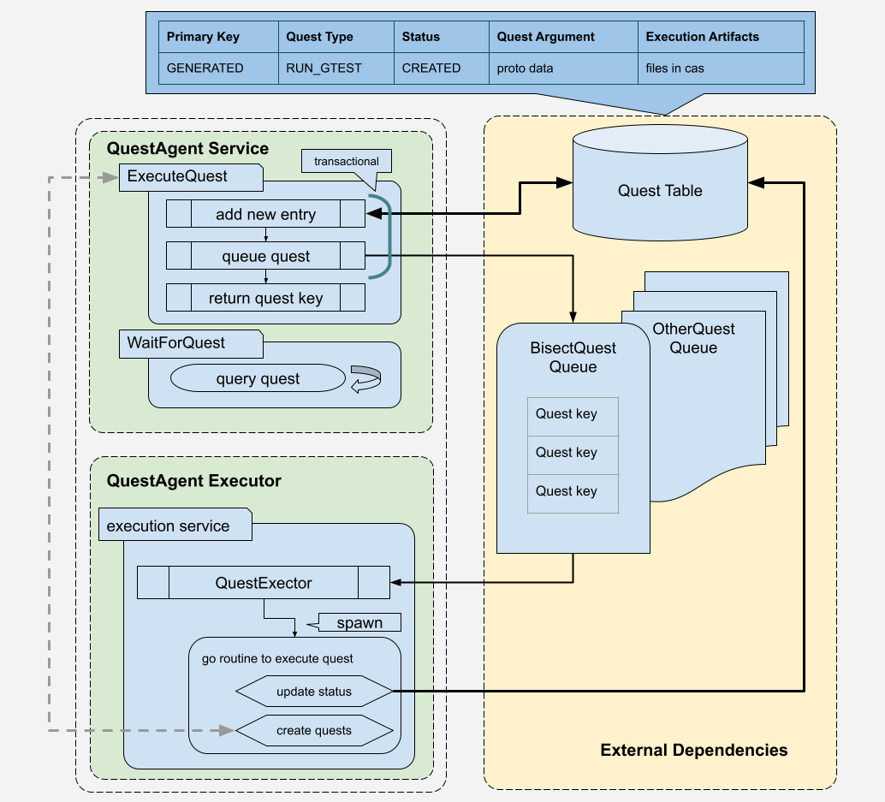

# Quest Agent

The execution service for Chrome perf.

- Owner:
- Mailing list: TBD
- [Design Doc](go/quest-agent-dd)
- Tracking Bug: TBD
- Status: **In Design**

# Overview

## QuestAgent Service

The RPC service that executes a predefined quest / function, or queries an
ongoing quest. The service is wrapped inside RPC endpoints to isolate clients
from underlying storage schemas and Agent implementations details. This enjoys
all the benefits by hiding invocations behind RPC endpoints.

## QuestAgent Executor

The demon-like service to execute the quests. It creates a topic, subscribes to
the pub/sub queue and continues to run. This should be able to be deployed to
Cloud Run or Cloud Function, or incorporated into any other long-running
service in Skia infra as well.

One QuestExecutor is created to handle one quest type, one message queue/topic
is dedicated to one quest type. The executor is responsible for creating a
topic to indicate that it is ready to process quests. Multiple executors can be
started to handle requests in a distributed manner.

## Quest

A Quest is a Go function that typically does followings:

- Encapsulates all the logic that should not be too long or complicated
- Invokes remote services or quests synchronously (waiting on the result to
  proceed)
- Runs a fairly complicated algorithm to process an input or an output from
  other services
- Spawns another goroutine and waits on its completion
- Outputs results whose size should be relatively small

However there are Go functions that may not be considered as a quest:

- Continues to poll an external service
- Runs at a certain interval (cron jobs)
- Spawns another job but don't wait on its completion
