# Module: /

### High-Level Overview

Pinpoint is a service designed for automated performance and functional
bisection on Chromium. Its primary objective is to identify the specific commit
that introduced a regression by orchestrating a series of builds and tests
across a range of commits. The system manages complex, long-running analysis
jobs, integrating with external services like build systems, test schedulers,
and data stores to provide a fully automated workflow from job submission to
culprit identification.

### Project-Specific Terminology

- **Bisection:** An analysis workflow that iteratively narrows down a range of
  commits to find a single culprit. It works by testing a commit in the middle
  of the range, comparing its performance to a known-good baseline, and then
  deciding which half of the range to continue searching in.
- **Pairwise:** An analysis workflow that runs tests on two specific commits
  and statistically compares their performance results to determine if there
  is a significant difference. This is often used to verify a potential
  regression or confirm a culprit found by a bisection.
- **CombinedCommit:** A core data abstraction that represents a specific state
  of the source code. It goes beyond a simple git hash by also including
  potential modifications from dependency rolls (`DEPS` file changes) and
  in-flight Gerrit patches. This allows Pinpoint to accurately reproduce and
  test complex code states that are not represented by a single repository
  commit.
- **Temporal:** A durable workflow orchestration system used as the backbone
  of Pinpoint's execution engine. It allows Pinpoint to model long-running
  bisection jobs as stateful, fault-tolerant processes, managing retries,
  state persistence, and timeouts externally to the core application logic.
- **PGAdapter:** A proxy that translates the standard PostgreSQL wire protocol
  into API calls for a different backend database, such as Google Cloud
  Spanner. It enables applications written with standard PostgreSQL drivers to
  connect to and interact with non-PostgreSQL databases without code changes.
- **Buganizer:** Google's internal issue tracking system. Pinpoint integrates
  with Buganizer to automatically create, update, and comment on issues
  related to performance regressions.

### Overall Architecture

Pinpoint is architected as a distributed system with a clear separation of
concerns between the user interface, the API gateway, the core workflow engine,
and its external integrations.

#### UI (`/ui`)

The user interface is a single-page application (SPA) built with LitElement and
TypeScript. Its design is centered on modularity and a predictable,
unidirectional data flow.

- **Why LitElement & Component-Based Structure:** The UI is composed of
  reusable web components. The architecture uses a "shell and component"
  model, where minimal HTML pages (`/pages`) act as entry points to load root
  components. This delegates all rendering and logic to the components
  themselves, promoting reusability and separation of concerns.
- **How it Manages Data Flow:** Components are divided into two types to
  enforce a one-way data flow.
  1.  **Controller Components:** These are stateful components responsible for
      a specific view (e.g., the job list or results page). They fetch data
      from the backend, manage the view's state, and pass data down to child
      components via properties.
  2.  **Presentational Components:** These are stateless components that are
      only responsible for rendering data they receive as properties. They
      communicate user interactions back to their parent controller by
      dispatching custom events. This "data down, events up" pattern makes the
      application's state management easier to reason about.
- **How it Communicates with the Backend:** All backend communication is
  centralized in a single API service module (`/services/api.ts`). This
  service exports `async` functions that encapsulate `fetch` calls and defines
  TypeScript interfaces that mirror the backend's data structures. This
  approach decouples UI components from the implementation details of API
  requests and provides a type-safe contract between the frontend and backend.

#### Frontend Service (`/go/frontend`)

This Go service acts as the primary API gateway and web server for the Pinpoint
system. It is the component run by the `jobsserver` container.

- **Why it Exists:** It serves a dual purpose: it serves the static assets for
  the SPA and provides the JSON API that the UI consumes. It also acts as a
  bridge, forwarding requests for complex operations (like scheduling a new
  job) to the core Pinpoint gRPC service.
- **How it Manages Configuration:** The service relies on a `benchmarks.json`
  file as its single source of truth for all available benchmarks, the bots
  that can run them, and associated test stories. On startup, this file is
  parsed and its entire contents are loaded into an in-memory cache. This
  design ensures that API requests for configuration data (e.g., to populate
  UI dropdowns) are served with extremely low latency, as they do not require
  disk or database access.
- **How it Connects to the Database:** The frontend requires a
  PostgreSQL-compatible database to store and retrieve job metadata. It
  achieves this by connecting through **PGAdapter**. This proxy allows the Go
  service to use a standard PostgreSQL driver while the underlying data store
  can be a different system, such as Google Cloud Spanner. This decouples the
  service from a specific database technology, simplifying ddevelopment and
  deployment.

#### Core Backend (`/go`)

The Go backend is the heart of Pinpoint, containing the business logic for
scheduling, executing, and analyzing bisection jobs.

- **API Layer (`/proto`, `/go/service`):** The public interface of the backend
  is defined using Protocol Buffers (`service.proto`). This provides a
  strongly-typed, language-agnostic API contract. The API is exposed via both
  gRPC for high-performance internal communication and a RESTful JSON
  interface (auto-generated via gRPC-Gateway) for consumption by the UI. The
  API design favors explicit, job-specific RPCs (e.g., `ScheduleBisection`,
  `SchedulePairwise`) to ensure type safety and clarity of intent.
- **Orchestration Layer (`/go/workflows`):** The core execution logic is
  implemented as **Temporal workflows**.
  - **Why Temporal:** Performance bisections are long-running, stateful
    processes that can take hours and are susceptible to transient failures
    in external systems. Using Temporal offloads the responsibility for
    durability, state management, fault tolerance, and retries from the
    application code. A Pinpoint job is modeled as a durable workflow
    execution that can survive process restarts and continue from where it
    left off.
  - **How it Works:** Workflows define the high-level sequence of steps in a
    job (e.g., find midpoint, build, test, compare, repeat). Each
    individual, short-lived task (e.g., an API call to an external service)
    is implemented as a Temporal "activity." A dedicated `worker` process
    polls the Temporal cluster for tasks and executes this workflow and
    activity logic.
- **Execution & Analysis Logic:** The workflows orchestrate calls to several
  key modules that contain specialized business logic.
  - `/go/midpoint`: This module is the bisection strategist. Its key
    responsibility is to intelligently select the next commit to test. It
    handles not only linear commit histories but also recursively bisects
    through dependency (`DEPS`) changes, which is critical for finding
    regressions caused by dependency rolls.
  - `/go/compare`: This is the statistical analysis engine. After a test
    run, this module receives two sets of performance measurements and
    determines if they are statistically different. It uses a combination of
    statistical tests (e.g., Mann-Whitney U) and a dual-threshold system to
    classify the comparison as definitively `Same`, definitively
    `Different`, or `Unknown`, triggering more test runs if necessary. This
    automates the critical decision-making step in a bisection.
  - `/go/backends`: This module centralizes all communication with external
    infrastructure. It contains a collection of low-level clients that
    abstract the APIs for services like Buildbucket (for compiling
    Chromium), Swarming (for running tests), and Gitiles (for querying git
    history). This design decouples the core workflow logic from the
    implementation details of external systems.
- **Persistence (`/go/sql`):** While Temporal manages the state of _active_
  workflows, a PostgreSQL-compatible SQL database provides long-term storage
  for job history, metadata, and results. The `/go/sql` module defines the
  database schema and provides a data access layer used by the `/go/frontend`
  to serve job information via its API.

#### Buganizer Integration

Pinpoint integrates with Google's IssueTracker (Buganizer) to automate bug
management for performance regressions.

- **Why it's Needed:** This integration allows Pinpoint to automatically
  create or comment on bugs when a regression is found, linking the analysis
  directly to the engineering workflow and eliminating the need for manual
  intervention.
- **How it Works:** The integration is facilitated by a dedicated service
  account. This account is granted specific permissions to access internal
  resources and secrets, such as an IssueTracker API key stored in Secret
  Manager. To modify issues, the service account must be added as a
  collaborator to the relevant Buganizer components. This service account is
  then associated with the Temporal workers, ensuring that any actions
  performed on Buganizer are done under this specific, audited identity.

### Core Workflows

#### A Performance Bisection Job

1.  A user schedules a bisection job through the UI, which sends a request to
    the Pinpoint Frontend service.
2.  The Frontend forwards this request to the core gRPC Service (`/go/service`).
3.  The gRPC service validates the request and initiates a `BisectWorkflow`
    execution on the Temporal cluster.
4.  A Pinpoint Worker process picks up the task and begins executing the
    workflow logic.
5.  **Inside the workflow loop:** a. An activity calls the `/go/midpoint` module
    to determine the next commit to test. b. Activities then use clients from
    `/go/backends` to request a build from Buildbucket and schedule tests on
    Swarming for that commit. c. Once tests complete, another activity fetches
    the performance metric values. d. These values are passed to an activity
    that uses the `/go/compare` module to statistically determine if the
    midpoint commit is better or worse than the baseline. e.g. Based on the
    comparison verdict, the workflow narrows the commit range and the loop
    continues.
6.  Throughout the process, the worker executes activities that update the job's
    status in the SQL database via the `/go/sql` layer. The Frontend service can
    then query this database to display real-time progress in the UI.
7.  Once the range is narrowed to a single commit, the workflow completes,
    marking the commit as the culprit.

#### Culprit Finder Workflow

The `ScheduleCulpritFinder` RPC initiates a composite workflow designed for
high-confidence culprit identification. It proceeds in three distinct stages:

1.  **Regression Verification:** It first runs a `Pairwise` job between the
    provided start and end commits to statistically confirm that a regression
    actually exists within the range. If no regression is found, the workflow
    ends early.
2.  **Bisection:** If a regression is confirmed, it proceeds to run a standard
    `Bisection` job on the commit range to identify one or more potential
    culprit commits.
3.  **Culprit Verification:** For each potential culprit found by the bisection,
    it runs a final `Pairwise` job comparing the culprit against its immediate
    parent commit. This step verifies that the specific commit is, by itself,
    the source of the regression. The workflow only reports culprits that pass
    this final verification step.

# Module: /docs

The `/docs` module serves as a repository for operational and integration
documentation relevant to various services within the project, particularly
those supporting the Pinpoint ecosystem. Its primary goal is to provide guidance
on how services are configured, interact with external platforms, and manage
their data and workflows.

## Pinpoint Frontend

The Pinpoint Frontend service (`/go/frontend`) is the primary user interface and
API gateway for the Pinpoint performance regression analysis system. Its core
purpose is to provide users with a comprehensive view of Pinpoint jobs, enable
them to initiate and manage these jobs, and access crucial configuration data
necessary for defining performance experiments. It acts as the critical bridge
between user requests and the underlying Pinpoint services, databases, and
workflow orchestration.

The service's responsibilities include:

- Providing HTTP endpoints for listing and viewing Pinpoint jobs.
- Serving the Pinpoint UI (landing and results pages).
- Providing configuration data such as available benchmarks, bots, and
  stories.
- Forwarding relevant requests to an underlying Pinpoint gRPC service for core
  functionalities like scheduling new jobs.

### Key Components and Design Decisions

The Pinpoint Frontend service is designed with several key architectural
components to achieve its goals:

- **User Interface & API Endpoints:** The service serves both a web-based user
  interface and a set of RESTful JSON API endpoints. These endpoints manage
  job lifecycle (listing, viewing), and provide dynamic configuration data
  (e.g., `/benchmarks`, `/bots`, `/stories`). It also acts as a proxy,
  forwarding requests to the core Pinpoint gRPC service for operations like
  job scheduling.

- **Database Integration with PGAdapter:** The Pinpoint Frontend is a Go
  application that requires a PostgreSQL-compatible database connection.
  However, it does not directly connect to a PostgreSQL database. Instead, it
  leverages **PGAdapter**.

  - **Why PGAdapter:** PGAdapter acts as an intelligent proxy, translating
    standard PostgreSQL wire protocol requests into calls for a specific
    backend database, such as Google Cloud Spanner. This design choice
    decouples the frontend service from direct database-specific client
    libraries. It allows the Go service to interact with the database as if
    it were a standard PostgreSQL instance, significantly simplifying
    development, testing, and deployment by using familiar database
    patterns.
  - **How it Works:** PGAdapter runs as a separate Java process, typically
    on the same host or network location as the frontend. It requires
    specific JAR files and configuration (e.g., instance ID, database name,
    authentication credentials) to establish and maintain the connection
    between the frontend and the underlying datastore.

- **Workflow Orchestration with Temporal:** For complex, long-running
  operations such as initiating Pairwise bisect jobs or canceling ongoing
  ones, the frontend delegates to a **Temporal workflow system**.

  - **Why Temporal:** Temporal provides robust and durable workflow
    orchestration. This ensures that complex jobs are executed reliably,
    automatically retried on failures, and their state is consistently
    maintained across potentially long durations. The frontend itself does
    not directly perform these complex, stateful operations; instead, it
    sends signals or initiates workflows on the Temporal cluster.
  - **How it Works:** The Pinpoint gRPC service (which the frontend forwards
    requests to) interacts with a Temporal client. This client communicates
    with a Temporal cluster, which then dispatches tasks to dedicated
    **Temporal workers**. These workers are responsible for executing the
    actual job logic (e.g., fetching data, running bisects). Workers listen
    on specific namespaces and task queues (e.g., `perf-internal`,
    `perf.perf-chrome-public.bisect`).

- **Configuration Management via `benchmarks.json`:** The service relies on
  `benchmarks.json` as its single source of truth for critical Pinpoint
  operational parameters.
  - **Why `benchmarks.json`:** This file centrally defines all available
    performance benchmarks, the bots capable of running them, and the
    specific test stories associated with each benchmark. This centralized
    configuration ensures consistency across the system, provides dynamic
    data for UI elements (like dropdowns), and enables the API endpoints to
    serve up-to-date configuration.
  - **How it Works:** Upon service startup, `benchmarks.json` is parsed and
    its contents are loaded entirely into an in-memory cache. This approach
    allows for extremely fast access to configuration data, as subsequent
    requests to the `/benchmarks`, `/bots`, and `/stories` API endpoints can
    retrieve information directly from memory without incurring repeated
    disk I/O, ensuring high performance for frequently queried data.

### Configuration Workflow with `benchmarks.json`

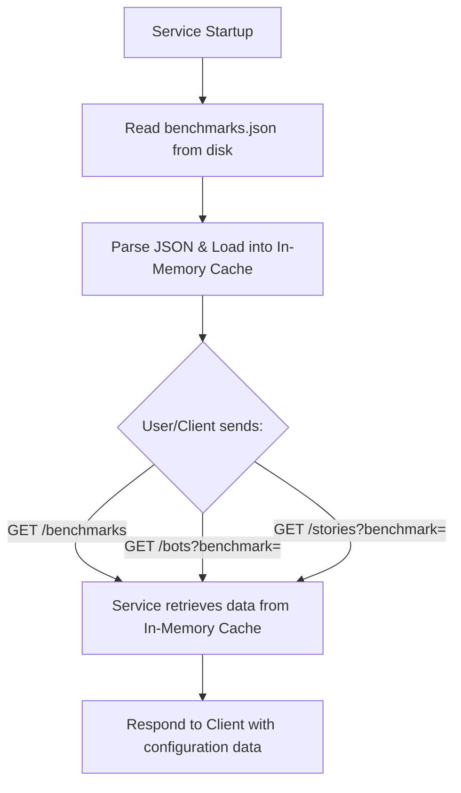

### Pinpoint Job Initiation Workflow with Temporal

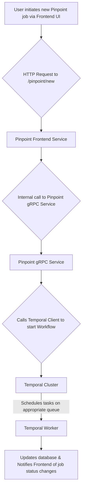

## Buganizer Integration

Automated systems, including Pinpoint, require the ability to interact with
Google's IssueTracker (**Buganizer**) for managing issues. This integration is
crucial for workflows that automatically create, update, or comment on bugs in
response to detected performance regressions or other significant events,
ensuring efficient tracking without manual intervention.

The integration is primarily facilitated through a dedicated **service account**
that acts on behalf of the automated system. This service account requires
specific, carefully managed permissions to securely access internal resources
and interact with Buganizer.

- **Service Account Creation:** A new service account is provisioned with a
  clear and descriptive name, avoiding misleading terms. This is typically
  managed through infrastructure-as-code changes.
- **Permission Grants:** The service account is granted several critical
  roles:
  - Read access to CAS (Credential Access System) for retrieving necessary
    secrets.
  - The `roles/cloudtrace.agent` for distributed tracing and observability.
  - Read access to internal code repositories, often involving a separate
    approval process.
- **IssueTracker API Key Access:** To interact with the IssueTracker API, the
  service account needs to read the IssueTracker secret key, which is stored
  in Secret Manager. This is a sensitive operation requiring an administrator
  to temporarily elevate their own permissions using **breakglass** to grant
  the service account the "Secret Manager Secret Accessor" role specifically
  for the IssueTracker key. This ensures tight control over access to
  sensitive credentials.
- **Ticket Collaboration:** For the service account to be able to modify
  tickets (e.g., add comments, change status), it must either be added as a
  **collaborator** on the relevant Buganizer components or be granted the
  "issue editor" role by a Component Admin. This provides the automated system
  with the necessary authority to update issues as required by workflow logic.
- **Deployment:** The configured service account is then associated with the
  Pinpoint workers, specifically for Temporal workflows, ensuring these
  workers operate under the appropriate identity when initiating or updating
  Buganizer issues.

# Module: /go

This module contains the complete Go-based backend for Pinpoint, a service for
performance and functional bisection on Chromium. It orchestrates complex,
long-running analysis jobs by integrating with various external services like
build systems, test schedulers, and data stores.

### Core Principles

- **Durable Orchestration with Temporal**: The system's core logic is
  implemented as Temporal workflows. This design choice provides fault
  tolerance, state persistence, and observability for long-running bisection
  jobs, offloading complex state management and retry logic from the
  application code.
- **Separation of Concerns**: The architecture distinctly separates the public
  API, the workflow orchestration logic, and low-level clients for external
  services. This modularity simplifies maintenance and testing.
- **Configuration as Code**: Bot and test configurations are embedded directly
  into the binary. This simplifies deployment and guarantees that the
  application and its configuration are always in sync.

### Key Modules and Responsibilities

- **/go/service**: The public API layer. It exposes a gRPC service (and a JSON
  equivalent via grpc-gateway) for clients to schedule, query, and cancel
  jobs. Its primary responsibility is to validate incoming requests and
  translate them into Temporal workflow executions, acting as the main entry
  point into the system.

- **/go/workflows**: The heart of Pinpoint's execution engine. This module
  defines the Temporal workflows and activities that implement the business
  logic for bisection, pairwise testing, and culprit finding.

  - **Why**: It models a Pinpoint job as a durable, stateful process. A
    `BisectWorkflow`, for example, orchestrates the entire process of
    finding a midpoint, building, testing, and comparing results, with
    Temporal ensuring the process can survive failures and continue where it
    left off.
  - **How**: Workflows define the high-level steps, while activities execute
    the short-lived, potentially failing tasks like making an API call to an
    external service. A dedicated `worker` process executes this logic.

- **/go/backends**: A collection of low-level clients for all external
  services.

  - **Why**: To centralize and abstract interactions with external
    infrastructure like Buildbucket (for builds), Swarming (for tests),
    Gitiles (for git history), and BigQuery (for data storage). This
    decouples the core workflow logic from the implementation details of
    external APIs.
  - **How**: Each submodule provides a dedicated client (e.g.,
    `buildbucket.go`, `swarming.go`) that handles authentication, request
    formation, and response parsing for a specific service.

- **/go/midpoint**: The bisection strategist.

  - **Why**: To intelligently select the next commit to test. The core
    challenge is handling not just linear commit history but also changes
    rolled in through dependencies (DEPS).
  - **How**: When bisecting a commit range, it finds the median commit. If
    the range is already narrowed to two adjacent commits, it parses their
    `DEPS` files, identifies the first modified dependency, and recursively
    continues the bisection within that dependency's repository.

- **/go/compare**: The statistical analysis engine.

  - **Why**: To provide automated, data-driven decisions on whether a change
    introduced a regression. This is the critical decision point in each
    bisection step.
  - **How**: It uses a combination of statistical tests (Kolmogorov-Smirnov,
    Mann-Whitney U) and a dual-threshold system. This allows it to quickly
    classify two sets of measurements as definitively `Same`, definitively
    `Different`, or `Unknown` (requiring more test runs), optimizing the
    speed and accuracy of the bisection.

- **/go/bot_configs**: The central configuration provider.

  - **Why**: To manage the vast and complex configurations for different
    bots, benchmarks, and tests without hardcoding them in the business
    logic.
  - **How**: It loads configuration from embedded JSON and YAML files. It
    provides lookup functions that resolve the correct build parameters and
    test targets for any given bot and benchmark combination, including
    handling aliases and regex-based matching.

- **/go/sql** and **/go/frontend**: The persistence and presentation layers.
  - **Why**: To store and display job metadata. While Temporal manages
    active workflow state, the SQL database provides long-term storage for
    job history and results.
  - **How**: `/go/sql` defines the database schema using Go structs and
    provides a `jobs_store` for data access. `/go/frontend` is a lightweight
    web service that queries this store to provide a simple UI and JSON API
    for viewing job status and results.

### Core Workflow: A Performance Bisection Job

The following diagram illustrates how the key modules interact to execute a
typical bisection job.

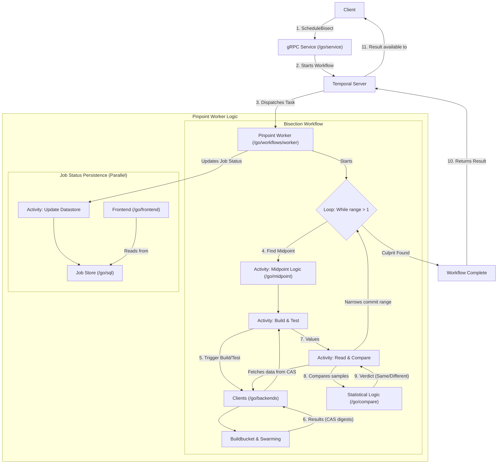

# Module: /go/backends

This module consolidates clients and logic for interacting with various external
services critical to Pinpoint's bisection workflow. It provides a standardized
and abstracted layer for tasks such as triggering builds, managing test
execution, fetching commit information, storing data, and reporting results,
minimizing direct external API dependencies across the Pinpoint codebase.

### Key Components and Responsibilities

- **`bigquery.go`**: Manages interactions with Google BigQuery. It abstracts
  data ingestion and table management, enabling Pinpoint to store bisection
  results, telemetry, or other structured data efficiently.
- **`buildbucket.go`**: Provides the primary interface for Buildbucket, the
  system for building Chrome. Its responsibilities include:
  - **Triggering and Managing Builds**: Scheduling new Chrome builds for
    specific commits, with optional DEPS overrides or Gerrit patches, and
    cancelling ongoing builds.
  - **Build Status and Artifacts**: Querying build status and retrieving CAS
    (Content Addressable Storage) references for build outputs. This is
    crucial for passing artifacts to Swarming for testing.
  - **Build Reuse**: Intelligently searching for and identifying existing
    builds (Pinpoint `try` builds or CI `waterfall` builds) that match
    specific criteria (commit, DEPS, patches) to avoid redundant work. This
    is achieved via `GetSingleBuild`, `GetBuildWithDeps`,
    `GetBuildWithPatches`, and `GetBuildFromWaterfall`, leveraging the
    `PinpointWaterfall` mapping (defined in `waterfall_map.go`).
- **`crrev.go`**: Facilitates conversion between various Chromium commit
  identifiers (e.g., commit positions, Git hashes) and canonical Git hashes,
  ensuring consistent commit references across different backend systems.
- **`gitiles.go`**: Offers a client for Gitiles, primarily used to access Git
  repository information (e.g., `chromium/src`). It provides an authenticated
  interface for fetching repository details and commit history, essential for
  bisection range determination.
- **`issuetracker.go`**: Integrates with Google IssueTracker (Buganizer). Its
  core responsibility is to automate the reporting of bisection results (e.g.,
  identified culprits) as comments on bug reports. It uses embedded templates
  (`culprit_detected.tmpl`) for structured, informative messages.
- **`swarming.go`**: Manages interactions with Swarming, the distributed task
  execution system for running tests. Key functions include:
  - **Task Triggering**: Scheduling Swarming tasks, often using CAS
    references from Buildbucket builds to execute performance benchmarks or
    other tests.
  - **Task Monitoring**: Retrieving task status, start times, and CAS output
    references (for results or subsequent tasks).
  - **Bot Management**: Querying available bots based on specific builder
    configurations to ensure tasks run on appropriate hardware.
  - **Task Interruption Detection**: Identifying if other tasks ran on a bot
    between two specific bisection tasks (`GetBotTasksBetweenTwoTasks`) to
    detect potential interference.

### Core Workflow (Build-and-Test Bisection Example)

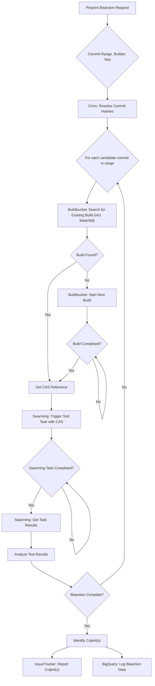

# Module: /go/backends/mocks

`go/backends/mocks`

This module provides generated mock clients for Pinpoint's external backend
services. It facilitates unit and integration testing by decoupling tested
components from actual external dependencies.

Mocks are generated from interfaces defined in
`go.skia.org/infra/pinpoint/go/backends` using the `mockery` tool. This approach
ensures mock consistency with interface contracts and enables robust, isolated
testing without live service reliance or API call overhead.

Each file, such as `BigQueryClient.go` or `BuildbucketClient.go`, contains a
mock implementation for a specific backend client interface. These mocks
leverage `github.com/stretchr/testify/mock` to define expected method calls,
return values, and side effects, simplifying test setup and enabling precise
control over simulated external service behavior.

# Module: /go/bot_configs

This module centralizes and manages configuration data for Pinpoint bots,
dictating how Chrome builds are specified in LUCI and how performance tests are
executed on Swarming. It also maps bots and benchmarks to specific build targets
(isolates).

### Bot Configurations

Bot configurations define parameters for building Chrome and running tests.

- **`bot_configs.go`**: Defines the `BotConfig` structure and provides the
  primary interface (`GetBotConfig`) for retrieving bot configurations. It
  also includes validation logic to ensure data integrity.
  - **Separation of `external.json` and `internal.json`**: Public
    configurations (`external.json`) are separated from internal or
    experimental ones (`internal.json`). `internal.json` augments or
    overrides `external.json` entries.
  - **Embedded JSON**: Configurations are embedded directly into the Go
    binary (`_embed` directive), ensuring runtime availability and
    simplifying deployment.
  - **Lazy Loading**: Configurations are unmarshaled from JSON only once
    (`sync.Once`) upon first access, optimizing performance.
  - **Aliases**: The `BotConfig.Alias` field allows bots with identical
    configurations to refer to a common alias, reducing duplication.
    `GetBotConfig` transparently resolves these aliases.
  - **Validation**: The `validate()` function enforces data integrity,
    checking for duplicate bot definitions, nested aliases, and completeness
    of configuration fields.

### Isolate Targets

Isolate targets specify the executable artifact to run for performance tests on
Swarming.

- **`isolate_targets.go`**: Maps bot names and benchmark names to specific
  Swarming isolate targets.
  - **Embedded YAML**: Isolate target mappings are embedded from
    `isolate_targets.yaml` into the binary.
  - **Tiered Lookup**: `GetIsolateTarget` resolves targets using a priority
    order:
  * Benchmark-specific overrides.
  * Exact bot name matches.
  * Regex pattern matches within the bot name.
  * A default `performance_test_suite` if no other match is found. This
    hierarchy provides flexible control over target selection.

### Key Workflow: Retrieving a Bot Configuration

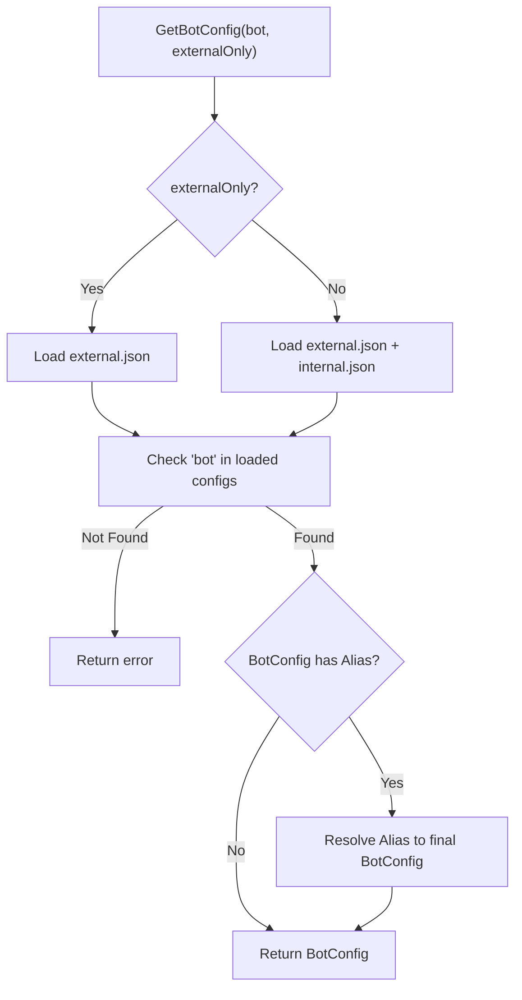

### Key Workflow: Retrieving an Isolate Target

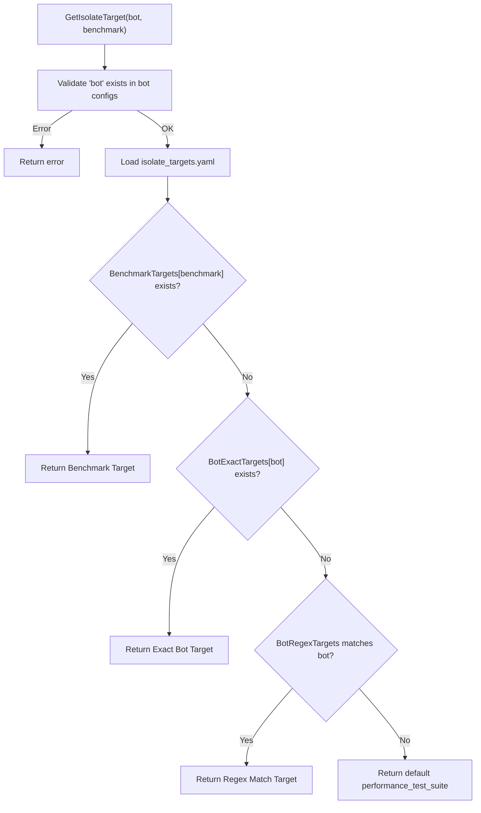

# Module: /go/cbb

The `/go/cbb` module provides essential utilities for the Continuous Browser
Benchmarking (CBB) infrastructure. It automates the distribution of Safari
Technology Preview (STP) releases for CBB devices and facilitates the ingestion
of historical CBB v3 performance data into the modern CBB v4 system (Skia Perf
dashboard).

### `download_stp`

This utility ensures CBB devices always have access to the latest Safari
Technology Preview (STP) releases for benchmarking. Apple does not provide a
direct API for STP downloads. Therefore, `download_stp` parses Apple's Safari
resources page to dynamically discover the latest STP builds and extract their
`.dmg` installer URLs.

Downloaded `.dmg` installers are then packaged and uploaded to CIPD
(`infra/chromeperf/cbb/safari_technology_preview`) for reliable and centralized
distribution across the CBB infrastructure. Packages are tagged with specific
CIPD references (e.g., `stable`, `canary`, `latest`,
`[release]-macos[version]`), enabling controlled rollouts and precise version
targeting for CBB devices. The process is idempotent, checking for existing
packages and references before performing redundant uploads.

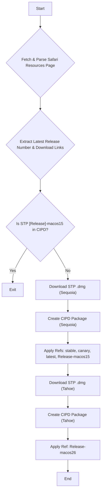

### `upload_v3_data`

This utility backfills historical CBB v3 performance metrics, sourced from a
specific Google3 CSV export, into the Skia Perf dashboard. This enables modern
CBB v4 analyses to include a comprehensive historical context from legacy data.

The conversion process, orchestrated by `main.go`, consumes a single
`cbb_v3_data.csv` file and produces multiple Skia Perf JSON files. Key
responsibilities include:

- **Data Ingestion and Normalization:** Reads the CSV and normalizes
  inconsistent Chrome version strings (e.g., `137.0.7151.070` to
  `137.0.7151.70`) to conform to Skia Perf's expected formats.
- **Commit Position Mapping:** A critical step that translates CBB v3 browser
  versions (Chrome, Safari, Edge across channels and devices) into equivalent
  Skia Perf "commit positions." This mapping, leveraging hardcoded
  configurations for known versions and a heuristic fallback for others, is
  essential for correctly plotting historical data along the Skia Perf x-axis.
- **Skia Perf Format Generation:** Transforms CBB v3 data points into
  individual Skia Perf `format.Format` JSON structures. This involves mapping
  CBB v3 identifiers (device, browser, benchmark) to Skia Perf bot, benchmark,
  and test trace keys, and explicitly marking the data as "Legacy Data."
- **Output Management:** Writes the generated JSON files, structured for
  subsequent bulk upload to the `chrome-perf-non-public` GCS bucket, to
  `~/cbb`.

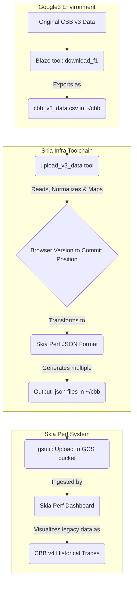

# Module: /go/cbb/download_stp

This module automates the distribution of Safari Technology Preview (STP)
releases for Continuous Browser Benchmarking (CBB). It ensures CBB devices
always have access to the latest STP versions by packaging them into CIPD.

**Design and Implementation:**

- **STP Discovery:** Apple does not provide a direct API for STP downloads.
  The tool parses the
  [Safari Technology Preview resources page](https://developer.apple.com/safari/resources/)
  to extract the latest release number and download URLs for various macOS
  versions. This approach is necessary to dynamically discover new STP builds.
- **CIPD Packaging:** STP `.dmg` installers are downloaded and uploaded as
  CIPD packages (`infra/chromeperf/cbb/safari_technology_preview`). CIPD is
  used for reliable and centralized distribution of artifacts across the
  infrastructure.
- **Reference Management:** Packages are tagged with specific CIPD references
  (e.g., `stable`, `canary`, `latest`, `[release]-macos[version]`). These
  references allow CBB devices to consume specific STP versions, enabling
  controlled rollouts and easy version targeting.
- **Idempotency:** Before creating new CIPD packages, the tool checks if the
  current STP release (identified by its version and macOS) already exists in
  CIPD with the necessary references. This prevents redundant uploads and
  ensures efficiency.

**Key Workflow:**


# Module: /go/cbb/upload_v3_data

Converts legacy Cross-Browser Benchmarking (CBB) v3 data, sourced from a
specific Google3 CSV export, into the Skia Perf dashboard's JSON ingestion
format. This enables backfilling historical CBB v3 performance metrics into the
modern CBB v4 system.

### Design and Implementation

The utility operates as a one-shot conversion process, consuming a single CSV
file and producing multiple Skia Perf JSON files.

### Key Components and Responsibilities

- **`main.go`**: Orchestrates the entire conversion.
  - **Data Ingestion and Normalization**: Reads `cbb_v3_data.csv` from the
    user's `~/cbb` directory. It normalizes inconsistent Chrome version
    strings (e.g., `137.0.7151.070` to `137.0.7151.70`) to match standard
    formats expected by Skia Perf.
  - **Commit Position Mapping**: Translates CBB v3 browser versions (Chrome,
    Safari, Edge across stable/dev channels and devices) into equivalent
    Skia Perf "commit positions." This mapping is crucial for correctly
    plotting historical data on the Skia Perf x-axis. A set of hardcoded
    maps (`chromeStableCP`, `safariTPCP`, etc.) provides precise mappings
    for known versions. A heuristic fallback calculates approximate commit
    positions for Chrome versions not explicitly listed, catering to the
    historical nature of the data.
  - **Skia Perf Format Generation**: Transforms raw CBB v3 data points into
    individual Skia Perf `format.Format` JSON structures. This includes
    mapping CBB v3 device, browser, and benchmark names to their
    corresponding Skia Perf bot, benchmark, and test trace keys, and
    explicitly marking them as "Legacy Data."
  - **Output Management**: Writes the generated JSON files to `~/cbb`,
    structuring them for subsequent bulk upload to the
    `chrome-perf-non-public` GCS bucket.


# Module: /go/clients

The `/go/clients` module provides abstracted interfaces for interacting with
external services essential to Pinpoint, such as build systems and data storage.
It centralizes and simplifies communication, ensuring Pinpoint's core logic
remains decoupled from specific service APIs and configurations.

### Design Principles and Implementation Choices

1.  **Service Abstraction**:

    - **Why**: To decouple Pinpoint's business logic from the specifics of
      underlying external services. This allows for easier maintenance,
      potential future integration of alternative services, and a consistent
      API for Pinpoint workflows.
    - **How**: Generic Go interfaces (e.g., `BuildClient`, `UploadClient`)
      define common operations for distinct service types.

2.  **Project-Specific Implementations**:

    - **Why**: External services often have unique requirements,
      configurations, or operational heuristics specific to a project (e.g.,
      Chrome/Chromium). Abstracting these details allows the generic interface
      to remain clean.
    - **How**: Concrete client implementations (e.g., `buildChromeClient`,
      `uploadChromeDataClient`) translate generic Pinpoint requests into
      service-specific API calls and data structures, including complex
      project-specific logic or heuristics where necessary.

3.  **Delegation to Backend Clients**:
    - **Why**: To separate the logic of _what_ operations to perform and _how_
      to map parameters (handled by `clients`) from the low-level mechanics of
      making authenticated API requests and managing data
      serialization/deserialization.
    - **How**: `clients` implementations embed and utilize clients from the
      `go/backends` module, which are responsible for direct, authenticated
      interactions with service APIs (e.g., Buildbucket, BigQuery).

### Key Components

- **`build` submodule**: Offers the `BuildClient` interface for managing
  Chrome/Chromium builds. The `buildChromeClient` implementation encapsulates
  the detailed logic for interacting with Buildbucket, including builder
  resolution, constructing request properties, and specific build search
  heuristics (e.g., differentiating "try" vs. "waterfall" builds).
- **`upload` submodule**: Provides the `UploadClient` interface for ingesting
  data into storage systems. The `uploadChromeDataClient` implementation
  handles operations for Google BigQuery, including deriving table schemas
  from Go structs and inserting data rows.

# Module: /go/clients/build

The `/go/clients/build` module provides an abstraction layer for interacting
with build systems, primarily Buildbucket, to manage Chrome/Chromium builds
within Pinpoint. It enables other Pinpoint components to perform build-related
operations (find, start, get status, retrieve artifacts, cancel) without direct
knowledge of the underlying build system's API or project-specific
configurations.

### Design Principles and Implementation Choices

1.  **Build System Agnostic Interface (`build_client.go`)**:

    - **Why**: To decouple Pinpoint's core logic from specific build platform
      details (e.g., Buildbucket, other potential future systems). A unified
      interface simplifies interaction and allows for future expansion.
    - **How**: The `BuildClient` interface defines generic operations. A
      factory function (`NewBuildClient`) provides authenticated client
      instances; currently, it exclusively returns a Chrome-specific client
      but is designed for future multi-project support.

2.  **Chrome/Chromium Specific Implementation (`build_chrome.go`)**:

    - **Why**: Chromium builds have unique requirements: specific builders,
      buckets (`try`, `ci`), custom request properties (e.g., `git_repo`,
      `deps_revision_overrides`), and nuanced logic for finding existing
      builds (e.g., handling patches or DEPS rolls differently for "try" vs.
      "waterfall" builds).
    - **How**: `buildChromeClient` encapsulates this logic. It maps Pinpoint's
      generic `workflows.BuildParams` to Buildbucket-specific requests,
      leveraging `bot_configs` for device-to-builder translation. Its
      `FindBuild` method implements a precise search strategy: first for
      Pinpoint-initiated "try" builds, then conditionally falling back to
      "waterfall" (CI) builds if no patches or DEPS rolls are present.

3.  **Generic Request/Response Wrappers (`types.go`)**:

    - **Why**: To maintain the `BuildClient` interface's independence from
      concrete Buildbucket protobufs or other API-specific data structures.
    - **How**: Simple structs like `FindBuildRequest` and `StartBuildRequest`
      use `any` to hold the actual, system-specific request/response payloads.
      Concrete client implementations then perform type assertions.

4.  **Delegation to Backend Client**:
    - **Why**: To separate the module's logic (mapping Pinpoint concepts to
      build system operations) from the low-level concerns of making API
      calls.
    - **How**: `buildChromeClient` embeds `backends.BuildbucketClient` to
      handle the actual HTTP requests and protobuf serialization for
      Buildbucket.

### Key Components

- **`build_client.go`**: Defines the `BuildClient` interface, which is the
  primary API contract for build operations. It also contains `NewBuildClient`
  for creating authenticated instances.
- **`build_chrome.go`**: Provides the concrete `buildChromeClient`
  implementation for Chrome/Chromium projects. This file contains the detailed
  logic for constructing Buildbucket requests, translating Pinpoint
  parameters, and implementing the specific build search heuristics.
- **`types.go`**: Contains lightweight, generic request and response structs
  that wrap system-specific payloads, enabling the `BuildClient` interface to
  remain generic.

### Build Request Workflow

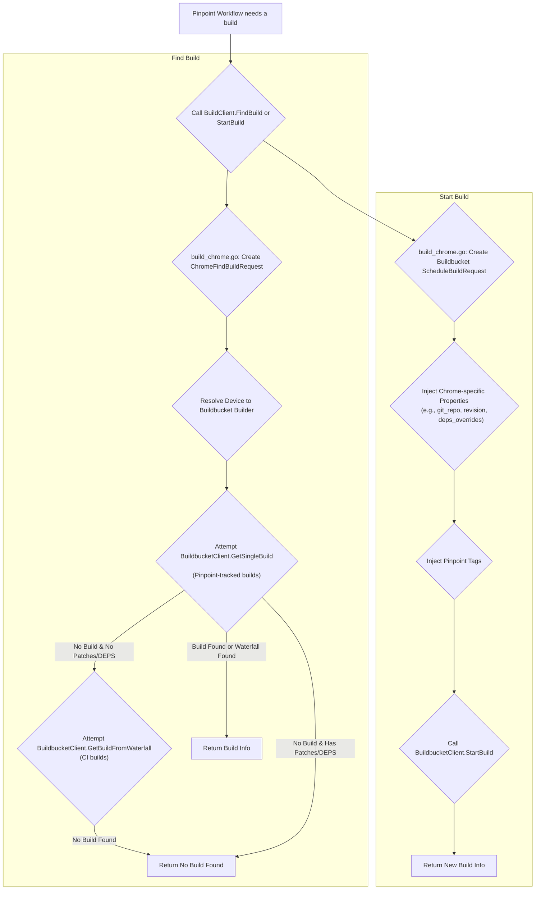

# Module: /go/clients/upload

This module offers a unified client for uploading data to backend storage,
specifically Google BigQuery for Chrome performance data.

The `UploadClient` interface (`upload_client.go`) abstracts the underlying
storage technology, decoupling consumers from specific backends (e.g., BigQuery,
Cloud SQL). This design enables future flexibility for different storage
solutions.

### Key Components

- **`upload_client.go`**: Defines the module's public API.

  - `UploadClient` interface: Specifies `CreateTableFromStruct` (to define
    table schema from a Go struct using tags) and `Insert` (to upload data
    rows). This is the primary interaction point.
  - `NewUploadClient` factory: Returns a concrete `UploadClient`
    implementation, currently `uploadChromeDataClient`.

- **`upload_chrome_data.go`**: Implements `UploadClient` for BigQuery-specific
  operations.
  - `uploadChromeDataClient`: Manages BigQuery interactions for a given
    project, dataset, and table. It leverages `go/backends.BigQueryClient`
    to perform actual BigQuery API calls.
  - **How it works**: `NewUploadClient` instantiates
    `uploadChromeDataClient`, which establishes a connection to BigQuery.
    Subsequent calls to `CreateTableFromStruct` or `Insert` translate
    generic requests into BigQuery-specific operations, utilizing Go struct
    tags (e.g., `bigquery:"column_name"`) for schema mapping and data
    insertion.

### Workflow

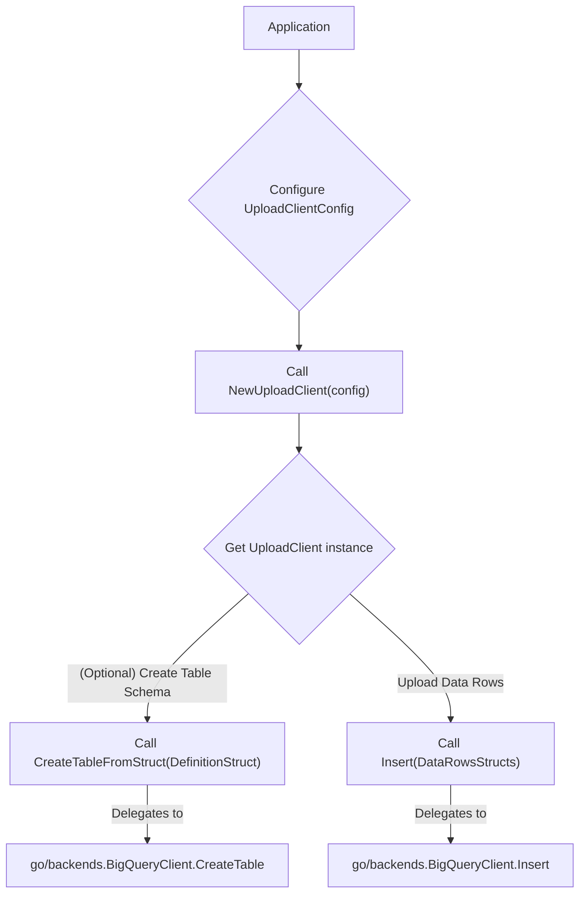

# Module: /go/common

The `/go/common` module defines core data structures and utilities for
`CombinedCommit` objects. These objects encapsulate a main repository commit
alongside overridden dependency commits, crucial for defining specific test
environments where a main project is tested against particular versions of its
dependencies.

### Design Decisions & Implementation Choices

The `CombinedCommit` type extends the `pinpoint_proto.CombinedCommit` protobuf
message, adding domain-specific logic and helper methods. This keeps the
protobuf definition pure for serialization while providing rich functionality
for business operations.

- **Dependency Management:** The `ModifiedDeps` field (a slice of
  `pinpoint_proto.Commit`) allows flexible specification of multiple
  dependency overrides. This enables testing a main project (e.g., Chromium)
  with specific versions of its transitive dependencies (e.g., V8, Skia),
  offering granular control over the build environment.
- **Identity and Hashing:** The `Key()` method generates a unique FNV hash for
  a `CombinedCommit`. This serves as a lightweight, non-cryptographic
  identifier, suitable for caching and map indexing, facilitating efficient
  tracking and comparison of build requests.
- **Dynamic Updates:** The `UpsertModifiedDep()` method efficiently adds or
  updates dependency commits. Despite its linear time complexity, this design
  is pragmatic, as the number of modified dependencies is expected to remain
  small, preventing performance bottlenecks.
- **Convenience Constructors:** Functions like `NewChromiumCommit()` and
  `NewCommit()` simplify `pinpoint_proto.Commit` instance creation,
  abstracting common setup patterns.

### Key Components & Responsibilities

The `combined_commit.go` file implements the `CombinedCommit` type and its
methods. It is responsible for:

- **Representing Complex Commits:** Encapsulating a main repository commit
  with its specific dependency overrides.
- **Commit Manipulation:** Providing methods to add, update, or retrieve
  dependency information (`UpsertModifiedDep`, `DepsToMap`,
  `GetLatestModifiedDep`).
- **Cloning and Identity:** Offering `Clone()` for creating independent copies
  and `Key()` for generating unique identifiers.

### Workflow: Building a Combined Commit

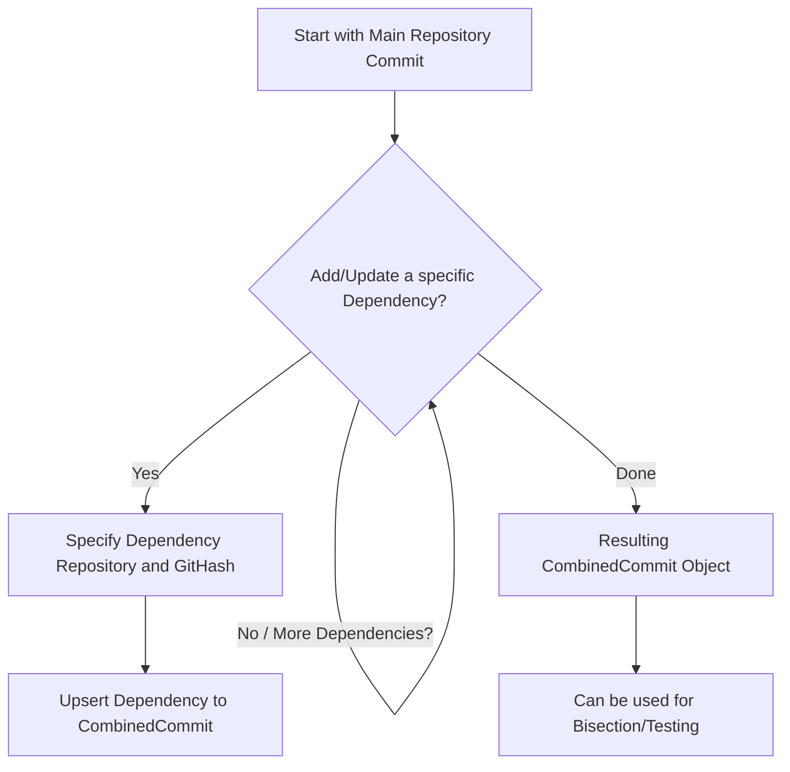

# Module: /go/compare

The `compare` module provides statistical methods to determine if two sets of
measurements are significantly different, similar, or inconclusive. It is
crucial for automated systems like Pinpoint to identify performance regressions
or functional failures efficiently.

### Design and Implementation Choices

- **Robust Statistical Testing**: To account for varying data characteristics
  and sensitivity requirements, the module employs both the Kolmogorov-Smirnov
  (KS) test, which is effective for detecting differences in distribution
  shapes, and the Mann-Whitney U (MWU) test, which is robust for detecting
  shifts in medians. The minimum p-value from these two tests is used as the
  overall significance measure.
- **Optimized Decision-Making with Dual Thresholds**: Instead of a single
  statistical significance level, the module utilizes a dual-threshold system
  (provided by `pinpoint/go/compare/thresholds`). A `LowThreshold` identifies
  statistically `Different` samples, while a `HighThreshold` allows for early
  classification of `Same` samples, thereby conserving computational resources
  in iterative bisection processes. P-values falling between these thresholds
  result in an `Unknown` verdict, suggesting the need for more data.
- **Contextual Comparison Logic**: The comparison logic adapts based on the
  type of data being analyzed:
  - **Performance Bisections**: Handle rational, non-negative numbers
    typical of benchmark results. They incorporate a "small difference"
    check to avoid bisecting on trivial changes and normalize magnitudes
    based on the interquartile range (IQR) for threshold calculation.
  - **Functional Bisections**: Focus on failure rates (represented as 0s and
    1s). They leverage specialized thresholds tailored for binary data,
    generally assuming an "improvement" means a decrease in failure rate.
- **Pairwise Comparison for Related Samples**: For comparisons involving
  paired observations (e.g., before-and-after measurements), the
  `ComparePairwise` function is used. This delegates to the Wilcoxon
  Signed-Rank Test (provided by `pinpoint/go/compare/stats`), which supports
  data transformations (e.g., logarithmic) and provides confidence intervals
  relevant for percentage changes, making it suitable for analysis of relative
  effects.

### Key Components

- **`compare.go`**: This file defines the core comparison orchestration. It
  introduces `Verdict` (e.g., `Same`, `Different`, `Unknown`) and
  `ImprovementDir` (e.g., `Up`, `Down`, `UnknownDir`) enums. It exposes
  high-level functions like `CompareFunctional`, `ComparePerformance`, and
  `ComparePairwise` which encapsulate the specific comparison logic, threshold
  application, and data pre-processing necessary for each context.
- **`kolmogorov_smirnov.go`**: Implements the 2-sample Kolmogorov-Smirnov (KS)
  test. It calculates the maximum difference between the empirical cumulative
  distribution functions (CDFs) of two independent samples to determine their
  statistical similarity.
- **`mann_whitney_u.go`**: Implements the Mann-Whitney U (MWU) test. This
  non-parametric test determines if two independent samples are drawn from the
  same distribution by comparing their medians through rank analysis, robustly
  handling tied values.
- **`pinpoint/go/compare/stats`**: This submodule provides the Wilcoxon
  Signed-Rank Test, primarily used for `ComparePairwise`. It supports exact
  and asymptotic calculations, data transformations (`LogTransform`,
  `NormalizeResult`), and confidence interval computation.
- **`pinpoint/go/compare/thresholds`**: This submodule manages the
  dual-threshold system (`LowThreshold`, `HighThreshold`). It provides
  pre-computed high thresholds that dynamically adjust based on sample size
  and expected magnitude, optimizing the bisection process by enabling quicker
  decisions.

### Main Comparison Workflow

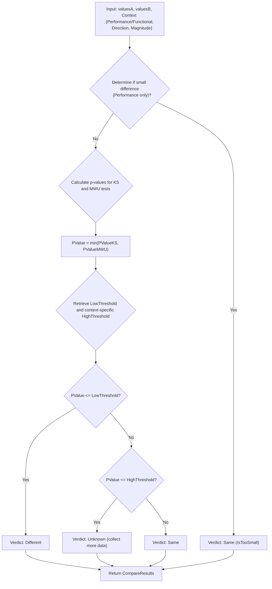

# Module: /go/compare/stats

This module provides a Go implementation of the Wilcoxon Signed-Rank Test,
primarily for pairwise statistical analysis in performance benchmarking, as used
in projects like Pinpoint. It enables non-parametric comparison of related
samples, offering precise p-values and confidence intervals.

### Key Components and Responsibilities

- **`wilcoxon_signed_rank.go`**: Core implementation of the Wilcoxon
  Signed-Rank Test.
  - `WilcoxonSignedRankedTest`: General function for one-sample or
    paired-sample tests.
  - `PairwiseWilcoxonSignedRankedTest`: Specialized function for Pinpoint's
    pairwise job context, providing `LogTransform`, `NormalizeResult`, and
    `OriginalResult` options for data preprocessing and result
    interpretation (e.g., percentage change).
- **`sign_rank.go`**: Provides the exact probability distribution functions
  (`pSignRank` for CDF, `qSignRank` for quantile) for the Wilcoxon Signed-Rank
  statistic, crucial for small sample sizes.
- **`zeroin.go`**: Implements Brent's root-finding algorithm (`zeroin`). This
  is used by `wilcoxon_signed_rank.go` to numerically compute confidence
  interval boundaries when the normal approximation is applied.

### Design and Implementation Choices

- **Wilcoxon Signed-Rank Test**: Chosen for its robustness in comparing
  related samples without assuming normal distribution, which is suitable for
  many performance metrics. The implementation is a Go rewrite of an R
  equivalent, ensuring quantitative consistency.
- **Exact vs. Asymptotic Methods**: The module dynamically switches between
  exact calculations (for sample sizes less than 50, providing higher
  precision) and normal approximation (for larger samples, enhancing
  computational efficiency).
- **Data Transformation Support**: Offers `LogTransform` (for metrics with
  multiplicative effects or skewed distributions), `NormalizeResult` (for
  expressing changes as percentages relative to a baseline), and
  `OriginalResult` (for raw differences). This adapts the test to various data
  characteristics encountered in performance analysis.
- **Confidence Intervals**: Calculations include confidence intervals (CI),
  providing an estimated range of plausible values for the true median
  difference, which complements p-values for a more complete statistical
  inference.
- **Handling Ties and Zero Differences**: The `rank` function and subsequent
  logic correctly account for tied values and zero differences within the
  samples, maintaining statistical validity.

### Workflow: WilcoxonSignedRankedTest

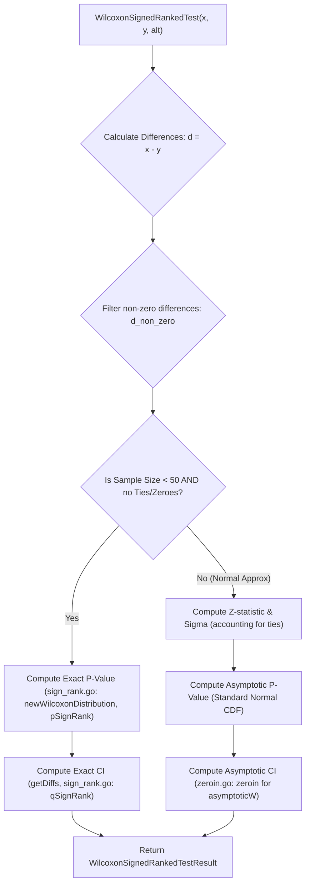

# Module: /go/compare/thresholds

The `thresholds` module optimizes hypothesis testing for iterative systems like
Pinpoint bisection. It provides a dual-threshold system to efficiently determine
if two data samples are statistically different, similar, or require more data,
thereby minimizing computational resources.

### Design and Implementation

- **Dual Threshold Approach**: Beyond the standard `LowThreshold` (0.05) for
  detecting significant differences, a dynamic `HighThreshold` is introduced.
  This high threshold enables early conclusions of "no significant difference"
  when the p-value is sufficiently high, accelerating decisions and reducing
  sampling costs in bisection processes.
- **Pre-computed Lookups**: High thresholds are stored in static tables
  (`highThresholdsFunctional`, `highThresholdsPerformance`) instead of being
  calculated on-the-fly. This design ensures rapid, predictable lookups,
  offloading computationally intensive statistical derivations to external
  generation scripts.
- **Contextual Adaptation**: Thresholds adjust based on `normalized_magnitude`
  and `sample_size`. Different magnitude normalizations are provided for
  functional (failure rate) and performance (interquartile range) comparisons,
  ensuring appropriate statistical sensitivity across diverse measurement
  types.

### Key Components

- **`thresholds.go`**: Defines the `LowThreshold` constant and provides
  `HighThresholdPerformance` and `HighThresholdFunctional` functions. These
  functions query the pre-calculated tables to return the relevant high
  threshold for a given magnitude and sample size.

### Decision Workflow

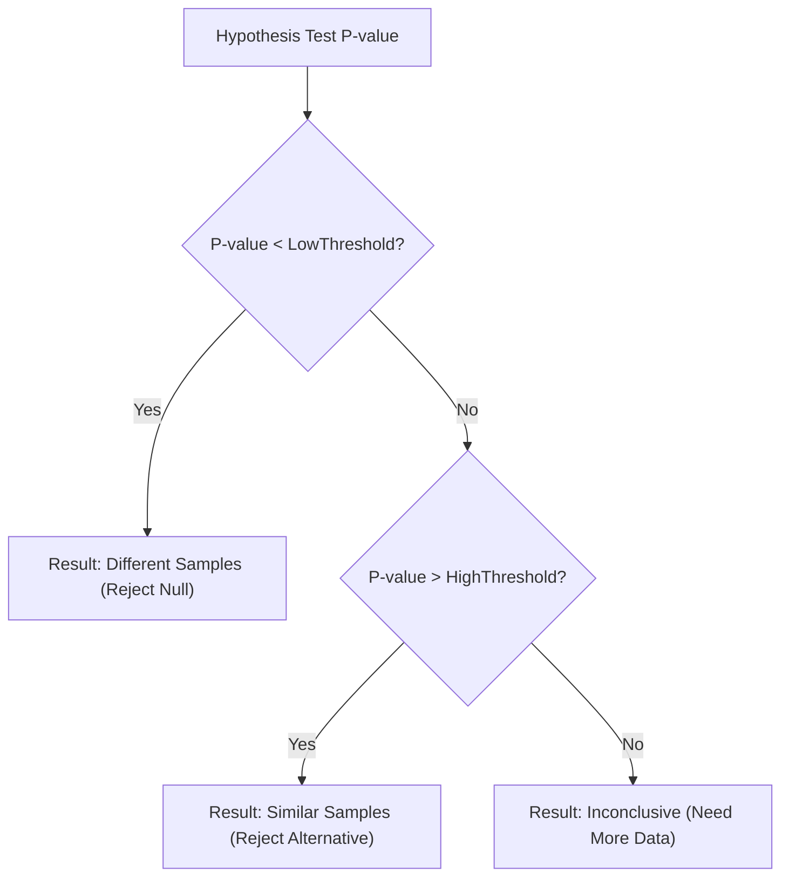

# Module: /go/frontend

The `/go/frontend` module is the public-facing HTTP service for the Pinpoint job
management system. It provides a web-based user interface and a set of HTTP APIs
for managing Pinpoint jobs, retrieving benchmark configurations, and initiating
job executions via an internal Pinpoint core service. It orchestrates various
backend components (database, core Pinpoint service) to deliver a cohesive user
experience.

### Design Principles

- **Delegated Core Logic:** Actual Pinpoint job execution and management are
  delegated to an internal `pinpoint_service`. This abstracts workflow
  complexities, allowing `frontend` to focus on presentation, data
  aggregation, and user interaction.
- **Hybrid Data Sourcing:** Job metadata is stored and retrieved from a
  `jobs_store` (PostgreSQL) for persistence and querying. Static
  configurations (benchmarks, stories, bots) are embedded in
  `benchmarks.json`, simplifying deployment and ensuring consistent
  configuration.
- **Separation of Concerns:** Application bootstrapping, infrastructure setup
  (e.g., database connectivity, HTTP server), and static asset serving are
  isolated in `/go/frontend/cmd`. Core business logic, API definition, and UI
  rendering are handled by `/go/frontend/service`, promoting modularity and
  maintainability.
- **Templated UI:** Basic HTML templates are served directly by the Go
  application, providing a functional user interface without requiring a
  separate frontend application framework.

### Responsibilities and Key Components

**`/go/frontend/cmd`** This module is the executable entry point, responsible
for bootstrapping the application and launching the HTTP server.

- **`main.go`**:
  - **Database Connectivity**: Establishes and manages a PostgreSQL
    connection pool using `pgxpool` for efficient, centralized database
    access.
  - **Service Initialization**: Instantiates `jobs_store` for data
    persistence and initializes the `/go/frontend/service` module, which
    encapsulates the application's core logic and registers its HTTP API
    handlers.
  - **HTTP Server Setup**: Configures the `chi` router, registers API and
    static asset routes, and starts the HTTP server, making the Pinpoint
    frontend accessible.

**`/go/frontend/service`** This module provides the HTTP API and user interface
for the Pinpoint system, orchestrating data display and core service
interactions.

- **`Service` struct (`jobs.go`):** The central orchestrator, holding
  references to the `jobs_store`, HTML templates, benchmark configurations,
  and the `pinpoint_service`'s HTTP handler. Its `RegisterHandlers` method
  defines all public API and UI endpoints.
- **HTTP Handlers (`jobs.go`):**
  - **Job Management:** `ListJobsHandler` and `GetJobHandler` provide API
    endpoints for querying and retrieving detailed job information from the
    `jobs_store`, including validation for pagination and date ranges.
  - **Configuration Discovery:** `ListBenchmarksHandler`,
    `ListBotConfigurationsHandler`, and `ListStoriesHandler` expose the
    embedded `benchmarks.json` data as JSON APIs, supporting dynamic UI
    population and input validation.
  - **UI Pages:** Dedicated `templateHandler` instances render
    `landing-page.html` and `results-page.html` for user interaction.
  - **Pinpoint Core Proxy:** The `pinpointHandler` forwards requests to
    `/pinpoint/*` directly to an HTTP adapter for the internal
    `pinpoint_service`, allowing the frontend to trigger and monitor actual
    Temporal-backed Pinpoint workflow executions.
- **`benchmarks.json`:** An embedded static JSON file defining available
  benchmarks, their stories, and supported bots, used for configuration APIs
  and UI validation.

### Workflows

#### Application Initialization

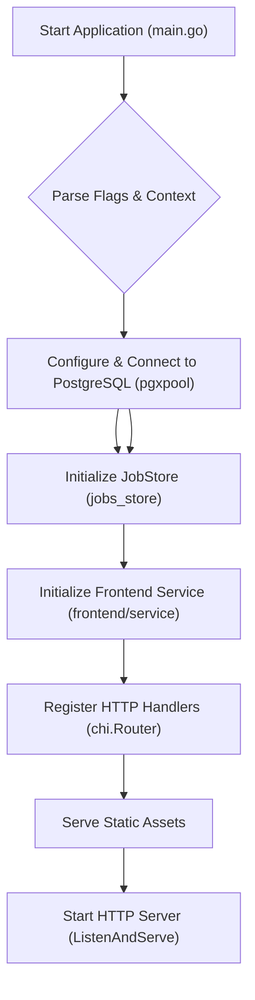

#### Request Handling

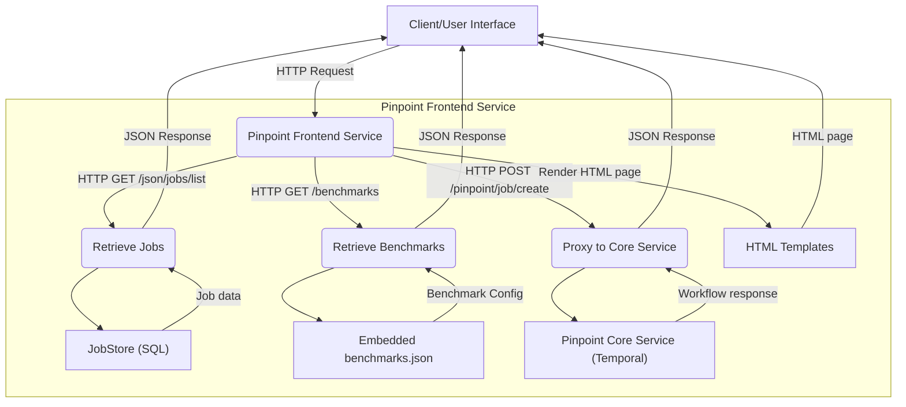

# Module: /go/frontend/cmd

The `/go/frontend/cmd` module is the executable entry point for the Pinpoint
frontend service. It bootstraps the application, establishes database
connectivity, initializes core services, and starts the HTTP server to handle
API requests and serve static web assets.

This module acts as the primary orchestrator, assembling various backend
components into a cohesive web service. Its design separates application
bootstrapping and infrastructure concerns from the core business logic,
promoting modularity. It ensures the application is correctly configured with
database access and that the business logic from `frontend/service` is exposed
via HTTP.

### Responsibilities and Key Components

- **`main.go`**: The application's starting point.
  - **Database Connectivity**: Parses the connection string and establishes
    a PostgreSQL connection pool using `pgxpool`. This centralizes database
    setup and optimizes connection management.
  - **Service Initialization**: Instantiates the `jobs_store` for data
    persistence and initializes the `frontend/service`. The
    `frontend/service` encapsulates core business logic and registers its
    HTTP API handlers.
  - **HTTP Server Setup**: Configures and starts the HTTP server with `chi`
    for routing. It also handles serving static UI assets from a specified
    production directory, making the web interface accessible alongside API
    endpoints.

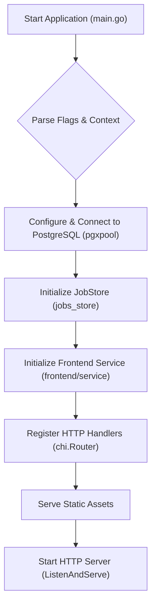

# Module: /go/frontend/service

This module provides the HTTP API and user interface for the Pinpoint job
management system. It acts as a gateway, exposing job metadata, benchmark
configurations, and routing core job creation/management requests to an internal
Pinpoint service.

### Design Principles and Implementation Choices

This service is designed for clear separation of concerns, aggregating data from
various sources to serve both programmatic clients and human users:

- **Delegated Core Logic:** Actual Pinpoint job execution and management is
  delegated to an internal `pinpoint_service`. This underlying service,
  primarily gRPC-based and interacting with Temporal workflows, is exposed via
  an HTTP/JSON handler. This ensures the frontend module remains focused on
  presentation and data aggregation, abstracting the complexities of workflow
  orchestration.
- **Hybrid Data Sourcing:**
  - **Persistent Job Data:** Pinpoint job metadata (e.g., status, details,
    history) is stored and retrieved from a `jobs_store` (SQL database).
    This enables scalable querying, filtering, and pagination of job data
    through dedicated API endpoints.
  - **Embedded Static Configuration:** Benchmark definitions, available
    stories, and supported bots are loaded from an embedded
    `benchmarks.json` file. Embedding this static data ensures it's always
    present with the application binary, simplifying deployment and
    providing consistent configuration for UI elements and input validation.
- **Templated UI:** HTML templates (`landing-page.html`, `results-page.html`)
  are loaded and served dynamically, providing a basic web-based user
  interface for interacting with the Pinpoint system without requiring a
  separate frontend application framework.

### Key Components

- **`Service` struct (`jobs.go`):** The central component, orchestrating all
  functionality. It holds references to the `jobs_store`, HTML templates,
  benchmark configurations, and the `pinpoint_service`'s HTTP handler. Its
  `RegisterHandlers` method defines all public API and UI endpoints.
- **HTTP Handlers (`jobs.go`):**
  - **Job Management:** `ListJobsHandler` and `GetJobHandler` provide API
    endpoints for querying and retrieving detailed information about
    Pinpoint jobs from the `jobs_store`. These handlers include robust
    validation for pagination and date range parameters.
  - **Configuration Discovery:** `ListBenchmarksHandler`,
    `ListBotConfigurationsHandler`, and `ListStoriesHandler` expose the
    embedded benchmark configuration data as JSON APIs. These are critical
    for dynamically populating user interfaces with valid options for
    creating new Pinpoint jobs.
  - **UI Pages:** Dedicated `templateHandler` instances serve the static
    HTML pages, providing the user-facing interface.
  - **Pinpoint Core Proxy:** Requests to `/pinpoint/*` are forwarded to the
    `pinpointHandler`, which is an HTTP adapter for the internal
    `pinpoint_service` instance. This allows the frontend to trigger and
    monitor actual Temporal-backed Pinpoint workflow executions.
- **`benchmarks.json`:** An embedded JSON file that provides static
  configuration for available benchmarks, their associated stories, and
  supported bots. This data underpins the frontend's configuration APIs and
  guides UI input validation.

### Workflow


# Module: /go/midpoint

The `/go/midpoint` module provides the core logic for identifying the next
candidate commit in a bisection process. Pinpoint uses bisection to efficiently
locate a regression's root cause by repeatedly narrowing down a range of
commits. This module's central role is to calculate the "midpoint" within a
given commit range.

### Responsibilities and Key Components

The `midpoint` module's primary responsibility is to determine the next commit
to test, handling both direct repository changes and changes introduced via
dependency rolls (DEPS).

- **`MidpointHandler`**: This is the main orchestrator for midpoint
  calculations. It manages Gitiles clients for interacting with various
  repositories and coordinates the recursive search for the midpoint.
- **`FindMidCombinedCommit`**: The module's public entry point. It takes two
  `common.CombinedCommit` objects (which represent a main repository commit
  combined with its modified dependencies) and returns the next midpoint. This
  function is designed to:
  - **Bisect the main repository**: If no modified dependencies are
    involved, it finds the median commit directly within the main
    repository's history.
  - **Handle DEPS rolls**: If the two main commits are adjacent, it assumes
    a DEPS roll. It then parses the DEPS files for both commits, identifies
    the first differing git-based dependency, and recursively bisects within
    that dependency's history.
  - **Manage `CombinedCommit` state**: It ensures consistent comparison of
    `CombinedCommit` objects by dynamically filling in implied dependency
    hashes through `fillModifiedDeps`. This is crucial when one
    `CombinedCommit` explicitly references a dependency change, and the
    other implicitly uses its parent's version of that dependency.

### Design and Implementation Choices

The module's design revolves around the `common.CombinedCommit` structure, which
allows bisection to traverse across different repositories - starting with a
main repository (like Chromium) and then "diving" into its git-based
dependencies when a DEPS roll is detected.

- **Recursive search for culprits**: When two commits are found to be
  adjacent, the system's design anticipates a DEPS roll. Instead of
  terminating, it shifts the bisection focus to the dependencies defined in
  the `DEPS` file. This allows Pinpoint to pinpoint regressions caused by
  changes in upstream libraries.
- **`fillModifiedDeps` for state consistency**: Bisection paths can involve
  `CombinedCommit` objects with varying levels of explicit dependency
  information. `fillModifiedDeps` ensures that both ends of a comparison have
  their `ModifiedDeps` arrays consistently populated from their respective
  DEPS files. This normalization is vital for accurate comparison and
  subsequent bisection steps, allowing `{C@1}` to be correctly compared
  against `{C@1, V8@4}` by implicitly defining `V8@3` for `C@1`.
- **Support for git-based DEPS only**: The implementation currently focuses on
  git-based dependencies, filtering out CIPD-based dependencies during DEPS
  parsing. This simplifies the initial scope but means CIPD-related
  regressions cannot be bisected this way.
- **Single-layer DEPS roll focus**: A current limitation is that the module
  only identifies and bisects the _first_ differing git-based dependency in a
  DEPS roll. It does not handle scenarios where multiple dependencies are
  rolled simultaneously or where a rolled dependency itself contains another
  roll that needs further bisection when adjacent. This is a pragmatic choice
  to simplify the initial implementation.

### Workflow: Finding a Midpoint

```mermaid
graph TD
    A["Start: FindMidCombinedCommit(startCC, endCC)"] --> B{"startCC == endCC?"}
    B -- Yes --> C["Error: Identical commits"]
    B -- No --> D{"Any ModifiedDeps?"}

    D -- Yes --> E["Fill ModifiedDeps for consistency"]
    E --> F["Identify latest differing ModifiedDep: startDep, endDep"]
    F --> G{"startDep.GitHash == endDep.GitHash?"}
    G -- Yes --> H["Handle edge cases: DEPS roll boundaries"]
    G -- No --> I["Find midpoint within ModifiedDep: findMidCommit(startDep, endDep)"]
    I --> J["Return new CombinedCommit with updated ModifiedDep"]

    D -- No --> K["No ModifiedDeps: Bisect Main commit"]
    K --> L["Find midpoint in Main: findMidCommit(startCC.Main, endCC.Main)"]
    L --> M{"Midpoint is in Main?"}
    M -- Yes --> N["Return new CombinedCommit with updated Main"]
    M -- No --> O["Midpoint is a new dep: Add to ModifiedDeps"]
    O --> J

    subgraph "findMidCommit(startCommit, endCommit)"
        P["Try findMidpoint(startCommit, endCommit)"] --> Q{"Result is startCommit (adjacent)?"}
        Q -- No --> R["Return found midpoint"]
        Q -- Yes --> S["Assume DEPS roll: Call findMidCommitInDEPS(startCommit, endCommit)"]
        S --> T{"DEPS roll midpoint found?"}
        T -- No --> U["Return startCommit (no further mid)"]
        T -- Yes --> V["Return DEPS midpoint"]
    end
```

# Module: /go/read_values

The `read_values` module provides an API to retrieve and process performance
benchmark results stored in RBE Content-Addressable Storage (CAS) for Pinpoint
workflows.

### Core Responsibility

This module is responsible for fetching raw performance sample values and
applying optional data aggregations (e.g., mean, min) for specified benchmarks
and charts from a list of CAS digests.

### Design and Implementation

- **CAS Abstraction:** The `CASProvider` interface decouples the core logic
  from specific CAS backend implementations. This design promotes testability
  and allows for future extensions beyond RBE without modifying the
  `perfCASClient`.
- **RBE Integration:** `rbeProvider` implements `CASProvider` for RBE-CAS,
  utilizing `cabe/go/backends` for efficient data retrieval. `DialRBECAS`
  centralizes the connection to RBE, accommodating Pinpoint's use of multiple
  Swarming instances to store CAS results. This ensures correct CAS client
  selection for specific data.
- **Data Processing:** `perfCASClient` encapsulates the logic to fetch raw
  `perfresults.PerfResults` from CAS digests, filter them by benchmark and
  chart, and apply specified aggregation methods. This transforms low-level
  CAS content into structured performance metrics required by Pinpoint.
- **Aggregation:** Integration with `perfresults.AggregationMapping` allows
  users to select statistical aggregation methods. This enables the module to
  return summarized performance data, which is vital for analysis, trend
  detection, and reducing data volume, instead of large sets of raw samples.

### Key Components

- `read_values.go`: Implements the `CASProvider` interface, the
  `perfCASClient` responsible for fetching and processing performance data,
  and public methods for reading values by chart or for all charts, including
  aggregation logic.
- `read_values_test.go`: Contains unit tests that validate the data fetching,
  filtering, and aggregation functionalities using a mocked `CASProvider` to
  ensure correctness and isolation.

### Workflow

```mermaid
graph TD
    A[Request Benchmark Data] --> B{Call DialRBECAS};
    B --> C[Initialize perfCASClient for specific Swarming instance];
    C --> D{Call ReadValuesByChart or ReadValuesForAllCharts};
    D --> E[For each CAS Digest in request];
    E --> F[Fetch raw PerfResults from CAS via rbeProvider];
    F -- On Success --> G[Filter results by Benchmark/Chart];
    G --> H{Aggregation Method Specified?};
    H -- Yes --> I[Apply aggregation to samples];
    H -- No --> J[Collect all raw samples];
    I --> K[Append processed values];
    J --> K;
    K --> E;
    E -- All Digests Processed --> L[Return TestResults];
    F -- On Error --> M[Return Error];
    D -- On Error --> M;
    B -- On Error --> M;
```

# Module: /go/run_benchmark

The `run_benchmark` module orchestrates performance benchmark executions as
Swarming tasks for Pinpoint. It dynamically constructs benchmark commands based
on specified parameters, schedules these tasks on Swarming, and offers utilities
to monitor and interpret task statuses.

### Core Components and Responsibilities

- **`run_benchmark.go`**: Manages the lifecycle of Swarming tasks for
  benchmark execution.

  - **How**: The `Run` function is the primary entry point, initiating
    Swarming tasks. It leverages the `BenchmarkTest` interface to decouple
    task scheduling from the specifics of command generation.
  - **Why**: The `State` type abstracts raw Swarming statuses into
    meaningful states (e.g., `IsTaskSuccessful`, `IsTaskTerminalFailure`),
    simplifying status interpretation and providing a consistent API for
    downstream services.

- **`benchmark_test_factory.go`**: Dynamically creates the appropriate
  benchmark test executor.

  - **How**: The `NewBenchmarkTest` function acts as a factory, using
    `bot_configs` to determine the specific isolate target (e.g.,
    `performance_test_suite`) for a given benchmark and bot. Based on this,
    it returns an implementation of the `BenchmarkTest` interface.
  - **Why**: This design choice promotes extensibility; new benchmark types
    can be integrated by implementing the `BenchmarkTest` interface without
    altering the core task scheduling logic in `run_benchmark.go`.

- **`telemetry.go`**: Implements the `BenchmarkTest` interface for Telemetry
  and Crossbench performance tests.

  - **How**: The `GetCommand` method constructs the precise command-line
    arguments needed to execute a Telemetry or Crossbench test on a Swarming
    bot, including handling different types of benchmarks (gtests, standard
    telemetry benchmarks, crossbench) and various parameters like story,
    story tags, and extra arguments.
  - **Why**: Centralizes the complex logic of converting Pinpoint's abstract
    benchmark parameters into concrete executable commands compatible with
    Chromium's performance testing infrastructure. Maps and specific
    argument generation functions ensure alignment with Chromium's perf
    waterfall.

- **`swarming_helpers.go`**: Utility functions for building Swarming API
  requests.
  - **How**: Contains functions like `createSwarmingRequest`,
    `generateProperties`, `convertDimensions`, and `generateTags` to
    assemble a complete `apipb.NewTaskRequest` object, populating all
    necessary fields for a Pinpoint-initiated Swarming task.
  - **Why**: Decouples the low-level details of Swarming request
    construction from the higher-level orchestration in `run_benchmark.go`,
    improving clarity and maintainability. It also centralizes
    Swarming-specific configurations like timeouts and service accounts.

### Workflow

```mermaid
graph TD
    A[Run Benchmark Request] --> B{Resolve Bot Config & Isolate Target};
    B --> C{Factory: Create BenchmarkTest Instance};
    C -- GetCommand() --> D[Generate Benchmark Execution Command];
    D --> E[Build Swarming Task Request];
    E --> F[Trigger Swarming Task];
    F --> G[Receive Swarming Task IDs];

    subgraph "Benchmark Command Details (telemetry.go)"
        C -- (e.g., TelemetryTest) --> D1{Is it a Waterfall GTest?};
        D1 -- Yes --> D2[Add GTest-specific args];
        D1 -- No, Is it Crossbench? --> D3[Add Crossbench-specific args];
        D3 -- No --> D4[Add Telemetry args];
        D2 & D3 & D4 --> D5[Include Story/StoryTag filters];
        D5 --> D;
    end

    subgraph "Swarming Request Details (swarming_helpers.go)"
        E --> E1[Convert Dimensions];
        E --> E2[Generate Task Properties];
        E --> E3[Generate Tags];
        E1 & E2 & E3 --> E;
    end
```

# Module: /go/service

The `/go/service` module provides the gRPC API for Pinpoint, enabling users to
schedule and query performance analysis jobs. It acts as the orchestration
layer, translating user requests into Temporal workflow executions.

## Design and Implementation Rationale

The module's core design relies on **Temporal workflows** for executing
long-running, stateful performance analysis jobs. This approach leverages
Temporal's fault tolerance, retry mechanisms, and state management capabilities,
offloading complex job lifecycle management from the service. The
`tpr_client.TemporalProvider` (`go.skia.org/infra/temporal/go/client`) abstracts
the Temporal client, ensuring testability and adaptability to different Temporal
environments.

The service uses **gRPC for efficient communication** and `grpc-gateway`
(`github.com/grpc-ecosystem/grpc-gateway/v2`) to **automatically generate a
RESTful JSON API**. This provides flexibility, allowing clients to interact with
Pinpoint via either gRPC or standard HTTP/JSON.

A **local rate limiter** (`golang.org/x/time/rate`) is integrated to temporarily
control the influx of new job requests. This is a pragmatic decision to manage
system load, particularly during migration phases or to prevent resource
exhaustion, acting as a temporary safeguard.

Workflow execution options consistently set `MaximumAttempts: 1` for all
scheduled jobs. This design assumes that once a Pinpoint job workflow begins,
any non-recoverable failure should not trigger a top-level workflow retry.
Instead, retries and error handling are expected to occur within the individual
activities composing the workflow.

**Input validation** (`validation.go`) is a critical "fail-fast" mechanism.
Requests are thoroughly checked before initiating any Temporal workflows,
preventing invalid jobs from consuming resources and providing immediate, clear
feedback to users.

## Key Components

### `service_impl.go`

Implements the Pinpoint gRPC API, defining methods for scheduling and querying
jobs, and for job cancellation.

- **`server` struct**: Encapsulates the `rate.Limiter` for request throttling
  and the `tpr_client.TemporalProvider` for Temporal interactions.
- **`New` function**: The constructor, injecting the Temporal client provider
  and rate limiter.
- **`NewJSONHandler`**: Exposes the gRPC service over HTTP/JSON using
  `grpc-gateway`.
- **RPC Methods (e.g., `ScheduleBisection`, `ScheduleCulpritFinder`,
  `SchedulePairwise`, `QueryPairwise`, `CancelJob`)**:
  - Apply rate limiting.
  - Perform initial request validation.
  - Connect to Temporal via `tpr_client.TemporalProvider`.
  - Generate unique workflow IDs.
  - Configure and execute Temporal workflows with specific timeouts and
    retry policies.
  - Convert Temporal workflow results or status into gRPC responses.

### `validation.go`

Houses the logic for validating incoming gRPC requests.

- **`updateFieldsForCatapult`, `updateCulpritFinderFieldsForCatapult`**:
  Temporary functions for migration compatibility, translating legacy
  `Statistic` fields to `AggregationMethod`.
- **`validateBisectRequest`, `validateCulpritFinderRequest`,
  `validatePairwiseRequest`, `validateQueryPairwiseRequest`**: Contains
  specific validation rules for each job type, ensuring all required
  parameters are present, valid, and conform to expected formats (e.g.,
  non-empty git hashes, supported aggregation methods, valid UUIDs for job
  IDs).

## Key Workflow: Scheduling a Job

```mermaid
graph TD
    A[Client Sends Schedule Request] --> B{Is Request Rate-Limited?};
    B -- Yes --> C[Return Resource Exhausted Error];
    B -- No --> D{Validate Request Parameters?};
    D -- No (Invalid) --> E[Return Invalid Argument Error];
    D -- Yes --> F[Connect to Temporal Service];
    F -- Error --> G[Return Internal Server Error];
    F -- Success --> H[Start New Temporal Workflow];
    H -- Error --> G;
    H -- Success --> I[Return Job ID to Client];
```

## Key Workflow: Querying a Job

```mermaid
graph TD
    A[Client Sends Query Request] --> B{Validate Request Parameters?};
    B -- No (Invalid) --> C[Return Invalid Argument Error];
    B -- Yes --> D[Connect to Temporal Service];
    D -- Error --> E[Return Internal Server Error];
    D -- Success --> F[Describe Temporal Workflow Execution];
    F -- Error --> E;
    F -- Success --> G{What is Workflow Status?};
    G -- COMPLETED --> H[Fetch Workflow Results];
    G -- FAILED/TIMED_OUT/TERMINATED --> I[Return FAILED Status];
    G -- CANCELED --> J[Return CANCELED Status];
    G -- RUNNING/CONTINUED_AS_NEW --> K[Return RUNNING Status];
    G -- Other --> E;
    H -- Error --> E;
    H -- Success --> L[Return Detailed Results];
```

# Module: /go/sql

This module manages Pinpoint's persistent job data, defining its database
schema, generating Spanner SQL DDL, and providing a data access layer for
interacting with job records.

### Why and How

- **Schema as Go Structs**: The database schema is defined as Go structs (in
  `schema`) annotated with `sql` tags. This provides type safety, ensures
  consistency between application code and the database, and enhances
  maintainability compared to raw SQL DDL.
- **Automated DDL Generation**: The `tosql` module programmatically converts
  these Go struct definitions into Spanner-compatible `CREATE TABLE` DDL. This
  guarantees schema alignment, centralizes management, and simplifies
  controlled evolution by embedding the generated DDL directly into
  `schema/spanner/spanner.go` at compile-time.
- **Flexible Data Storage**: Complex, evolving job parameters and results are
  stored in `JSONB` columns within the `Jobs` table. This design choice
  provides schema flexibility, minimizing the need for frequent database
  migrations when new fields or data types are introduced in job definitions
  or results.
- **Decoupled Data Access**: The `jobs_store` module provides a standardized
  data access layer, decoupling job execution logic from the underlying
  Spanner database. This ensures job states, parameters, and results are
  reliably recorded and accessible, supporting the complete lifecycle of a
  performance experiment.

### Responsibilities and Key Components

- **`schema`**: Defines the authoritative Go-native data structures, primarily
  `JobSchema`, that model the `Jobs` Spanner table. It uses `sql` tags to
  specify column types and constraints, including flexible `JSONB` fields for
  dynamic data. The `spanner` submodule within `schema` contains the
  _generated_ Spanner DDL.
- **`tosql`**: An executable responsible for generating the Spanner SQL DDL.
  It reads the Go struct definitions from `schema`, utilizes the
  `go/sql/exporter` utility to translate them into DDL, and writes the output
  to `schema/spanner/spanner.go`.
- **`jobs_store`**: Manages all persistence and retrieval operations for
  Pinpoint performance analysis jobs. Its responsibilities include initial job
  creation (`AddInitialJob`), status updates (`UpdateJobStatus`), detailed run
  data storage (`AddCommitRuns`), analysis results persistence (`AddResults`),
  error reporting (`SetErrors`), and flexible job retrieval for dashboards
  (`GetJob`, `ListJobs` with filtering and pagination).

### Workflows

#### Schema Definition and Generation

```mermaid
graph TD
    A["Go Structs in schema/schema.go (with 'sql' tags)"] --> B{"tosql executable"}
    B --> C["go/sql/exporter library"]
    C --> D["Generated Spanner DDL (written to schema/spanner/spanner.go)"]
    D --> E["Pinpoint Spanner Database (Schema applied)"]
```

#### Job Lifecycle Persistence

```mermaid
graph TD
    A["User Schedules Job"] --> B{"jobs_store.AddInitialJob"}
    B --> C["Job Stored: Pending"]
    C --> D["Job Execution Workflow"]
    D -- "Updates Status" --> E{"jobs_store.UpdateJobStatus"}
    D -- "Stores Run Data" --> F{"jobs_store.AddCommitRuns"}
    D -- "Stores Analysis Results" --> G{"jobs_store.AddResults"}
    D -- "Records Errors" --> H{"jobs_store.SetErrors"}
    E & F & G & H --> I["Job Data Persisted"]
    I --> J{"jobs_store.GetJob / jobs_store.ListJobs"}
    J --> K["Dashboard / Client Retrieval"]
```

# Module: /go/sql/jobs_store

The `jobs_store` module manages the persistence and retrieval of Pinpoint
performance analysis jobs. It provides a robust, standardized interface for
other Pinpoint components to interact with job data, decoupling job execution
logic from the underlying storage mechanism. This design ensures job states,
parameters, and results are reliably recorded and accessible, supporting the
complete lifecycle of a performance experiment.

### Responsibilities and Key Components

- **Job Data Persistence (`jobs_store.go`)**: The core `JobStore` interface
  and its `jobStoreImpl` implementation handle all database operations related
  to jobs.

  - **Initial Job Creation**: `AddInitialJob` stores the complete
    `SchedulePairwiseRequest` as the foundational record for a new job. This
    captures all user-defined parameters at the job's inception.
  - **Job State Management**: `UpdateJobStatus` tracks the progression of a
    job through its lifecycle, updating its status and, upon completion,
    recording its total execution duration.
  - **Detailed Run Data Storage**: `AddCommitRuns` stores comprehensive
    information about the builds and test runs executed for both the start
    and end commits of a pairwise comparison. This data is critical for
    understanding the experimental context.
  - **Analysis Result Storage**: `AddResults` persists the final statistical
    analysis results, such as Wilcoxon test outcomes, providing the
    quantitative summary of the job.
  - **Error Reporting**: `SetErrors` captures and stores any errors
    encountered during job execution, aiding in debugging and user
    communication.
  - **Job Retrieval**: `GetJob` fetches all details for a specific job,
    while `ListJobs` supports dashboard views by allowing filtered and
    paginated retrieval of job summaries.
  - **Why structured JSON columns?** The module utilizes flexible JSONB
    columns (e.g., `additional_request_parameters`, `metric_summary`) to
    store complex, evolving data structures (like
    `schema.AdditionalRequestParametersSchema` and
    `pinpointpb.PairwiseExecution_WilcoxonResult`). This approach avoids
    frequent schema migrations when new fields or data types are introduced
    in the job definition or results.

- **Dashboard Integration (`jobs_store.go`)**: `DashboardJob` and
  `ListJobsOptions` are tailored data structures to efficiently support a
  user-facing dashboard. `ListJobsOptions` allows for flexible filtering by
  criteria such as job name, benchmark, date range, bot, and user, along with
  pagination, directly addressing the "how" of presenting a manageable list of
  jobs to users.

### Job Lifecycle Workflow

```mermaid
graph TD
    A["User Schedules Job"] --> B{"AddInitialJob"}
    B --> C["Job Stored: Pending"]
    C --> D{"Job Execution Workflow"}
    D -- "Updates Status" --> E{"UpdateJobStatus"}
    D -- "Stores Commit & Run Data" --> F{"AddCommitRuns"}
    D -- "Stores Analysis Results" --> G{"AddResults"}
    D -- "Records Errors" --> H{"SetErrors"}
    E --> I["Job Status: Running/Completed/Failed"]
    F --> J["Additional Parameters (CommitRuns) Updated"]
    G --> K["Metric Summary Updated"]
    H --> L["Error Message Updated"]
    I & J & K & L --> M{"GetJob / ListJobs"}
    M --> N["Dashboard / Client"]
```

# Module: /go/sql/schema

### Overview

This module defines the Go-native data structures that represent the schema for
Pinpoint's persistent job data, primarily for the `Jobs` Spanner table. It acts
as the programmatic interface for interacting with job records in the database.

### Design and Implementation

The module's core design revolves around providing a type-safe, declarative
representation of the database schema in Go.

- **Go Structs as Schema Definition**: `schema.go` uses Go structs (e.g.,
  `JobSchema`, `AdditionalRequestParametersSchema`) with `sql:"..."` tags to
  define the database schema. This ensures the application's data models align
  directly with the database schema, enabling compile-time type checking and
  reducing runtime mismatches.

- **Flexible Data Storage with JSONB**: Critical job parameters and results
  (e.g., `AdditionalRequestParameters`, `MetricSummary`) are stored as `JSONB`
  fields in the database. This design choice provides flexibility, allowing
  the addition of new parameters or changes to result formats without
  requiring schema migrations on the main `Jobs` table.

- **Integration with Core Types**: The schema integrates types from other
  Pinpoint modules, such as `go/workflows` (for build/test run data) and
  `pinpoint/proto/v1` (for metric summary results). This ensures data
  consistency and a unified data model across the Pinpoint ecosystem.

- **Automated DDL Generation**: The actual Spanner DDL (found in the `spanner`
  submodule) is automatically generated from these Go structs by a dedicated
  exporter tool. This centralizes schema management, guarantees consistency,
  and simplifies controlled schema evolution by preventing manual DDL errors.

### Key Components

- **`schema.go`**:

  - **`JobSchema`**: The primary Go struct modeling the `Jobs` table. It
    defines core job metadata like `JobID` (primary key), `JobName`,
    `JobStatus`, `SubmittedBy`, `Benchmark`, and `BotName`, alongside nested
    `JSONB` fields for flexible data.
  - **`AdditionalRequestParametersSchema`**: Encapsulates diverse parameters
    required for a job, such as commit hashes, story details, and
    aggregation methods. This struct is serialized into a `JSONB` column
    within `JobSchema`.
  - **`CommitRunData` / `CommitRuns`**: Nested structures within
    `AdditionalRequestParametersSchema` to store detailed build and test run
    information for comparative analyses.

- **`spanner` (Submodule)**: This submodule contains the declarative Spanner
  SQL DDL for the `Jobs` table, specifically the `Schema` constant within
  `spanner.go`. This DDL is generated from the Go structs defined in
  `schema.go` and includes a TTL policy for data retention.

### Workflow: Schema Definition and Deployment

```mermaid
graph TD
    A["Go Structs in schema.go"] --> B{"Annotated with 'sql' tags"}
    B --> C["go/sql/exporter/ Tool"]
    C --> D["go/sql/schema/spanner/spanner.go (Generated CREATE TABLE DDL)"]
    D --> E["Pinpoint Spanner Database (Schema Applied)"]
```

# Module: /go/sql/schema/spanner

This module provides the declarative Spanner SQL schema for the `Jobs` table.

The schema is automatically generated by `//go/sql/exporter/`, centralizing
schema management and ensuring consistency across the system by avoiding manual
definition errors. This also facilitates controlled schema evolution.

The `Jobs` table is central to Pinpoint, storing comprehensive details about
each performance testing job. This includes critical metadata like `job_id`,
`job_status`, `submitted_by`, and `benchmark`. `JSONB` fields
(`additional_request_parameters`, `metric_summary`) are used to store flexible,
unstructured data, accommodating diverse job configurations and results without
rigid schema changes. A `TTL` (Time-To-Live) policy is applied to automatically
purge old job records (after 1095 days), managing data volume and retention.

The sole key component is the `Schema` constant within `spanner.go`, which
contains the complete `CREATE TABLE IF NOT EXISTS Jobs` DDL statement.

```mermaid
graph TD
    A["Schema Definition Source (e.g., ORM models)"] --> B["go/sql/exporter/ tool"]
    B --> C["go/sql/schema/spanner/spanner.go (Generated 'Schema' constant)"]
    C --> D["Pinpoint Spanner Database (Schema Applied)"]
```

# Module: /go/sql/tosql

This module generates Spanner SQL DDL from Go struct definitions, ensuring
consistency between application data models and the database.

**Why and How:** The database schema's source of truth is defined as Go structs,
specifically `pinpoint/go/sql/schema.JobSchema`. This approach provides several
benefits over directly writing raw SQL DDL:

- **Type Safety:** Leverages Go's type system for schema definitions.
- **Consistency:** The same Go structs can be used for ORM, validation, and
  schema generation, eliminating divergence.
- **Maintainability:** Easier for Go developers to read, understand, and
  modify.

The `tosql` executable uses the `go/sql/exporter` library to introspect these Go
structs and convert them into Spanner-compatible DDL. This DDL is then embedded
as a string into a generated Go file (`schema/spanner/spanner.go`). This makes
the DDL available at compile time, simplifying deployment and ensuring the
application always uses the correct schema.

**Responsibilities:**

- **Schema Generation:** Programmatically creates Spanner DDL from Go struct
  definitions.
- **Schema Consistency:** Ensures the database schema is directly derived from
  and aligned with the application's Go data models.

**Key Components:**

- `main.go`: The executable that identifies the Go structs to be exported
  (e.g., `pinpoint/go/sql/schema.JobSchema`), invokes the `go/sql/exporter`
  library, and writes the generated Spanner DDL to
  `schema/spanner/spanner.go`.
- `go/sql/exporter`: A generic library responsible for converting Go struct
  definitions into SQL DDL for various database backends, used here for
  Spanner schema generation.

**Workflow:**

```mermaid
graph LR
    A["pinpoint/go/sql/schema.JobSchema Go Struct"] --> B("tosql executable (main.go)")
    B --> C{"go/sql/exporter library"}
    C --> D["Spanner DDL as Go String"]
    D --> E["schema/spanner/spanner.go file"]
```

# Module: /go/workflows

This module is the central hub for defining and implementing Pinpoint's backend
logic using the Temporal workflow engine. It provides durable, fault-tolerant,
and observable execution for complex, long-running tasks like performance
bisection and A/B testing. The design separates the public interface of
workflows from their underlying implementation and execution environment.

### Key Components

- **`workflows.go`**: Defines the public contract for all Pinpoint workflows.

  - **Why**: To decouple clients from the implementation. A client only
    needs to know a workflow's name (e.g., `perf.bisect`) and its parameter
    struct (`BisectParams`) to start a job, without importing the
    implementation code.
  - **How**: It provides constants for workflow names and Go structs for
    parameters and results. These structs ensure type safety and include
    helper methods for safely parsing and sanitizing user-provided inputs
    (e.g., `GetMagnitude`, `GetInitialAttempt`).

- **`internal` submodule**: Contains the core business logic and
  implementation of all primary workflows.

  - **Why**: This module encapsulates the complex orchestration of building
    Chrome, running benchmarks, and analyzing results.
  - **How**: It implements key workflows like `BisectWorkflow`, which uses a
    concurrent strategy to analyze multiple commit ranges in parallel, and
    `PairwiseCommitsRunnerWorkflow`, which runs tests back-to-back on the
    same bot to minimize environmental noise. It interacts with external
    services like Swarming and Buildbucket through dedicated activities.

- **`catapult` submodule**: A compatibility layer to support the legacy
  Catapult UI.

  - **Why**: Ensures a smooth transition from the old Catapult backend by
    allowing the legacy frontend to work with the modern, Temporal-based
    system. It is designed for eventual deprecation.
  - **How**: It acts as an adapter. Workflows in this module, like
    `CatapultBisectWorkflow`, orchestrate the core `internal` workflows and
    then transform their results into the legacy data format expected by
    Catapult's datastore and UI.

- **`worker` submodule**: The executable that runs the workflow and activity
  logic.

  - **Why**: To separate the business logic from the runtime environment.
    The same workflow code can be executed by different worker
    configurations for development, staging, or production.
  - **How**: The `worker` binary connects to the Temporal server, registers
    all the workflow and activity functions defined in `internal` and
    `catapult`, and polls a task queue for jobs to execute.

- **`sample` and `experiment` submodules**: Command-line tools for invoking
  workflows.
  - **Why**: To provide developers with a direct way to trigger and debug
    workflows, and to run specialized experiments without needing the full
    Pinpoint UI.
  - **How**: These are simple client applications that use the Temporal Go
    SDK and the public contracts from `workflows.go` to start workflows with
    specific parameters from the command line.

### High-Level Workflow Architecture

The diagram below illustrates how a client's request is processed. The client
uses the public definitions to start a workflow, which is then picked up and
executed by a `worker` process.

```mermaid
graph TD
    subgraph "Client"
        A["Pinpoint API / `sample` CLI"]
    end
    subgraph "Temporal_Server"
        B["Task Queue"]
    end
    subgraph "Worker_Process"
        C["Pinpoint Worker"]
    end

    A -- "1. ExecuteWorkflow (uses `workflows.go` definitions)" --> B
    C -- "2. Polls for tasks" --> B
    B -- "3. Dispatches task" --> C
    C -- "4. Executes implementation (from `internal`, `catapult`)" -->
    D["External Services <br/> (Swarming, Buildbucket)"]
```

# Module: /go/workflows/catapult

The `/go/workflows/catapult` module acts as a compatibility layer, enabling
Pinpoint's modern, Skia-based bisection and culprit-finding logic to integrate
with the legacy Catapult UI and datastore. This ensures continuity for existing
Catapult users during the transition to a new Pinpoint backend, with the module
designed for eventual deprecation.

The module's design focuses on:

- **Backwards Compatibility**: Bridging the data model and API differences
  between modern Pinpoint and legacy Catapult.
- **Orchestration**: Utilizing Temporal workflows to manage the multi-step
  process of bisection, data transformation, and persistence.
- **Data Transformation**: Converting complex Pinpoint bisection results into
  the specific `pinpoint_proto.LegacyJobResponse` format expected by
  Catapult's frontend.
- **Regression Verification**: Implementing a "sandwich verification" pattern
  to confirm regressions and accurately identify culprits, minimizing false
  positives.

### Key Components

- **`CatapultBisectWorkflow` (in `catapult_bisect.go`)**: Orchestrates the
  execution of a Pinpoint bisection for Catapult. It invokes the core
  `internal.BisectWorkflow` for bisection logic, then delegates to
  `ConvertToCatapultResponseWorkflow` for data transformation, and finally
  uses `WriteBisectToCatapultActivity` to persist results to the Catapult API.
- **`ConvertToCatapultResponseWorkflow` (in `catapult_bisect.go`)**: A child
  workflow that maps modern Pinpoint bisection results and request parameters
  into the legacy `pinpoint_proto.LegacyJobResponse` structure. This includes
  structuring "states," "attempts," and "comparisons" as required by the
  Catapult UI.
- **`CulpritFinderWorkflow` (in `culprit_finder.go`)**: Implements the
  "sandwich verification" process. It first uses `PairwiseWorkflow` to confirm
  an initial regression, then `CatapultBisectWorkflow` to find potential
  culprits, and finally re-verifies each culprit with `PairwiseWorkflow` to
  confirm its significance. Optionally, it can trigger external culprit
  processing.
- **`parsers.go`**: Contains comprehensive logic for translating data between
  Pinpoint's internal models and Catapult's legacy proto. This includes
  extracting and formatting commit details (author, message, commit position),
  run data (values, bot IDs, CAS references), and comparison results.
- **`activites.go`**: Provides Temporal activities for interacting with
  external systems:
  - `FetchCommitActivity`: Retrieves rich commit metadata from Gitiles.
  - `FetchTaskActivity`: Gathers detailed Swarming task information.
  - `WriteBisectToCatapultActivity`: Executes the final write operation to
    the legacy Catapult API.
- **`write.go`**: Defines the `CatapultClient` and its `WriteBisectToCatapult`
  method, responsible for authenticated HTTP POST requests to the legacy
  Catapult API endpoints to store bisection results.

### Core Workflow: Catapult Bisection

```mermaid
graph TD
    A["CatapultBisectWorkflow Start"] --> B{"Generate Workflow ID"}
    B --> C["Execute Child Workflow: internal.BisectWorkflow<br/>
    (Perform Skia-based Bisection)"]
    C -- "BisectExecution" --> D["Execute Child Workflow:
    ConvertToCatapultResponseWorkflow<br/>
    (Transform to Legacy Catapult Format)"]
    D -- "LegacyJobResponse" --> E["Execute Activity:
    WriteBisectToCatapultActivity<br/>(Persist to Catapult Datastore)"]
    E -- "DatastoreResponse" --> F["Log Datastore Response"]
    F --> G["CatapultBisectWorkflow End"]
```

### Core Workflow: Culprit Finder (Sandwich Verification)

```mermaid
graph TD
    A["CulpritFinderWorkflow Start"] --> B{"Execute Child Workflow:
    PairwiseWorkflow<br/>(Verify Initial Regression)"}
    B -- "PairwiseExecution (initial regression)" --> C{"Is Regression
    Significant?"}
    C -- No --> D["End (No Regression Detected)"]
    C -- Yes --> E["Execute Child Workflow: CatapultBisectWorkflow<br/>
    (Find Potential Culprits)"]
    E -- "BisectExecution (potential culprits)" --> F{"Are Culprits Found?"}
    F -- No --> G["End (Regression Detected, No Culprits Found)"]
    F -- Yes --> H["Parallel: For Each Culprit:<br/>Run Culprit Verification
    (PairwiseWorkflow)"]
    H -- "Verified Culprits" --> I["Invoke Culprit Processing Workflow
    (Optional)"]
    I --> J["End (Regression Detected, Culprits Verified)"]
```

# Module: /go/workflows/experiment

The `experiment` module is a command-line interface for initiating Chrome
performance experiments through Temporal. It abstracts experiment setup and
execution by delegating to Temporal workflows, ensuring durable and observable
execution.

Its primary role is to translate user-defined experiment parameters (benchmark,
commit, bot, iterations) into a request for the `workflows.TestAndExport`
Temporal workflow. The `TestAndExport` workflow then orchestrates Chrome builds,
triggers Swarming tasks, and exports task IDs to BigQuery. This design separates
experiment initiation from durable, fault-tolerant execution.

### Key Component:

- **`main.go`**: Contains the executable logic: parses flags, connects to
  Temporal, constructs `internal.TestAndExportParams`, and invokes the
  `workflows.TestAndExport` workflow. The client initiates the workflow with a
  unique ID and a single-attempt retry policy, meaning it won't auto-retry
  _starting_ the workflow if the initial call fails.

### Workflow:

```mermaid
graph TD
    A["User executes `experiment` CLI"] --> B{"Parses Flags"}
    B --> C["Connects to Temporal Service"]
    C --> D["Constructs TestAndExportParams"]
    D --> E["Triggers workflows.TestAndExport Temporal Workflow"]
    E -- "Exports Swarming Task IDs to BQ" --> F["External System (e.g.,
    `collectResults`) for result collection"]
```

# Module: /go/workflows/internal

This module contains the core implementation of Pinpoint's Temporal workflows.
It orchestrates complex tasks such as performance bisection, A/B testing
(pairwise), and continuous benchmarking for the Chrome for Benchmarking (CBB)
project. The design separates concerns into distinct workflows and activities
for building Chrome, running tests, analyzing results, and interacting with
external services like Swarming, Buildbucket, and Gerrit.

### Bisection Workflows

The primary goal is to automatically find the single commit that introduced a
performance regression within a given commit range.

- **`bisect.go`**: Implements the main `BisectWorkflow`. It employs a
  concurrent bisection strategy using a `workflow.Selector` to manage multiple
  benchmark runs and comparisons simultaneously. This non-blocking approach
  allows the workflow to efficiently explore different sub-ranges of the
  original commit range in parallel. If a comparison between two commits is
  statistically inconclusive, the workflow dynamically increases the number of
  test runs to gather more data before making a decision.
- **`bisect_run.go`**: Provides the `BisectRun` struct, which abstracts the
  state of benchmark runs for a single commit. This is crucial because a
  commit's runs may be initiated by different bisection sub-problems or
  increased in number over time. It decouples the management of test runs from
  the main bisection logic.
- **`midpoint.go`**: Contains the `FindMidCommitActivity`, which is essential
  for the bisection algorithm. Its logic is more complex than a simple
  `(start+end)/2` because it must correctly handle dependency rolls within the
  Chromium `DEPS` file, ensuring the true midpoint is found even when the
  regression is in a dependency like V8 or Skia.

```mermaid
graph TD
    A[Start Bisect] --> B{Initial Pair Runs};
    B --> C{Compare Results};
    C -- Different --> D{Find Midpoint};
    C -- Same --> E[No Culprit Found];
    C -- Unknown --> F{Schedule More Runs};
    F --> C;
    D --> G{Is Range a Single Commit?};
    G -- Yes --> H[Report Culprit];
    G -- No --> I{Create New Sub-Ranges};
    I --> J[Run Benchmark on Midpoint];
    J --> C;
```

### Pairwise Comparison Workflows

These workflows provide a statistically rigorous A/B comparison between two
specific commits or builds. The design prioritizes minimizing environmental
noise.

- **`pairwise.go`**: The main `PairwiseWorkflow` orchestrates the comparison,
  persists job status and results to a database via `database_activities.go`,
  and handles the overall lifecycle of a pairwise job.
- **`pairwise_runner.go`**: Implements the `PairwiseCommitsRunnerWorkflow`.
  Its key design choice is to execute benchmark pairs back-to-back on the
  _same physical bot_, alternating the run order (A then B, B then A). This
  minimizes noise from machine-to-machine variations. The workflow also
  includes logic to balance the dataset by discarding pairs if one of the runs
  fails, preserving the statistical integrity of the analysis.
- **`compare.go`**: Defines activities that perform the statistical analysis.
  It strategically separates functional analysis (e.g., crash rates) from
  performance analysis. A significant functional difference often indicates a
  clear regression and can conclude the analysis early without needing to
  evaluate performance metrics.

### Benchmark Execution and Data Collection

These are the foundational components that perform the actual work of building
and testing.

- **`commits_runner.go`**: The `SingleCommitRunner` workflow is a reusable
  unit that orchestrates the entire process for one commit: building, running
  a set of benchmarks, and collecting all results. It is the primary building
  block for both bisection and pairwise workflows.
- **`build_workflow.go`**: Encapsulates all interaction with the build system
  (Buildbucket). It intelligently finds existing builds to reuse or triggers
  new ones, waits for completion, and fetches the resulting build artifact
  (CAS reference).
- **`run_benchmark.go`**: Manages the execution of a single benchmark test on
  Swarming. It includes robust polling and retry logic, especially for
  `NO_RESOURCE` errors, which is critical for reliability. The
  `RunBenchmarkPairwiseWorkflow` specifically handles scheduling two tasks
  back-to-back on the same bot.
- **`fetch_and_process.go`**: Provides a data pipeline to post-process
  results. It can query a BigQuery log of all Swarming tasks for a workflow,
  retrieve detailed sample values for each task, and upload the processed data
  to a separate BQ table for analysis.

### Chrome for Benchmarking (CBB) Workflows

This is a specialized system for continuously monitoring the performance of
major browsers.

- **`cbb_new_release_detector.go`**: The top-level workflow that periodically
  checks for new official releases of Chrome, Edge, and Safari.
- **`chrome_releases_info.go`**: Fetches the latest browser version
  information (e.g., from Chromium Dash). It compares this with historical
  data stored in GCS (`gcs_store.go`) to detect new versions. Upon detecting a
  new release, it commits updated metadata files into the Chromium repository
  using the `git.go` activities.
- **`cbb_runner.go`**: Triggered after a new browser release is committed. It
  runs a standard suite of CBB benchmarks (e.g., Speedometer3, Jetstream2). A
  key responsibility is to format the raw benchmark output into the standard
  Perf ingestion format and upload it to a GCS bucket, where it can be picked
  up by the Skia Perf dashboard.
- **`stp_downloader.go`**: A utility workflow to automatically download new
  versions of Safari Technology Preview and package them for deployment to
  test devices via CIPD.

### Supporting Components

- **`database_activities.go`**: Provides a clean interface for workflows to
  interact with a SQL database for persisting job state, parameters, and
  results. This supports the Pinpoint UI.
- **`bug_update.go`**: Contains activities to interact with an issue tracker,
  enabling the system to automatically post comments on bugs with the results
  of a bisection or pairwise run.
- **`options.go`**: Centralizes all Temporal retry policies and timeouts. This
  separation makes it easy to configure and maintain the reliability and
  execution constraints for different types of workflows and activities (e.g.,
  short local activities vs. long-running builds).
- **`testdata`**: Contains data for reproducible tests of the complex
  bisection logic, including `DEPS` files with specific commit hashes and a
  recorded Temporal event history.

# Module: /go/workflows/internal/testdata

This module contains sample data and configurations essential for testing the
`go/workflows` bisection logic.

`DEPS` files (e.g., `LatestChromiumDEPS`, `NMinusOneV8DEPS`) define specific,
fixed commit hashes for external dependencies like V8 and Skia. These are used
to create reproducible test scenarios for the bisection algorithm, representing
"good" and "bad" states or distinct points in a commit range. This ensures that
the bisection process can be consistently evaluated against known commit
references.

`bisect_event_history_20240627.json` captures a complete `perf.bisect` workflow
execution as a Temporal event history. It serves as a golden test case to
validate the workflow's intricate logic and state transitions, demonstrating how
the system iteratively narrows down a problematic commit. This file is crucial
for verifying that the bisection correctly orchestrates child workflows and
activities to pinpoint performance regressions.

The bisection workflow iteratively tests commit ranges:

```mermaid
graph TD
    A["perf.bisect Workflow Started"] --> B{"FindAvailableBots"}
    B --> C1["Run Single Commit (Lower Bound)"]
    B --> C2["Run Single Commit (Higher Bound)"]
    C1_RES("Lower Results") --> D{"Collect Data for Comparison"}
    C2_RES("Higher Results") --> D
    D --> E{"CompareActivity"}
    E -- "Significant Difference" --> F{"FindMidCommit"}
    F --> G{"Check If Range Is Single Commit"}
    G -- "Not Single Commit" --> H["Run Single Commit (Mid Commit)"]
    H --> H_RES("Mid Results")
    H_RES --> D
    G -- "Single Commit" --> I["Report Bisected Commit"]
```

# Module: /go/workflows/sample

# `sample`: A CLI for Triggering Pinpoint Workflows

The `sample` module is a command-line tool for developers to manually trigger
and test various Pinpoint workflows. It serves as a sample client
implementation, demonstrating how to programmatically start workflows like
bisection, culprit finding, and pairwise runs using the Temporal Go SDK. Its
primary use is for development and debugging.

### Design and Implementation

The tool is designed as a simple, flag-driven application for ease of use during
development.

- **Why:** This approach provides a straightforward way to test individual
  workflows with specific parameters without requiring the full Pinpoint
  frontend or API. It consolidates example invocations for all major workflows
  into a single, executable file.
- **How:** The `main` function parses command-line flags. A dedicated boolean
  flag (e.g., `--bisect`, `--single-commit`) selects which workflow to run.
  The application establishes a connection to the Temporal server, and based
  on the selected flag, calls a corresponding `trigger...` function.

### Key Components

**`main.go`** is the single file containing all logic.

- **Workflow Invocation:** Its primary responsibility is to translate
  command-line arguments into a specific workflow execution request. Each
  `trigger...` function (e.g., `triggerBisectWorkflow`,
  `triggerCulpritFinderWorkflow`) is tailored to a single workflow. It
  populates the workflow's parameter struct from the command-line flags and
  uses the Temporal client's `ExecuteWorkflow` method to start it.
- **Client Connection:** It initializes and manages the Temporal client
  connection (`client.Dial`), which is necessary to communicate with the
  Temporal server.
- **Result Handling:** After triggering a workflow, it synchronously waits for
  the result using the `Get` method on the workflow handle and prints the
  outcome to the console for immediate feedback.

### Workflow Execution Process

The following diagram illustrates the typical flow when a user runs the `sample`
tool.

```mermaid
graph TD
    A["User runs ./sample with flags, e.g., --bisect"] --> B{"Parse Flags"}
    B --> C["Connect to Temporal Server"]
    C --> D{"Select trigger function based on flag"}
    D -- "e.g., --bisect" --> E["triggerBisectWorkflow"]
    subgraph E ["triggerBisectWorkflow"]
        direction LR
        E1["Build BisectParams from flags"] --> E2["client.ExecuteWorkflow"]
        E2 --> E3["Wait for result"]
    end
    E3 --> F["Print workflow result to console"]
```

# Module: /go/workflows/worker

The Pinpoint Worker is the executable that runs the business logic for all
Pinpoint jobs, such as performance bisections and pairwise analyses. It operates
as a [Temporal worker](https://docs.temporal.io/workers), connecting to a
Temporal cluster to poll for and execute tasks.

### Design and Implementation

The worker is designed to be a scalable and resilient processor for
long-running, stateful operations. Using the Temporal framework abstracts away
the complexities of distributed systems, allowing developers to focus on the
core business logic of a job.

The worker's lifecycle and operational model is as follows:

1.  **Initialization**: On startup, it parses command-line flags to configure
    its connection to the Temporal server (`--hostPort`, `--namespace`) and the
    specific task queue it will listen to (`--taskQueue`). This flag-based
    configuration allows the same binary to be used in different environments
    (local, staging, production).
2.  **Registration**: It registers all the workflow and activity functions it is
    capable of executing. This acts as a contract with the Temporal server,
    indicating which tasks this worker can handle. For example, it registers
    `internal.BisectWorkflow` with the name `workflows.Bisect`.
3.  **Execution**: The worker enters a polling loop, continuously asking the
    Temporal server for tasks from its designated queue. When it receives a
    task, it executes the corresponding registered function.

A key design choice is the use of the `--databaseWriteback` feature flag. This
conditionally registers a set of activities that write job results to a new
PostgreSQL database. This enables incremental migration and testing of a new
data backend without disrupting existing functionality.

```mermaid
graph TD
    A[Start ./worker] --> B[Connect to Temporal Server];
    B --> C[Listen on a specific Task Queue];
    C --> D[Register all Workflow and Activity implementations];
    D --> E{Poll for tasks};
    E -- Receives Task --> F[Execute corresponding Workflow/Activity code];
    F -- Task Complete --> E;
```

### Key Components

- **`main.go`**: This is the application's entry point. Its primary
  responsibility is to initialize and configure the Temporal worker. It brings
  together all the disparate workflow and activity implementations from
  sub-packages (e.g., `internal`, `catapult`) and registers them with the core
  worker engine. It also handles the setup of essential services like tracing
  and metrics.

- **`BUILD.bazel`**: Defines the rules to build the `worker` Go binary and
  package it into a `skia_app_container` named `bisect_workflow`. This
  container is the deployable artifact for the Pinpoint backend.

# Module: /proto

This module defines the Pinpoint service's public API using Protocol Buffers. It
provides strongly-typed data structures for performance analysis workflows like
bisection and pairwise comparison. The API is accessible via both gRPC and a
RESTful JSON interface (via gRPC-Gateway).

### API Design

The API is defined in a single source of truth, `service.proto`, from which
server stubs, client libraries, and the REST gateway are auto-generated. This
approach ensures consistency across all interfaces.

The design favors explicit, job-specific RPCs (`ScheduleBisection`,
`SchedulePairwise`) over a generic one. This improves type safety and makes the
API's intent clear, as each request message contains only parameters relevant to
its specific workflow.

A key abstraction is the `CombinedCommit` message. It models a specific code
state not just by a git hash, but also by including potential DEPS modifications
and Gerrit patches. This is crucial for accurately reproducing and testing
complex changes, such as dependency rolls or in-flight CLs.

To ensure a smooth migration from the previous system, `LegacyJobRequest` and
`LegacyJobResponse` mirror the legacy Catapult Pinpoint API, providing backward
compatibility for existing clients.

### Key Files

- **`service.proto`**: The core API definition. It contains all RPC service
  methods, message structures, and the HTTP annotations that map gRPC services
  to RESTful endpoints.
- **`service.pb.go`**, **`service_grpc.pb.go`**, **`service.pb.gw.go`**:
  Auto-generated Go language bindings for the protobuf messages, gRPC
  interfaces, and REST gateway handlers. These files should not be modified
  directly.
- **`generate.go`**: Uses `//go:generate` directives to document and automate
  the commands for regenerating Go files from the `.proto` definition,
  ensuring a repeatable process.

### Culprit Finder Workflow

The `ScheduleCulpritFinder` RPC initiates a composite workflow to identify the
specific commit that caused a performance regression.

```mermaid
graph TD
    A["Client sends ScheduleCulpritFinderRequest"] --> B{"Pinpoint Service"}
    B --> C("1. Regression Verification <br><i>Pairwise job between start/end
    commits</i>")
    C -- "Regression Confirmed" --> D("2. Bisection <br><i>Bisect job to find
    potential culprits</i>")
    C -- "No Regression" --> E["Workflow Ends: No culprits"]
    D -- "Culprit(s) Found" --> F("3. Culprit Verification
    <br><i>Pairwise job between each culprit and its parent</i>")
    D -- "No Culprit Found" --> E
    F -- "Verified" --> G["Workflow Ends: Culprit(s) reported"]
    F -- "Not Verified" --> H["Workflow Ends: Bisection error or false positive"]
```

# Module: /proto/v1

This module defines the public API for the Pinpoint service using Protocol
Buffers. It provides strongly-typed data structures and service endpoints for
performance analysis tasks like bisection and pairwise comparison. The API is
designed to be accessed via both gRPC and a RESTful JSON interface, which is
enabled by gRPC-Gateway.

### API Design

The API is defined in `service.proto` and serves as the single source of truth.
This choice enables auto-generation of server stubs, client libraries, and the
REST gateway, ensuring consistency across different interfaces.

The design favors explicit, job-specific RPCs (`ScheduleBisection`,
`SchedulePairwise`, `ScheduleCulpritFinder`) over a single generic endpoint.
This improves type safety and makes the API's intent clear, as each request
message contains only the parameters relevant to its specific workflow.

A key abstraction is the `CombinedCommit` message. It models a specific state of
the code not just by a git hash, but also by including potential DEPS
modifications (`modified_deps`) and Gerrit patches (`patch`). This is crucial
for accurately reproducing and testing complex changes, such as those involving
dependency rolls or in-flight CLs.

To ensure a smooth migration from the previous system, the API includes
`LegacyJobRequest` and `LegacyJobResponse`. These messages mirror the structure
of the legacy Catapult Pinpoint API, providing backward compatibility for
existing clients like the Pinpoint UI.

### Key Files

- **`service.proto`**: The core API definition file. It contains all RPC
  service methods, message structures (requests, responses, and data models
  like `Commit`), and enums (`SwarmingStatus`, `PairwiseJobStatus`). It also
  includes HTTP annotations that map gRPC services to RESTful endpoints.
- **`service.pb.go`**, **`service_grpc.pb.go`**, **`service.pb.gw.go`**: These
  files are auto-generated from `service.proto`. They provide the Go language
  bindings for the protobuf messages, the gRPC client and server interfaces,
  and the reverse-proxy handlers for the RESTful gateway, respectively.
  Application code should import and use these generated packages, not modify
  them directly.
- **`generate.go`**: This file uses `//go:generate` directives to document and
  automate the commands needed to regenerate the Go files from the
  `service.proto` definition. This ensures the generation process is
  repeatable and consistent.

### Culprit Finder Workflow

The `ScheduleCulpritFinder` RPC initiates an end-to-end workflow to identify the
specific commit that caused a performance regression between two points in
history. This is a composite workflow that internally leverages other Pinpoint
capabilities.

```mermaid
graph TD
    A["Client sends ScheduleCulpritFinderRequest"] --> B{"Pinpoint Service"}
    B --> C("1. Regression Verification <br><i>Pairwise job between start/end
    commits</i>")
    C -- "Regression Confirmed" --> D("2. Bisection <br><i>Bisect job to find
    potential culprits</i>")
    C -- "No Regression" --> E["Workflow Ends: No culprits"]
    D -- "Culprit(s) Found" --> F("3. Culprit Verification
    <br><i>Pairwise job between each culprit and its parent</i>")
    D -- "No Culprit Found" --> E
    F -- "Verified" --> G["Workflow Ends: Culprit(s) reported"]
    F -- "Not Verified" --> H["Workflow Ends: Bisection error or false
    positive"]
```

# Module: /ui

### Overview

The Pinpoint UI is a single-page application built with LitElement and
TypeScript. Its architecture is designed for modularity and a clear separation
of concerns, organized into three primary areas:

- **`pages`**: Minimal HTML files that serve as entry points for different
  application views.
- **`modules`**: A collection of reusable LitElement web components that form
  the building blocks of the UI.
- **`services`**: A centralized API client for all backend communication.

### Architectural Principles

The UI is built on a few key design principles to ensure maintainability and a
predictable data flow.

#### Component-Based Structure

The application follows a "shell and component" model. Each file in `/pages` is
a minimal HTML shell whose sole purpose is to load a single root web component
from `/modules`. This design delegates all rendering, state management, and user
interaction logic to the components, keeping the page entry points clean and
simple.

#### Unidirectional Data Flow

Components are divided into two main categories to enforce a clear, one-way data
flow:

1.  **Controller Components** (e.g., `pinpoint-landing-page-sk`,
    `pinpoint-results-page-sk`): These are stateful components that manage a
    view. They are responsible for fetching data from the API service, managing
    the view's state (e.g., filters, pagination), and passing data down to child
    components via properties.
2.  **Presentational Components** (e.g., `jobs-table-sk`,
    `commit-run-overview-sk`): These are stateless ("dumb") components focused
    solely on rendering data. They receive data as properties and communicate
    user interactions (like a button click or sort request) back up to their
    parent controller by dispatching custom events. They contain no business
    logic.

This pattern makes components more reusable and the application easier to reason
about, as data flows down and events flow up.

#### Centralized API Service

All communication with the Pinpoint backend is consolidated in
`/services/api.ts`. This file serves as the single source of truth for API
interactions.

- **Why**: Centralizing the API client decouples UI components from the
  specifics of HTTP requests. Any changes to backend endpoints only need to be
  updated in this one file.
- **How**: It exports `async` functions (e.g., `listJobs`, `getJob`) that
  handle making `fetch` calls. It also defines TypeScript interfaces (`Job`,
  `Commit`) that mirror the Go structs on the backend, creating a strong,
  type-safe contract between the frontend and backend.

### Key Workflows and Components

#### Job List and Filtering

The landing page demonstrates the core unidirectional data flow pattern. The
`pinpoint-scaffold-sk` provides the global UI, including filter controls. When a
user applies a filter, the scaffold dispatches an event. The
`pinpoint-landing-page-sk` (the controller) listens for this event, updates its
state and the URL, fetches the filtered data using the API service, and passes
the new list of jobs down to the `jobs-table-sk` for rendering.

```mermaid
sequenceDiagram
    actor User
    participant Scaffold as pinpoint-scaffold-sk
    participant LandingPage as pinpoint-landing-page-sk
    participant PinpointAPI as services/api.ts
    participant JobsTable as jobs-table-sk

    User->>Scaffold: Changes filter and clicks "Apply"
    Scaffold->>LandingPage: Dispatches 'filters-changed' event
    LandingPage->>LandingPage: Updates internal state & browser URL
    LandingPage->>PinpointAPI: listJobs(new filter state)
    PinpointAPI-->>LandingPage: Returns filtered jobs
    LandingPage->>JobsTable: Passes new 'jobs' property
    JobsTable-->>User: Renders updated table
```

#### Creating a New Job

The `pinpoint-new-job-sk` component encapsulates the entire workflow for
scheduling a new job. It is a modal dialog that contains the form, validation
logic, and the call to the `schedulePairwise` function in the API service. This
keeps the complexity of job creation isolated within a single component.

#### Viewing Job Results

The `pinpoint-results-page-sk` acts as a controller for the results view. It
reads the job ID from the URL, fetches the corresponding job data, and composes
various presentational components (`commit-run-overview-sk`,
`wilcoxon-results-sk`) to display different aspects of the results. It
conditionally renders components based on the job's type and status.

# Module: /ui/modules

### Overview

The `/ui/modules` directory contains the LitElement-based web components that
constitute the Pinpoint user interface. The architecture is designed around a
clear separation between stateful "page" (controller) components and stateless
"presentational" components.

This design promotes reusability and a unidirectional data flow. Page components
manage application state, fetch data from the API, and orchestrate the UI.
Presentational components receive data via properties and communicate user
interactions back to their parent via custom events, without containing any
business logic themselves.

### Component Architecture

#### Page and Controller Components

These components manage the primary views and application state.

- **`pinpoint-landing-page-sk`**: The main entry point for the jobs list. Its
  core responsibility is managing state, including filters, sorting, and
  pagination, and synchronizing it with the browser's URL. It fetches data and
  passes it down to presentational components like `jobs-table-sk`.
- **`pinpoint-results-page-sk`**: Displays the detailed results of a single
  Pinpoint job. It fetches all necessary data based on the Job ID in the URL
  and composes other components (`commit-run-overview-sk`,
  `wilcoxon-results-sk`) to render different aspects of the job result. It
  conditionally displays content based on the job's status and type.

#### Structural and Modal Components

These components provide the overall application structure and on-demand
dialogs.

- **`pinpoint-scaffold-sk`**: Provides the main application shell, including a
  consistent header with global actions like search and filtering. It uses a
  `<slot>` to allow page components to inject their content. It is designed to
  be decoupled from the page's content, communicating user actions (e.g.,
  filter changes) via custom events.
- **`pinpoint-new-job-sk`**: A modal dialog for scheduling new jobs. It
  encapsulates the form logic, client-side validation, and API calls needed to
  create a job. It offers both a simplified and a detailed view to cater to
  different user needs.
- **`job-overview-sk`**: A simple modal used to display the formatted
  configuration parameters of a job.

#### Presentational Components

These are "dumb" components that focus solely on rendering data.

- **`jobs-table-sk`**: Renders a list of jobs in a table. It is stateless
  regarding data fetching. User actions, such as clicking a column header to
  sort, trigger custom events (`sort-changed`). The parent component is
  responsible for handling these events, re-sorting the data, and passing it
  back down.
- **`commit-run-overview-sk`**: Provides a compact, visual summary of test
  runs for a single commit. Its key design decision is to define a
  "successful" run as one that produces metric data, visually marking runs
  with no values as failures (red).
- **`wilcoxon-results-sk`**: Renders the statistical results from a completed
  pairwise job. It translates the raw statistical data into a color-coded
  table, making it easy to interpret whether a change caused a significant
  performance improvement or regression.

### Core Workflow: Viewing and Filtering Jobs

The interaction between the scaffold, landing page, and table demonstrates the
application's event-driven architecture.

```mermaid
sequenceDiagram
    actor User
    participant Scaffold as pinpoint-scaffold-sk
    participant LandingPage as pinpoint-landing-page-sk
    participant JobsTable as jobs-table-sk
    participant PinpointAPI

    User->>Scaffold: Changes filter and clicks "Apply"
    Scaffold->>LandingPage: Dispatches 'filters-changed' event
    LandingPage->>LandingPage: Updates state & URL
    LandingPage->>PinpointAPI: listJobs(new filter state)
    PinpointAPI-->>LandingPage: Returns filtered jobs
    LandingPage->>JobsTable: Passes new 'jobs' property
    JobsTable-->>User: Renders updated table
```

# Module: /ui/modules/commit-run-overview-sk

The `commit-run-overview-sk` module provides a UI component to visualize the
results of a build and its associated test runs for a single commit.

### Design and Implementation

The primary goal of this component is to offer a compact, at-a-glance summary of
a performance test execution for a given commit. This is particularly useful in
contexts like bisection, where users need to quickly assess the outcome at each
step.

It is implemented as a self-contained LitElement (`commit-run-overview-sk.ts`),
making it a reusable presentation component. It's designed to be stateless
regarding data fetching; it receives the necessary `CommitRunData` and
`JobSchema` objects via properties. This separation of concerns keeps the
component focused solely on rendering.

A key implementation detail is how it determines the success or failure of a
test run. Instead of relying on a status field, the component's `isEmptyValues`
method checks for the _presence of metric values_. A run that completes but
produces no metric data is visually marked as a "failure" (a red box). This
design choice reflects the fact that for performance testing, a run without
results is not a successful run.

To maintain a clean and uncluttered main view, detailed information for each
test run is presented on-demand in a modal dialog (`md-dialog`).

### Key Components

- **`commit-run-overview-sk.ts`**: This file contains the complete
  implementation of the `CommitRunOverviewSk` web component. Its
  responsibilities include:
  - Rendering the high-level build information, such as the commit hash and
    a link to the build log.
  - Displaying a grid of small, colored squares, where each square
    represents a single test iteration (`TestRun`). The square's color
    (green for success, red for failure) is determined by the logic
    described above.
  - Handling user interaction. A click on any run's square triggers a dialog
    that shows detailed metadata for that specific run, including links to
    the Swarming task and CAS output.

### Workflow

The component follows a simple interactive workflow for displaying detailed run
information.

```mermaid
graph TD
    A["Component receives CommitRunData"] --> B{"Render View"}
    B --> C["Display build info"]
    B --> D["Display grid of colored run boxes"]
    D -- "Click a run box" --> E{"showRunDetails()"}
    E --> F["Update state with selected run"]
    F --> G["Show md-dialog with run details"]
    G -- "Click 'Close'" --> H["Hide dialog"]
```

# Module: /ui/modules/job-overview-sk

### Module: `job-overview-sk`

This module provides a UI component, `<job-overview-sk>`, designed to display
the configuration parameters of a Pinpoint job in a modal dialog. Its purpose is
to offer users a clear, formatted, and easily accessible summary of a job's
inputs without cluttering the primary interface.

#### Design and Implementation

The component is implemented as a LitElement that wraps a Material Web
`<md-dialog>`. This choice provides a consistent, modern UI for presenting
contextual information on-demand.

The core responsibility of `job-overview-sk` is to transform a raw `JobSchema`
object into a human-readable format. This is achieved through several key design
choices:

- **Data Aggregation**: It combines top-level properties (e.g., `Benchmark`,
  `BotName`) with nested parameters from `AdditionalRequestParameters` into a
  single, unified list. This provides a comprehensive view of all relevant job
  arguments.
- **Selective Filtering**: To maintain clarity, certain parameters deemed
  internal or less relevant for an overview (like `commit_runs` and
  `duration`) are explicitly filtered out.
- **User-Friendly Formatting**:
  - Technical keys (e.g., `start_commit_githash`) are mapped to more
    descriptive labels (e.g., "Start Commit") via the `formatKey` method.
    This makes the information more accessible to a wider audience.
  - Complex values, such as nested JSON objects, are automatically
    pretty-printed using `renderParameterValue`, ensuring they are readable
    within the dialog.

#### Key Components

- **`job-overview-sk.ts`**: The LitElement component definition. It accepts a
  `job` property of type `JobSchema`. The component remains hidden until its
  public `show()` method is invoked, which then displays the dialog with the
  formatted job data.

#### Workflow

The component is designed to be controlled by a parent element. The parent is
responsible for passing the job data and triggering the dialog's visibility.

```mermaid
sequenceDiagram
    participant Parent as Parent Component
    participant User
    participant E as job-overview-sk

    Parent->>E: Sets [job] property with JobSchema data
    User->>Parent: Clicks a "View Arguments" button
    Parent->>E: Calls show() method
    E-->>User: Displays dialog with formatted job parameters
    User->>E: Clicks "Close" button
    E-->>User: Dialog closes
```

# Module: /ui/modules/jobs-table-sk

### Module: `/ui/modules/jobs-table-sk`

#### Overview

`jobs-table-sk` is a presentational web component that displays a list of
Pinpoint jobs in a sortable, interactive table. Its primary purpose is to render
job data provided to it, without managing any application state or data fetching
itself.

#### Design and Implementation

The component is designed to be "stateless" or "dumb". It receives all necessary
data, including the list of `jobs` and the current sorting state (`sortBy`,
`sortDir`), via properties. This design decouples the component from business
logic, making it highly reusable and straightforward to test.

Instead of directly modifying data or calling APIs, the component communicates
user actions to its parent via custom events.

- **Sorting**: When a user clicks a column header, `jobs-table-sk` emits a
  `sort-changed` event. It does not re-sort the data internally. The parent
  component is responsible for listening to this event, re-fetching or
  re-sorting the job list, and then passing the updated data back down to the
  table.
- **Cancellation**: A "Cancel" button is conditionally rendered for jobs that
  are 'Pending' or 'Running'. Clicking it fires a `cancel-job-clicked` event,
  delegating the responsibility of making the API call to cancel the job to
  the parent.

This event-driven, unidirectional data flow simplifies the component's
responsibility to just rendering and user input translation.

#### Key Components

- `jobs-table-sk.ts`: This file contains the complete definition of the
  `JobsTableSk` Lit element. It defines the component's properties (`jobs`,
  `sortBy`, `sortDir`), renders the table structure, handles click events on
  headers to dispatch sorting events, and conditionally displays action
  buttons.

#### Workflow: Sorting Jobs

The following diagram illustrates the interaction between the user, the
`jobs-table-sk` component, and its parent when sorting the table.

```mermaid
sequenceDiagram
    participant User
    participant jobs-table-sk
    participant Parent Component

    User->>jobs-table-sk: Clicks a column header
    jobs-table-sk->>jobs-table-sk: Determines new sort key and direction
    jobs-table-sk-->>Parent Component: Dispatches 'sort-changed' event
    Parent Component->>Parent Component: Updates state, fetches/sorts data
    Parent Component-->>jobs-table-sk: Passes new 'jobs', 'sortBy', and 'sortDir' properties
    jobs-table-sk->>jobs-table-sk: Re-renders with sorted data
```

# Module: /ui/modules/pinpoint-landing-page-sk

### Overview

The `pinpoint-landing-page-sk` element is the main entry point for the Pinpoint
application. It orchestrates the display of a paginated, filterable, and
sortable list of Pinpoint jobs. Its primary design goal is to manage the
application's state and reflect it in the URL, allowing users to share and
bookmark specific views of the job list.

### Design and Implementation

The component's state, including filters, search terms, sorting preferences, and
the current page, is managed using `stateReflector`. This synchronizes the
component's internal state with the browser's URL query parameters. When the
page loads, it initializes its state from the URL; conversely, any change to the
state (e.g., applying a filter) updates the URL.

This component acts as a controller, delegating rendering and specific UI
interactions to child components:

- **`pinpoint-scaffold-sk`**: Provides the overall page structure, header, and
  user controls for searching and filtering. When a user applies a filter,
  this component emits an event which `pinpoint-landing-page-sk` handles by
  re-fetching the job list with the new filter parameters.
- **`jobs-table-sk`**: Responsible for rendering the list of jobs in a table.
  It emits events when a user clicks a column header to sort the data or
  clicks a button to cancel a job.

### Key Responsibilities and Workflows

- **Data Fetching**: On initialization or when filters change, the component
  calls the `listJobs` API endpoint to retrieve a page of jobs. It handles
  loading and error states during this process.
- **Pagination**: It fetches a fixed number of jobs per page. The "Next"
  button is enabled if the API returns a full page of results, which is a
  simple heuristic for determining if more data is available. Navigation
  updates the page number in the state and triggers a new API call with the
  appropriate offset.
- **Sorting**: Sorting is performed **client-side**. When the `jobs-table-sk`
  emits a `sort-changed` event, this component updates its sorting state and
  re-sorts only the currently visible page of jobs before re-rendering. The
  sorting parameters are not sent to the backend API.
- **Job Cancellation**: When a user initiates a job cancellation from the
  `jobs-table-sk`, this component displays a confirmation dialog. Upon
  submission with a required reason, it calls the `cancelJob` API and
  refreshes the job list.

```mermaid
sequenceDiagram
    participant User
    participant URL
    participant pinpoint-landing-page-sk as LandingPage
    participant pinpoint-scaffold-sk as Scaffold
    participant jobs-table-sk as JobsTable
    participant PinpointAPI as API

    User->>URL: Navigates to page (or refreshes)
    URL-->>LandingPage: stateReflector reads initial state
    LandingPage->>API: listJobs(state)
    API-->>LandingPage: Returns list of jobs
    LandingPage->>Scaffold: Renders with filter values
    LandingPage->>JobsTable: Renders with job list

    User->>Scaffold: Changes a filter
    Scaffold->>LandingPage: Emits 'filters-changed' event
    LandingPage->>URL: Updates URL via stateReflector
    LandingPage->>API: listJobs(new filter state)
    API-->>LandingPage: Returns filtered jobs
    LandingPage->>JobsTable: Re-renders with new jobs

    User->>JobsTable: Clicks column header to sort
    JobsTable->>LandingPage: Emits 'sort-changed' event
    LandingPage->>URL: Updates URL via stateReflector
    Note over LandingPage: Performs client-side sort on current page of jobs
    LandingPage->>JobsTable: Re-renders with sorted jobs
```

# Module: /ui/modules/pinpoint-new-job-sk

### `pinpoint-new-job-sk` Module

The `pinpoint-new-job-sk` module provides a modal dialog for scheduling new
Pinpoint performance testing jobs. Pinpoint is used to diagnose performance
regressions or compare performance between two Chrome commits (a "try job").

#### Design and Implementation

The component is designed to accommodate both novice and expert users by
offering two distinct views: "Simplified" and "Detailed".

- **Simplified View**: This view streamlines job creation for common use
  cases. It pre-populates the form with a standard test configuration (e.g.,
  `speedometer3.crossbench` on `mac-m1-pro-perf`) and only requires the user
  to input the start and end commit hashes. This reduces complexity for users
  who need a quick, standard performance check.
- **Detailed View**: This provides full control over all job parameters,
  including the specific benchmark, device (bot), story, iteration count, and
  an optional bug ID for tracking. This view is for users with specific
  testing needs.

The form's options are populated dynamically. When a user selects a benchmark in
the detailed view, the component fetches the corresponding lists of compatible
devices and stories from the Pinpoint API. This ensures that users can only
select valid configurations, preventing backend errors.

Client-side validation is performed before submission to provide immediate
feedback on required fields and valid value ranges, such as the iteration count.
User feedback on the job submission status is provided via a non-blocking
`toast-sk` element, which on success includes a direct link to the newly created
job.

#### Key Components

- `pinpoint-new-job-sk.ts`: The core LitElement that defines the modal's UI
  and behavior. It manages the component's state, handles user input,
  orchestrates API calls to fetch data and schedule jobs, and renders either
  the detailed or simplified view.
- `pinpoint-new-job-sk` relies on the `//pinpoint/ui/services:api_ts_lib`
  module for all communication with the Pinpoint backend. This includes
  fetching benchmarks, bots, and stories, as well as submitting the final job
  request via the `schedulePairwise` function.

#### Workflows

**New Job Creation Workflow**

The following diagram illustrates the process of creating a new Pinpoint job
using this component.

```mermaid
sequenceDiagram
    participant User
    participant PinpointNewJobSk as Modal Component
    participant PinpointAPI as API Service

    User->>+Modal Component: Opens modal (show())
    Modal Component->>+PinpointAPI: listBenchmarks()
    PinpointAPI-->>-Modal Component: Returns benchmarks
    Modal Component->>+PinpointAPI: listBots()
    PinpointAPI-->>-Modal Component: Returns bots
    Note over User,Modal Component: User fills in job details
    User->>+Modal Component: Clicks "Start"
    Modal Component->>Modal Component: Validates form input
    alt Form is valid
        Modal Component->>+PinpointAPI: schedulePairwise(request)
        PinpointAPI-->>-Modal Component: Success (jobId)
        Modal Component->>User: Shows success toast with job link
        Modal Component->>Modal Component: Dispatches 'pinpoint-job-started' event
        Modal Component->>Modal Component: close()
    else Form is invalid
        Modal Component->>User: Shows error toast
    end
```

# Module: /ui/modules/pinpoint-results-page-sk

### Module: `pinpoint-results-page-sk`

#### Overview

`pinpoint-results-page-sk` is a full-page Lit element responsible for displaying
the detailed results of a single Pinpoint job. It serves as the primary view for
users to analyze job outcomes, compare performance between commits, and access
statistical analysis. The component is designed to be self-contained; it fetches
all necessary data based on a Job ID provided in the URL.

#### Design

The core design is centered around providing a comprehensive, state-aware view
of a job.

- **Data-Driven Rendering:** The component's lifecycle begins by parsing the
  Job ID from the URL. It then fetches the corresponding job data from the
  API. The entire UI is reactive to the state of this fetch operation,
  displaying loading, error, or data-rich views accordingly.
- **Component Composition:** Instead of implementing all UI elements within
  this module, it composes several specialized child components. It uses
  `commit-run-overview-sk` to display details for the base and experimental
  commits side-by-side, and `job-overview-sk` to show the job's full
  configuration parameters in a dialog. This separation of concerns keeps the
  results page focused on layout and state management.
- **Conditional Logic for Results:** A key design choice is how it handles
  different job types and statuses. The statistical analysis, rendered by
  `wilcoxon-result-sk`, is only shown for completed `Pairwise` jobs. For other
  statuses (e.g., `Running`, `Failed`, `Canceled`), the component renders
  distinct status boxes. This provides clear, immediate feedback to the user
  about the job's state without cluttering the UI with irrelevant or
  unavailable information.

#### Key Components

- **`pinpoint-results-page-sk.ts`**: The main element. Its primary
  responsibilities include:
  - Extracting the Job ID from the browser's URL.
  - Orchestrating the API call to fetch job data.
  - Managing the page's state (e.g., `loading`, `error`, `job`).
  - Rendering the overall page layout, including the header with job
    metadata and the main content area.
  - Composing and passing data down to child components
    (`commit-run-overview-sk`, `wilcoxon-result-sk`, `job-overview-sk`).

#### Workflows

The primary workflow is fetching and displaying job data based on the current
URL.

```mermaid
graph TD
    A["Page Loads"] --> B{"Extract Job ID from URL"}
    B --> C{"Job ID exists?"}
    C -- "No" --> D["Show 'No Job ID' error"]
    C -- "Yes" --> E["Fetch job data via API"]
    E --> F{"Fetch successful?"}
    F -- "No" --> G["Show fetch error"]
    F -- "Yes" --> H["Render job header & commit details"]
    H --> I{"Job is 'Pairwise' and 'Completed'?"}
    I -- "Yes" --> J["Render 'wilcoxon-result-sk' with statistics"]
    I -- "No" --> K["Render relevant status box (e.g., Pending, Failed)"]
```

# Module: /ui/modules/pinpoint-scaffold-sk

The `pinpoint-scaffold-sk` module provides the main layout and user interface
shell for the Pinpoint application. It creates a consistent header with global
actions like searching, filtering, and creating new jobs, while allowing
different page content to be displayed within its main body.

### Design and Implementation

The primary design goal is to decouple the application's overall structure (the
scaffold) from the specific content it displays (e.g., a list of jobs).

This is achieved through two main web component patterns:

1.  **Content Projection:** The scaffold uses a `<slot>` element. This allows
    parent components to insert their own content into the main area of the
    scaffold, making the scaffold a reusable container.
2.  **Event-Driven Communication:** Instead of directly manipulating its child
    content, the scaffold communicates user actions via custom events. When a
    user types in the search bar or applies filters, the component dispatches
    `search-changed` and `filters-changed` events, respectively. A parent
    component listens for these events and is responsible for updating the
    content shown in the `<slot>`. This keeps the scaffold unaware of the
    specific data being displayed.

Upon initialization, the component fetches the available benchmarks and bots
from the Pinpoint API to populate the filter dropdown menus.

### Key Components

- **`pinpoint-scaffold-sk.ts`**: This is the core file defining the
  `<pinpoint-scaffold-sk>` Lit element. It contains the HTML template for the
  header and main content area, the logic for handling user input in the
  search and filter menus, and the code for dispatching events to parent
  components. It also includes the logic for showing the
  `<pinpoint-new-job-sk>` modal.

### Workflows

#### Filtering Content

The following diagram illustrates how the scaffold interacts with a parent
component to filter content.

```mermaid
sequenceDiagram
    actor User
    participant Scaffold as pinpoint-scaffold-sk
    participant ParentComponent as e.g., Job List Page

    User->>Scaffold: Clicks the filter icon
    Scaffold-->>User: Shows filter menu
    User->>Scaffold: Changes filter values and clicks "Apply"
    Scaffold->>ParentComponent: Dispatches "filters-changed" event with new
    filter parameters
    ParentComponent->>ParentComponent: Receives event, fetches new data, and
    updates its content inside the scaffold's <slot>
```

# Module: /ui/modules/wilcoxon-results-sk

### Overview

The `wilcoxon-results-sk` module is a UI component designed to present the
statistical results from a pairwise Wilcoxon signed-rank test. It visualizes the
performance comparison between a "control" and a "treatment" group from a
Pinpoint job, making it easy to determine if a change resulted in a
statistically significant improvement or regression.

### Design and Implementation

The component is implemented as a LitElement, `wilcoxon-result-sk`. Its primary
design goal is to translate complex statistical data from a `JobSchema` object
into a concise and easily interpretable table.

It operates by processing the `MetricSummary` field of a given Pinpoint job. For
each metric found, it calculates and displays:

- **Median Difference**: The percentage change between the control and
  treatment medians.
- **Confidence Interval**: The 95% confidence interval for the median
  difference, providing a range for the true effect size.
- **P-value**: The probability value to assess statistical significance.

A key feature is the use of color-coding to provide at-a-glance interpretation.
Cells are colored based on the outcome:

- **Green (`improvement`)**: A statistically significant change in the desired
  direction (e.g., latency going down).
- **Red (`regression`)**: A statistically significant change in the opposite
  of the desired direction.
- **Grey (`neutral`)**: The change is not statistically significant.

This logic depends on the metric's "improvement direction" (whether higher or
lower values are better). Currently, this is a known limitation as the direction
is hardcoded to 'UP' (higher is better) and awaits a backend implementation.

### Key Components

- **`wilcoxon-results-sk.ts`**: Defines the `WilcoxonResultSk` custom element.
  It receives a `JobSchema` object as a property. Its main responsibility is
  to render the results table. It contains the logic for formatting the
  statistical values into human-readable strings (e.g., percentages) and
  applying the appropriate CSS classes (`improvement`, `regression`,
  `neutral`) to visually communicate the test's outcome.

# Module: /ui/pages

The `pages` module provides the top-level HTML entry points for the Pinpoint web
application. Each page corresponds to a distinct user view or workflow.

### Design Philosophy

The design prioritizes a clean separation between page structure and application
logic. Each page is a minimal HTML shell that loads a single root custom
element. The corresponding TypeScript file's sole responsibility is to import
this element.

This "shell and component" approach delegates all complex UI rendering, state
management, and user interaction to the custom elements (defined in other
modules). This keeps the page definitions simple and focused on bootstrapping
the correct user experience.

### Key Pages

- **`landing-page`**: The main entry point for the application. It loads the
  `<pinpoint-landing-page-sk>` element, which contains the interface for
  configuring and starting new Pinpoint jobs.
- **`results-page`**: Displays the outcome of a specific job. It loads the
  `<pinpoint-results-page-sk>` element, which fetches and renders the detailed
  results for a given job ID.

# Module: /ui/services

This module serves as the API client for the Pinpoint frontend. It abstracts all
communication with the backend, providing a centralized and type-safe way for UI
components to fetch data and trigger actions.

### Design and Implementation

- **Centralization:** All backend interactions are consolidated here to
  simplify maintenance and ensure consistency. Changes to backend API
  endpoints only require updates in this module, not across various UI
  components.
- **Type Safety:** The module uses TypeScript interfaces (e.g., `Job`,
  `JobSchema`, `Commit`) that mirror the Go structs in the backend. This
  creates a strong data contract between the frontend and backend, preventing
  data-related bugs at compile time.
- **API Interaction:** Functions like `schedulePairwise`, `listJobs`, and
  `getJob` use the standard `fetch` API to make asynchronous HTTP requests.
  They handle request formatting (URL parameters, JSON bodies) and basic error
  handling.

### Key Components

- **`api.ts`**: This file is the single source of truth for frontend-backend
  communication.
  - **Data Models**: Defines TypeScript interfaces (`Job`, `JobSchema`,
    `Commit`, etc.) that match the backend's data structures. This ensures
    that data received from or sent to the API conforms to an expected
    shape.
  - **API Functions**: Exposes a set of `async` functions
    (`schedulePairwise`, `listJobs`, `getJob`, etc.) that wrap `fetch` calls
    to specific backend endpoints. Each function is responsible for
    constructing the correct request and parsing the response.

### Example Workflow: Scheduling a Job

The following diagram shows how a UI component uses this service to schedule a
new pairwise job.

```mermaid
sequenceDiagram
    participant UI Component
    participant services/api.ts
    participant Pinpoint Backend

    UI Component->>services/api.ts: Calls schedulePairwise(request)
    services/api.ts->>Pinpoint Backend: POST /pinpoint/v1/pairwise with JSON body
    Pinpoint Backend-->>services/api.ts: Returns job execution details (JSON)
    services/api.ts-->>UI Component: Returns Promise<PairwiseExecution>
```
