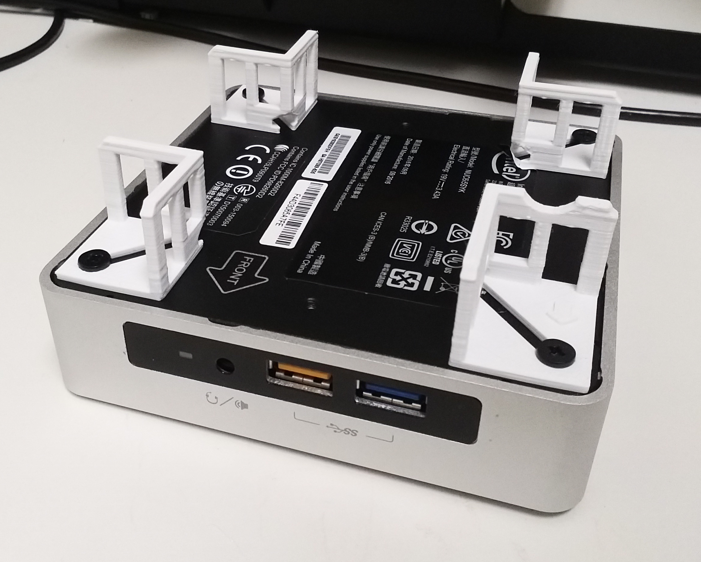
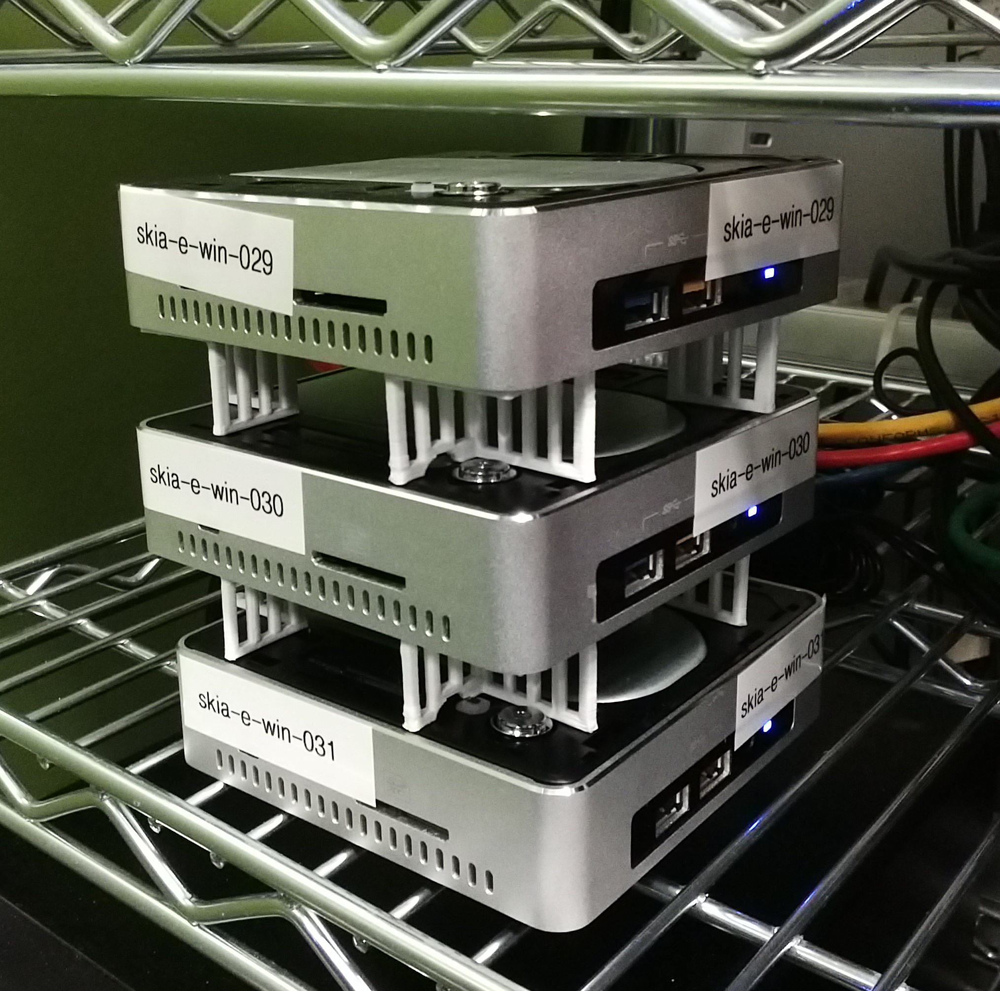

NUC foot 3D models
==================

The "NUC foot" 3D models are designed for
a [NUC6i5SYK](http://www.intel.com/content/www/us/en/nuc/nuc-kit-nuc6i5syk.html), but should work
for many other NUC models. They provide additional airflow when stacking NUCs but keep the power
button easily accessible. The NUC-foot-over-button-v1.stl model features a cutout over the hard
drive indicator light so that the lids can be removed from the NUCs, providing more airflow to the
heat sink.

Installation:

1. Print 1 [NUC-foot-over-button-v1.stl](NUC-foot-over-button-v1.stl) and
   3 [NUC-foot-standard-v1.stl](NUC-foot-standard-v1.stl). The base of the model is 1.6 mm tall, so
   you should print with a layer size that allows for that thickness. (I used 0.2mm.)

2. Loosen the screws on the bottom of the NUC. Remove the rubber feet.

3. Install each foot by sliding from the outside toward the center of the
   NUC, avoiding catching the edge on the
   label. For [NUC-foot-over-button-v1.stl](NUC-foot-over-button-v1.stl), orient
   the arrow on the foot to match the "FRONT" arrow printed on the
   NUC. Illustration:

     

4. Tighten the screws.

NUCs can then be stacked:

