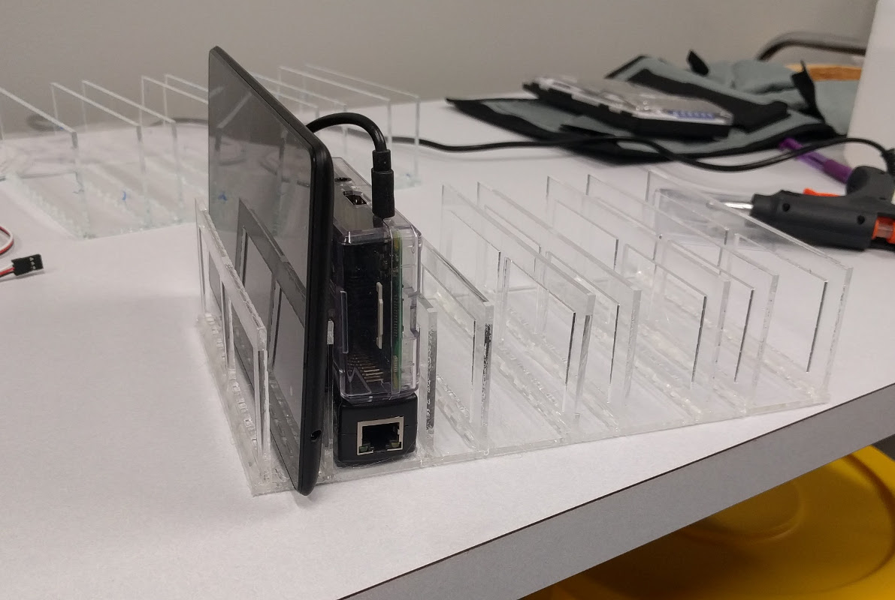

2D Models for Lasercutting
==========================

This directory contains the the 2D model files in SVG format for
laser-cut designs to house a Raspberry Pi (RPi) and Android device
for testing.
The units of all models are in millimeters (mm). This is relevant when
importing them into a tool like Tinkercad.

The holder is designed to hold a RPi in this specific case:

  http://www.amazon.com/SB-Components-Clear-Case-Raspberry/dp/B00MQLB1N6

and a Power Over Ethernet (POE) adapter like this:

  https://www.amazon.com/UCTRONICS-802-3af-Splitter-Ethernet-Raspberry/dp/B01MDLUSE7

The side pieces fit into the base and should be secured by hot glue or adhesive.

Contents:
=========

24x12_set.*.svg : A full print set of the pieces needed to make a rack on a
                  24x12 inch piece of material.

base.*.svg : The base piece. Has holes enough for 4 slots.

side.*.svg : The side piece. Fits into the holes in the base. Has slots cut
             out for better airflow.
