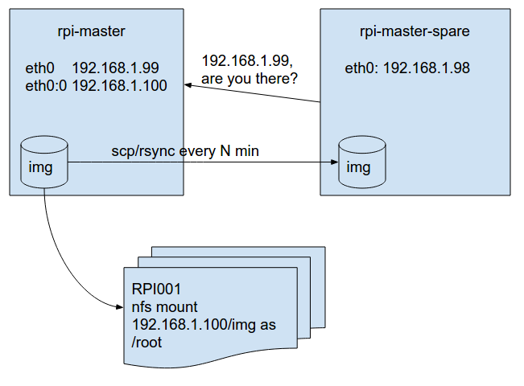

# Skolo + Raspberry Pi

Skolo has a fleet of Raspberry Pis that are attached to one (and only one) Android device.

This directory contains scripts for making that all happen.

This is meant to be a detailed description, with [this design doc](https://docs.google.com/document/d/1bbEfQSZvAk5yIpq4Ey1gGgGQscdO9KB0Jfe962XcowA/edit#)
acting as a high level overview.  If the current setup is lost in a fire and this document is the
only thing remaining, it should be sufficient to fix Skolo.

I have written the ansible commands to be executed locally, although the ansible playbooks lend
themselves very well to being executed from a
[remote machine](https://docs.google.com/document/d/1o07eSiEnzDS0D90HRn_fIWEGOUqmPx3w1d-LP-_MdUQ/edit#).

## Setting up the master servers
The basic setup looks like:


The master and the spare can theoretically be run on any OS that supports NSF mounting and systemd.
They are currently running Ubuntu 16.10.  16.04 was the first LTS release that supports systemd.
Make the username chrome-bot and use the buildbot password from Valentine.
The hostnames should be skia-rpi-master and skia-rpi-master-spare.
```
sudo apt-get update
sudo apt-get install ansible git
git clone https://github.com/google/skia-buildbot.git
cd skia-buildbot/skolo/raspberry-pi
# setup_master.yml should be run on both master and spare
ansible-playbook -i "localhost," -c local setup_master.yml

# If you were setting up the spare, you would use spare.interfaces
sudo cp master.interfaces /etc/network/interfaces
sudo chmod 0644 /etc/network/interfaces
```

Note that the above will configure a static IP for the machine that the router
DNS will not know about unless specifically configured. You can still ssh at
192.168.1.99 or 192.168.1.98.

At this point, the steps get a bit hard to script, but we are nearly done.
Bootstrap pulld by downloading a recent .deb and installing it with `sudo dpkg -i pulld.deb`
I also suggest putting the jump host's ssh public key in ~/.ssh/authorized_keys.

If the device has built in wifi, we want to disable it with `sudo nmcli radio wifi off`


## Loading a pre-existing image
  - Download the image from https://console.cloud.google.com/storage/browser/skia-backups/rpi_image/?project=google.com:skia-buildbots
  - Place it in `/opt/rpi_img/`.  Rename it to `prod.img` or `stage.img` or similar.
  - See "Begin serving the image"

## Building the image (from scratch)
  - Download and uncompress the [latest raspbian "lite" image](https://www.raspberrypi.org/downloads/raspbian/).  Last known good version 2016-03-18-raspbian-jessie-lite.img
  - run `fdisk -lu raspian-jessie-lite.img`  The start columns are important, as they tell us where the boot and root partitions of the image start.  Update the playbooks `setup_for_chroot.yml` and `start_serving_image.yml` to have offset_root and offset_boot be correct.  offset_root and offset_boot are in bytes, so multiply by the sector size, probably 512.
  - `ansible-playbook -i "localhost," -c local setup_for_chroot.yml`  It is largely inspired by http://raspberrypi.stackexchange.com/a/856
  - We will now chroot into the image and, using basically "an ARM emulator", run commands on the image.  As much as possible has been scripted into finalize_image.yml, but some manual stuff must still be done.  I could not figure out how to get Ansible to execute commands inside the chroot.

```
sudo chroot /opt/prod/root/
# You should now be in a different filesystem.  Check this with pwd.  You should be in /

# First we fix the keyboard layout
dpkg-reconfigure keyboard-configuration
# Select the 104 keyboard option.  Then, when it prompts you for locale, go down to Other and select US

# give root user a password, just in case.  Use/Put the password in the password manager.
passwd root

# Make our user for swarming
adduser chrome-bot
# Use/Put the password in the password manager.

# Use visudo to add the following rule for chrome-bot
chrome-bot ALL=NOPASSWD: /sbin/shutdown -r now, /bin/umount *

# Load some android public/private keys for python-adb to use into /home/chrome-bot/.android
# Download from https://console.cloud.google.com/storage/browser/skia-buildbots/rpi_auth/?project=google.com:skia-buildbots
# then use chown to make chrome-bot own them.

# Take the rpi-master and rpi-spare ssh public keys and put them in /home/chrome-bot/.ssh/authorized_keys

# Acquire .gitconfig and .netrc for the bots. Put them in /opt/
# Design decision note:  These configs may change; by putting them in /opt/ with
# a script to copy them to $HOME on boot, new keys can be deployed by updating
# them in /opt and then rebooting the rpis. If a faster deploy is required, then
# they can be put in /opt and deployed immediately using Ansible. There is more
# flexibility this way. (Reminder that $HOME is not NFS mounted, and so updating
# $HOME on the master image does not autoupdate all the pis)

# Install libimobiledevice. If you are updating to a newer version of Raspbian,
# try installing using apt-get; if it works, update this README. Otherwise,
# see ../ios/README.md.

# Ctrl+D to exit chroot
```
  - `./setup-swarming.sh`  This will do all automatic, idempotent setup that is possible.  If Ansible can be configured to act inside a chroot, this should be ported to Ansible.
  - `ansible-playbook -i "localhost," -c local finalize_image.yml`  finalize_image copies any scripts we need, changes any additional files that can be done in an automated way.
  - The mounted image file has been receiving the changes this entire time, no need to `dd` anything to back it up.  Current backups are in gs://skia-images/Swarming
  - See "Begin serving the image"

## Begin serving the image
By default, the script is looking for `/opt/rpi_img/prod.img`

    ansible-playbook -i "localhost," -c local start_serving_image.yml

To being serving staging image

    ansible-playbook -i "localhost," -c local start_serving_image.yml --extra-vars "nfs_mount_point=/opt/stage image=/opt/rpi_img/stage.img"


## Adding a new Raspberry PI into the swarm
This is also quite straight-forward.
 1. Assemble Raspberry PI hardware.  Connect Ethernet cable.
 2. Insert blank SD card into skia-rpi-master.
 3. `./format_new_card.yml`  Optionally add the argument `stage` for the staging environment. Type in static IP address and hostname suffix.
 4. Insert SD card into new pi.  Turn on.

The SD card is partitioned to have two primary partitions and one extended partitions with 3 logical partitions.
 - `/boot` is a small primary partition that has the boot code and a key file called `cmdline.txt`.  That file is changed to mount via nfs the /root file system and boot from it.  This took a lot of tweaking to get right, and there was no authoritative source on the matter.  I had to use a few different sources and a bit of dumb luck to get the configuration just right.
 - `/tmp`, `/var`, `/home` are all logical partitions on the extended partition.  These three partitions are mounted on the SD card so the RPI can function properly and we have persistent access to logs. They are each 1G, but this can be changed if needed.
 - `/b` is a primary partition that takes up all the rest of the space.  It is used as the workspace for swarming.
